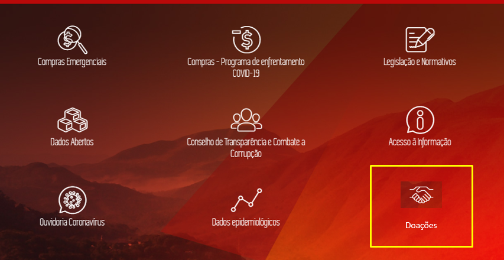
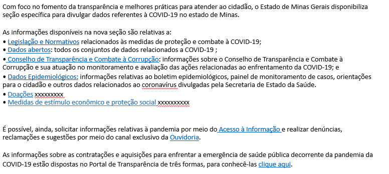

[VERSÃO HTML]()

# Visão geral da Demanda
<a href="#top">(inicio)</a>

Essa demanda visa acrescentar e alterar modos na consulta  [COVID-19](http://transparencia.mg.gov.br/covid-19).

# Motivação
<a href="#top">(inicio)</a>

Considerando a metodologia que será aplicada na 3ª avaliação da Transparência Internacional será necessário fazer novas intervenções na consulta [COVID-19](http://transparencia.mg.gov.br/covid-19) disponível no Portal da Transparência.

# Especificação
<a href="#top">(inicio)</a>

## Página das Consultas
<a href="#top">(inicio)</a>

Após clicar no ícone ___[COVID-19]___ deve ser apresentado a página a seguir:

OPÇÃO 1
--

OPÇÃO 2
--
Modificar a estrutura dos ícones de forma que exista uma coerência em quais assuntos ficam com ícones e quais ficam na parte textual. A sugestão é que os todos os tópicos que não possuem dados (tipo consulta)  fiquem no texto da página inicial.

Nesse sentido, manteremos um lógica: consultas e páginas de direcionamento

