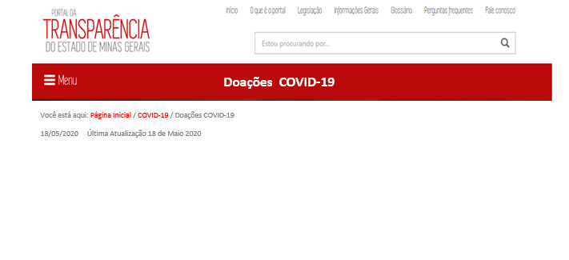
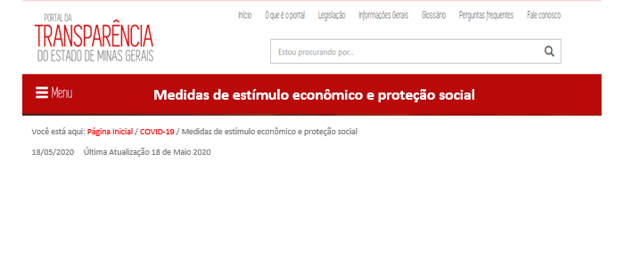
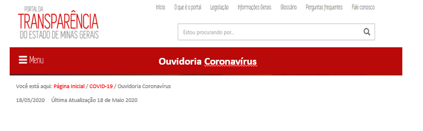

[VERSÃO HTML]()

# Visão geral da Demanda
<a href="#top">(inicio)</a>

Essa demanda visa acrescentar e alterar modos na consulta  [COVID-19](http://transparencia.mg.gov.br/covid-19).

* Modos que serão acrescentados:
  * Doações
  * Medidas de estímulo econômico e proteção social

* Modos que serão alterados:
 * Ouvidoria Coronavírus

# Motivação
<a href="#top">(inicio)</a>

Considerando a metodologia que será aplicada na 3ª avaliação da Transparência Internacional será necessário fazer novas intervenções na consulta [COVID-19](http://transparencia.mg.gov.br/covid-19) disponível no Portal da Transparência.

# Especificação
<a href="#top">(inicio)</a>

## Página das Consultas
<a href="#top">(inicio)</a>

Após clicar no ícone ___[COVID-19]___ deve ser apresentado a página a seguir:

#### __Texto do ícone:__

* Doações: Encontre aqui orientações sobre como fazer doações e informações sobre doações recebidas e sua destinação.

#### __Texto Página Inicial__

O texto da página inicial será alterado pela CGE através do Joomla, no entanto precisamos que sejam criadas seções específicas para que possamos fazer os direcionamentos.

### * Doações
<a href="#top">(inicio)</a>

Ao clicar no ícone ___[Doações ]___ o portal exibe a página de conteúdo Doações COVID-19 (eg. Voos do Governador).

O conteúdo dessa página será alimentado pela CGE através da área administrativa do Portal (Joomla).

### * Medidas de estímulo econômico e proteção social
<a href="#top">(inicio)</a>

Criar uma página de conteúdo ___[Medidas de estímulo econômico e proteção social]___.

O conteúdo dessa página será alimentado pela CGE através da área administrativa do Portal (Joomla).

### * Ouvidoria Coronavírus
<a href="#top">(inicio)</a>

Ao clicar no ícone ___[Ouvidoria Coronavírus]___ o portal exibe a página de conteúdo da Ouvidoria.

O conteúdo dessa página será alimentado pela CGE através da área administrativa do Portal (Joomla).

**OBS:** Retirar o direcionamento para o link: http://www.ouvidoriageral.mg.gov.br/coronavirus

