# Homologação layout da consulta
<a href="#top">(inicio)</a>

Todas as divergências estão destacadas em vermelho

# Especificação
<a href="#top">(inicio)</a>

## Página Inicial
<a href="#top">(inicio)</a>

Para contemplar a inclusão dos modos de consulta relacionadas às Contratações/Aquisições decorrentes do Programa 026 - "Enfrentamento dos efeitos da pandemia de COVID-19" a página inicial do Portal deve ser:

CONFERE
--
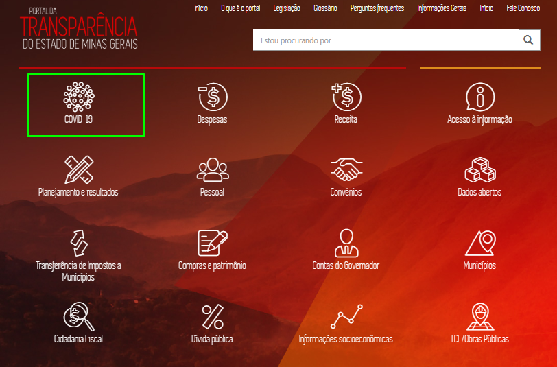
  

Alterar Texto
--
__Texto do ícone COVID-19:__ Encontre aqui os gastos, contratações e legislações do Estado referente ao enfretamento à pandemia causada pela COVID-19.

#### Observação

O ícone ___[COVID-19]___ deve se o primeiro ícone da esquerda para direita, sendo os demais reposicionandos.

O ícone ___[TCE/Obras Públicas]___ deverá ficar abaixo do ícone ___[Munícipios]___

## Página das Consultas
<a href="#top">(inicio)</a>

Após clicar no ícone ___[COVID-19]___ deverá ser apresentada a seguinte página:

Acrescentar o ícone ___[Contratações Emergenciais]___ conforme abaixo:
--

A letra "E" do ícone [Legislação e Normativos] é minúscula.
--

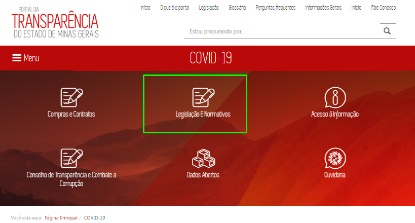

  

#### __Texto dos ícones:__

Acrescentar a descrição do ícone _[Contratações Emergenciais]_
--

* Contratações Emergenciais: Acesse as informações relativas aos Contratos Emergenciais firmados para aquisição de bens, serviços, inclusive de engenharia, obras, alienações e locações para enfrentamento da COVID-19, com base na Lei Federal nº 13.979/2020 e na Lei Estadual nº 23.640/2020.

Alterar nome e Descrição
--

* Contratações executadas no Programa Enfrentamento dos efeitos da pandemia de COVID-19 :  Acesse as contratações e os contratos do Programa 26 - Enfrentamento dos efeitos da pandemia da COVID-19.

* Legislação e Normativos: Acesse a legislação e os normativos relativos às medidas de prevenção e combate a COVID- 19.

CONFERE
--

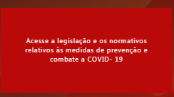
  

Alterar Descrição
--

* Ouvidoria: Registre aqui as denúncias, reclamações e manifestações sobre o enfrentamento a COVID-19.

* Acesso à Informação: Registre sua solicitação de acesso à informação para órgãos e entidades do Poder Executivo Estadual.

CONFERE
--

  

* Dados Abertos: Acesse os conjuntos de dados relacionados a COVID-19.

CONFERE
--
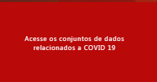
  

* Conselho de Transparência e Combate a Corrupção: Acesse as informações sobre o Conselho e sua atuação no monitoramento e avaliação das ações relacionadas ao enfrentamento da COVID-19.

CONFERE
--
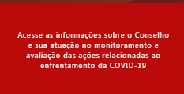

#### __Texto Página Inicial__

Alterar Texto
--

Com foco no fomento da transparência e melhores práticas para atender ao cidadão, o Estado de Minas Gerais disponibiliza sessão específica para facilitar a divulgação de informações relativas aos Contratos Emergenciais amparados pela Lei Federal nº 13.979, de 6 de fevereiro de 2020 e Lei Estadual nº 23.640, de 14 de maio de 2020 para aquisição de bens, serviços, inclusive de engenharia, obras, alienações e locações necessários ao enfrentamento da calamidade de saúde pública e estado de emergência decorrentes da COVID-19.

Por meio dessa seção é possível consultar a legislação de referência, os relatórios de execução financeira, dados dos contratados, valores, dentre outras informações, de forma estruturada e em formato aberto.

Ao clicar em Ouvidoria, um canal específico para denúncias, reclamações e sugestões também está disponível ao cidadão.

E caso deseje mais informações, solicite por meio do Acesso à Informação.

--
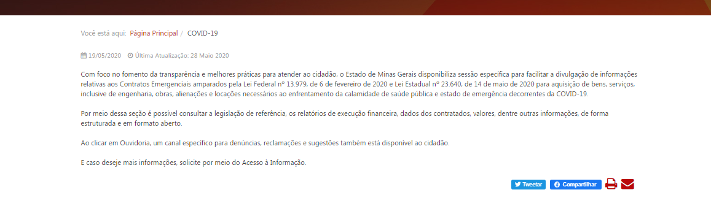

### 1. Contratações Emergenciais
<a href="#top">(inicio)</a>

Inclusão de novo ícone
--

Ao clicar em ___[Contratações Emergenciais]___ o portal exibe uma página com as Contratações Emergenciais.

Link: http://www.transparencia.dadosabertos.mg.gov.br/dataset/contratacoes-coronavirus

### 2. Consulta Contratações executadas no Programa Enfrentamento dos efeitos da pandemia de COVID-19
<a href="#top">(inicio)</a>

Ao clicar em ___[Contratações executadas no Programa Enfrentamento dos efeitos da pandemia de COVID-19]___ o portal exibe uma página com o painel das contratações relacionados ao Programa 26 - "Enfrentamento dos efeitos da pandemia de COVID-19".

Retirar as colunas [Código do órgão demandante] e [Código do órgão do contrato] do painel. Esses dados deverão ser exibidos apenas na extração dos dados.
--

As datas que estiverem em branco no armazém deverão ser exibidas no Portal com o campo vazio.
--

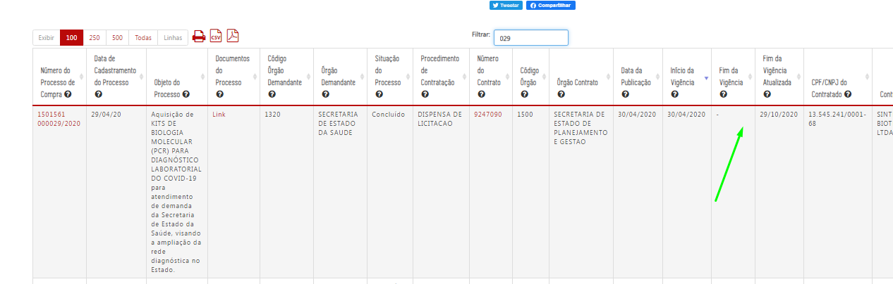
--
--
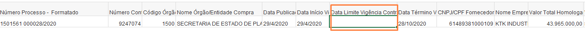

Arquivo .xls: [leiaute-tabelas-covid19](https://github.com/transparencia-mg/especificacoes-portal-transparencia/blob/feat/consulta-contratos-covid/static/leiaute-tabelas-covid19.xlsx)

___Itens da tabela___:

1. __Número do Processo de Compra:__ Número identificador do processo de compra no Portal de Compras.

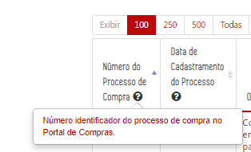

1. __Data de Cadastramento do Processo:__ Data de Cadastro do Processo de Compras

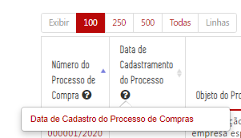

1. __Objeto do Processo:__ Descrição dos bens e serviços que estão sendo comprados e sua finalidade.

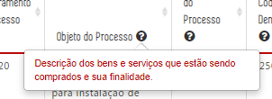

1. __Documentos do Processo:__ Relação dos documentos do processo de compra: Edital e suas retificações, relatório de detalhes do processo de compra, dados do pregão e outros arquivos relacionados ao processo.

1. __Órgão Demandante__: Órgão ou entidade que solicitou a compra de determinado material ou serviço. Pode coincidir ou não com o órgão que está executando o processo de compra.

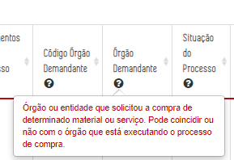

1. __Situação do Processo:__ Situação do processo de compra durante a aquisição de materiais e serviços (concluído, suspenso, em andamento, etc.). Quanto aos processos de compra com situação em andamento, são considerados apenas os itens já homologados desses processos.

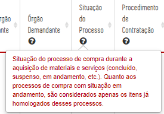

1. __Procedimento de Contratação:__ Inclui as modalidades de licitação (concorrência, tomada de preços, convite e leilão), pregão, dispensa, inexigibilidade, registro de preços, etc.

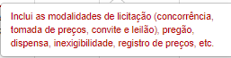

1. __Número do Contrato__: Número do contrato registrado no SIAFI.

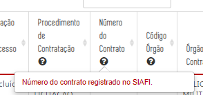

1. __Órgão Contrato__: Órgão ou entidade que formalizou o instrumento de contratação.

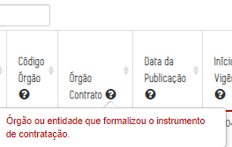

1. __Data da Publicação:__ Data de Publicação do Contrato no IOF.

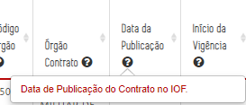

1. __Início da Vigência:__ Ínicio da vigência do Contrato

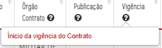

1. __Fim da Vigência:__: Data fim da vigência do Contrato.

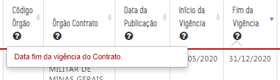

1. __Fim da Vigência Atualizada:__: Data atualizada do fim da vigência do Contrato.

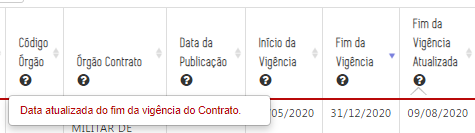

1. __CPF/CNPJ do Contratado:__ Número de identificação do fornecedor. Pessoa Jurídica (CNPJ) e Pessoa física (CPF).

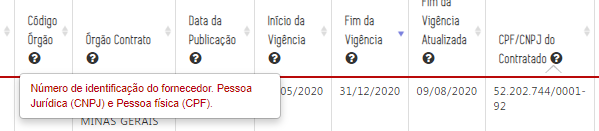

1. __Contratado:__ Nome da pessoa física ou jurídica contratada para prestar um serviço ou entregar bens materiais ao Estado.

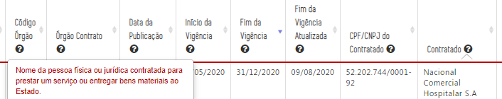

1. __Valor de Referência__:Valor estimado de um determinado bem ou serviço, obtido por meio de pesquisa de mercado ou cadastro de preços.

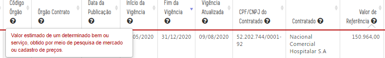

1. __Valor Homologado__: Valor final licitado ou comprado.

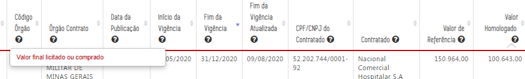
  

#### Observações Importantes

* O campo filtro deverá buscar qualquer item na tabela;

CONFERE

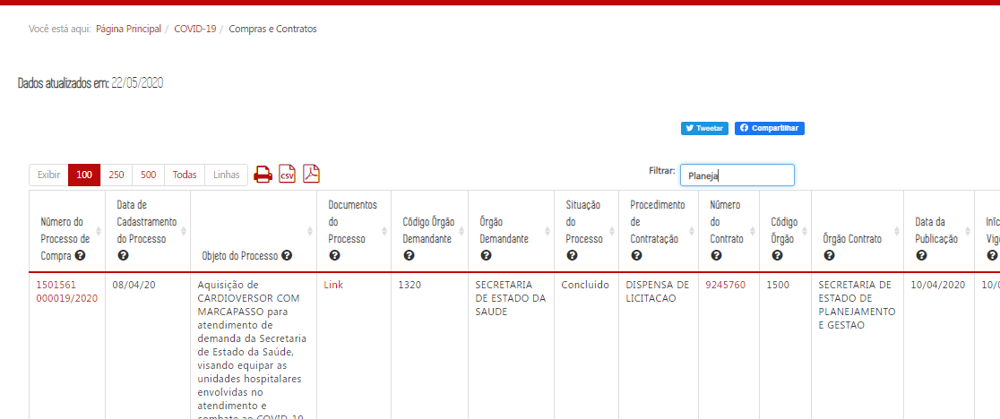

  

* O Painel deverá apresentar todos os processos de compras relacionados ao Programa 026 -Enfrentamento dos Efeitos da Pandemia da COVID-19 independente da situação e do ano de cadastro do processo de compra.        
__Exemplo:__
    - Processo de Compra Concluido: [0250073 000001/2020](http://transparencia.mg.gov.br/compras-e-patrimonio/compras-e-contratos/comprasecontratos-detalhe-proccompra/2020/20200101/20201231/322109)
    - Processo de Compra ano 2017: [1401189 000001/2017](http://transparencia.mg.gov.br/compras-e-patrimonio/compras-e-contratos/comprasecontratos-detalhe-proccompra/2017/20170101/20171231/90432)

* O painel deve apresentar todos os processos independentemente de haver ou não execução (empenho). ___Luiz irá verificar essa possibilidade___  

* Ao clicar no _[Número do processo de compra]_ o usuário será direcionado a página de detalhamento do Portal que apresenta os dados do processo de compra.  
__Exemplo:__ Processo de compra - [0250073 000001/2020](http://transparencia.mg.gov.br/compras-e-patrimonio/compras-e-contratos/comprasecontratos-detalhe-proccompra/2020/20200101/20201231/322109)

CONFERE

  

* Ao clicar no _[Número do contrato]_ o usuário será direcionado para a página do Portal de Compras para realizar o download do contrato;  
__Exemplo:__ Número do Contrato - [9245761](https://www1.compras.mg.gov.br/contrato/gestaocontratos/arquivosContrato.html?idContrato=162593)

CONFERE

  

* Ao clicar em _[Documentos do processo]_ o usuário será direcionado para a página do Portal de Compras onde constam todos os documentos relacionados ao processo de compra.  

  __Exemplo:__ Documentos do processo - [Link](https://www1.compras.mg.gov.br/processocompra/processo/consultaProcessoCompra.html?metodo=pesquisar&codigoUnidadeCompra=1501561&numero=000028&ano=2020)

  * _URL_ que deverá ser recuperda para exibição dos documentos do processos:
<https://www1.compras.mg.gov.br/processocompra/processo/consultaProcessoCompra.html?metodo=pesquisar&codigoUnidadeCompra={unidade}&numero={numero}&ano={ano}>

  * Considerar os seguintes campos para construção da _url_:
   * Processo de Compra: 1501561 000028/2020    
      Código da Unidade: 1501561    
      Número do Processo: 000028    
      Ano do Processo: 2020

CONFERE

* O cidadão poderá realizar a extração dos dados através dos ícones (imprimir, CSV e PDF);

CONFERE

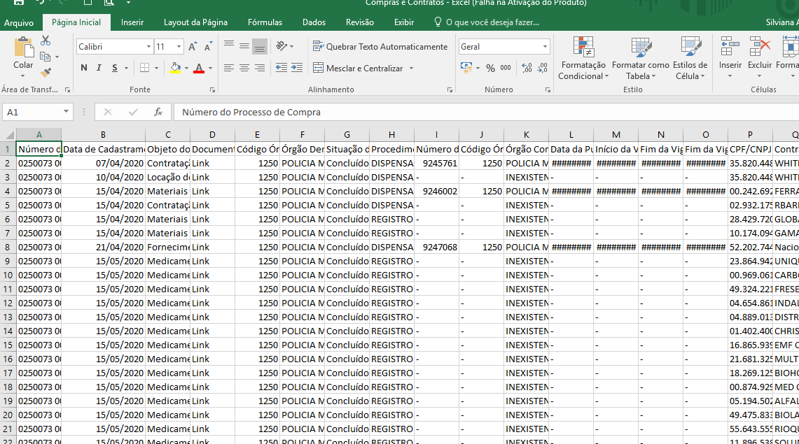

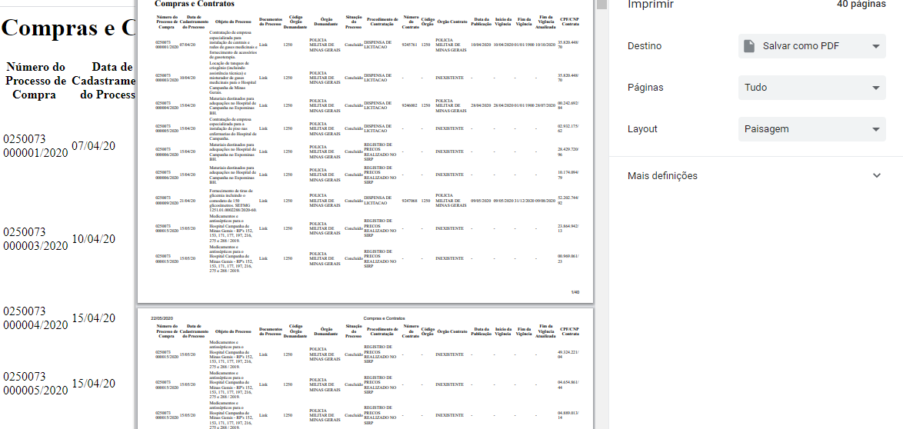
  

* As colunas da tabela deverão ser movíveis, conforme adotado pelas demais consultas do Portal.

CONFERE

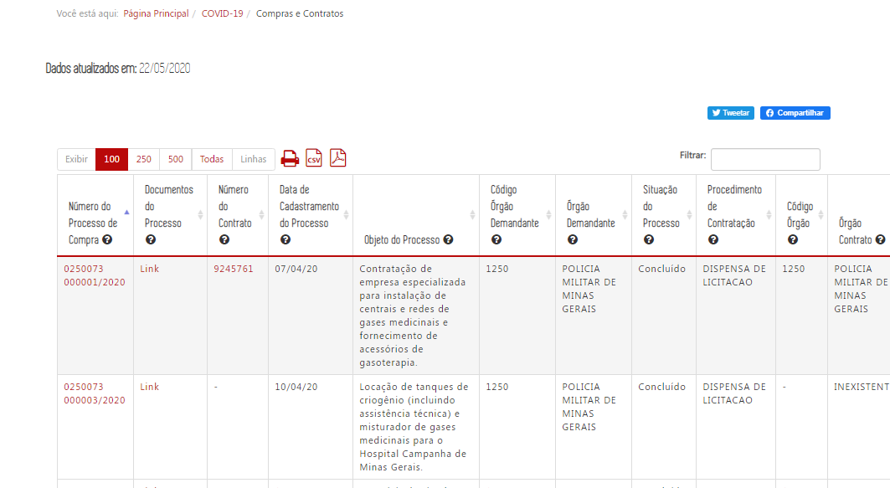            

* O usuário poderá classificar os dados da tabela, conforme o  adotado pelas demais consultas do Portal.

CONFERE

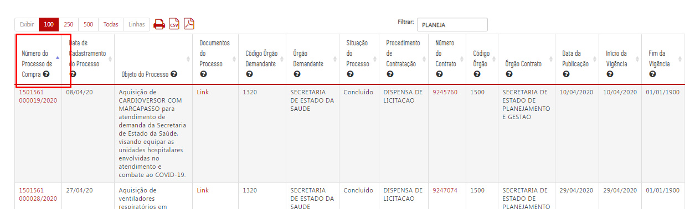            

CONFERE

* Twitter

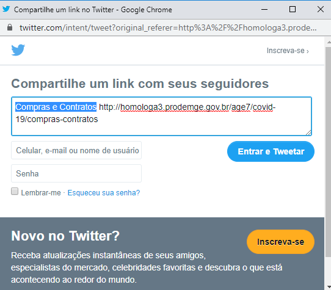     

* Facebook

  

### 3. Consulta Legislação e Normativos
<a href="#top">(inicio)</a>

Ao clicar no ícone ___[Legislação e Normativos ]___ o portal exibe a página de conteúdo Legislação e Normativos COVID-19 (eg. Voos do Governador).

O conteúdo dessa página será alimentado pela CGE atravéz da aréa administrativa do Portal (Joomla).

A letra "E" do ícone [Legislação e Normativos] é minúscula.
--

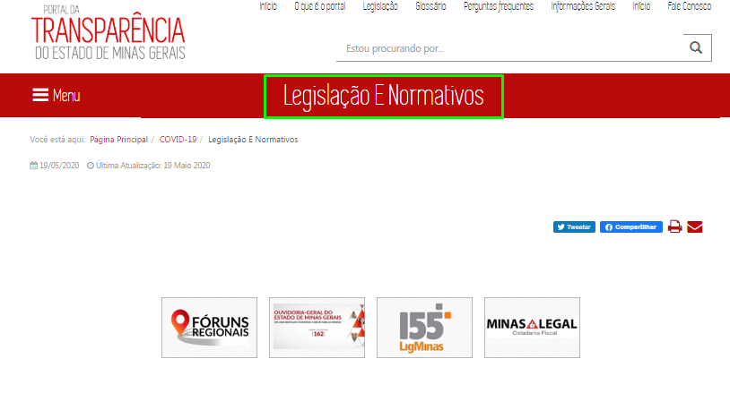
  

### 4. Consulta Dados Abertos
<a href="#top">(inicio)</a>

Ao clicar no ícone ___[Dados Abertos]___ o portal exibe o conjunto de dados do Estado referente ao enfrentamento da emergência de saúde pública de importância internacional decorrente do coronavírus.

Link: http://www.transparencia.dadosabertos.mg.gov.br/dataset?tags=coronavirus

Corrigir o Link de direcionamento do ícone _[Dados Abertos]_.
--

  

### 5. Consulta Conselho de Transparência e Combate a Corrupção
<a href="#top">(inicio)</a>

Ao clicar no ícone ___[Conselho de Transparência e Combate a Corrupção]___ o portal exibe informações sobre o Conselho de Transparência e Combate à Corrupção e sua atuação no monitoramento e avaliação das ações relacionadas ao enfrentamento da COVID-19.

Link: http://portaldosconselhos.cge.mg.gov.br/

CONFERE
--
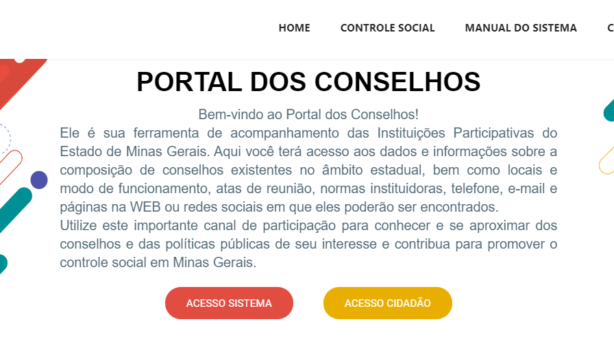

### 6. Ouvidoria
<a href="#top">(inicio)</a>

Ao clicar no ícone ___[Ouvidoria]___ o portal exibe a página da Ouvidoria exclusiva para manifestações relacionadas ao Coronavírus.

Link: http://www.ouvidoriageral.mg.gov.br/coronavirus

CONFERE
--
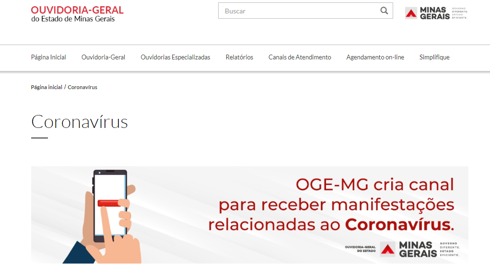

### 7. Acesso à Informação
<a href="#top">(inicio)</a>

Ao clicar no ícone ___[Acesso à Informação]___ o portal exibe a página Sistema Eletrônico de Acesso à Informação (e-Sic)

Link: http://www.acessoainformacao.mg.gov.br/

CONFERE
--

