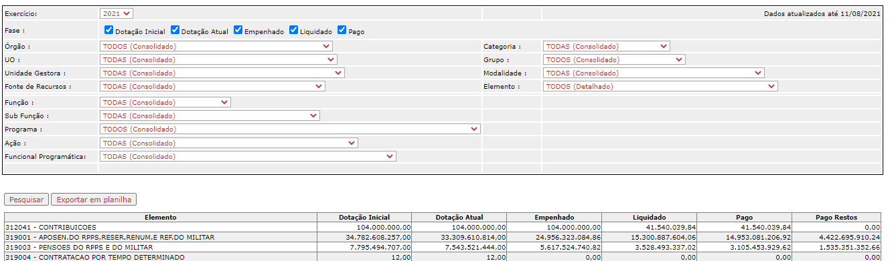
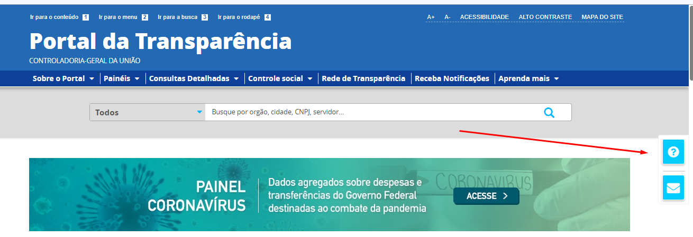
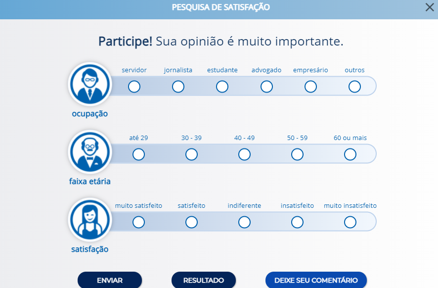

# Demandas de manutenção evolutiva para intervenções no Portal de Transparência

A fim de permitir ao cidadão a inserção em um contexto participativo na gestão pública, a Controladoria Geral do Estado, por meio da Diretoria Central de Transparência Ativa - DTA e em parceria com Laboratório de Inovação (LAB.MG) - SEPLAG realizaram em 2021 o "Projeto Experiência do Usuário no Portal da Transparência".

O Projeto teve como objetivo, dentre outros, entender melhor as demandas dos usuários fazendo com que os mesmos se sintam satisfeitos em usar as funcionalidades do PdT. Sendo assim foi preciso estudar, compreender e avaliar todo comportamento do usuário, levando em consideração uma serie de aspectos como usabilidade, fluidez e etc.

O projeto foi dividido em etapas sequenciais que visou o entendimento do problema à implementação das soluções propostas, seguidas por uma manutenção evolutiva das soluções.

A identificação das principais necessidades estão sendo objeto de elaboração de especificações que serão disponibilizadas a PRODEMGE para que possam ser implementadas.

### ORDEM DE PRIORIDADDE

## Despesa de Pessoal

## [Consulta de Despesa](https://www.transparencia.mg.gov.br/estado-pessoal/despesa-com-pessoal)

 - Alterar a forma de disponibilização da despesa com pessoal do Portal da Transparência, alinhando para que as informações estejam coerentes com os dados disponibilizados pela Secretaria de Fazenda

## [Consulta de Compras](https://www.transparencia.mg.gov.br/compras-e-patrimonio)
 
 - Link as informações de autorização de serviço e ordem de serviço do Portal de Compras para o Portal da Transparência assim como foi feito nos processos de compras que possuem Contratos;
 - Incluir o link sobre os dados de despesa: linkar processo de compras com dados de despesa.
 
## Remuneração
 
 - Incluir a funcionalidade de número de admissão como chave primária na tabela do portal para não perder o histórico do servidor quando o mesmo trocar de nome ou alterar carga horária
 - Criar uma nova opção "Carreiras" dentro do menu de acesso rápido na consulta de Remuneração
 - Inserir no Portal a lista de todos os servidores por carreira independente da remuneração
 - Disponibilização dos descontos alinhados com os dados disponibilizados pelo TCE/MG

## Remodelagem da Pesquisa Avançada

A remodelagem e a elaboração da pesquisa avançada deverá seguir os moldes da pesquisa avançada da consulta 'Acordo Judicial de Reparação da Vale'.

- Remodelagem
  - Despesa
  - Restos a pagar
  - Receita
  - Proposta Orçamentária
  - Alteração Orçamentária
  - Crédito Orçamentário
  - Obras Orçadas

- Elaboração
  - Concursos Realizados
  - Diárias
  - Emendas
  - PPAG

## Remodelagem da Página Inicial

O objetivo é torná-la autoexplicativa. Para isso, tanto o design a quanto navegação, devem ser intuitivos, de forma a deixar claro para o usuário como o PdT funciona.

A página inicial deve reduzir ao máximo os pontos intermediários de interação para que, com poucos cliques, os usuários cheguem às informações desejadas permitindo assim que ele veja claramente quais dados estão disponíveis. Abaixo segue as principais intervenções:

1) Alterar e melhorar a navegabilidade do menu superior e do menu de acesso rápido:

  - Alteração do menu superior, reorganizando as informações para possibilitar o acesso a todo conteúdo de forma mais rápida.  eg. 	Menu no formato *dropdown*;
  - diferenciar quais informações são internas (eg. consulta do PdT - Despesas) e quais são externas (eg. Obras Públicas)
  - Criar novos ícones para as consultas;
  - Inclusão da barra de acessibilidade;

2) Reorganizar as informações da página inicial:
  - Alterar a cor de fundo;
  - Criar menu de acesso rápido (consultas mais acessadas);
  - Centralização dos canais de atendimento.
  - Alteração do menu de acesso de rápido de forma que o usuário visualize todos os dados com menor número de cliques possíveis;
  - Reorganização da área de notícias

3) Barra de Busca:
  - o campo deve possibilitar que um determinado dado seja encontrado
 de forma mais rápida e por vários caminhos possíveis;
  - inclusão da ferramenta *placeholder* indicando o que o usuário pode buscar, como órgão, Município, CNPJ de empresa conveniada ou nome de servidor.

4) Acesso à área administrativa pela DTA
  - Essa funcionalidade permitirá que a equipe DTA realize alterações e acrescente informações a serem exibidas no painel de destaque da página inicial. A área administrativa do Portal deverá permitir que a equipe da DTA altere o texto explicativo das pesquisa básica, bem como os termos que ficarão em destaque

5) Criação do Mapa do site
  - O mapa do sítio deve ser disponibilizado em forma de lista hierárquica (utilizando os elementos de lista do HTML), podendo conter quantos níveis forem necessários

6) Barra de Início Fixa
  - Fixar a barra inicial ao rolar página das consultas

7) Fale Conosco:
  - inserir o link de dúvidas frequentes na página do formulário do fale conosco e o link do fale conosco próximo ao dúvidas frequentes.

8) Corrigir a lentidão na pesquisa avançada da consulta Receita Pública

## Remodelagem das páginas intermediárias do Portal

As páginas intermediárias deverão seguir o mesmo padrão das páginas intermediarias do menu de acesso rápido.

Todas as consultas deverão ter página intermediárias, incluindo as páginas quee possuem apenas uma sessão, como por exemplo a consulta da Receita.

A área administrativa do Portal deverá permitir que a DTA altere o conteúdo de todas as páginas intermediárias.

> Pensar na questão da data de atualização do conteúdo estático das páginas intermediárias

## Remodelagem da Pesquisa Básica

A Remodelagem deverá seguir os moldes da pesquisa 'Acordo Judicial de Reparação da Vale' nas seguintes consultas:

1) COVID-19    
- Compras - Programa de enfrentamento COVID 19.

2) Despesa  
- Despesa;
- Restos a Pagar;
- Mapa de Investimento;

3) Receita

4) Planejamento e Resultados
  - Proposta Orçamentária
  - Emendas Orçamentária
  - Alteração Orçamentária
  - Obras Orçadas
  - Crédito Orçamentário
  - PPAG Consolidado
  - PPAG por Programa

5) Pessoal
  - Despesa com Pessoal
  - Remuneração dos Servidores
  - Diárias
  - Viagens
  - Concursos Realizados

6) Convênios e Parcerias
  - Convênios de Entrada
  - Convênio de Saída

7) Transferência de Impostos a Municípios

8) Compra e Patrimônio
  - Compras e Contratos
  - Gestão da Frota
  -  Patrimônio

9) Dívida Pública
 - Execução da Dívida

A remodelagem deve considerar a alteração dos formulários de detalhamento de todas as consultas com as seguintes novas funcionalidades:
  - modal
  - uma aba para cada conjunto de informações (classificação orçamentária, empenho, liquidação, pagamento, outras informações)
  - visualização dos dados de despesa e restos a pagar de acordo agrupados por estágio de despesa (empenho, liquidação e pagamento)

## Partição dos anos

O Portal de Transparência deverá permitir que o cidadão busque informações, na pesquisa avançada, por mais de um exercício simultaneamente, a exemplo do modelo implantado na Pesquisa Avançada da Consulta da Vale.

Por exemplo, na consulta de despesa, o usuário poderá comparar dados de programa, função, UO, Ação e etc entre exercícios distintos, bem como poderá pesquisar os valores pagos a um determinado credor em um intervalo de tempo.

Exemplo: [Portal de Transparência de Linhares](https://linhares-es.portaltp.com.br/consultas/despesas/empenhos.aspx)

## Consolidar os dados de Despesa e RP em uma única consulta

Remodelagem das consultas despesas e restos a pagar de forma que as todas as etapas (empenho, liquidação, pagamento do exercício corrente e pagamento dos valores inscritos em RP) sejam apresentadas em uma única consulta.

Exemplo:
- [Portal de Transparência Distrito Federal](http://www.transparencia.df.gov.br/#/despesas/acao)

- [Portal de Transparência Federal](http://www.portaltransparencia.gov.br/despesas/orgao?ordenarPor=orgaoSuperior&direcao=asc)

## Restos a Pagar

 - Alterar a consulta (fórmula de cálculo das colunas) para alinhar com as informações com os dados disponibilizados pela Secretaria de EStado de Fazendo no Relatório Resumido de Execução Orçamentária - [RREO](http://www.fazenda.mg.gov.br/governo/contadoria_geral/lrf/2021/).

## Contratos

 - Inclusão do número da Nota Fiscal e chave de acesso;
 - Incluir a vigência do Contrato nas tabelas - Consulta de Compras e Contratos;

## Favorecido da Consulta de Diárias

 - Alterar o credor beneficiário da Diária, passando a trazer informações do Credor beneficiário e não mais do CPF administrativo.
 - Unificar as consultas de Diárias e Viagens.

## Possibilidade do usuário consultar todas as etapas da Programação Orçamentária

Possibilitar que o usuário verifique todas as etapas (Crédito Inicial + Alteração + Empenho + Liquidação + Pagamento + RP) da Programação e Execução Orçamentária em um único local.

A sugestão que esses dados possam ser verificados na pesquisa avançada e na pesquisa básica de despesa.

Exemplo:
- [Portal de Transparência do Estado de São Paulo](https://www.fazenda.sp.gov.br/SigeoLei131/Paginas/FlexConsDespesa.aspx)

## Inclusão da barra de dúvidas e canais de atendimento

A barra de dúvidas e canais de atendimento devem estar presentes em todas as páginas do PdT assim com ocorre com o ícone de acessibilidade.
 - Barra de dúvidas: o usuário pode procurar qualquer assunto.  
      - Ao clicar no ícone dúvidas será aberto um popup para o usuário digite o termo que deseja pesquisar. Inicialmente a busca será realizada no glossário, perguntas frequentes e no manual de navegação.

Exemplo: [Portal de Transparência Federal](http://www.portaltransparencia.gov.br/despesas/orgao?ordenarPor=orgaoSuperior&direcao=asc)

 - Canais de atendimento:	O usuário será direcionado para a página canais de atendimento do PdT

## Inclusão de novo canal de compartilhamento

Inclusão do canal de compartilhamento pela rede social WhatsApp em todas as páginas do PdT.

## Implementação da ferramenta de feedback

Implementação da ferramenta de feedback para o PdT, com o objetivo de coletar informações dos usuários do Portal sobre o que eles querem e o que eles precisam.

A ferramenta proposta pretende por meio de coleta de informações dos usuários identificar erros, melhorias e evoluções necessárias para o atendimento das demandas da sociedade. 

Exemplo: [Portal de Transparência Distrito Federal](http://www.transparencia.df.gov.br/#/despesas/acao)

