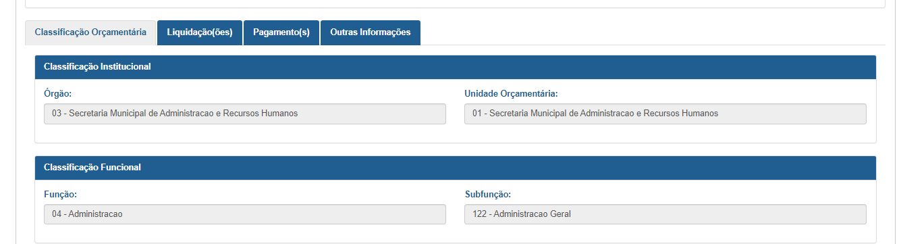

# Demandas de manutenção evolutiva do Projeto Experiência do Usuário no PdT

A fim de permitir ao cidadão a inserção em um contexto participativo na gestão pública, a Controladoria Geral do Estado, por meio da Diretoria Central de Transparência Ativa - DTA e em parceria com Laboratório de Inovação (LAB.MG) - SEPLAG realizaram o "Projeto Experiência do Usuário no Portal da Transparência".

O Projeto teve como objetivo, dentre outros, entender melhor as demandas dos usuários e identificar oportunidades de melhorias nas interfaces das informações disponibilizadas atualmente no site.

O projeto foi dividido em etapas sequenciais que visam o entendimento do problema à implementação das soluções propostas, seguidas por uma manutenção evolutiva das soluções.

A identificação das principais necessidades serão objeto de elaboração de especificações que serão disponibilizadas a PRODEMGE para que possam ser implementadas.

Inicialmente serão analisadas as seguintes intervenções:

### Remodelagem da Página Inicial

O objetivo é torná-la autoexplicativa. Para isso, tanto o design a quanto navegação, devem ser intuitivos, de forma a deixar claro para o usuário como o PdT funciona.

A página inicial deve reduzir ao máximo os pontos intermediários de interação para que, com poucos cliques, os usuários cheguem às informações desejadas permitindo assim que ele veja claramente quais dados estão disponíveis. Abaixo segue as principais intervenções:

- Alterar e melhorar a navegabilidade do menu superior e do menu de acesso rápido:
  - permitir que o usuário tenha acesso rápido a itens específicos do PdT - eg. 	Menu no formato *dropdown*;
  - diferenciar quais informações são internas (eg. consulta do PdT - Despesas) e quais são externas (eg. Obras Públicas)

- Reorganizar as informações da página inicial:
  - Alterar a cor de fundo;
  - Criar menu de acesso rápido (consultas mais acessadas);
  - Consolidar os canais de atendimento em uma única seção.

- Barra de Busca:
 - o campo deve possibilitar que um determinado dado seja encontrado
 de forma mais rápida e por vários caminhos possíveis;
 - inclusão da ferramenta *placeholder* indicando o que o usuário pode buscar, como órgão, Município, CNPJ de empresa conveniada ou nome de servidor.

## Partição dos anos

O Portal de Transparência deverá permitir que o cidadão busque informações, na pesquisa avançada, por mais de um exercício simultaneamente.

Por exemplo, na consulta de despesa, o usuário poderá comparar dados de programa, função, UO, Ação e etc entre exercícios distintos, bem como poderá pesquisar os valores pagos a um determinado credor em um intervalo de tempo.

Exemplo: [Portal de Transparência de Linhares](https://linhares-es.portaltp.com.br/consultas/despesas/empenhos.aspx)

## Inclusão de Informações
 - Inclusão do número da Nota Fiscal;
 - incluir a vigência do Contrato nas tabelas - Consulta de Compras e Contratos
 - Criar uma nova opção "Carreiras" dentro do menu de acesso rápido
 - Inserir no Portal a lista de todos os servidores por carreira independente da remuneração;

## Consolidar os dados de Despesa e RP em uma única consulta

Remodelagem das consultas despesas e restos a pagar de forma que as todas as etapas (empenho, liquidação, pagamento do exercício corrente e pagamento dos valores inscritos em RP) sejam apresentadas em uma única consulta.

Exemplo:
- [Portal de Transparência Distrito Federal](http://www.transparencia.df.gov.br/#/despesas/acao)

- [Portal de Transparência Federal](http://www.portaltransparencia.gov.br/despesas/orgao?ordenarPor=orgaoSuperior&direcao=asc)

## Possibilidade do usuário consultar todas as etapas da Programação Orçamentária

Possibilitar que o usuário verifique todas as etapas (Crédito Inicial + Alteração + Empenho + Liquidação + Pagamento + RP) da Programação e Execução Orçamentária em um único local.

A sugestão que esses dados possam ser verificados na pesquisa avançada e na pesquisa básica de despesa.

Exemplo:
- [Portal de Transparência do Estado de São Paulo](https://www.fazenda.sp.gov.br/SigeoLei131/Paginas/FlexConsDespesa.aspx)

## Remodelagem da Pesquisa Básica

- Incluir campo que direcione o usuário para os dados.mg;
- Incluir filtro no cabeçalho nas colunas;
- Melhorar a identificação da informação que é clicável tanto nas tabelas como no formulário de detalhamento;
- Alterar a tipografia de todas as consultas (alterar tamanho e cor da fonte);
- Formulário de Detalhamento:
  - Alterar o design/layout de forma que ele fique mais compreensível;
    - [Portal de Transparência de Linhares](https://linhares-es.portaltp.com.br/consultas/detalhes/empenho.aspx?id=33964993)

- Remodelagem das páginas intermediárias de forma que o conteúdo fique próximos aos assuntos relacionados, como exemplo, ao acessar a consulta de Despesa tanto o manual como as perguntas frequentes relacionadas ao tema serão exibidas na mesma tela.

### Inclusão da barra de dúvidas e canais de atendimento

A barra de dúvidas e canais de atendimento devem estar presentes em todas as páginas do PdT assim com ocorre com o ícone de acessibilidade.
 - Barra de dúvidas: o usuário pode procurar qualquer assunto.  Ao clicar no ícone dúvidas será aberto um popup para o usuário digitar o termo o qual quer pesquisar. Inicialmente a busca será realizada no glossário, perguntas frequentes e no manual de navegação.

Exemplo: [Portal de Transparência Federal](http://www.portaltransparencia.gov.br/despesas/orgao?ordenarPor=orgaoSuperior&direcao=asc)

 - Canais de atendimento:	O usuário será direcionado para a página canais de atendimento do PdT

### Inclusão de novo canal de compartilhamento

Inclusão do canal de compartilhamento pela rede social WhatsApp em todas as páginas do PdT.

### Implementação da ferramenta de feedback

Implementação da ferramenta de feedback para o PdT, com o objetivo de coletar informações dos usuários do Portal sobre o que eles querem e o que eles precisam.

A ferramenta proposta pretende por meio de coleta de informações dos usuários identificar erros, melhorias e evoluções necessárias para o atendimento das demandas da sociedade.

Exemplo: [Portal de Transparência Distrito Federal](http://www.transparencia.df.gov.br/#/despesas/acao)

