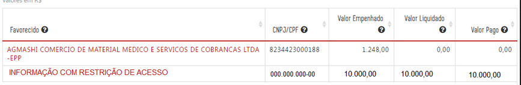
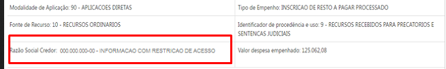
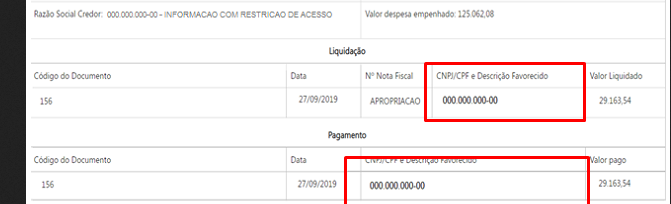

# Homologação da documentação da especificação

Inicialmente cabe destacar que os registros do elemento item de despesa 3102 deverão ser novamente carregados na base de dados do Portal da Transparência.

## Método de anonimização

A anonimização deve ser aplicada nas consultas de Despesa e Restos a Pagar para todos os registros do elemento item de despesa 3102 - PRÊMIOS LOTÉRICOS. O método de anonimização consiste em:

1. Substituir o nome do credor pelo valor "INFORMAÇÃO COM RESTRIÇÃO DE ACESSO"; e
2. Substituir o CPF do credor pelo valor "000.000.000-00".

As regras acima devem ser aplicadas inclusive no caso em que o nome e CPF sejam apresentados no mesmo campo, como nos formulários de detalhamento apresentados acima.

No banco de dados do Portal da Transparência as informações de nome e CPF devem ser armazenadas sem anonimização, permitindo filtros que utilizem essas informações.

## Consulta Despesa e Restos a Pagar

A anonimização deve ser aplicada:

* Gráficos e tabelas do nível favorecido (eg. [Despesa](http://www.transparencia.mg.gov.br/despesa-estado/despesa/despesa-orgaos/2019/01-01-2019/31-12-2019/3873/1874/510/20/39); [RP](http://www.transparencia.mg.gov.br/despesa-estado/restos-a-pagar/restospagar-orgaos/2018/3718/510/39/20/2704/130/59))
* Formulários de detalhamento de documentos (eg. [Despesa](http://www.transparencia.mg.gov.br/despesa-estado/despesa/despesa-orgaos/2019/01-01-2019/31-12-2019/3873/1874/510/20/39/897363/2704/empenhado/412/12420866/0/0); [RP](http://www.transparencia.mg.gov.br/despesa-estado/restos-a-pagar/restospagar-orgaos/2018/3718/510/39/20/2704/130/59/3774671));
* Pesquisa avançada;
* Imprimir página;
* Exportar para csv;
* Exportar para pdf.

### Exemplos

#### Gráficos e tabelas do nível favorecido

Ao acessar o nível favorecido das classificações orçamentárias que devem ser anonimizadas, o Portal deverá exibir

| Favorecido | CNPJ/CPF | Item de despesa | Valor Empenhado |Valor Liquidado| Valor Pago|
|---|---|---|---|---|---
INFORMAÇÃO COM RESTRIÇÃO DE ACESSO|000.000.000-00|Prêmios Lotéricos| 10.000,00|10.000,00|10.000,00|

__Anonimização na tabela está OK__

  

#### Formulários de detalhamento de documentos

Ao acessar os formulários de detalhamento os seguintes campos devem ser anonimizados:

* Campo ___Razão Social do Credor___ do formulário de empenho da despesa:

__Dados OK__

  

 * Campo ___CNPJ/CPF e Descrição do Favorecido___ do formulário de liquidação e pagamento:

__Falta a descrição do favorecido__

  

#### Pesquisa Avançada

A anonimização deve ocorrer quando o usuário marcar o campo ___exibir favorecidos___.
