# Homologação do layout da funcionalidade
<a href="#top">(inicio)</a>

As divergências estão destacadas em 
 vermelho.
 

 

## Visão geral da demanda

Essa demanda visa anonimizar os nomes e CPFs de credores pessoas físicas nas consultas de Despesa e Restos a Pagar (RP) em classificações orçamentárias específicas.

As classificações orçamentárias iniciais estão definidas nesta especificação, no entanto, a solução deve ser flexível para que outras classificações possam ser inseridas na regra de anonimização mediante provocação da CGE.

O método de anonimização deve ser aplicado nos resultados das consultas de Despesa e RP que apresentem informação de nome e CPF, bem como nas funcionalidades de exportação de dados.

No entanto as informações devem ser armazenadas de forma completa no banco de dados do Portal, permitindo inclusive a realização de buscas nos campos anonimizados.

__Ao pesquisar um dado anonimizado (Nome ou CPF) no campo de busca do Portal o dado não é exibido__

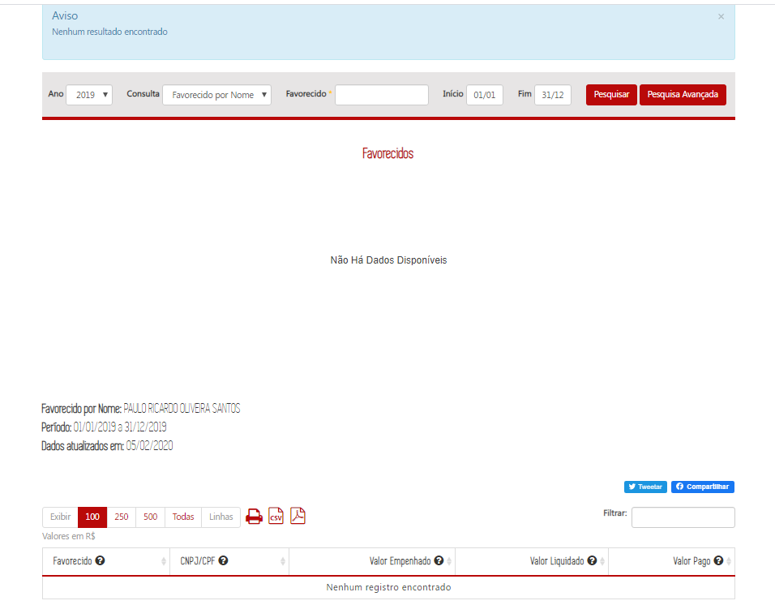
  

Inicialmente cabe destacar que os registros do elemento item de despesa 3102 deverão ser novamente carregados na base de dados do Portal da Transparência.

## Método de anonimização

A anonimização deve ser aplicada nas consultas de Despesa e Restos a Pagar para todos os registros do elemento item de despesa 3102 - PRÊMIOS LOTÉRICOS. O método de anonimização consiste em:

1. Substituir o nome do credor pelo valor "INFORMAÇÃO COM RESTRIÇÃO DE ACESSO"; e
2. Substituir o CPF do credor pelo valor "000.000.000-00".

Dados OK

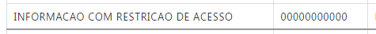

  

As regras acima devem ser aplicadas inclusive no caso em que o nome e CPF sejam apresentados no mesmo campo, como nos formulários de detalhamento apresentados acima.

__A regra está anonimizando dados de CNPJ. No momento a funcionalidade deve ser aplicada apenas aos CPFs__

Conforme Armazém BO apenas a natureza Jurídicia (1) Pessoa Física deve ser anonimizada.

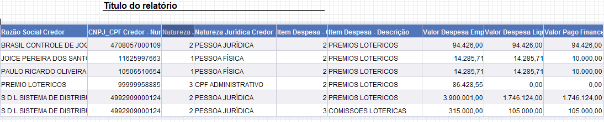

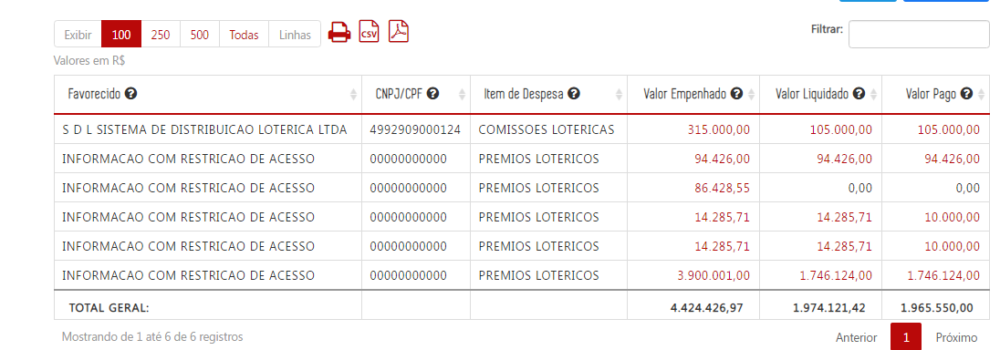

  

No banco de dados do Portal da Transparência as informações de nome e CPF devem ser armazenadas sem anonimização, permitindo filtros que utilizem essas informações.

## Consulta Despesa e Restos a Pagar

A anonimização deve ser aplicada:

* Gráficos e tabelas do nível favorecido (eg. [Despesa](http://www.transparencia.mg.gov.br/despesa-estado/despesa/despesa-orgaos/2019/01-01-2019/31-12-2019/3873/1874/510/20/39); [RP](http://www.transparencia.mg.gov.br/despesa-estado/restos-a-pagar/restospagar-orgaos/2018/3718/510/39/20/2704/130/59))

__Gráfico treemap OK__
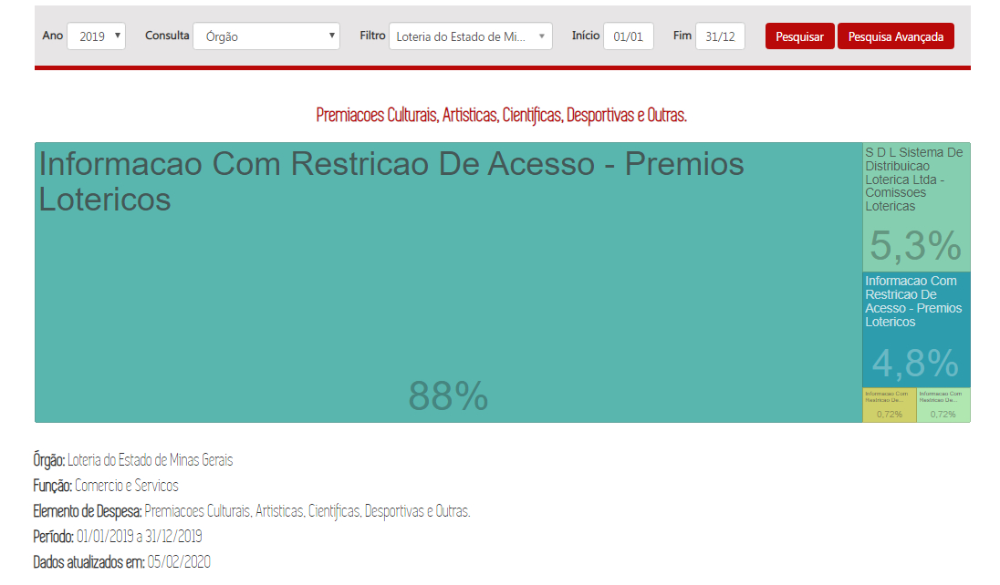
  

* Formulários de detalhamento de documentos (eg. [Despesa](http://www.transparencia.mg.gov.br/despesa-estado/despesa/despesa-orgaos/2019/01-01-2019/31-12-2019/3873/1874/510/20/39/897363/2704/empenhado/412/12420866/0/0); [RP](http://www.transparencia.mg.gov.br/despesa-estado/restos-a-pagar/restospagar-orgaos/2018/3718/510/39/20/2704/130/59/3774671));

__Fomulário de detalhamento "Dados do Empenho" a funcionalidade não foi aplicada__

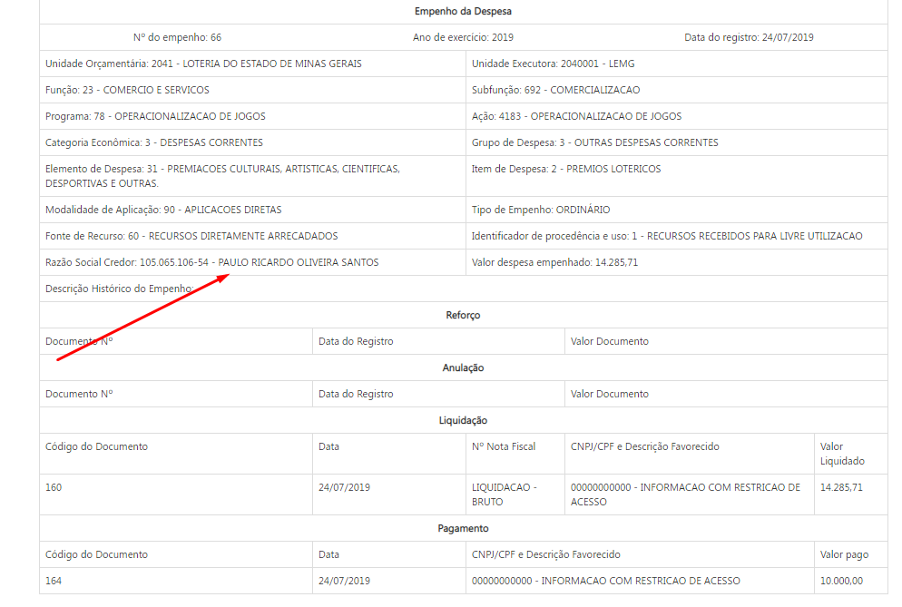

__Quando se tratar de natureza jurídica que não seja pessoa física os dados não devem ser anonimizados__

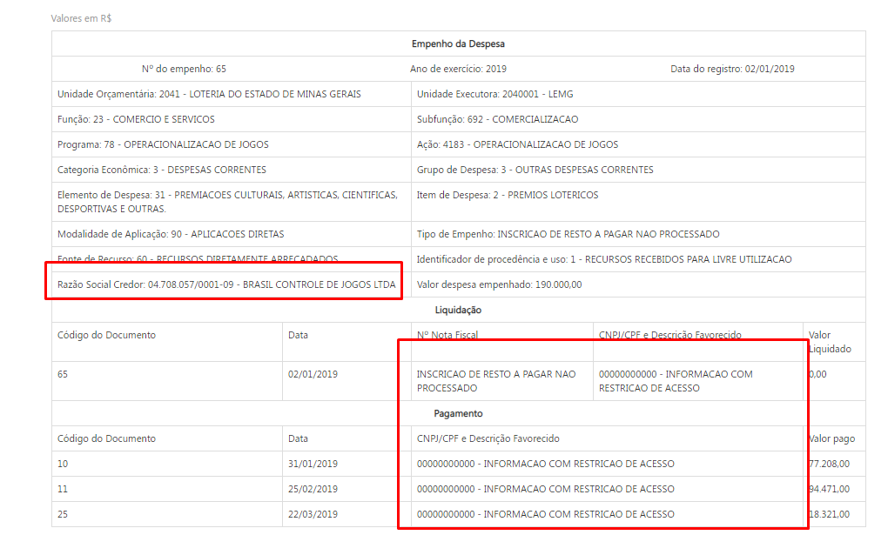
  

* Pesquisa avançada;

__O Portal está anonimizando dados de natureza jurídica diferente de pessoa física__
1. Despesa
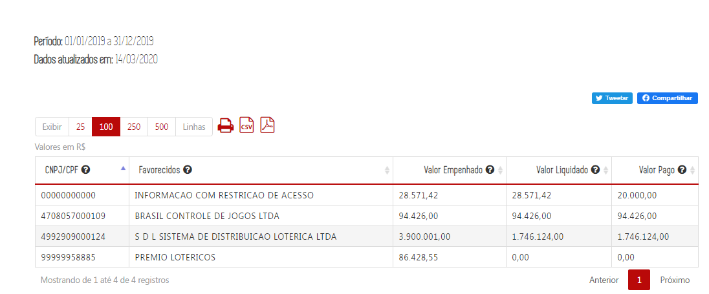

2. Restos a pagar
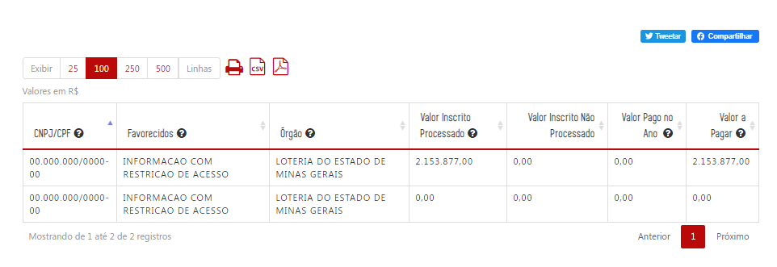

  

* Imprimir página;

__Confere__

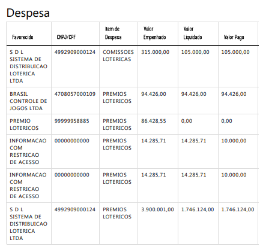

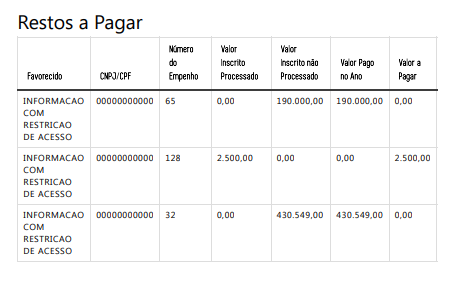

---
* Exportar para csv;

__Confere__
1. Despesa
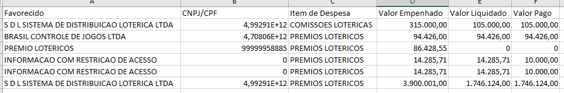

2. Restos a pagar
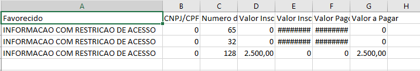
---
* Exportar para pdf.

__Confere__
1. Despesa
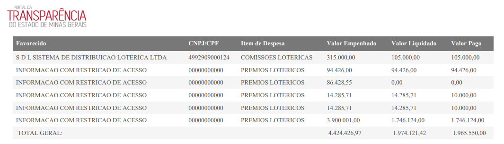

2. Restos a pagar
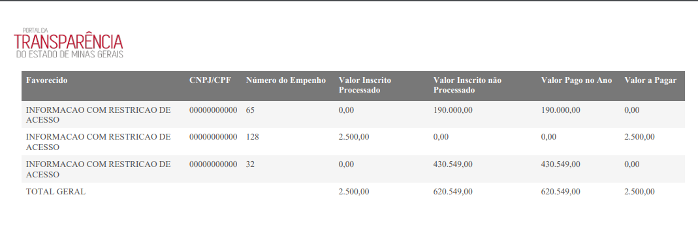

  

### Exemplos

#### Gráficos e tabelas do nível favorecido

Ao acessar o nível favorecido das classificações orçamentárias que devem ser anonimizadas, o Portal deverá exibir

| Favorecido | CNPJ/CPF | Item de despesa | Valor Empenhado |Valor Liquidado| Valor Pago|
|---|---|---|---|---|---
INFORMAÇÃO COM RESTRIÇÃO DE ACESSO|000.000.000-00|Prêmios Lotéricos| 10.000,00|10.000,00|10.000,00|

 __Todas as tabelas estão com o layout de anonimização conforme o especificado.__

  

#### Formulários de detalhamento de documentos

Ao acessar os formulários de detalhamento os seguintes campos devem ser anonimizados:

* Campo ___Razão Social do Credor___ do formulário de empenho da despesa:

__Funcionalidade não foi aplicada__

  

 * Campo ___CNPJ/CPF e Descrição do Favorecido___ do formulário de liquidação e pagamento:

__Funcionalidade OK__

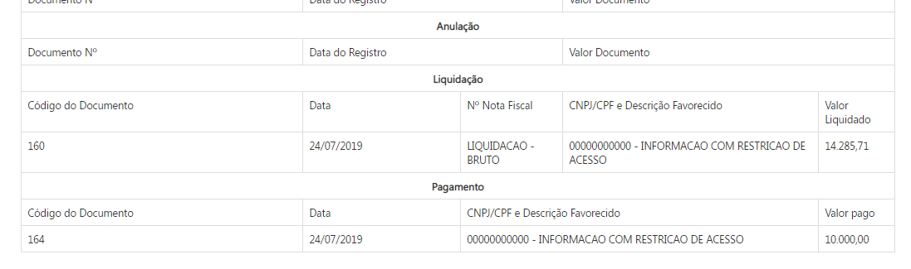
  

#### Pesquisa Avançada

A anonimização deve ocorrer quando o usuário marcar o campo ___exibir favorecidos___.

__O Portal está anonimizando dados de natureza jurídica diferente de pessoa física__
1. Despesa

2. Restos a pagar

  

