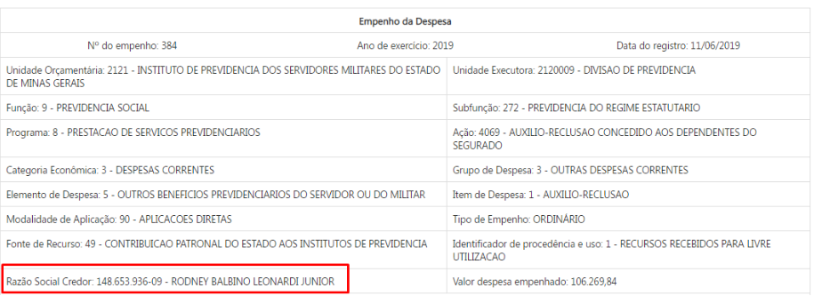
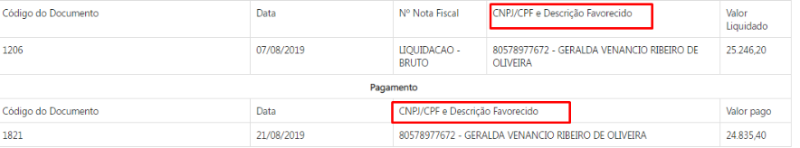

# Visão geral da intervenção

A especificação tem objetivo de anonimizar os nomes e CPFs dos credores pessoas físicas das consultas de Despesa e Restos a Pagar disponível no Portal da Transparência. 

As alterações serão aplicadas no nível favorecido, formulário de detalhamento e pesquisa avançada dos credores que receberem valores na classificação orçamentária referente aos elementos de despesa destacados na _tabela 1_(vide item 2 da 'Consulta Despesa' em 'Especificação', abaixo - linha 46).

#### Regra da Anonimização:

1. Exibir apenas as iniciais do nome do favorecido, em letras maiúsculas, separadas por ponto.; e
2. Ocultar os três primeiros dígitos e os dois últimos dígitos verificadores dos CPFs.

# Motivação / contexto da intervenção

A exigência de a administração pública divulgar informações consta na Lei Complementar nº 101/2000 (Lei de Responsabilidade Fiscal- LRF) que foi complementada pelo Decreto Federal n° 7.185/2010, que regulamentou os padrões mínimos de qualidade da informação e reforçou o entendimento da divulgação dos dados em sentido amplo, conforme art. 7º abaixo:

> _“Art.7º Sem prejuízo dos direitos e garantias individuais constitucionalmente estabelecidos, o SISTEMA deverá gerar, para disponibilização em meio eletrônico que possibilite amplo acesso público, pelo menos, as seguintes informações relativas aos atos praticados pelas unidades gestoras no decorrer da execução orçamentária e financeira:_
>
> _I - quanto à despesa:_
>
>_[...]_
>
> _d) a pessoa física ou jurídica beneficiária do pagamento, inclusive nos desembolsos de operações independentes da execução orçamentária, exceto no caso de folha de pagamento de pessoal e de benefícios previdenciários.”_

Nesse sentido, atualmente, o Portal da Transparência divulga nas consultas de Despesa e Restos a Pagar informações completas (nome e CPF) de __todos os credores__ que recebem benefícios previdenciários do Estado, contrariando o Decreto Federal em questão.

Além disso, sua divulgação tem sido objeto de questionamentos pela sociedade. 

Assim, com a finalidade de atender plenamente o que determina a legislação, a Diretoria Central de Transparência Ativa (DTA), unidade responsável pela gestão do Portal da Transparência, propõe a alteração na forma de exibição dos dados nas consultas de Despesas e Restos a Pagar.

Destaca-se ainda que as demais consultas, como por exemplo, convênios e remuneração não sofrerão alterações, uma vez que, o entendimento corrente é o de que a divulgação de informações completas e íntegras possibilita a qualquer cidadão conhecer, questionar e atuar como fiscal da aplicação dos recursos públicos, para o exercício do controle social – pois está possibilitado o cruzamento de dados dos beneficiários de políticas públicas.

# Especificação

Abaixo segue as regras que deverão ser aplicadas nas consultas de despesa e restos a pagar.

1. Quando o usuário realizar o download dos dados, esses deverão ser exibidos anonimizados conforme especificado. No entanto, a base deverá conter a informação completa.

2. A anonimização será aplicada apenas nos credores pessoas físicas que receberem valores na classificação dos elementos de despesa listados abaixo.

__Tabela 01__

|Código|Descrição|
|-------|:--------|
|01| aposentadorias do RPPS, reserva remunerada e reformas dos militares|
|03| pensões do RPPS e do militar|
|05| Outros benefícios previdenciários do servidor ou do militar
|59| Pensões especiais
|31.2|premiacoes culturais, artisticas, cientificas, desportivas e outras / prêmios lotéricos|

## Consulta Despesa

A alteração será aplicada no nível no qual o nome dos favorecidos são exibidos, no formulário de detalhamento e no resultado da consulta avançada.

### Consulta por Órgão

* 1º nível (Órgão) - Não haverá alteração
* 2º nível (Função) - Não haverá alteração
* 3º nível (Elemento de Despesa) - Não haverá alteração
* 4º nível (Favorecido):

Ao clicar no ___Elemento de despesa___ listados no item 5, o Portal exibirá um gráfico treemap e uma tabela. O cidadão poderá navegar pelos níveis de detalhamento tanto no gráfico quanto na tabela. Dados da tabela:

|Favorecido| CNPJ/CPF | Item de despesa | Valor Empenhado |Valor Liquidado| Valor Pago|
|---------|--------|---------------|-----------|----------|---------|

As regras para anonimização são:

 * __Campo Favorecido:__ Exibir apenas as iniciais do nome do favorecido, em letras maiúsculas, separadas por ponto.

 * __Campo CPF:__ Ocultar os três primeiros dígitos e dos dois últimos dígitos verificadores.

  _Exemplo:_

  ___Favorecido:___ Cassio Gustavo de Castro - CPF: 028.659.616-48

  O Portal deverá exibir da seguinte forma:

__Tabela 02__
|Favorecido| CNPJ/CPF | Item de despesa | Valor Empenhado |Valor Liquidado| Valor Pago|
|---------:|:------------:|:---------------:|:-----------:|:----------:|:---------|
|C.G.C.     |***.659.616-**|Auxílio Reclusão| 10.000,00|10.000,00|10.000,00|

* 5º nível (Formulário de Detalhamento): Os campos do formulário de detalhamento deverão seguir as regras descritas acima.

___Empenho da despesa:___

_Campo Razão Social do Credor:_ Nesse campo deverá ser exibido o nome do favorecido e CPF descaracterizados conforme regras para anonimização mencionadas acima.

___Liquidação e Pagamento___

_Campo CNPJ/CPF e Descrição do Favorecido:_ Deverá ser exibido o nome do favorecido e CPF descaracterizados conforme regras para anonimização mencionadas acima.

### Consulta por Função

* 1º nível (Função) - Não haverá alteração
* 2º nível (Subfunção) - Não haverá alteração
* 3º nível (Órgão) - Não haverá alteração
* 4º nível (Programa) - Não haverá alteração
* 5º nível (Ação) - Não haverá alteração
* 6º nível (Elemento de despesa): Não haverá alteração
* 7º nível (Favorecido): __Mesmas alterações aplicadas na Tabela 02.__
* 8º nível (Formulário de Detalhamento): __Mesmas alterações aplicadas no formulário de detalhamento da consulta por órgão.__.

### Consulta por Programa

* 1º nível (Programa) - Não haverá alteração
* 2º nível (Órgão) - Não haverá alteração
* 3º nível (Ação) - Não haverá alteração
* 4º nível (Elemento de despesa)- Não haverá alteração
* 5º nível (Favorecido) - __Mesmas alterações aplicadas na Tabela 02.__
* 6º nível (Formulário de Detalhamento): __Mesmas alterações aplicadas no formulário de detalhamento da consulta por órgão.__.

### Consulta por Favorecido Nome

O portal exibirá a opção para escolher o período da consulta – formato aaaa.

O portal exibirá a opção de escolher tipo da consulta e, ao selecionar o tipo ___Favorecido por nome___, permitirá que o cidadão escreva o nome do favorecido e retornará todos os resultados que se encaixem no termo informado do filtro.

___OBSERVAÇÃO___: O Portal deverá exibir os favorecidos que apresentem a anonimização, contudo a sua exibição deverá seguir as regras estabelecidas.

O Portal da Transparência irá listar o resultado da consulta em um gráfico treemap e em tabela.  O cidadão poderá navegar pelos níveis de detalhamento tanto no gráfico quanto na tabela.

* 1º nível (Favorecido) - __Mesmas alterações aplicadas na Tabela 02.__
* 2º nível (Elemento de despesa) - Não haverá alteração
* 3º nível (Item de despesa) - Não haverá alteração
* 4º nível (Órgão) - Não haverá alteração
* 5º nível (Formulário de Detalhamento): __Mesmas alterações aplicadas no formulário de detalhamento da consulta por órgão.__.

### Consulta por Favorecido CPF/CNPJ

O portal exibirá a opção para escolher o período da consulta – formato aaaa.
O portal exibirá a opção de escolher tipo da consulta e, ao selecionar o tipo ___Favorecido por CPF/CNPJ___, permitirá que o cidadão escreva o número do CPF ou CNPJ do favorecido e retornará todos os resultados que se encaixem no termo informado do filtro.

___OBSERVAÇÃO___: Os favorecidos que apresentarem o CPF anonimizado deverão ser exibidos no resultado da busca, contudo a sua exibição seguirá as regras estabelecidas.

O Portal da Transparência irá listar o resultado da consulta em um gráfico treemap e em tabela.  O cidadão poderá navegar pelos níveis de detalhamento tanto no gráfico quanto na tabela.

* 1º nível (Favorecido) - __Mesmas alterações aplicadas na Tabela 02.__
* 2º nível (Elemento de despesa) - Não haverá alteração
* 3º nível (Item de despesa) - Não haverá alteração
* 4º nível (Órgão) -Não haverá alteração
* 5º nível (Formulário de Detalhamento): __Mesmas alterações aplicadas no formulário de detalhamento da consulta por órgão__.

### Pesquisa Avançada

Quando o cidadão selecionar o campo ___Exibir favorecidos___ o Portal deverá retornar a lista dos favorecidos que correspondem aos elementos da despesa especificados na alínea com o nome do favorecido e CPF anonimizados (*****.123.456-**) conforme Tabela 02.

## Especificação da consulta Restos a pagar

As regras serão aplicadas no 4º nível (favorecido) e no formulário de detalhamento.

### Consulta por Órgão

* 1º nível (Órgão) - Não haverá alteração
* 2º nível (Elemento de despesa) - Não haverá alteração
* 3º nível (Item de despesa) - Não haverá alteração
* 4º nível (Favorecido):

Ao clicar no ___Item de despesa___ listados no item 5 o Portal exibirá uma tabela. Dados da tabela:

|Favorecido| CNPJ/CPF | Número do empenho | valor inscrito processado |valor inscrito não processado| valor pago no ano| valor a pagar|
|---------|--------|---------|-----------|----------|---------|--------|

#### Regras para anonimização:

* __Campo Favorecido:__ Exibir apenas as iniciais do nome do favorecido, em letras maiúsculas, separadas por ponto.

* __Campo CPF:__ Ocultar os 3 dos três primeiros e dos dois últimos dígitos verificadores.

_Exemplo:_

___Favorecido:___ Cassio Gustavo de Castro - CPF: 028.659.616.48

O Portal deverá exibir da seguinte forma:

|Favorecido| CNPJ/CPF | Número do empenho | valor inscrito processado |valor inscrito não processado| valor pago no ano| valor a pagar|
|---------|--------|---------|-----------|----------|---------|--------|
|C.G.C|***.659.616-**|316| 10.000,00|0,00|10.000,00|0,00|

* 5º nível (Formulário de Detalhamento): __Mesmas alterações aplicadas no formulário de detalhamento da consulta por órgão.__.

# Dependências / Integrações

Para efetivação da alteração é necessário verificar com a PRODEMGE a possibilidade de descaracterizar os dados.

# Exemplos

Foi realizado pesquisa no Portal do Governo Federal, Espirito Santo e São Paulo e no que diz respito a beneficios previdênciáirios nçao foi localizado nenhum credor pessoa física.

# Dúvidas / Pendências

* Ponderar e decidir sobre a inclusão do rol de dados de beneficiários dos itens abaixo na mesma especificação da Tabela 02:

Grupo 3 / Elemento: OUTROS SERVICOS DE TERCEIROS - PESSOA FISICA / Item de despesa: Estagiários????
Grupo 3 / Elemento 13: Obrigações Patronais / Item: INSS – Demais Despesas
OUTROS BENEFICIOS ASSISTENCIAIS DO SERVIDOR E DO MILITAR / Itens: auxílios fineral e natalidade.

* Conforme Decreto nº 42.758, de 17de julho de 2002; os benefícios assistencias referem-se a benefícios assegurados pelo RPPS:

> _Art. 9º - São benefícios assegurados pelo Regime Próprio de Previdência Social:
>I - ao segurado:
>aposentadoria;
>licença para tratamento de saúde;
>licença-maternidade;
>abono-família;
>
>II - ao dependente:
>pensão por morte;
>auxílio-reclusão._
----FIM----
