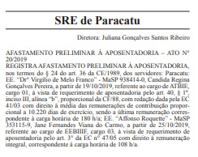
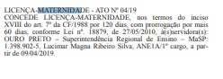
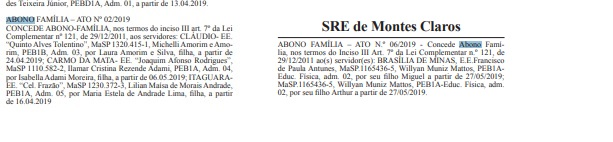
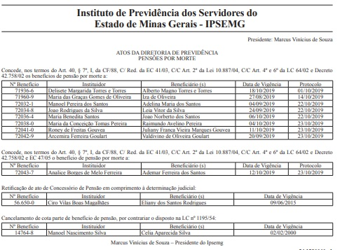

# Visão geral da demanda

Essa demanda visa anonimizar/descaracterizar os nomes e CPFs de credores pessoas físicas nas consultas de Despesa e Restos a Pagar (RP) em classificações orçamentárias específicas. As classificações orçamentárias iniciais (eg. Elemento item 31-02 - Prêmios lotéricos) estão definidas nesta especificação, mas a solução deve ser flexível para que as classificações possam ser alteradas mediante provocação da CGE.

O método de anonimização/descaracterização deve ser aplicado nos resultados das consultas de Despesa e RP que apresentem informação de nome e CPF, notadamente:

* Nível favorecido (eg. [Despesa](http://www.transparencia.mg.gov.br/despesa-estado/despesa/despesa-orgaos/2019/01-01-2019/31-12-2019/3887/1888/513/20/39); [RP](http://www.transparencia.mg.gov.br/despesa-estado/restos-a-pagar/restospagar-orgaos/2019/3887/533/42/20/2798/130/58));
* Formulários de detalhamento de documentos (eg. [Despesa](http://www.transparencia.mg.gov.br/despesa-estado/despesa/despesa-orgaos/2019/01-01-2019/31-12-2019/3887/1888/513/20/39/1210194/3023/empenhado/7/12510483/0/0); [RP](http://www.transparencia.mg.gov.br/despesa-estado/restos-a-pagar/restospagar-orgaos/2019/3887/533/42/20/2798/130/58/5839291));
* Pesquisa avançada.

O método de anonimização/descaracterização consiste em:

1. Substituir o nome do credor pelo valor "INFORMAÇÃO COM RESTRIÇÃO DE ACESSO"; e
2. Substituir o CPF do credor pelo valor "000.000.000-00".

As regras acima devem ser aplicadas inclusive no caso em que os dois campos estejam sendo apresentados de maneira conjunta.

__Nota: No banco de dados do Portal da Transparência as informações de nome e CPF devem ser armazenadas sem anonimização/descaracterização, permitindo filtros que utilizem essas informações.__

# Motivação / contexto da demanda

A exigência de a administração pública divulgar informações consta na Lei Complementar nº 101/2000 (Lei de Responsabilidade Fiscal- LRF) que foi complementada pelo Decreto Federal n° 7.185/2010, que regulamentou os padrões mínimos de qualidade da informação e reforçou o entendimento da divulgação dos dados em sentido amplo, conforme art. 7º abaixo:

> _“Art.7º Sem prejuízo dos direitos e garantias individuais constitucionalmente estabelecidos, o SISTEMA deverá gerar, para disponibilização em meio eletrônico que possibilite amplo acesso público, pelo menos, as seguintes informações relativas aos atos praticados pelas unidades gestoras no decorrer da execução orçamentária e financeira:_
>
> _I - quanto à despesa:_
>
>_[...]_
>
> _d) a pessoa física ou jurídica beneficiária do pagamento, inclusive nos desembolsos de operações independentes da execução orçamentária, exceto no caso de folha de pagamento de pessoal e de benefícios previdenciários.”_

Nesse sentido, atualmente, o Portal da Transparência divulga nas consultas de Despesa e Restos a Pagar informações completas (nome e CPF) de __todos os credores__ que recebem benefícios previdenciários do Estado, contrariando o Decreto Federal em questão.

Além disso, sua divulgação tem sido objeto de questionamentos pela sociedade.

Outro item que também será alterado é a divulgação dos nomes e CPF de ganhadores de prêmio lotéricos. Atualmente, o Portal da Transparência retirou do rol de credores da consulta de despesa e restos a pagar os favorecidos do elemento item de despesa 3102 nos anos de 2002 a 2019, para atender a Portaria nº 26/2014 da Loteria Mineira do Estado de Minas. A referida portaria em seu art. 2º estabelece que a LEMG manterá, independente de classificação, sigilo sobre a informação pessoal, relativa à intimidade, à vida privda, à honra e à imagem dos apostadores sorteados da Loteria do Estado de Minas Gerais.

A medida adotada pela DTA para preservar informações sobre apostadores sorteados da LEMG foi a exclusão de todos os dados divulgados no Portal da Transparência referentes aos pagamentos realizados no elemento item 3102, até que fosse realizada manutenção corretiva no Portal da Transparência para divulgar os dados sem a exposição dos ganhadores. Em consulta, a ASSJUR da CGE, o entendimento predominante foi o de anonimizar o nome e o CPF dos apostadores sorteados.

Assim, com a finalidade de atender plenamente o que determina a legislação, a Diretoria Central de Transparência Ativa (DTA), unidade responsável pela gestão do Portal da Transparência, propõe a alteração na forma de exibição dos dados nas consultas de Despesas e Restos a Pagar, referentes aos credores de benefícios previdenciários e prêmios lotéricos.

Destaca-se ainda que as demais consultas, como por exemplo, convênios e remuneração não sofrerão alterações, uma vez que, o entendimento corrente é o de que a divulgação de informações completas e íntegras possibilita a qualquer cidadão conhecer, questionar e atuar como fiscal da aplicação dos recursos públicos, para o exercício do controle social – pois está possibilitado o cruzamento de dados dos beneficiários de políticas públicas.

# Especificação

Abaixo segue as regras que deverão ser aplicadas nas consultas de despesa e restos a pagar.

1. Quando o usuário realizar o download dos dados, esses deverão ser exibidos anonimizados conforme especificado. No entanto, a base deverá conter a informação completa.

2. A anonimização será aplicada apenas nos credores pessoas físicas que receberem valores na classificação dos elementos de despesa listados abaixo.

__Tabela 01__

|Código|Descrição|
|-------|:--------|
|01| aposentadorias do RPPS, reserva remunerada e reformas dos militares|
|03| pensões do RPPS e do militar|
|05| Outros benefícios previdenciários do servidor ou do militar
|59| Pensões especiais
|31.2|premiacoes culturais, artisticas, cientificas, desportivas e outras / prêmios lotéricos|

## Consulta Despesa

A alteração será aplicada no nível no qual o nome dos favorecidos são exibidos, no formulário de detalhamento e no resultado da consulta avançada.

### Consulta por Órgão

* 1º nível (Órgão) - Não haverá alteração
* 2º nível (Função) - Não haverá alteração
* 3º nível (Elemento de Despesa) - Não haverá alteração
* 4º nível (Favorecido):

Ao clicar no ___Elemento de despesa___ listados no item 5, o Portal exibirá um gráfico treemap e uma tabela. O cidadão poderá navegar pelos níveis de detalhamento tanto no gráfico quanto na tabela. Dados da tabela:

|Favorecido| CNPJ/CPF | Item de despesa | Valor Empenhado |Valor Liquidado| Valor Pago|
|---------|--------|---------------|-----------|----------|---------|

As regras para anonimização são:

 * __Campo Favorecido:__ Exibir apenas as iniciais do nome do favorecido, em letras maiúsculas, separadas por ponto.

 * __Campo CPF:__ Ocultar os três primeiros dígitos e dos dois últimos dígitos verificadores.

  _Exemplo:_

  ___Favorecido:___ Cassio Gustavo de Castro - CPF: 028.659.616-48

  O Portal deverá exibir da seguinte forma:

__Tabela 02__
|Favorecido| CNPJ/CPF | Item de despesa | Valor Empenhado |Valor Liquidado| Valor Pago|
|---------:|:------------:|:---------------:|:-----------:|:----------:|:---------|
|C.G.C.     |***.659.616-**|Auxílio Reclusão| 10.000,00|10.000,00|10.000,00|

* 5º nível (Formulário de Detalhamento): Os campos do formulário de detalhamento deverão seguir as regras descritas acima.

___Empenho da despesa:___

_Campo Razão Social do Credor:_ Nesse campo deverá ser exibido o nome do favorecido e CPF descaracterizados conforme regras para anonimização mencionadas acima.

___Liquidação e Pagamento___

_Campo CNPJ/CPF e Descrição do Favorecido:_ Deverá ser exibido o nome do favorecido e CPF descaracterizados conforme regras para anonimização mencionadas acima.

### Consulta por Função

* 1º nível (Função) - Não haverá alteração
* 2º nível (Subfunção) - Não haverá alteração
* 3º nível (Órgão) - Não haverá alteração
* 4º nível (Programa) - Não haverá alteração
* 5º nível (Ação) - Não haverá alteração
* 6º nível (Elemento de despesa): Não haverá alteração
* 7º nível (Favorecido): __Mesmas alterações aplicadas na Tabela 02.__
* 8º nível (Formulário de Detalhamento): __Mesmas alterações aplicadas no formulário de detalhamento da consulta por órgão.__.

### Consulta por Programa

* 1º nível (Programa) - Não haverá alteração
* 2º nível (Órgão) - Não haverá alteração
* 3º nível (Ação) - Não haverá alteração
* 4º nível (Elemento de despesa)- Não haverá alteração
* 5º nível (Favorecido) - __Mesmas alterações aplicadas na Tabela 02.__
* 6º nível (Formulário de Detalhamento): __Mesmas alterações aplicadas no formulário de detalhamento da consulta por órgão.__.

### Consulta por Favorecido Nome

O portal exibirá a opção para escolher o período da consulta – formato aaaa.

O portal exibirá a opção de escolher tipo da consulta e, ao selecionar o tipo ___Favorecido por nome___, permitirá que o cidadão escreva o nome do favorecido e retornará todos os resultados que se encaixem no termo informado do filtro.

___OBSERVAÇÃO___: O Portal deverá exibir os favorecidos que apresentem a anonimização, contudo a sua exibição deverá seguir as regras estabelecidas.

O Portal da Transparência irá listar o resultado da consulta em um gráfico treemap e em tabela.  O cidadão poderá navegar pelos níveis de detalhamento tanto no gráfico quanto na tabela.

* 1º nível (Favorecido) - __Mesmas alterações aplicadas na Tabela 02.__
* 2º nível (Elemento de despesa) - Não haverá alteração
* 3º nível (Item de despesa) - Não haverá alteração
* 4º nível (Órgão) - Não haverá alteração
* 5º nível (Formulário de Detalhamento): __Mesmas alterações aplicadas no formulário de detalhamento da consulta por órgão.__.

### Consulta por Favorecido CPF/CNPJ

O portal exibirá a opção para escolher o período da consulta – formato aaaa.
O portal exibirá a opção de escolher tipo da consulta e, ao selecionar o tipo ___Favorecido por CPF/CNPJ___, permitirá que o cidadão escreva o número do CPF ou CNPJ do favorecido e retornará todos os resultados que se encaixem no termo informado do filtro.

___OBSERVAÇÃO___: Os favorecidos que apresentarem o CPF anonimizado deverão ser exibidos no resultado da busca, contudo a sua exibição seguirá as regras estabelecidas.

O Portal da Transparência irá listar o resultado da consulta em um gráfico treemap e em tabela.  O cidadão poderá navegar pelos níveis de detalhamento tanto no gráfico quanto na tabela.

* 1º nível (Favorecido) - __Mesmas alterações aplicadas na Tabela 02.__
* 2º nível (Elemento de despesa) - Não haverá alteração
* 3º nível (Item de despesa) - Não haverá alteração
* 4º nível (Órgão) -Não haverá alteração
* 5º nível (Formulário de Detalhamento): __Mesmas alterações aplicadas no formulário de detalhamento da consulta por órgão__.

### Pesquisa Avançada

Quando o cidadão selecionar o campo ___Exibir favorecidos___ o Portal deverá retornar a lista dos favorecidos que correspondem aos elementos da despesa especificados na alínea com o nome do favorecido e CPF anonimizados (*****.123.456-**) conforme Tabela 02.

## Especificação da consulta Restos a pagar

As regras serão aplicadas no 4º nível (favorecido) e no formulário de detalhamento.

### Consulta por Órgão

* 1º nível (Órgão) - Não haverá alteração
* 2º nível (Elemento de despesa) - Não haverá alteração
* 3º nível (Item de despesa) - Não haverá alteração
* 4º nível (Favorecido):

Ao clicar no ___Item de despesa___ listados no item 5 o Portal exibirá uma tabela. Dados da tabela:

|Favorecido| CNPJ/CPF | Número do empenho | valor inscrito processado |valor inscrito não processado| valor pago no ano| valor a pagar|
|---------|--------|---------|-----------|----------|---------|--------|

#### Regras para anonimização:

* __Campo Favorecido:__ Exibir apenas as iniciais do nome do favorecido, em letras maiúsculas, separadas por ponto.

* __Campo CPF:__ Ocultar os 3 dos três primeiros e dos dois últimos dígitos verificadores.

_Exemplo:_

___Favorecido:___ Cassio Gustavo de Castro - CPF: 028.659.616.48

O Portal deverá exibir da seguinte forma:

|Favorecido| CNPJ/CPF | Número do empenho | valor inscrito processado |valor inscrito não processado| valor pago no ano| valor a pagar|
|---------|--------|---------|-----------|----------|---------|--------|
|C.G.C|***.659.616-**|316| 10.000,00|0,00|10.000,00|0,00|

* 5º nível (Formulário de Detalhamento): __Mesmas alterações aplicadas no formulário de detalhamento da consulta por órgão.__.

# Dependências / Integrações

Para efetivação da alteração é necessário verificar com a PRODEMGE a possibilidade de descaracterizar os dados.

# Exemplos

Foi realizado pesquisa no Portal do Governo Federal, Espirito Santo e São Paulo e no que diz respito a beneficios previdênciáirios nçao foi localizado nenhum credor pessoa física.

# Dúvidas / Pendências

## Técnicas

* O método de anonimização/descaracterização escolhido influencia na estimativa de horas?

* As classificações orçamentárias para as quais o método de anonimização/descaracterização será aplicado influencia na estimativa de horas?

* Acrescentar novas consultas (eg. [Concursos](http://www.transparencia.mg.gov.br/estado-pessoal/concursos-realizados/concursos-orgaos-demandantes/2017/01-01-2017/31-12-2017/1/2/2/64)) que deverão ser anonimizadas/descaracterizadas influencia na estimativa de horas?

## Negócio

* O método de anonimização/descaracterização proposta está suficiente para garantir a privacidade dos credores?

* Ponderar e decidir sobre a inclusão do rol de dados de beneficiários dos itens abaixo na mesma especificação da Tabela 02:

Grupo 3 / Elemento: OUTROS SERVICOS DE TERCEIROS - PESSOA FISICA / Item de despesa: Estagiários????
Grupo 3 / Elemento 13: Obrigações Patronais / Item: INSS – Demais Despesas
OUTROS BENEFICIOS ASSISTENCIAIS DO SERVIDOR E DO MILITAR / Itens: auxílios fineral e natalidade.

1. Em seu art. 7º, o Decreto 7.185/2010 regulamenta que a exceção de disponiblização de dados de pessoa física estende-se a folha de pagamento de pessoa e a benefícios previdenciários.
No entanto, com base no julgamento do Recurso Extraordinário com Agravo (ARE) 652777 do Supremo Tribunal Federal é legítima a publicação, inclusive em sítio eletrônico, dos nome de servidores e dos valores dos correspondentes vencimentos e vantagens pecuniárias.
Ressalta-se que em relação aos dados de endereço, CPF e identidade o ARE 652777 permaneceu com a proibição.

..."E quanto à segurança física ou corporal dos servidores, seja pessoal, seja familiarmente, claro que ela resultará um tanto ou quanto fragilizada com a divulgação nominalizada dos dados em debate, mas é um tipo de risco pessoal e familiar que se atenua com a proibição de se revelar o endereço residencial, o CPF e a CI de cada servidor."

2. Em relação a divulgação de dados de pessoas físicas credores de benefícios previdenciários: a Lei Complementar nº 64/2002 dispõe que são benefícios assegurados pelo Regima Próprio de Previdência Social:

>I - ao segurado:
>aposentadoria;
>licença para tratamento de saúde;
>licença-maternidade;
>abono-família;
>
>II - ao dependente:
>pensão por morte;
>auxílio-reclusão.

No entanto, o Diário Oficial do Estado divulga as pessoas físicas autorizadas a receber os benefícios previstos na Lei Complementar 64/2002, assim, questiono se não é válida divulgação nominal dos beneficiários, deixando apenas anonimizado o CPF do previdenciário, seguindo a regra já estabelecida na ARE 652777.
O único benefício previdenciário que não consta no IOF é o auxílio reclusão, que para evitar questionamentos, pode ser anonimizado o CPF e o nome do beneficiário.

A título de exemplo, abaixo apresenta-se a divulgação no IOF de benefícios previdenciários.

2.a. aposentadoria

2.b. licença para tratamento de saúde

2.c. licença maternidade

2.d abono família

2.e. pensão por morte

----FIM----
