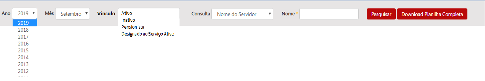
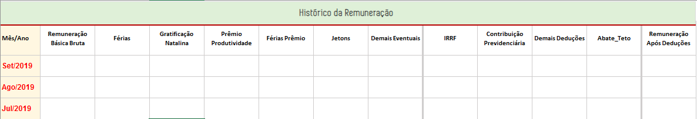
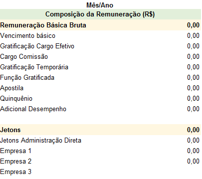
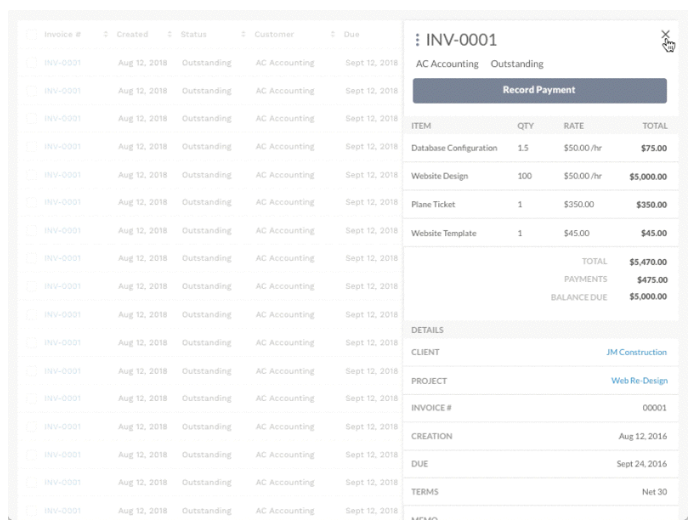

# Visão geral da Demanda

Essa demanda visa divulgar no Portal da Transparência as remunerações de todos os exercícios.

Também deve ser alterado o formato de divulgação do histórico da remuneração, com inversão de linhas e colunas, de tal forma que seja possível a visualização de maior quantidade de meses.

Além disso, também deve ser realizada a adequação do layout (entre planilha, banco de dados e interface) da consulta de remuneração no Portal da Transparência.

Por fim, deve ser incluído funcionalidade de exportação para .pdf e .csv conforme formato definido nesta especificação.

# Motivação / contexto da demanda

O formato atual de divulgação no Portal da Transparência apresenta apenas os dados financeiros referentes ao ano corrente, o que tem sido objeto de questionamentos.

A prática adotada pelo Portal da Transparência, é a transferência dos dados ao final do ano corrente para a base de dados do Portal de Dados Abertos, e a consequente exclusão desse dados na consulta de Remuneração.

Visando atender com mais completude o disposto no inc. VIII, do art. 4º do Decreto Estadual nº 45.969/2012, a Diretoria Central de Transparência Ativa - DTA/CGE, sugere a inclusão do histórico da remuneração de todos os anos ( provavelmente a partir de 2012).

# Especificação

## Página Inicial - Barra de pesquisa

Para contemplar a possibilidade da seleção de novos períodos a barra de pesquisa da página inicial deve ser:

### Observações

* Nos filtro vínculo, órgão, cargo efetivo caso o usuário não selecione nenhuma opção o Portal deve exibir todos resultados possíveis.

* Os filtros vínculo, órgão, cargo efetivo e cargo em comissão devem possuir funcionalidade de seleção múltipla como na pesquisa avançada da consulta de despesa.

* O filtro nome do servidor deve permitir que o cidadão digite no mínimo 3 letras consecutivas de qualquer parte do nome do servidor e o portal retornará todos os itens que encaixem na pesquisa.

* No filtro o campo órgão deve permitir buscas por sigla sem que essa informação seja exibida.

* O portal deve exibir todos os tipos de vínculo que estiverem na planilha de remuneração

## ___Opção 1:___ _Planilha de remuneração com os dados atuais_

## ___Opção 2:___ _Planilha de remuneração do layout aprovado em 2015_

A especificação da consulta de remuneração foi elaborada em 2012 quando da publicação do Decreto 45.969/12 que obriga a publicação da remuneração e revista em 2015, quando da atualização e reformulação do Portal da Transparência.

Na primeira onda de reformulação optou-se por atualizar a interface web da consulta de remuneração já colocando os novos campos, mas não foi feita a adequação no banco de dados. Desde então existem campos disponibilizados na interface web da consulta que não possuem dados preenchidos.

## Formulário situação funcional e histórico da Remuneração

Após a seleção de um servidor utilizando qualquer um dos filtros da pesquisa o Portal deve exibir o formulário da situação funcional (layout não sofrerá alterações) e o histórico da Remuneração, conforme apresentado abaixo:

O formulário histórico da Remuneração deve exibir 14 colunas conforme detalhamento, no entanto caso o usuário queira obter mais detalhes da remuneração o portal deve permitir a [vizualização rápida](https://uxdesign.cc/design-better-data-tables-4ecc99d23356).

Ao clicar em um período o portal exibe a vizualização rápida na parte lateral da tabela com o detalhamento abaixo:

Exemplo:

### Observações

* Os dados da situação funcional devem refletir o situação do mês/ano selecionado no início da pesquisa realiza pelo usuário.
* O cabeçalho da tabela deverá ser fixo. Exemplo: [cabeçalho fixo](https://uxdesign.cc/design-better-data-tables-4ecc99d23356)

* A coluna mês/ano será apresentado em forma: Mês (3 caracteres) e ano (4 caracteres).

* Os dados da coluna mês/ ano devem ser exibidos de forma decrescente (mais recente para o mais antigo)

* Quando o número de linhas for superior ao limite da página deve ser aplicado a paginação conforme já ocorre nas demais consultas do Portal.

* A tabela deve exibir a opção de classificar em todas as colunas.

* Aa coluna mês/ano  deve possibilitar que o usuário filtro um período desejado. Exemplo: [Filtro - Remuneração Governo do Paraná](http://www.transparencia.pr.gov.br/pte/pages/pessoal/remuneracoes/exibir_remuneracao?windowId=3d0)

Deverá ser exibido uma linha com o filtro escolhido pelo usuário.

   

   

* Opção exportar CSV: a opção exportar dados deve gerar a planilha completa em forma de tabela com todos os dados da situação funcional (dados devem refletir a situação do período selecionado) e todo histórico da remuneração.

  __Importante:__ Caso o usuário selecione um período na coluna mês/ano o CSV irá apresentar apenas o histórico da remuneração referente a seleção. Exemplo: [Extração CSV - Remuneração Governo do Paraná](http://www.transparencia.pr.gov.br/pte/pages/pessoal/remuneracoes/exibir_remuneracao?windowId=3d0)

## ___Opção 3:___ _Planilha de remuneração do layout 2019_

https://github.com/transparencia-mg/especificacoes-portal-transparencia/blob/feat/especificacao-layout-remuneracao/template.md
