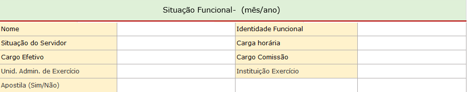
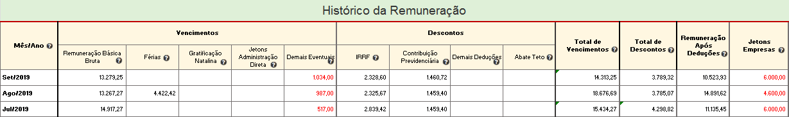
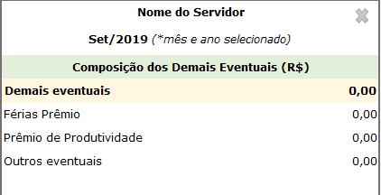
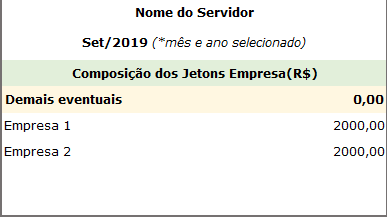

# Visão geral da Demanda

Essa demanda visa divulgar no Portal da Transparência as remunerações dos servidores públicos do Poder Executivo de todos os exercícios.

Sugere-se a alteração do formato de divulgação do histórico da remuneração, com inversão de linhas e colunas, de tal forma que seja possível a visualização de maior quantidade de meses.

Além disso, também deve ser realizada a adequação do layout (entre planilha, banco de dados e interface) da consulta de remuneração no Portal da Transparência.

Por fim, deve ser incluído funcionalidade de exportação para .pdf e .csv conforme formato definido nesta especificação.

# Motivação / contexto da demanda

O formato atual de divulgação da consulta de Remuneração no Portal da Transparência apresenta apenas o histórico da remuneração referentes ao ano corrente, o que tem sido objeto de dúvidas no Fale Conosco e no telefone 155, sobre a localização do histórico da remuneração dos anos anteriores.

A prática adotada pelo Portal da Transparência é a transferência dos dados ao final do ano corrente para a base de dados do Portal de Dados Abertos, e a consequente exclusão desse dados na consulta de Remuneração.

Visando atender com mais completude o disposto no inc. VIII, do art. 4º do Decreto Estadual nº 45.969/2012, a Diretoria Central de Transparência Ativa - DTA/CGE, sugere a inclusão do histórico da remuneração de todos os anos ( provavelmente a partir de 2012).

## _Planilha de remuneração do layout aprovado em 2012_

A especificação da consulta de remuneração foi elaborada em 2012 quando da publicação do Decreto 45.969/12 que obriga a publicação da remuneração.

## Formulário situação funcional e histórico da Remuneração

Após a seleção de um servidor utilizando qualquer um dos filtros da barra pesquisa, o Portal exibe o formulário da situação funcional e o histórico da Remuneração, conforme apresentado abaixo:

A tabela histórico remuneração deve permitir que o usuário clique no valor  referente a coluna "Demais eventuais" ou "Jetons Empresas" e o Portal exibe outra tabela detalhando os valores no formato de visualização rápida na parte lateral da tabela histórico da remuneração.

* Ao clicar no valor da coluna "Demais Eventuais" o portal exibe a barra lateral:

* Ao clicar no valor da coluna "Jetons Empresas" o portal exibe a barra lateral:

___EXEMPLO:___ [VIZUALIZAÇÃO RÁPIDA (_Quick View)_](https://uxdesign.cc/design-better-data-tables-4ecc99d23356)

### Observações

* A tabela de vizualização rápida (barra lateral) deve apresentar a opção de fechar (x) e o usuário poderá mover essa tabela para qualquer parte da tela.
* Os dados da situação funcional devem refletir a situação do mês/ano selecionado no início da pesquisa realizada pelo usuário. Ou seja, caso o usuário selecione a exibição dos dados de out/2019, a situação funcional será a correspondente a esse período. Caso o usuário selecione o jan/2019 a situação funcional deve refletir os dados de janeiro de 2019.
* Os dados apresentados na tabela histórico da remuneração deve como regra apresentar o período selecionado no início da consulta e os meses anteriores.

* O cabeçalho da tabela histórico da remuneração deverá ser congelado, ou seja, quando o usuário usar a barra de rolagem horizontal o cabeçalho da tabela deve ficar sempre visível.                    
 __Exemplo:__ [Cabeçalho fixo (_Fixed Header_)](https://uxdesign.cc/design-better-data-tables-4ecc99d23356)

* A coluna mês/ano será apresentado em forma: Mês (3 caracteres) e ano (4 caracteres).           
__Exemplo:__ Set/2019

* Os dados da coluna mês/ano devem ser exibidos de forma decrescente (mais recente para o mais antigo)

* Quando o número de linhas da tabela histórico da remuneração for superior ao limite da página deve ser aplicado a paginação conforme já ocorre nas demais consultas do Portal.

* A tabela histórico da remuneração deve exibir a opção de classificar em todas as colunas conforme já ocorre nas demais consultas do Portal.

* Opção exportar CSV: a opção exportar dados deve gerar a planilha completa em forma de tabela com todos os dados da tabela (situação funcional e todo histórico da tabela da remuneração). Os dados de cada linha da tabela deve refletir a situação funcional e remuneração referente ao período (mês/ano).       

   _Exemplo:_ A linha "Ago/2015" deve exibir a situação funcional e remuneração do servidor referente a agosto de 2015; A linha "Jan/2019" deve exibir a situação funcional e remuneração do servidor referente a janeiro/2019 e assim sucessivamente.

* __Importante:__ Caso o usuário tenha selecionado um período específico a tabela histórico da remuneração exporta apenas o histórico da remuneração referente a seleção aplicada.

   _Exemplo 1_:  Usuário selecionou o mês janeiro/2019 na barra de pesquisa inicial do Portal. O Portal exibe e exporta para CSV os dados de Janeiro/2019 e os meses anteriores.

  _Exemplo 2_:  Usuário não realizou nenhum filtro na barra de pesquisa inicial do Portal (default último mês). O Portal exibe e exporta para CSV todos dos dados da tabela de remuneração, inclusive os anteriores.

* Opção exportar PDF/ Imprimir: a opção exportar para PDF e Imprimir deve permitir que o cidadão imprima ou gere o pdf dos dados exibido na tela.  
* Caso o servidor tenha mais de uma admissão o Portal irá apresentar cada admissão conforme já ocorre atualmente, no entanto caso ele opte em exportar os dados para CSV o Portal deve apresentar todas as admissões na planilha CSV gerada.

Modelo da Planilha CSV. em anexo [remuneracao-layout-2012]()

## Glossário Interativo

1. Mês/ ano: Mês e ano de referência da remuneração

2. Remuneração Básica Bruta: É composta pela soma das parcelas remuneratórias correspondentes ao cargo efetivo, a função ou o cargo comissionado.
3. Férias: Adicional: correspondente a 1/3 (um terço) da remuneração, pago ao servidor civil ou militar por ocasião das férias.
4. Gratificação Natalina: Gratificação assegurada ao servidor civil ou militar a título de décimo terceiro salário.
5. Jetons Administração Direta: Gratificação paga, em folha, referente a participação em reuniões dos órgãos de deliberação coletiva. Pode ser pago a pessoa que não tenha vínculo funcional com o Estado.
6. Demais eventuais: Gratificações, restituições, horas-extras, prêmio de produtividade, férias prêmio e outros, pagos de forma variável e/ou eventual.
7. IRRF: Imposto de Renda Retido na Fonte, nos termos da legislação própria.
8. Contribuição Previdenciária: Contribuição Previdenciária obrigatória, nos termos da legislação pertinente.
9. Demais Deduções;
10. Abate Teto: Valor deduzido da remuneração básica bruta, quando esta ultrapassar o teto constitucional, nos termos da legislação pertinente.
11. Total de Vencimentos: Valor obtido pela soma das remunerações básica bruta, férias, Gratificação Natalina. Jetons Administração Direta e Demais eventuais.
12. Total de Descontos: Valor total dos descontos obrigatórios
13. Remuneração após deduções: Valor líquido após descontos obrigatórios.
14. Jetons empresas: É a remuneração percebida por servidores públicos estaduais em razão da participação como representantes do Estado em Conselhos de Administração e Fiscal ou órgãos equivalentes de empresas controladas direta ou indiretamente pelo Estado
