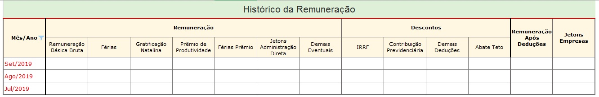
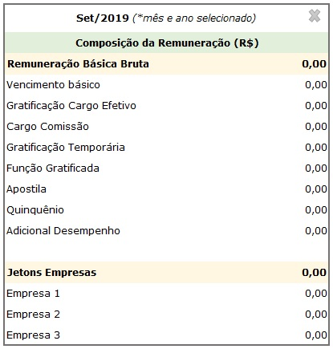
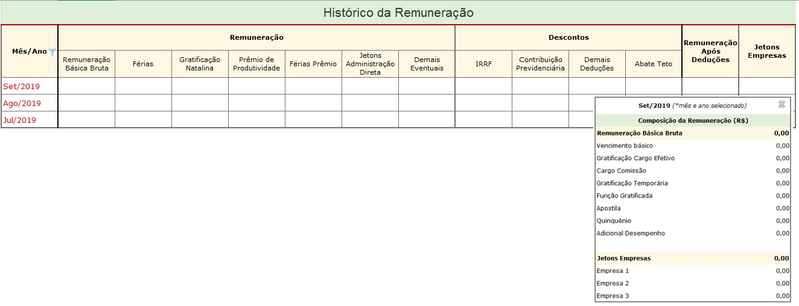
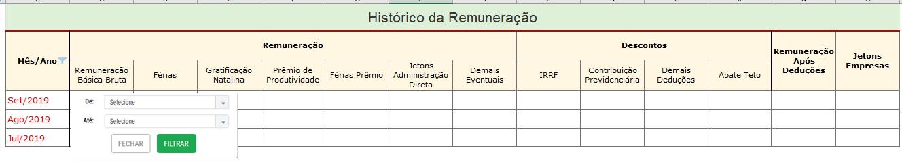
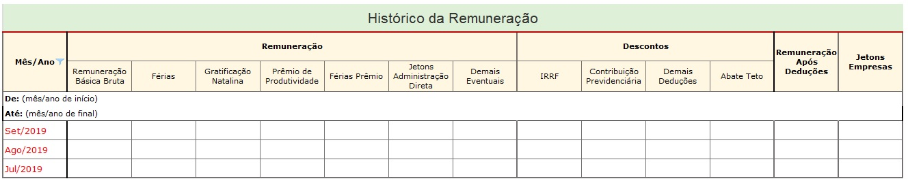

# Visão geral da Demanda

Essa demanda visa divulgar no Portal da Transparência as remunerações de todos os exercícios.

Também deve ser alterado o formato de divulgação do histórico da remuneração, com inversão de linhas e colunas, de tal forma que seja possível a visualização de maior quantidade de meses.

Além disso, também deve ser realizada a adequação do layout (entre planilha, banco de dados e interface) da consulta de remuneração no Portal da Transparência.

Por fim, deve ser incluído funcionalidade de exportação para .pdf e .csv conforme formato definido nesta especificação.

# Motivação / contexto da demanda

O formato atual de divulgação da consulta de Remuneração no Portal da Transparência apresenta apenas o histórico da remuneração referentes ao ano corrente, o que tem sido objeto de dúvidas no Fale Conosco e no telefone 155, sobre a localização do histórico da remuneração dos anos anteriores.

A prática adotada pelo Portal da Transparência é a transferência dos dados ao final do ano corrente para a base de dados do Portal de Dados Abertos, e a consequente exclusão desse dados na consulta de Remuneração.

Visando atender com mais completude o disposto no inc. VIII, do art. 4º do Decreto Estadual nº 45.969/2012, a Diretoria Central de Transparência Ativa - DTA/CGE, sugere a inclusão do histórico da remuneração de todos os anos ( provavelmente a partir de 2012).

## _Planilha de remuneração do layout aprovado em 2015_

A especificação da consulta de remuneração foi elaborada em 2012 quando da publicação do Decreto 45.969/12 que obriga a publicação da remuneração e revista em 2015, quando da atualização e reformulação do Portal da Transparência.

Na primeira onda de reformulação optou-se por atualizar a interface web da consulta de remuneração já colocando os novos campos, mas não foi feita a adequação no banco de dados. Desde então existem campos disponibilizados na interface web da consulta que não possuem dados preenchidos.

## Formulário situação funcional e histórico da Remuneração

Após a seleção de um servidor utilizando qualquer um dos filtros da pesquisa o Portal deve exibir o formulário da situação funcional e o histórico da Remuneração, conforme apresentado abaixo:

* __formulário da situação funcional__: sem alterações

* __formulário histórico da remuneração__: deve exibir 14 colunas conforme detalhado abaixo

A tabela histórico remuneração deve permitir que o usuário clique em um mês/ano. 
Assim ao clicar em um período, o portal exibe a outra tabela no formato de visualização rápida na parte lateral da tabela histórico da remuneração.     

___EXEMPLO:___ [VIZUALIZAÇÃO RÁPIDA (_Quick View)_](https://uxdesign.cc/design-better-data-tables-4ecc99d23356)

### Observações

* Os dados da situação funcional devem refletir a situação do mês/ano selecionado no início da pesquisa realizada pelo usuário.

* O cabeçalho da tabela histórico da remuneração deverá ser congelado, ou seja, quando o usuário usar a barra de rolagem horizontal o cabeçalho da tabela deve ficar sempre visível.                    
 __Exemplo:__ [Cabeçalho fixo (_Fixed Header_)](https://uxdesign.cc/design-better-data-tables-4ecc99d23356)

* A coluna mês/ano será apresentado em forma: Mês (3 caracteres) e ano (4 caracteres).           
__Exemplo:__ Set/2019

* Os dados da coluna mês/ano devem ser exibidos de forma decrescente (mais recente para o mais antigo)

* Quando o número de linhas da tabela histórico da remuneração for superior ao limite da página deve ser aplicado a paginação conforme já ocorre nas demais consultas do Portal.

* A tabela histórico da remuneração deve exibir a opção de classificar em todas as colunas conforme já ocorre nas demais consultas do Portal.

* Ao clicar no símbolo de filtrar da tabela histórico da remuneração o usuário pode selecionar o período de exibição dos dados (_ínicio e fim_).

 

 Após clicar em filtrar o portal deve exibir a tabela histórico da remuneração com a informação do período que foi selecionado:

 

  __Exemplo:__ [Governo do Paraná](http://www.transparencia.pr.gov.br/pte/pages/pessoal/remuneracoes/exibir_remuneracao?windowId=3d0)

   
   

* Opção exportar CSV: a opção exportar dados deve gerar a planilha completa em forma de tabela com todos os dados da tabela (situação funcional e todo histórico da tabela da remuneração). Os dados de cada linha da tabela deve se referir a situação funcional e remuneração referente ao período (mês/ano).       

__Exemplo:__ A linha "Ago/2015" deve exibir a situação funcional e remuneração do servidor referente a agosto de 2015; A linha "Jan/2019" deve exibir a situação funcional e remuneração do servidor referente a janeiro/2019 e assim sucessivamente.

  __Importante:__ Caso o usuário filtre um período na tabela histórico da remuneração na coluna mês/ano o CSV irá apresentar apenas o histórico da remuneração referente a seleção aplicada.       
  
  __Exemplo:__ [Extração CSV - Remuneração Governo do Paraná](http://www.transparencia.pr.gov.br/pte/pages/pessoal/remuneracoes/exibir_remuneracao?windowId=3d0)

* A tabela de vizualização rápida (barra lateral) deve apresentar a opção de fechar (x) e o usuário poderá mover essa tabela para qualquer parte da tela.
