| Título| [Homologação do layout - Consulta Remuneração - Interface](http://htmlpreview.github.io/?https://github.com/transparencia-mg/especificacoes-portal-transparencia/blob/master/espec002_remuneracao-servidores/especificacao-remuneracao-layout-2019-homologa-layout.html)        
| -|:-
|__Contrato Manutenção__ | Nº 15210010062019 (INF. 3951)
|__Proposta comercial__ |  Nº 626584/19
|__Mantis__ | 0146470  

# Homologação do layout
<a href="#top">(inicio)</a>

_As divergências estão destacadas em vermelho_
--

## Leiaute - Tabelas navegação por filtros
<a href="#top">(inicio)</a>

Incluir os campos ___remuneração bruta e remuneração líquida___ nas tabelas de resultado dos filtros

* [Nome do Servidor]()  

 __CONFERE__

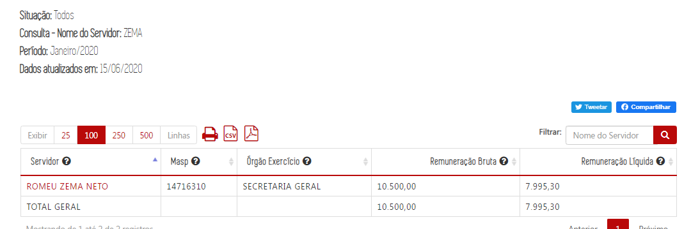

* [Cargo Efetivo]()

__CONFERE__

* [Cargo em Comissão]()

__CONFERE__

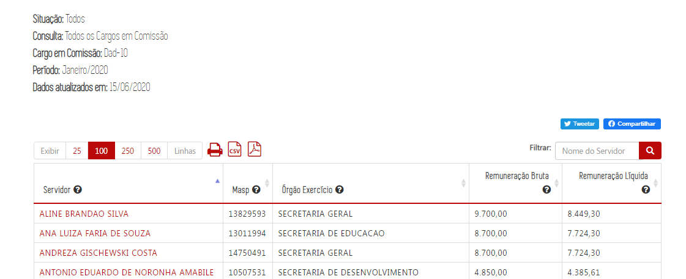

* [Órgão]()

__CONFERE__

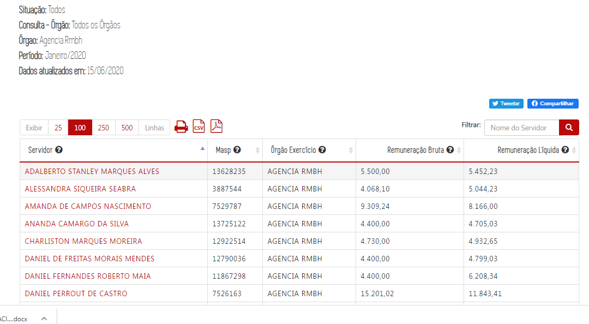

bem como no [quarto nível]() da navegação default por [salários mínimos](http://transparencia.mg.gov.br/estado-pessoal/remuneracao-dos-servidores/remuneracao-faixa/201911/3). Os campos na tabela de resultado devem ser

* Servidor
* Masp
* Órgão Exercício
* Remuneração Bruta
* Remuneração Líquida

Exemplo:

__CONFERE__

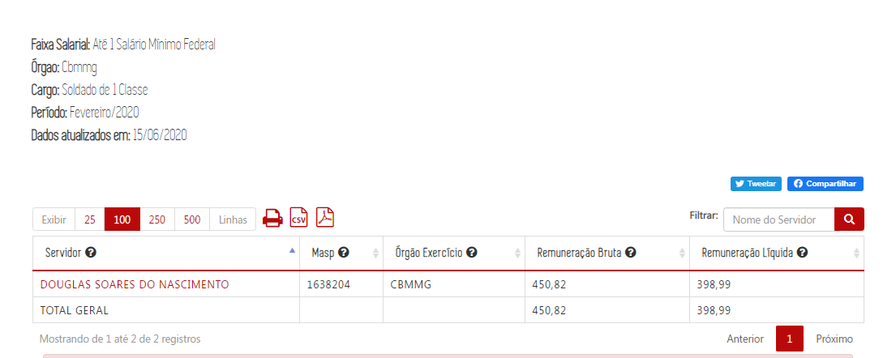

* O campo remuneração bruta refere-se ao campo _[Total]_ da tabela histórico recebimentos;

O portal não está exibindo os valores referente ao campo _[Total]_ na remuneração bruta. Os valores que estão sendo exibidos refere-se ao campo remuneração básica
--
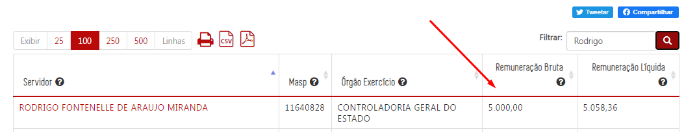

**Valores corretos a serem exibidos:**

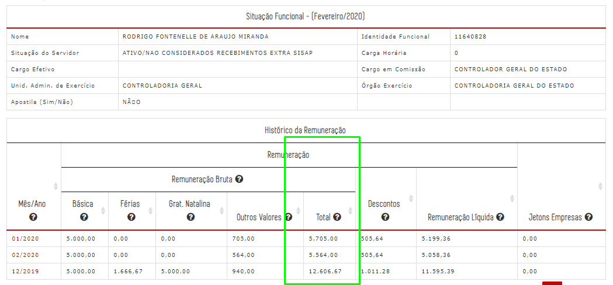

* O campo remuneração líquida refere-se ao campo _[Remuneração Líquida]_ da tabela histórico recebimentos.
__CONFERE__

* As tabelas devem possuir o comportamento padrão em relação a paginação, filtro, compartilhamento em redes sociais e exportação/impressão.

A opção "todas" não está ativa em nenhuma consulta conforme ocorre na consulta de despesa
--
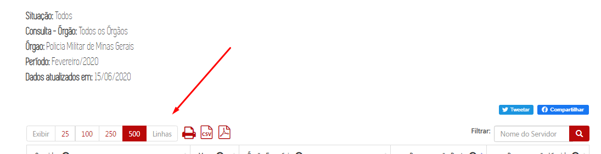

--

**Exemplo: [Consulta Despesa]()**
--

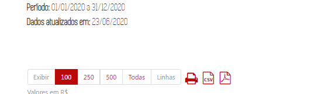

Ao realizar a classificação de valores o "TOTAL GERAL" é considerado na classificação
--

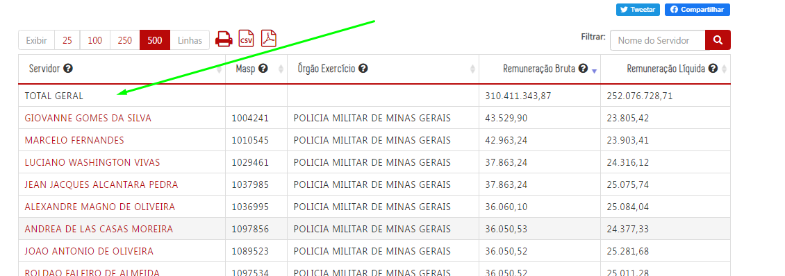

O "TOTAL GERAL" não está sendo exibido no fim da tabela
--

--
**Exemplo: [Consulta Despesa]()**
--

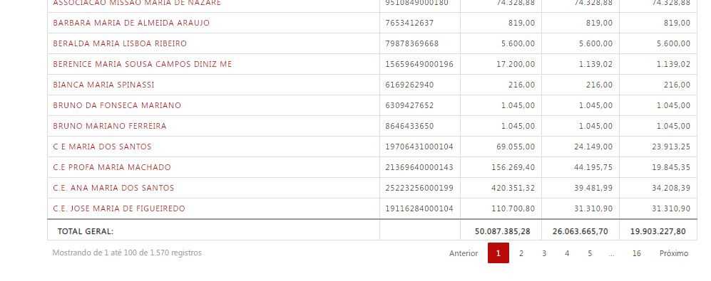

O campo "TOTAL GERAL"deve vir em negrito
--

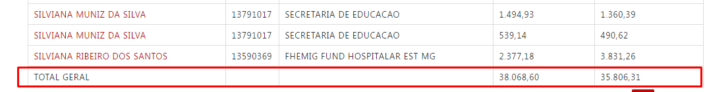

Considerando a estrutura padrão do portal ao utilizar o campo "filtrar" o Portal de deve apresentar como "TOTAL GERAL" o valor total do filtro inicial da pesquisa.
--

Filtro utilizado na pesquisa: ***Fontenelle***
--

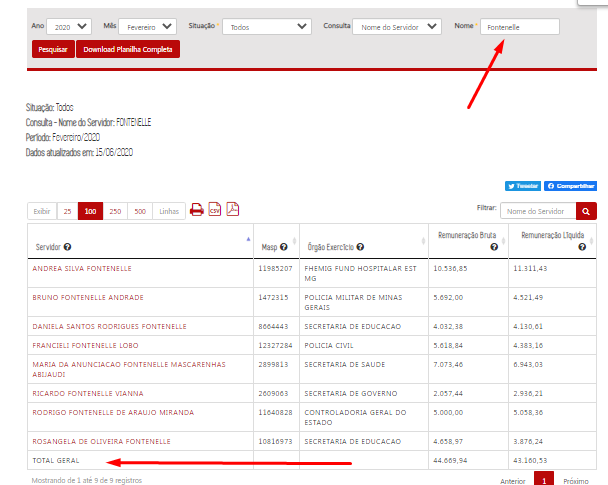

Resultado utilizando o campo [filtrar]: ***Rodrigo***
--
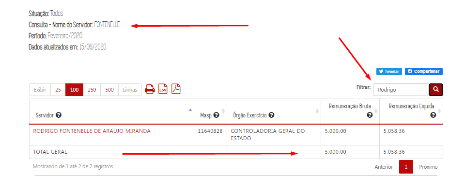

--

**Exemplo: [Consulta Despesa]()**
--

Filtro utilizado na pesquisa: ***Maria Aparecida da Silva***

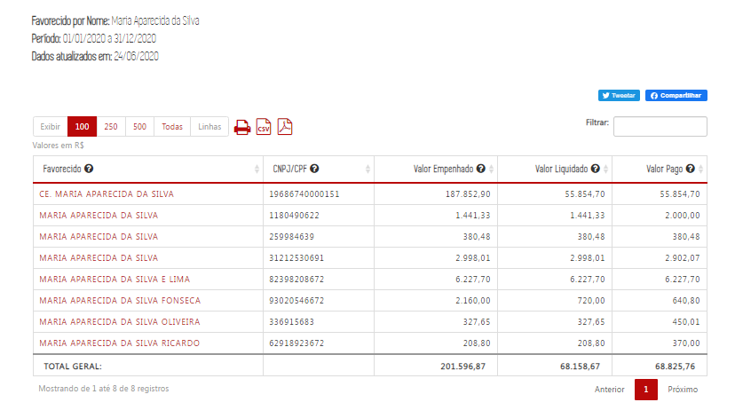

Resultado utilizando o campo [filtrar]: ***Oliveira***

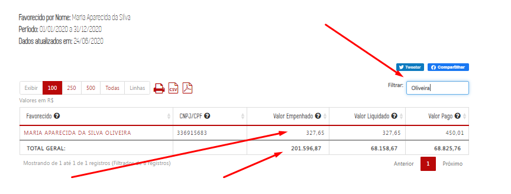

Inserir as cores padrões na planilha
--

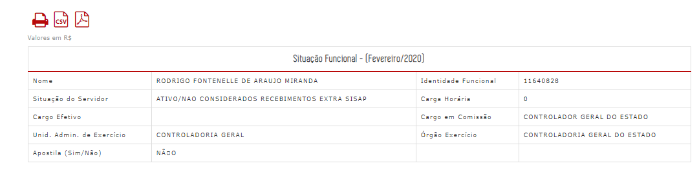

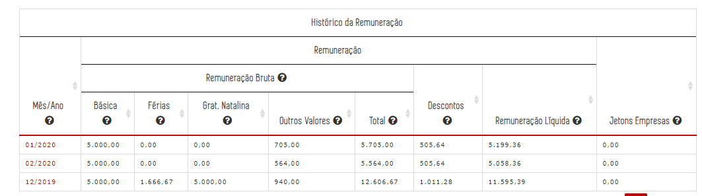

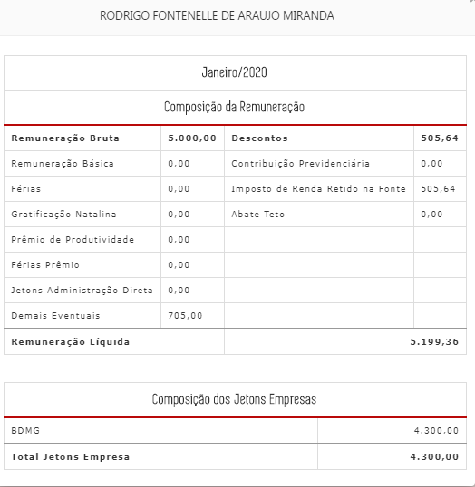

* Quando a base de dados (tabela de dados) apresentar o mesmo servidor com dois ou mais vínculos, o Portal deve apresentar cada vínculo em uma linha com os seus respectivos valores, ou seja, cada linha da planilha deve refletir uma linha no Portal.

__CONFERE__

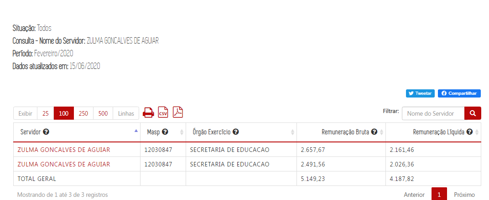

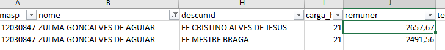

Resultado ao clicar na linha de valor: 2.657,67
--

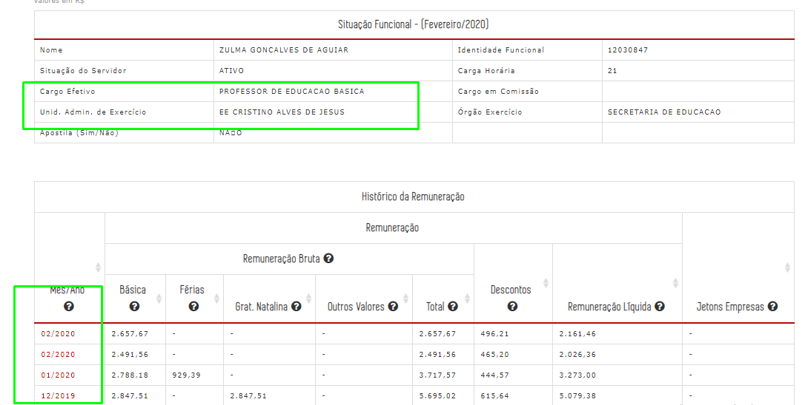

Resultado ao clicar na linha de valor: 2.491,56
--

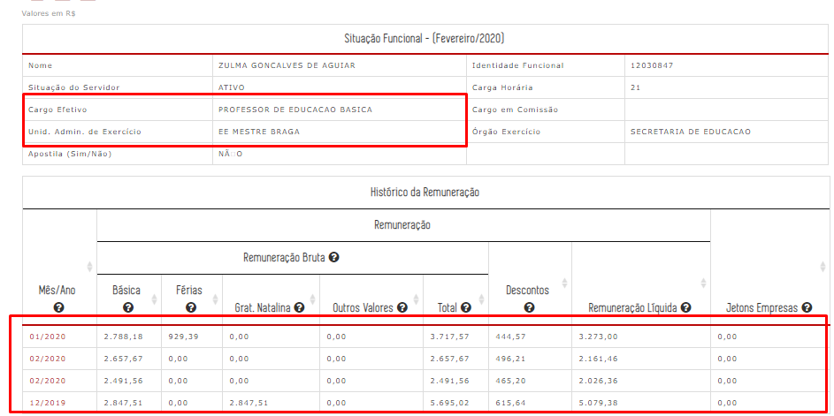

  __Exemplo:__ Servidora: ZULMA GONCALVES DE AGUIAR - JAN/2019 -

  Atualmente o Portal apresenta a servidora em linhas distintas, no entanto ao solicitar a exibição do detalhamento da remuneração o Portal duplica a informação de um vínculo desconsiderando as informações do segundo vínculo.

Resultado após clicar em qualquer um dos vínculos

### Glossário Interativo: TOOL TIP

O glossário interativo das tabelas de navegação deve apresentar os seguintes textos:

1. __Servidor:__ Nome do servidor civil ou militar conforme registrado nos Sistemas de Pagamento de Pessoal do Estado de Minas Gerais.

__CONFERE__

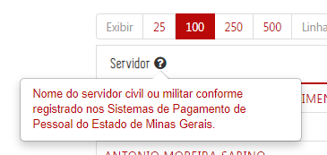

1. __Masp:__ Matrícula do servidor civil ou militar de Minas Gerais.

__CONFERE__

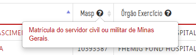

1. __Órgão Exercício:__ Órgão ou entidade de exercício do servidor.

__CONFERE__

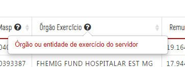

1. __Remuneração Bruta:__ Composta pela soma das parcelas remuneratórias correspondentes ao cargo efetivo, a função ou cargo comissionado, bem como gratificações de qualquer natureza e vantagens pecuniárias de caráter temporário ou permanente (gratificação natalina, férias e etc).

__CONFERE__

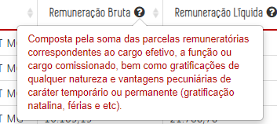

1. __Remuneração Líquida:__ Valor da remuneração do servidor após deduções obrigatórias realizadas no mês. O valor líquido apresentado pode ser superior ao efetivamente recebido, em face de não estarem inseridos os descontos de caráter pessoal.

__CONFERE__

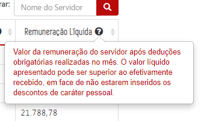

## Leiaute - Formulários detalhamento situação funcional e histórico de recebimentos
<a href="#top">(inicio)</a>

Após a seleção de um servidor utilizando qualquer um dos filtros da barra pesquisa, o Portal deve exibir o formulário da situação funcional e o histórico de recebimentos, conforme apresentado abaixo.

### Situação funcional

__CONFERE__

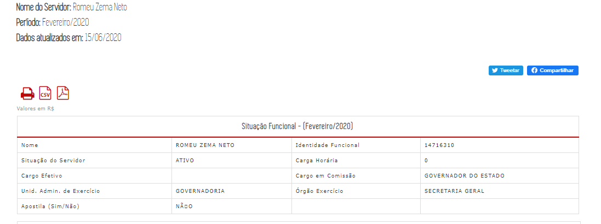

Os dados da situação funcional devem refletir a situação do mês/ano selecionado no filtro da _[barra de pesquisa]_ da consulta.

__CONFERE__

Dados foram conferidos tomando como exemplo a Servidora: zulma-goncalves

Resultado ao clicar na linha de valor: 2.657,67
--

Resultado ao clicar na linha de valor: 2.491,56
--

___Exemplo:___ Caso o usuário selecione os filtros `Ano: 2015 Mês: Janeiro` na _[barra de pesquisa]_, a situação funcional apresentada na tabela _[situação funcional]_ será a correspondente ao período Jan/2015.

**OBS:** Testes referente a mais anos serão verificados em produção, pois no ambiente de homologação estão disponíveis apenas 3 meses.
--

### Histórico recebimentos

__CONFERE__

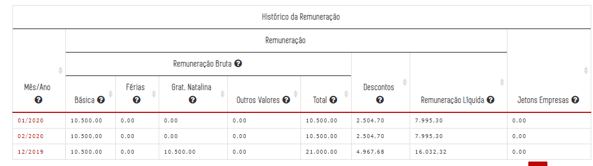

Observações:

* Valores zero devem ser apresentados como "-";

Valores zero devem ser apresentados como "-"
--
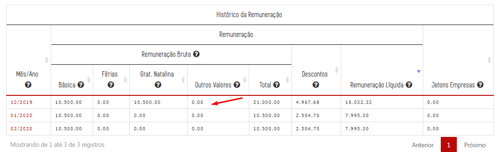

* A coluna mês/ano deve ser apresentada no formato mês(3 caracteres)/ano(4 caracteres). ___Exemplo:___ Set/2019;

__CONFERE__

* Os dados da coluna mês/ano devem ser exibidos de forma decrescente (mais recente para o mais antigo);

Ao utilizar a opção classificar  da coluna mês ano a funcionalidade não retorna a classificação correta
--
A ordem correta seria:
--
*  __<12/2019>; <01/2020>; <02/2020>__  
     ou  
* __<02/2020>; <01/2020>; <12/2019>__

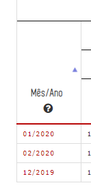

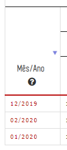

* Quando o número de linhas da tabela _[histórico recebimentos]_ for superior ao limite da página deve ser aplicada paginação conforme padrão das demais consultas;

**OBS** Não é possível verificar essa funcionalidade (paginação) em homologação, pois a base de dados disponibilizada corresponde a apenas 3 meses. Dados serão verificados em produção.
--

* O cabeçalho da tabela histórico recebimentos deve ser congelado, ou seja, quando o usuário usar a barra de rolagem vertical o cabeçalho da tabela deve ficar sempre visível. ___Exemplo:___ [Cabeçalho fixo (_Fixed Header_)](https://uxdesign.cc/design-better-data-tables-4ecc99d23356#86cf);

**OBS** Não é possível verificar essa funcionalidade (*Cabeçalho fixo (Fixed Header)* em homologação, pois a base de dados disponibilizada corresponde a apenas 3 meses. Dados serão verificados em produção.
--

__OBSERVAÇÃO:__ Essa funcionalidade não deve apresentar outra barra de rolagem dentro da tabela histórico recebimentos.

**OBS**: Não é possível verificar essa funcionalidade (*não apresentar barra de rolagem*) em homologação, pois a base de dados disponibilizada corresponde a apenas 3 meses. Dados serão verificados em produção.
--

Exemplo: [stackoverflow](https://stackoverflow.com/questions/4709390/table-header-to-stay-fixed-at-the-top-when-user-scrolls-it-out-of-view-with-jque)

* A tabela _[histórico recebimentos]_ deve exibir a opção de classificar em todas as colunas conforme já ocorre nas demais consultas do Portal; 
__CONFERE__

* Os dados apresentados na tabela _[histórico recebimentos]_ devem refletir o primeiro mês da série histórica disponível até o mês/ano selecionado no início da pesquisa.

**OBS**: Não é possível verificar essa funcionalidade em homologação, pois a base de dados disponibilizada corresponde a apenas 3 meses. Dados serão verificados em produção.
--

    ___Exemplo:___ O servidor Luiz possui dados disponíveis de Mai/2015 a Out/2019. Caso o usuário selecione no filtro da _[barra de pesquisa]_ os dados de Out/2017, o Portal exibirá dos dados de Mai/2015 a Out/2017.

##### Glossário Interativo: TOOL TIP

O glossário interativo do histórico recebimentos deve apresentar os seguintes textos:

1. __Mês/ano:__ Mês e ano de referência da folha de pagamento. O pagamento ocorre conforme cronograma do Governo do Estado de Minas Gerais;

__CONFERE__

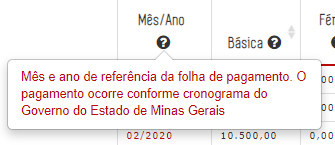

1. __Básica:__ Composta pela soma das parcelas remuneratórias correspondentes ao cargo efetivo,  função gratificada ou cargo comissionado;

__CONFERE__

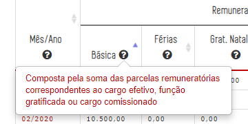

1. __Férias:__ Adicional pago ao servidor, por ocasião das férias regulamentares, correspondentes a 1/3 (um terço) da remuneração do período de férias;

__CONFERE__

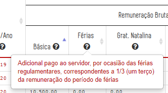

1. __Gratificação Natalina:__ Gratificação assegurada ao servidor civil ou militar a título de décimo terceiro salário;

__CONFERE__

1. __Outros valores:__ Valores pagos em condições excepcionais e transitórias, tais como: Indenizações, Decisões Judiciais, Ajuda de Custo, Alimentação e outros valores de natureza eventual.

__CONFERE__

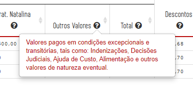

1. __Total:__ Composta pela soma das parcelas remuneratórias correspondentes a remuneração básica e vantagens pecuniárias de caráter temporário ou permanente (gratificação natalina, férias e etc);

__CONFERE__

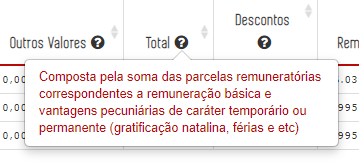

1. __Descontos:__ Valor referentes aos descontos obrigatórios, incluído os descontos que excedam o limite constitucional da remuneração. Não estão incluídos os descontos de caráter pessoal, tais como consignados, previdência complementar e pensão alimentícia.

__CONFERE__

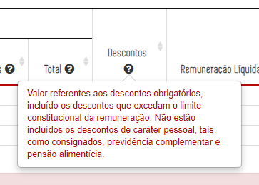

1. __Remuneração líquida:__ Valor da remuneração do servidor após deduções realizadas no mês. O valor líquido apresentado pode ser superior ao efetivamente recebido, em face de não estarem inseridos os descontos de caráter pessoal.

__CONFERE__

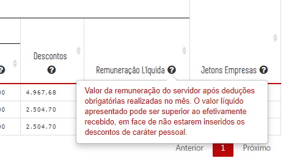

1. __Jetons Empresas:__ É a remuneração percebida por servidores públicos estaduais em razão da participação como representantes do Estado em Conselhos de Administração e Fiscal ou órgãos equivalentes de empresas controladas direta ou indiretamente pelo Estado

__CONFERE__

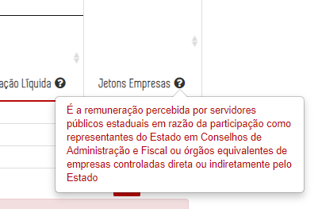

#### Formulário de detalhamento

A tabela histórico recebimentos deve permitir que o usuário clique no mês/ano para detalhar as informações referente aqueles mês. A informação mês/ano virá em vermelho como forma de destacar a possibilidade de clique.

Quando o usuário clicar em um desses campos o Portal exibe outra janela detalhando os valores do mês selecionado. Deve ser possível a seleção de múltiplos meses sem perda de contexto.

___Exemplo:___ [Multi-Modal](https://uxdesign.cc/design-better-data-tables-4ecc99d23356#4a39)

__CONFERE__
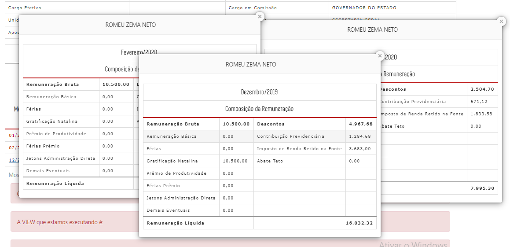

  

Ao clicar na coluna mês/ano, linha Out/2019 o portal exibirá o detalhamento do mês de outubro, com cabeçalho detalhando nome do servidor e mês da pesquisa: __OK__

__CONFERE__

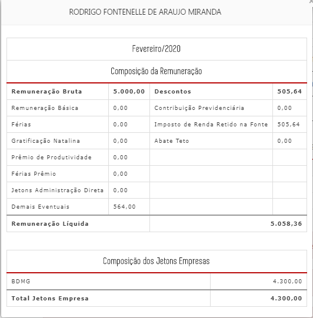

  

A tabela histórico de remuneração não está exibindo os valores de jetons
--

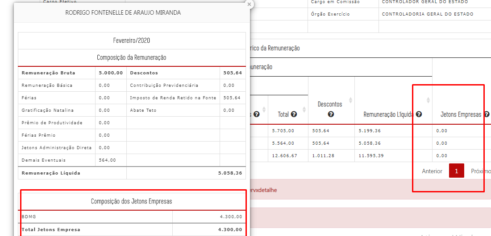

Algumas observações:

* O formulário de detalhamento deve apresentar a opção de fechar (x)

__CONFERE__
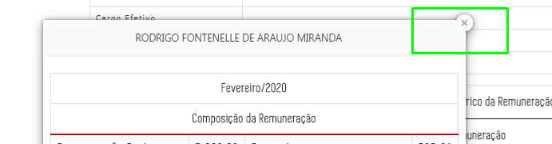

* O usuário pode mover o formulário de detalhamento para qualquer parte da tela

__CONFERE__
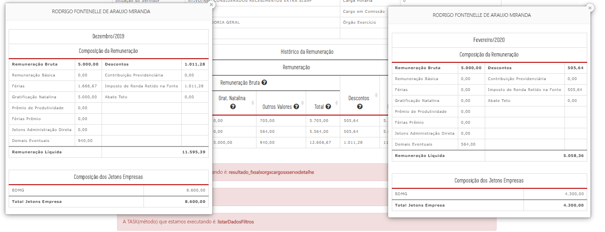

* Valores zero devem ser apresentados como "-"

Corrigir valores zerados para "-"
--

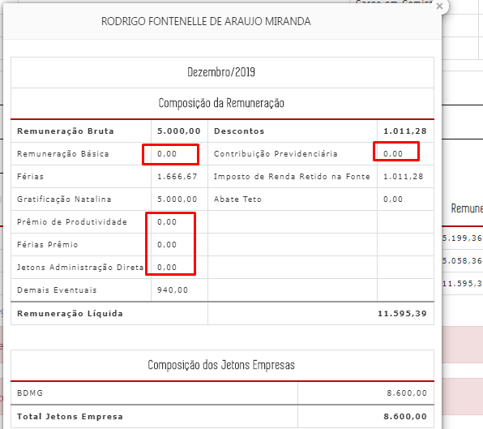

* A seção de detalhamento dos jetons empresas somente deve ocorrer para os casos em que os valores não forem zerados para o mês destacado. __Exemplo:__

__CONFERE__

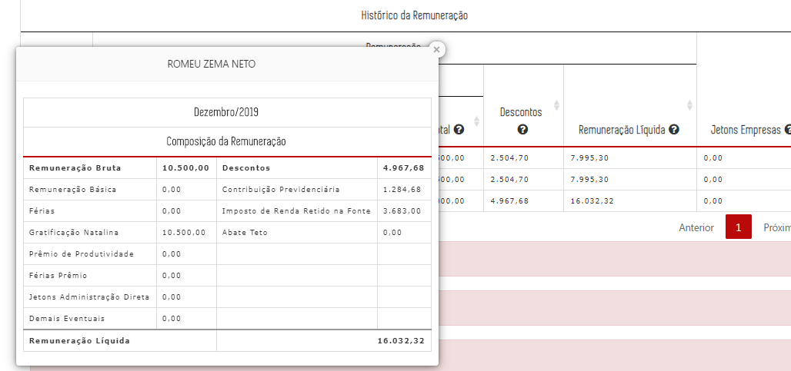

Corrigir nome de Total Jetons Empresa para **Total Jetons Empresas**
--

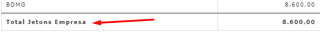

Incluir o "R$" no local indicado
--

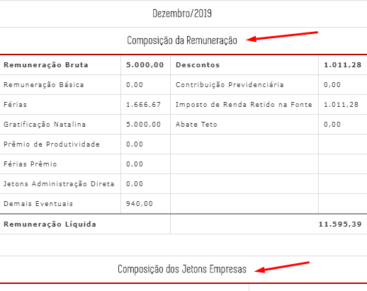

### Exportação de arquivos

Ao contrário da situação atual, a funcionalidade de impressão e exportação (CSV e PDF) deve existir tanto nas tabelas de navegação por filtros quanto nos formulários de detalhamento da situação funcional e histórico de recebimentos.

* Tabelas de Navegação - __CONFERE__

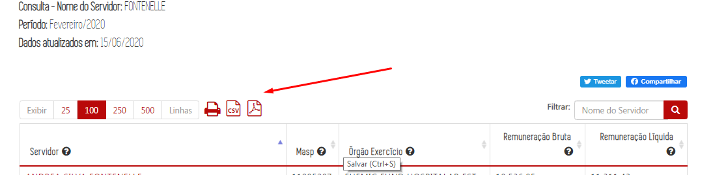

--
* **IMPRIMIR**- Tabelas de Navegação

--
* **PDF** - Tabelas de Navegação

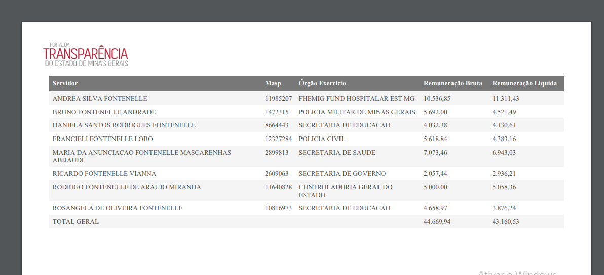

--
* **CSV** - Tabelas de Navegação

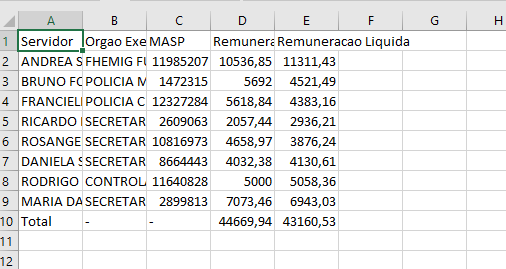

Nas tabelas de navegação por filtros as regras de exportação/impressão devem seguir o padrão das demais consultas. A seguir são destacadas as particularidades das regras exportação/impressão para os formulários de detalhamento da situação funcional e histórico de recebimentos:

 __CONFERE__

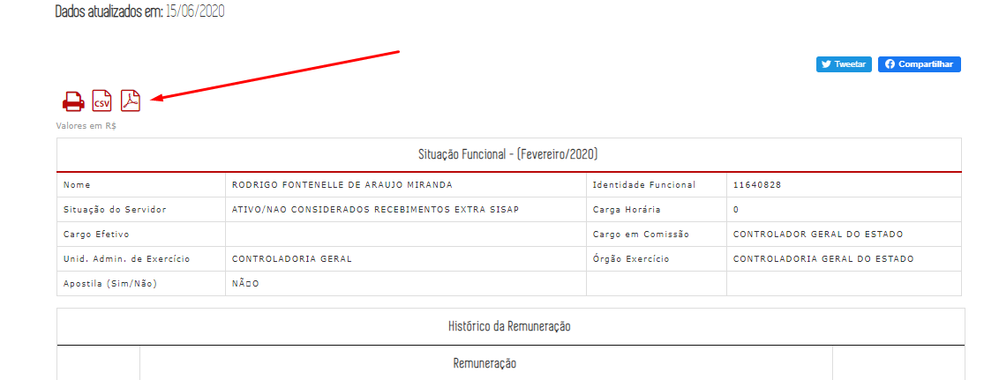

* A opção exportar dados deve gerar a planilha completa em forma de tabela com todos os dados das tabelas _[situação funcional]_ e _[histórico de recebimentos]_.

* Os dados de cada linha da planilha deve refletir a situação funcional e remuneração referente ao período (mês/ano).

___Exemplo 1___: A linha "Ago/2015" deve exibir a situação funcional e remuneração do servidor referente a agosto de 2015; A linha "Jan/2019" deve exibir a situação funcional e remuneração do servidor referente a janeiro/2019 e assim sucessivamente.

A funcionalidade destacada no exemplo acima (Exemplo 1) não está funcionando.
--

**Exemplo**: A Joana Darc Aparecida de Faria Lopes em dez/2019 estava lotada na "SUPERINTENDENCIA CENTRAL DE ANALISE E"  e em fev/2020 estava lotada em "DIRETORIA CENTRAL DE FISCALIZACAO DE" ao gerar o csv o Portal retorna os mesmos dados para todos os períodos. Esse fato também ocorre para os outros campos, como por exemplo cargo em comissão.

--

* **Dezembro/2019**
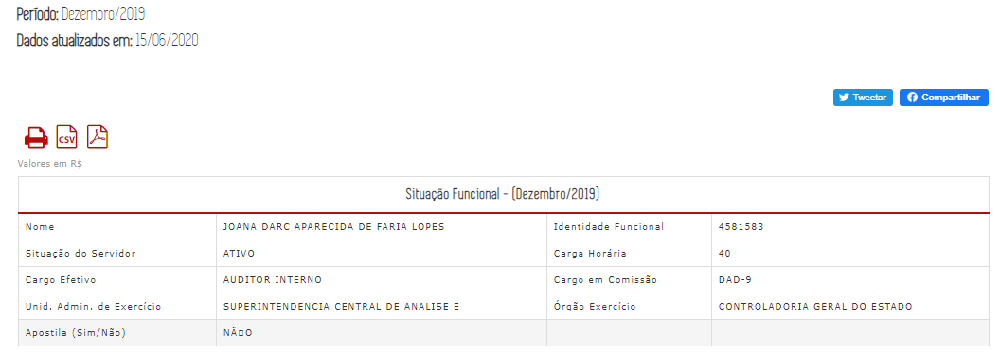

--
* **Fevereiro/2020**
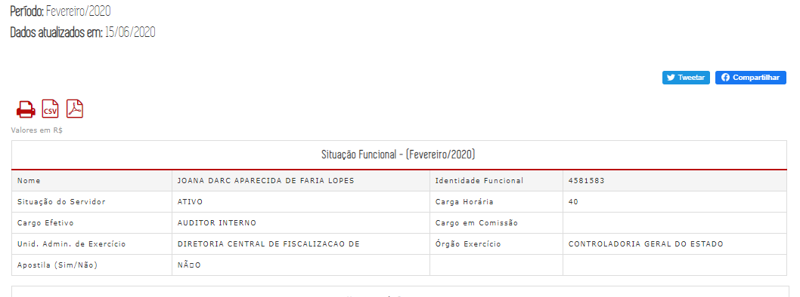

* **CSV gerado**
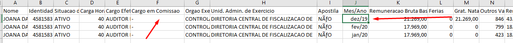

__CONFERE__

* **IMPRIMIR**

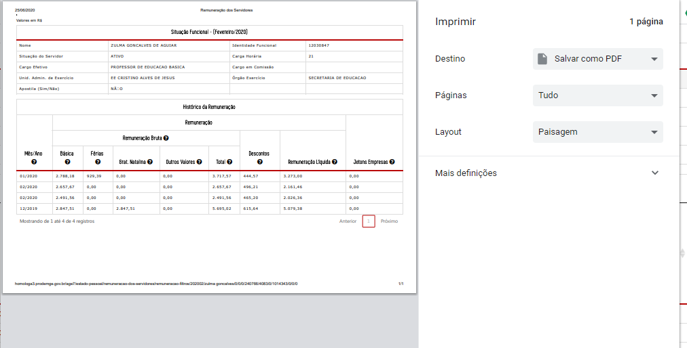

--

* **PDF**

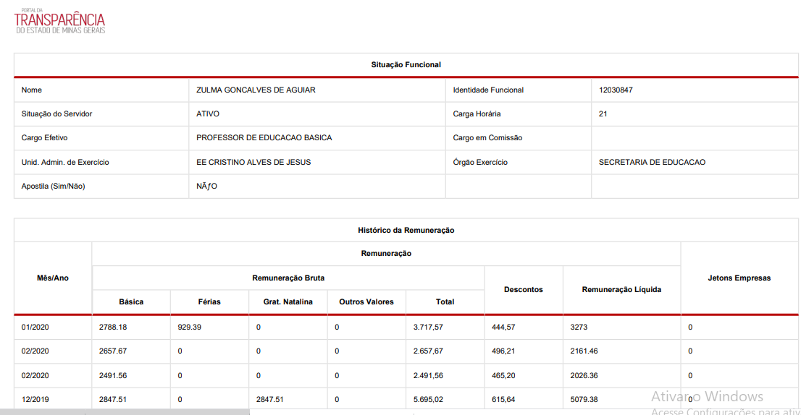

* O leiaute da planilha exportada deve seguir o formato da planilha de remuneração disponibilizada pela CGE com inserção de uma coluna `mes` no formato `YYYY-MM-01`. Vide [arquivo exemplo](static/csv-usuario.csv). __OK__

A ordem e o layout da planilha extraída em csv do Portal não está conforme o solicitado pela congelado
--
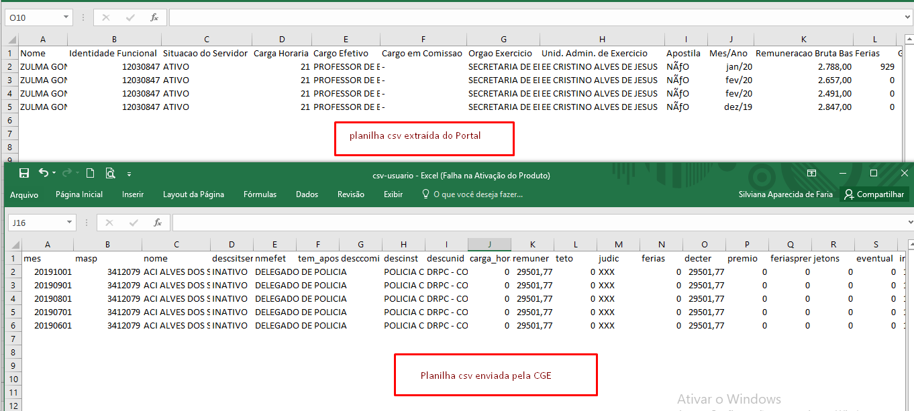

* Os valores zero devem ser exportados como valores numéricos `0`

Os valores não estão no formato solicitado
--

