# Homologação da documentação da especificação
<a href="#top">(inicio)</a>

* ___Mantis 0144817___

_As divergências foram todas corrigidas na documentação do dia 28/04/2020__

## Leiaute - Tabelas navegação por filtros
<a href="#top">(inicio)</a>

Incluir os campos ___remuneração bruta e remuneração líquida___ nas tabelas de resultado dos filtros

* [Nome do Servidor]() __OK__

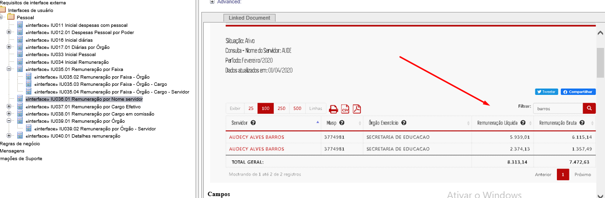

* [Cargo Efetivo]()

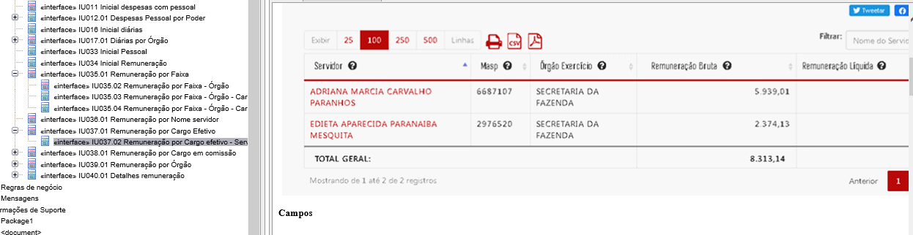

* [Cargo em Comissão]()

* [Órgão]()

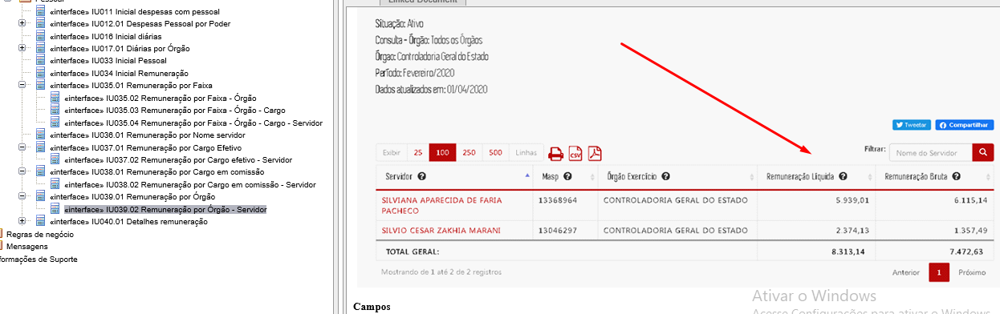

bem como no [quarto nível]() da navegação default por [salários mínimos](http://transparencia.mg.gov.br/estado-pessoal/remuneracao-dos-servidores/remuneracao-faixa/201911/3). Os campos na tabela de resultado devem ser

* Servidor
* Masp
* Órgão Exercício
* Remuneração Bruta
* Remuneração Líquida

Exemplo:

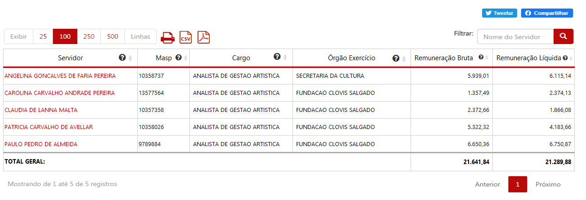

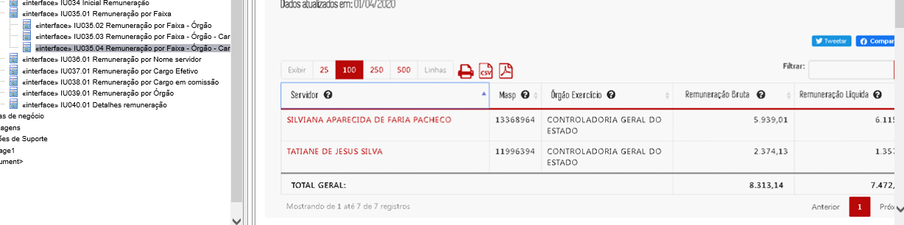

---

__Esse item não existe nas Tabelas__

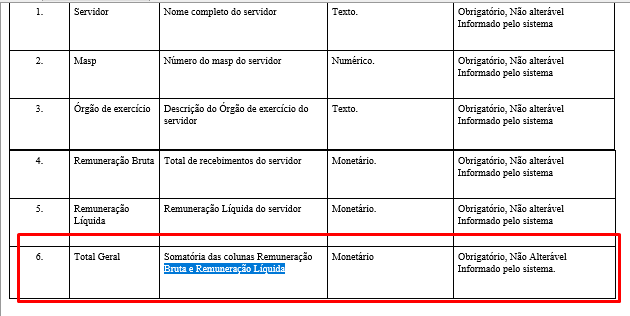

  

* O campo remuneração bruta refere-se ao campo _[Total]_ da tabela histórico recebimentos;

* O campo remuneração líquida refere-se ao campo _[Remuneração Líquida]_ da tabela histórico recebimentos.
* As tabelas devem possuir o comportamento padrão em relação a paginação, filtro, compartilhamento em redes sociais e exportação/impressão.
* Quando a base de dados (tabela de dados) apresentar o mesmo servidor com dois ou mais vínculos, o Portal deve apresentar cada vínculo em uma linha com os seus respectivos valores, ou seja, cada linha da planilha deve refletir uma linha no Portal.

  __Exemplo:__ Servidora: ZULMA GONCALVES DE AGUIAR - JAN/2019 -

  Atualmente o Portal apresenta a servidora em linhas distintas, no entanto ao solicitar a exibição do detalhamento da remuneração o Portal duplica a informação de um vínculo desconsiderando as informações do segundo vínculo.

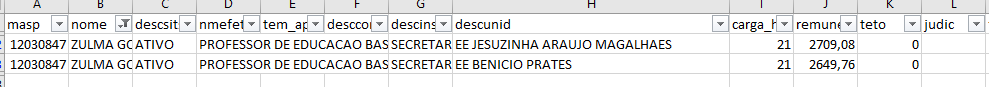

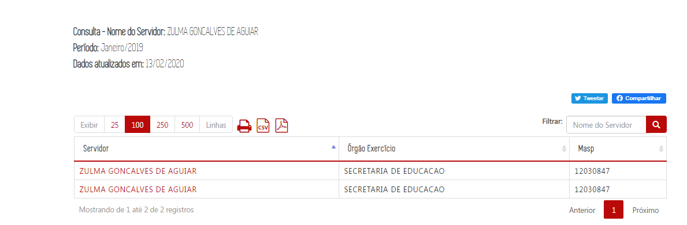

Resultado após clicar em qualquer um dos vínculos

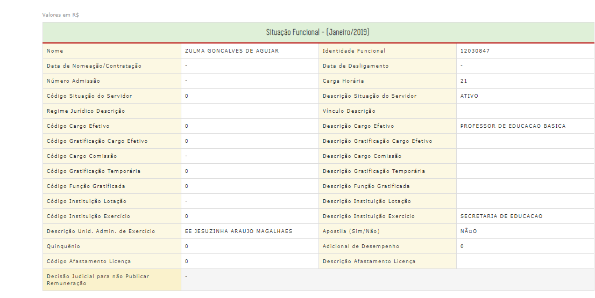

<s>A tela do glossário não está disponível na documentação</s>  __CORRIGIDO__

### Glossário Interativo: TOOL TIP

O glossário interativo das tabelas de navegação deve apresentar os seguintes textos:

1. __Servidor:__ Nome do servidor civil ou militar conforme registrado nos Sistemas de Pagamento de Pessoal do Estado de Minas Gerais.
1. __Masp:__ Matrícula do servidor civil ou militar de Minas Gerais.
1. __Órgão Exercício:__ Órgão ou entidade de exercício do servidor.
1. __Remuneração Bruta:__ Composta pela soma das parcelas remuneratórias correspondentes ao cargo efetivo, a função ou cargo comissionado, bem como gratificações de qualquer natureza e vantagens pecuniárias de caráter temporário ou permanente (gratificação natalina, férias e etc).
1. __Remuneração Líquida:__ Valor da remuneração do servidor após deduções obrigatórias realizadas no mês. O valor líquido apresentado pode ser superior ao efetivamente recebido, em face de não estarem inseridos os descontos de caráter pessoal.

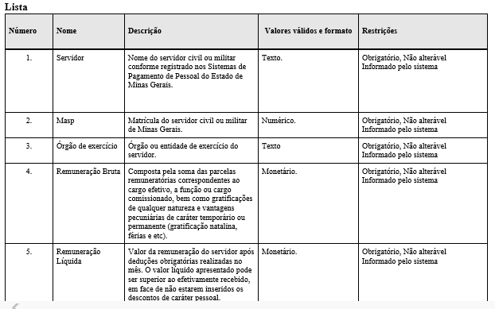

## Leiaute - Formulários detalhamento situação funcional e histórico de recebimentos
<a href="#top">(inicio)</a>

Após a seleção de um servidor utilizando qualquer um dos filtros da barra pesquisa, o Portal deve exibir o formulário da situação funcional e o histórico de recebimentos, conforme apresentado abaixo.

### Situação funcional

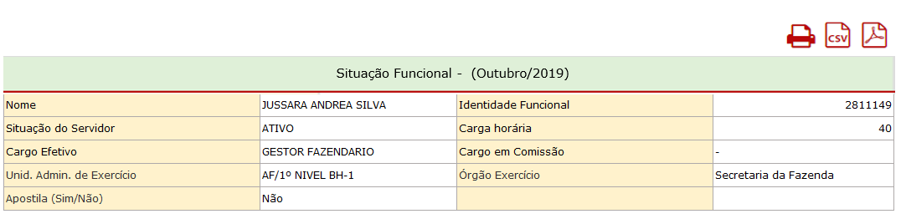

<s> Faltou o texo __"(sim/não)"__ no campo apostila </s> __CORRIGIDO__

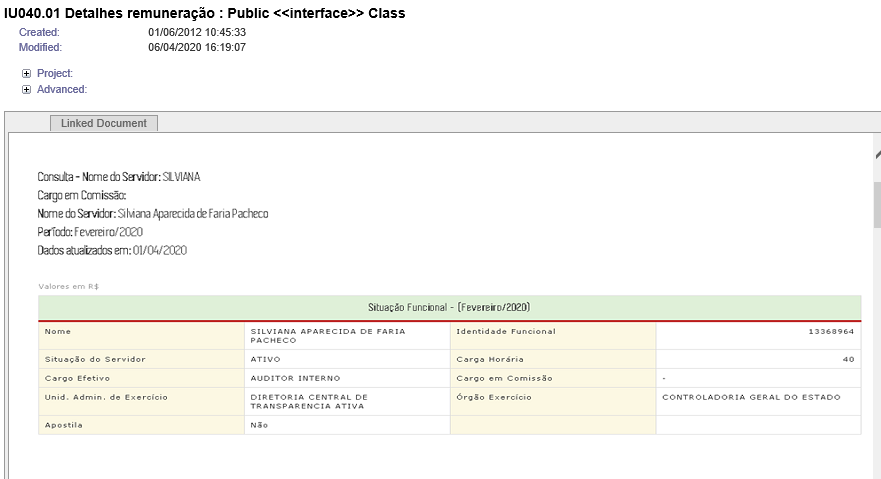

---

<s>Corrigir texto do itens da situação funcional</s> __OK__

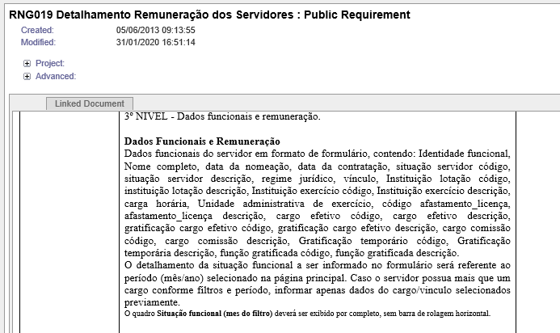

Os dados da situação funcional devem refletir a situação do mês/ano selecionado no filtro da _[barra de pesquisa]_ da consulta.

___Exemplo:___ Caso o usuário selecione os filtros `Ano: 2015 Mês: Janeiro` na _[barra de pesquisa]_, a situação funcional apresentada na tabela _[situação funcional]_ será a correspondente ao período Jan/2015.

### Histórico recebimentos

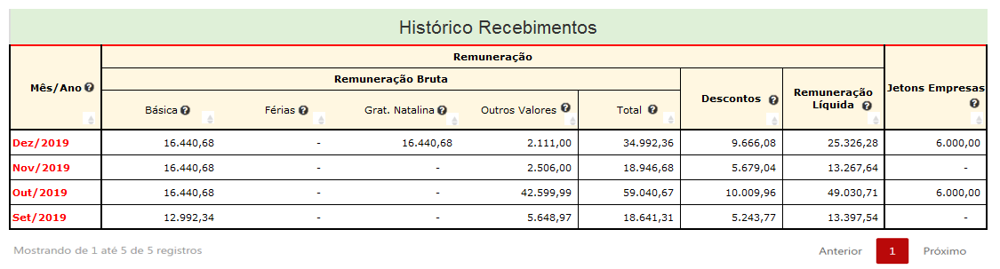

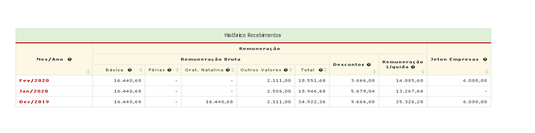

---

<s>Corrigir texto do itens do histórico de recebimentos</s> __CORRIGIDO__

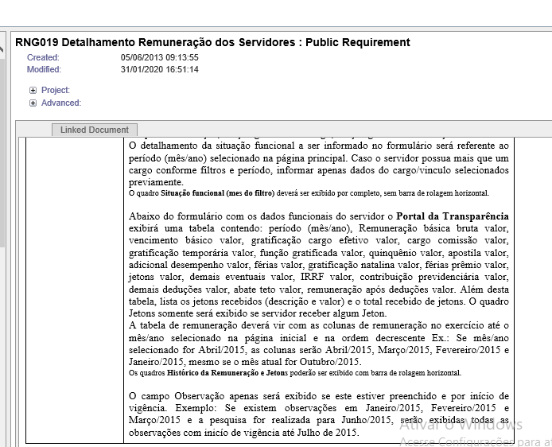
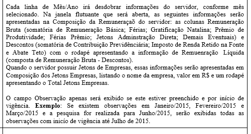

  

Observações:

* Valores zero devem ser apresentados como "-"; __OK__

* A coluna mês/ano deve ser apresentada no formato mês(3 caracteres)/ano(4 caracteres). ___Exemplo:___ Set/2019; __OK__

* Os dados da coluna mês/ano devem ser exibidos de forma decrescente (mais recente para o mais antigo); __OK__

* Quando o número de linhas da tabela _[histórico recebimentos]_ for superior ao limite da página deve ser aplicada paginação conforme padrão das demais consultas;

* O cabeçalho da tabela histórico recebimentos deve ser congelado, ou seja, quando o usuário usar a barra de rolagem vertical o cabeçalho da tabela deve ficar sempre visível. ___Exemplo:___ [Cabeçalho fixo (_Fixed Header_)](https://uxdesign.cc/design-better-data-tables-4ecc99d23356#86cf);

__OBSERVAÇÃO:__ Essa funcionalidade não deve apresentar outra barra de rolagem dentro da tabela histórico recebimentos.

Exemplo: [stackoverflow](https://stackoverflow.com/questions/4709390/table-header-to-stay-fixed-at-the-top-when-user-scrolls-it-out-of-view-with-jque)

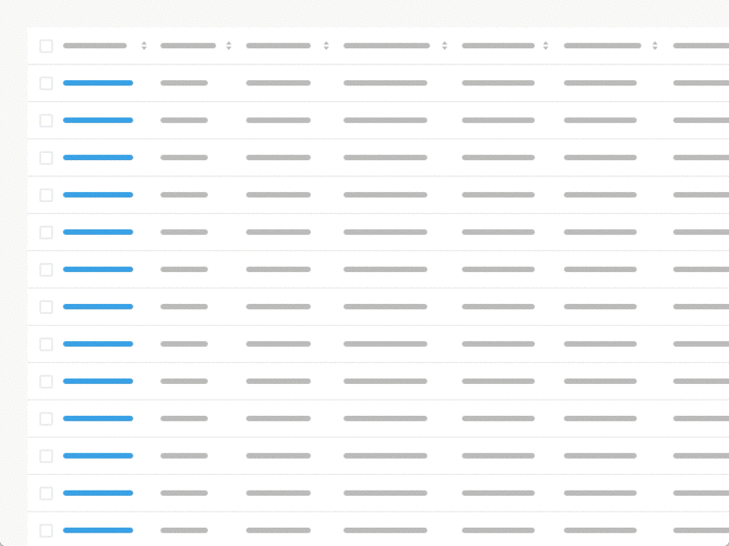

---
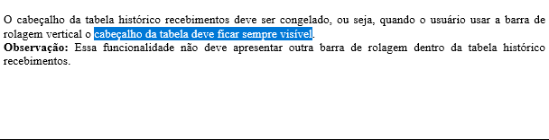

* A tabela _[histórico recebimentos]_ deve exibir a opção de classificar em todas as colunas conforme já ocorre nas demais consultas do Portal; __OK__

* Os dados apresentados na tabela _[histórico recebimentos]_ devem refletir o primeiro mês da série histórica disponível até o mês/ano selecionado no início da pesquisa.  

    ___Exemplo:___ O servidor Luiz possui dados disponíveis de Mai/2015 a Out/2019. Caso o usuário selecione no filtro da _[barra de pesquisa]_ os dados de Out/2017, o Portal exibirá dos dados de Mai/2015 a Out/2017.

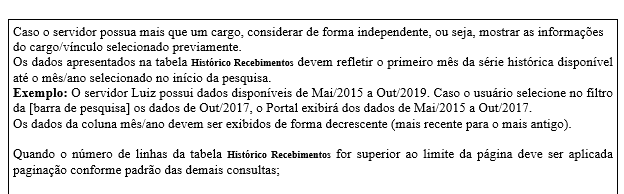

##### Glossário Interativo: TOOL TIP

O glossário interativo do histórico recebimentos deve apresentar os seguintes textos:

1. __Mês/ano:__ Mês e ano de referência da folha de pagamento. O pagamento ocorre conforme cronograma do Governo do Estado de Minas Gerais;
1. __Básica:__ Composta pela soma das parcelas remuneratórias correspondentes ao cargo efetivo,  função gratificada ou cargo comissionado;
1. __Férias:__ Adicional pago ao servidor, por ocasião das férias regulamentares, correspondentes a 1/3 (um terço) da remuneração do período de férias;
1. __Gratificação Natalina:__ Gratificação assegurada ao servidor civil ou militar a título de décimo terceiro salário;
1. __Outros valores:__ Valores pagos em condições excepcionais e transitórias, tais como: Indenizações, Decisões Judiciais, Ajuda de Custo, Alimentação e outros valores de natureza eventual.
1. __Total:__ Composta pela soma das parcelas remuneratórias correspondentes a remuneração básica e vantagens pecuniárias de caráter temporário ou permanente (gratificação natalina, férias e etc);
1. __Descontos:__ Valor referentes aos descontos obrigatórios, incluído os descontos que excedam o limite constitucional da remuneração. Não estão incluídos os descontos de caráter pessoal, tais como consignados, previdência complementar e pensão alimentícia.
1. __Remuneração líquida:__ Valor da remuneração do servidor após deduções realizadas no mês. O valor líquido apresentado pode ser superior ao efetivamente recebido, em face de não estarem inseridos os descontos de caráter pessoal.
1. __Jetons Empresas:__ É a remuneração percebida por servidores públicos estaduais em razão da participação como representantes do Estado em Conselhos de Administração e Fiscal ou órgãos equivalentes de empresas controladas direta ou indiretamente pelo Estado

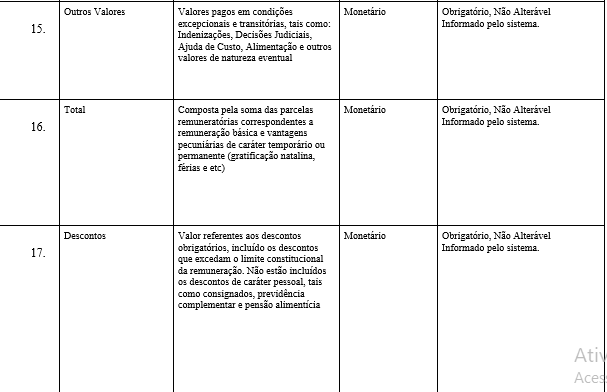
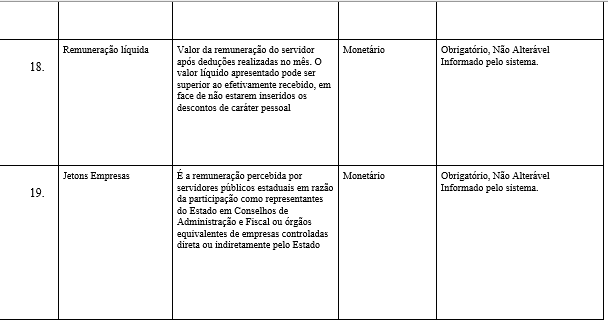

#### Formulário de detalhamento

A tabela histórico recebimentos deve permitir que o usuário clique no mês/ano para detalhar as informações referente aqueles mês. A informação mês/ano virá em vermelho como forma de destacar a possibilidade de clique.

Quando o usuário clicar em um desses campos o Portal exibe outra janela detalhando os valores do mês selecionado. Deve ser possível a seleção de múltiplos meses sem perda de contexto.

___Exemplo:___ [Multi-Modal](https://uxdesign.cc/design-better-data-tables-4ecc99d23356#4a39)

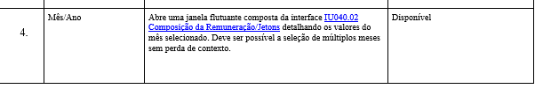

  

Ao clicar na coluna mês/ano, linha Out/2019 o portal exibirá o detalhamento do mês de outubro, com cabeçalho detalhando nome do servidor e mês da pesquisa: __OK__

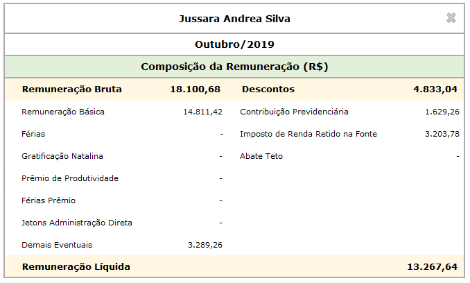

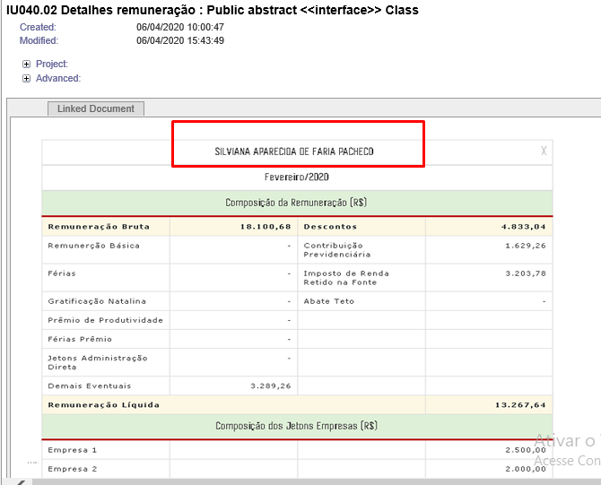

Algumas observações:

* O formulário de detalhamento deve apresentar a opção de fechar (x) __OK__
* O usuário pode mover o formulário de detalhamento para qualquer parte da tela
* Valores zero devem ser apresentados como "-" __OK__
* A seção de detalhamento dos jetons empresas somente deve ocorrer para os casos em que os valores não forem zerados para o mês destacado. __Exemplo:__

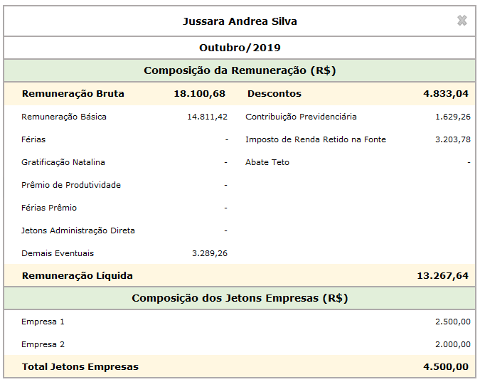

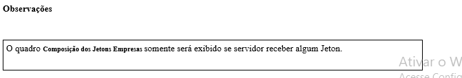

### Exportação de arquivos

Ao contrário da situação atual, a funcionalidade de impressão e exportação (CSV e PDF) deve existir tanto nas tabelas de navegação por filtros quanto nos formulários de detalhamento da situação funcional e histórico de recebimentos.

__OK__
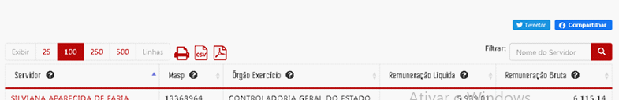

__Falta o ícone imprimir__ __OK__

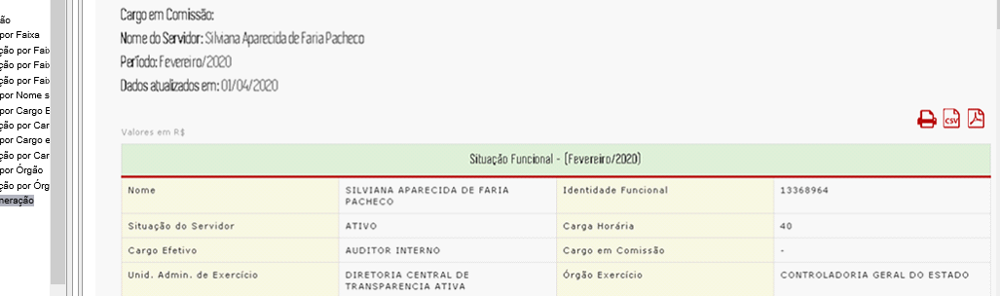

Nas tabelas de navegação por filtros as regras de exportação/impressão devem seguir o padrão das demais consultas. A seguir são destacadas as particularidades das regras exportação/impressão para os formulários de detalhamento da situação funcional e histórico de recebimentos:

* A opção exportar dados deve gerar a planilha completa em forma de tabela com todos os dados das tabelas _[situação funcional]_ e _[histórico de recebimentos]_.

* Os dados de cada linha da planilha deve refletir a situação funcional e remuneração referente ao período (mês/ano).

      ___Exemplo 1___: A linha "Ago/2015" deve exibir a situação funcional e remuneração do servidor referente a agosto de 2015; A linha "Jan/2019" deve exibir a situação funcional e remuneração do servidor referente a janeiro/2019 e assim sucessivamente.

* O leiaute da planilha exportada deve seguir o formato da planilha de remuneração disponibilizada pela CGE com inserção de uma coluna `mes` no formato `YYYY-MM-01`. Vide [arquivo exemplo](static/csv-usuario.csv). __OK__

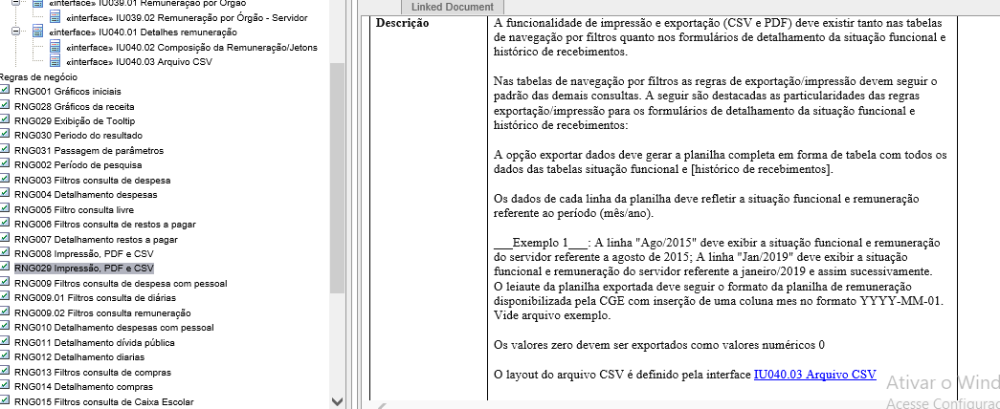

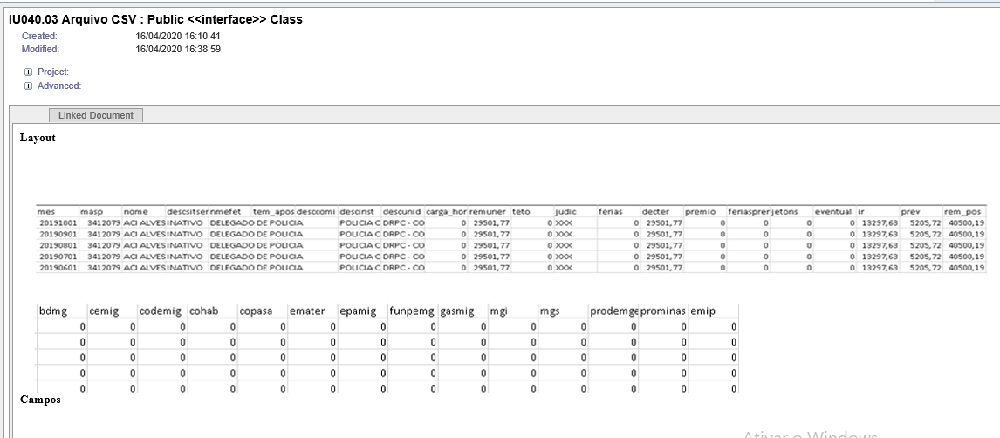

* Os valores zero devem ser exportados como valores numéricos `0`

