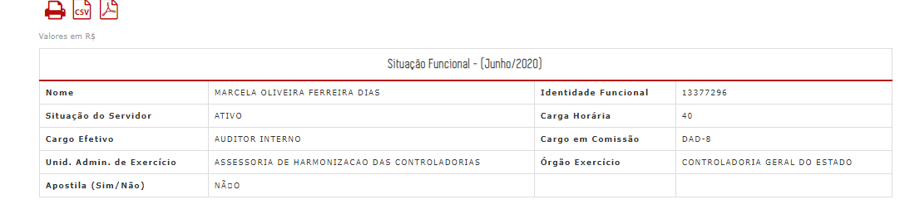
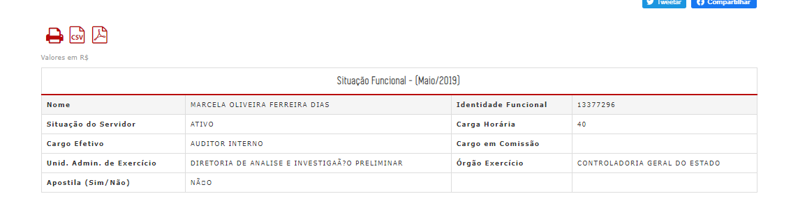
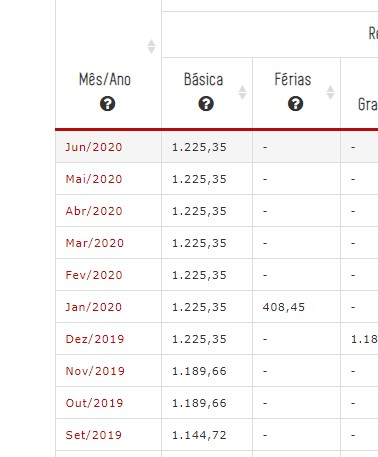
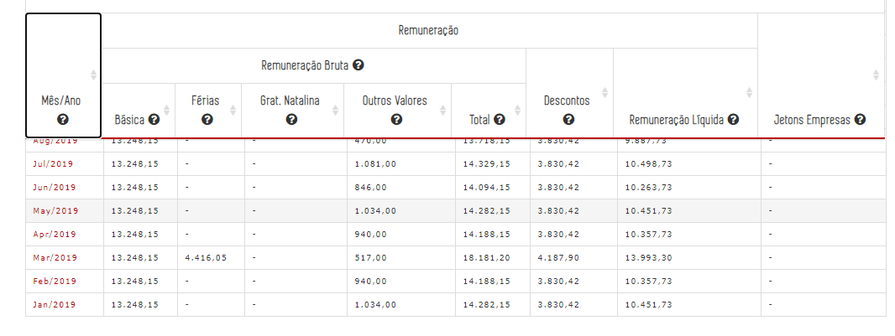
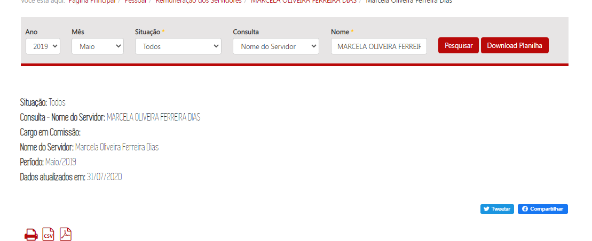
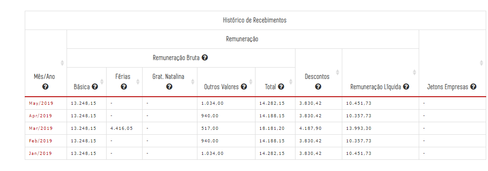
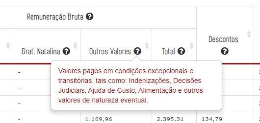
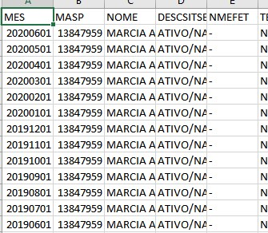
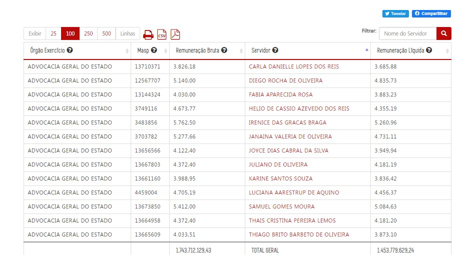
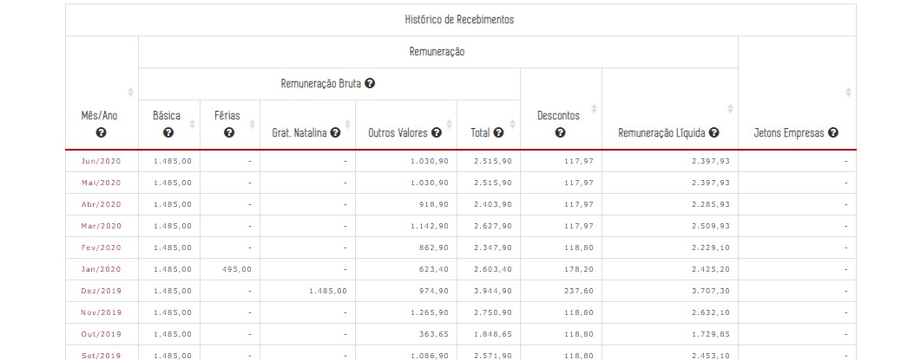

---
Título: "Conferência dos dados em produção - Consulta Remuneração"
Contrato Manutenção: 15210010062019 (INF. 3951)
Proposta comercial: 626584/19
Mantis: 0146470
output:
  html_document:
    theme: united
    toc: yes
  pdf_document:
    toc: yes
  word_document:
    toc: yes
---

## Homologação no ambiente de produção

## Leiaute - Tabelas navegação por filtros
<a href="#top">(inicio)</a>

Incluir os campos ___remuneração bruta e remuneração líquida___ nas tabelas de resultado dos filtros

<s>O conteúdo das colunas estão incorretos na navegação por faixa salarial</s>

__CORRIGIDO__

* Servidor
* Masp
* Órgão Exercício
* Remuneração Bruta
* Remuneração Líquida

## Leiaute - Formulários detalhamento situação funcional e histórico de recebimentos

Os dados da situação funcional devem refletir a situação do mês/ano selecionado no filtro da _[barra de pesquisa]_ da consulta.

___Exemplo:___ Caso o usuário selecione os filtros `Ano: 2015 Mês: Janeiro` na _[barra de pesquisa]_, a situação funcional apresentada na tabela _[situação funcional]_ será a correspondente ao período Jan/2015.

__CONFERE__

Dados foram conferidos tomando como exemplo a Servidora: MARCELA OLIVEIRA FERREIRA DIAS

JUNHO/2020

MAIO/2019

### Histórico recebimentos

Favor alterar o nome dos meses para a língua Portuguesa
--

* Quando o número de linhas da tabela _[histórico recebimentos]_ for superior ao limite da página deve ser aplicada paginação conforme padrão das demais consultas; 
 **OBS** Não é possível verificar essa funcionalidade (paginação) em produção, pois a base de dados disponibilizada corresponde a apenas 18 meses. Dados serão verificados em produção.

* O cabeçalho da tabela histórico recebimentos deve ser congelado, ou seja, quando o usuário usar a barra de rolagem vertical o cabeçalho da tabela deve ficar sempre visível. ___Exemplo:___ [Cabeçalho fixo (_Fixed Header_)](https://uxdesign.cc/design-better-data-tables-4ecc99d23356#86cf);

__CONFERE__

__OBSERVAÇÃO:__ Essa funcionalidade não deve apresentar outra barra de rolagem dentro da tabela histórico recebimentos.

* Os dados apresentados na tabela _[histórico recebimentos]_ devem refletir o primeiro mês da série histórica disponível até o mês/ano selecionado no início da pesquisa.

__CONFERE__

MAIO/2019

    ___Exemplo:___ O servidor Luiz possui dados disponíveis de Mai/2015 a Out/2019. Caso o usuário selecione no filtro da _[barra de pesquisa]_ os dados de Out/2017, o Portal exibirá dos dados de Mai/2015 a Out/2017.

##### Glossário Interativo: TOOL TIP

O glossário interativo do histórico recebimentos deve apresentar os seguintes textos:

<s>Não está sendo exibido no tooltip</s> - __CORRIGIDO__

1. __Outros valores:__ Valores pagos em condições excepcionais e transitórias, tais como: Indenizações, Decisões Judiciais, Ajuda de Custo, Alimentação e outros valores de natureza eventual.

#### Formulário de detalhamento

Exportação de arquivos

<s>Ao exportar os dados em csv a ordem dos meses está incorreta</s> __CORRIGIDO__

__CORRIGIDO__

A ordem da planilha a partir das empresa ainda encontra-se incorreto.

As colunas não estão movíveis nesse nível
--

Alinhar os valores do formulário de rendimentos
--

