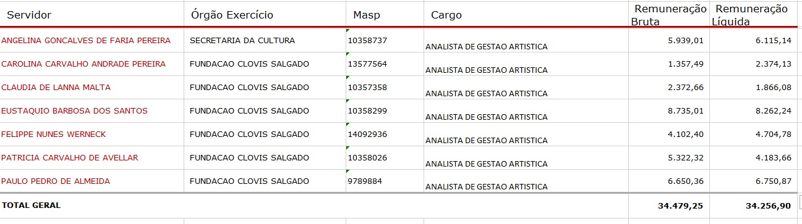
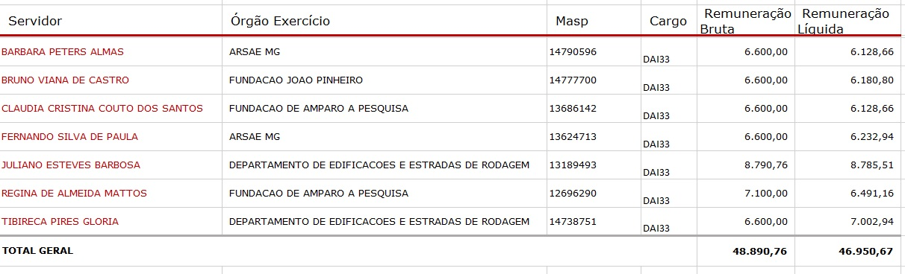
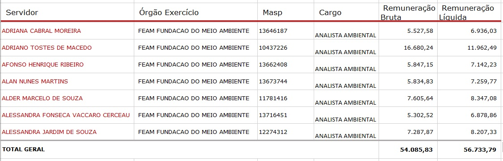
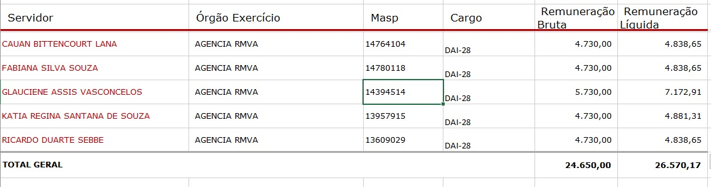
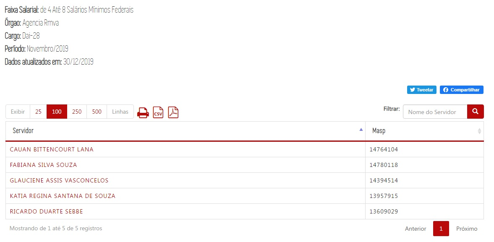
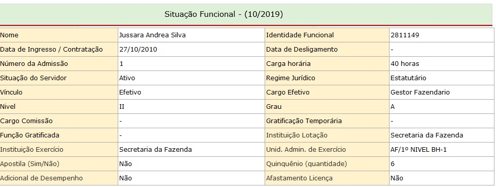
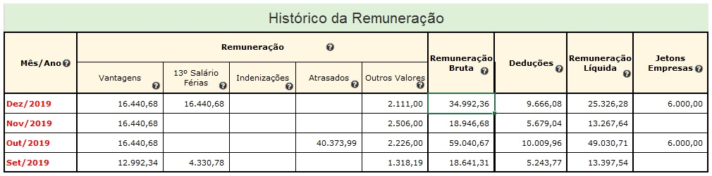
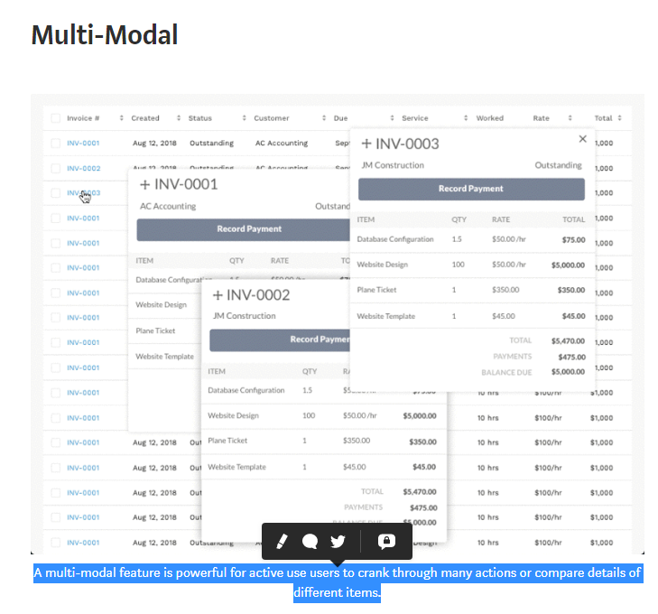
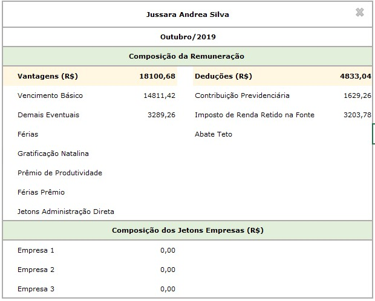

# Visão geral da Demanda

Essa demanda visa divulgar alterar a [consulta de remuneração](http://www.transparencia.mg.gov.br/estado-pessoal/remuneracao-dos-servidores) para:

* divulgar o histórico da remuneração de múltiplos anos na mesma tela;
* adequar o leiaute da interface aos campos da planilha de remuneração;
* utilizar elementos visuais para facilitar o entendimento da composição da remuneração.

# Motivação / contexto da demanda

O formato atual de divulgação da consulta de Remuneração no Portal da Transparência apresenta apenas o histórico da remuneração referentes ao ano corrente, o que tem sido objeto de dúvidas no Fale Conosco e no telefone 155, sobre a localização do histórico da remuneração dos anos anteriores.

A prática adotada pelo Portal da Transparência é a transferência dos dados ao final do ano corrente para a base de dados do Portal de Dados Abertos, e a consequente exclusão desse dados na consulta de Remuneração.

Em relação a interface de divulgação, a especificação da consulta de remuneração foi elaborada em 2012 quando da publicação do decreto 45.969/12 que obriga a publicação da remuneração e revista em 2015, quando da atualização e reformulação do Portal da Transparência.

A revisão em 2015 visou dar mais transparência com relação à vida funcional dos servidores e à composição dos proventos. A interface web da consulta de remuneração foi alterada com a inserção dos novos campos, mas não foi feita as demais adequações para viabilizar a divulgação. Desde então existem campos disponibilizados na interface web da consulta que não possuem dados preenchidos.

## _Planilha de remuneração - novo layout

### Inclusão de colunas na consulta *Nome do Servidor*

Após a busca de um determinado termo, pelo filtro Nome do Servidor, o Portal exibirá além do nome, órgão e MASP, que atualmente já existem na consulta de Remunaração, as informações sobre o cargo, remuneração bruta e remuneração líquida, e o somatório dessas remunerações. 

Por ex: Ao utilizar a consulta *Nome do Servidor", digitar o nome Robson Goncalves e clicar em pesquisar, o portal deverá exibir as seguintes situações:

### Inclusão de colunas na consulta *Cargo Efetivo*

Após a seleção de um dos cargos da lista de cargos efetivos, o Portal exibirá além do nome, órgão e MASP, que atualmente já existem na consulta de Remunaração, as informações sobre o cargo, remuneração bruta e remuneração líquida, e o somatório dessas remunerações. 

Por ex: Ao utilizar a consulta *Cargo Efetivo*, e selecionar o filtro Analista de Gestão Artística, o portal deverá exibir as seguintes situações:

### Inclusão de colunas na consulta "Cargo em Comissão"

Após a busca de um dos cargos da lista de cargos em comissão, o Portal exibirá além do nome, órgão e MASP, que atualmente já existem na consulta de Remunaração, as informações sobre o cargo, remuneração bruta e remuneração líquida, e o somatório dessas remunerações. 

Por ex: Ao utilizar a consulta *Cargo em Comissão*, e selecionar o filtro Dai33, o portal deverá exibir as seguintes situações:

### Inclusão de colunas na consulta "Órgão"

Após a busca de um dos órgãos da lista de consulta "Órgãos", o Portal exibirá além do nome, órgão e MASP, que atualmente já existem na consulta de Remunaração, as informações sobre o cargo, remuneração bruta e remuneração líquida, e o somatório dessas remunerações. 

Por ex: Ao utilizar a consulta *Órgão*, e selecionar o filtro Feam Fundacao do Meio Ambiente, o portal todos os servidores da FEAM com as seguintes colunas:

### Inclusão de colunas na consulta [Salários Mínimos](http://transparencia.mg.gov.br/estado-pessoal/remuneracao-dos-servidores/remuneracao-faixa/201911/3)

Ao navegar pela página inicial da consulta por salários mínimos, no [quarto nível](http://transparencia.mg.gov.br/estado-pessoal/remuneracao-dos-servidores/remuneracao-faixa/201911/4/1094/4028/C) na qual mostra o nome do servidor e o MASP, o Portal deverá exibir, as colunas órgão, cargo, remuneração bruta e remuneração líquida, e o somatório dessas remunerações. 

Consulta que será exibida:

Consulta que é exibida atualmente:

## Formulário situação funcional e histórico da Remuneração

Após a seleção de um servidor utilizando qualquer um dos filtros da barra pesquisa, o Portal exibe o formulário da situação funcional e o histórico da Remuneração, conforme apresentado abaixo:

No caso da tabela histórico da Remuneração, cada linha da tabela será representado pelo mês e as colunas serão divididas em:
- mês/ano
- Vantagens
- 13º Salário/Férias
- Indenizações
- Atrasados
- Outros Valores
- Remuneração Bruta
- Deduções
- Remuneração Líquida
- Jetons Empresas

A tabela histórico remuneração deve permitir que o usuário clique no mês/ano para detalhar as informações referente aqueles mês. A informação mês/ano virá em vermelho. 

Quando o usuário clicar em um desses campos o Portal exibe outra tabela detalhando os valores do mês selecionado. O formato de exibição dessa nova tabela será do tipo [multi-modal](https://uxdesign.cc/design-better-data-tables-4ecc99d23356).

* Ao clicar no coluna mês/ano, linha Out/2019 o portal exibirá o detalhamento do mês de Novembro, com cabeçalho detalhando nome do servidor e mês da pesquisa:

### Observações

__1. Tabela situação funcional:__

  * Os dados da situação funcional devem refletir a situação do mês/ano selecionado na _[barra de pesquisa inicial]_ do Portal no início da consulta.       

      ___Exemplo 1:___ Caso o usuário selecione a  exibição os dados de out/2019, a situação funcional apresentada na tabela _[situação funcional]_ será a correspondente a esse período (Out/2019).

      ___Exemplo 2:___ Caso o usuário selecione  a  exibição os dados de Jan/2015, a situação funcional apresentada na tabela _[situação funcional]_ será a correspondente a esse período (Jan/2015).

__2. Tabela histórico da remuneração:__

  * A coluna mês/ano será apresentada da seguinte forma: Mês (3 caracteres) e ano (4 caracteres);           
    ___Exemplo:___ Set/2019

  * Os dados da coluna mês/ano devem ser exibidos de forma decrescente (mais recente para o mais antigo);

  * Quando o número de linhas da tabela _[histórico da remuneração]_ for superior ao limite da página deve ser aplicada a paginação conforme já ocorre nas demais consultas do Portal.

  * O cabeçalho da tabela histórico da remuneração deve ser congelado, ou seja, quando o usuário usar a barra de rolagem horizontal o cabeçalho da tabela deve ficar sempre visível.                    
      ___Exemplo:___ [Cabeçalho fixo (_Fixed Header_)](https://uxdesign.cc/design-better-data-tables-4ecc99d23356)

  * A tabela _[histórico da remuneração]_ deve exibir a opção de classificar em todas as colunas conforme já ocorre nas demais consultas do Portal.

   * Os dados apresentados na tabela _[histórico da remuneração]_ devem refletir o primeiro mês da série histórica disponível até o mês/ano selecionado no início da pesquisa.  

   ___Exemplo:___ O servidor Luiz possui dados disponíveis de Mai/2015 a Out/2019. Caso o usuário selecione na barra de pesquisa inicial, os dados de Out/2017, o Portal exibirá dos dados de Mai/2015 a Out/2017.

__3. Tabela multi-modal:__

  * A tabela de vizualização multi-modal deve apresentar a opção de fechar (x);
  * O usuário poderá mover a tabela multi-modal para qualquer parte da tela.

  * ___Observação___: Considerando que do período de 2012 a 2019 não existe detalhamento dos dados da Remuneração e Deduções, o Portal não terá a opção do usuário exibir a tabela multi-modal nesse período.

__4. Exportar CSV:__

  * A opção exportar dados deve gerar a planilha completa em forma de tabela com todos os dados das tabelas _[situação funcional]_ e _[histórico da remuneração]_.

  * Os dados de cada linha da planilha deve refletir a situação funcional e remuneração referente ao período (mês/ano). Ver: Modelo da Planilha CSV: [remuneracao-layout-](AGUARDANDO A TABELA DA PRODEMGE)

      ___Exemplo 1___: A linha "Ago/2015" deve exibir a situação funcional e remuneração do servidor referente a agosto de 2015; A linha "Jan/2019" deve exibir a situação funcional e remuneração do servidor referente a janeiro/2019 e assim sucessivamente.

  * Caso o usuário tenha selecionado um período específico na barra de pesquisa inicial o portal exporta apenas o histórico da remuneração considerando o primeiro mês da série histórica disponível até o mês selecionado.

      ___Exemplo 2___:  O servidor Aroldo possui dados disponíveis de Mai/2012 a Out/2019. Caso o usuário selecione o mês janeiro/2019 na barra de pesquisa inicial do Portal. O Portal exibe e exporta para CSV o primeiro mês da série histórica disponível até o mês de Jan/2019 (Mai/2012 a Jan/2019).

      ___Exemplo 3___: Considerando ainda o servidor Aroldo. O mês atual é Out/2019. O Usuário não realizou nenhum filtro na barra de pesquisa inicial do Portal que por default utilizou o mês corrente (Out/2019). O Portal exibe e exporta para CSV o primeiro mês da série histórica disponível até o mês de Out/2019 (Mai/2012 a Out/2019).

__5. Exportar PDF e imprimir:__

  * A opção deve permitir que o cidadão imprima ou gere o pdf dos dados exibidos na tela conforme já ocorre nas demais consultas do Portal.  

## Glossário Interativo: TOOL TIP

1. Mês/ano: Mês e ano de referência da remuneração
2. Vantagens: É composta pela soma das parcelas remuneratórias recebidas pelo servidor em razão do cargo, função ou emprego público, o que inclui adicionais, gratificações e vantagens pessoais.
3. 13º Salário e Férias: Valores próprios desses direitos.
4. Indenizações: Valores pagos a título de auxílio alimentação, auxílio transporte, ajuda de custose parcelas indenizatórias que não caracterizam como despesas de pessoal.
5. Atrasados: Valores pagos posteriormente ao fato gerador
6. Outros Valores: Valores pagos em condições excepcionais e transitórias, tais como: Indenizações, Decisões Judiciais e outros valores de natureza eventual.
7. Remuneração Bruta: Todos os valores devidos ao servidor no mês
8. Deduções: Valor referentes aos descontos obrigatórios e pagamentos indevidos, incluído os descontos que excedam o limite constituicional da remuneração. Não estão incluídos os descontos de caráter pessoal, tais como consignados, previdência complementar e pensão alimentícia. 
9. Remuneração Líquida: Valor da remuneração do servidor deduzidos das deduções realizadas no mês. O valor líquido apresentado pode ser superior ao efetivamente recebido, em face de não estarem inseridos os descontos de caráter pessoal.
10. Jetons empresas: É a remuneração percebida por servidores públicos estaduais em razão da participação como representantes do Estado em Conselhos de Administração e Fiscal ou órgãos equivalentes de empresas controladas direta ou indiretamente pelo Estado
