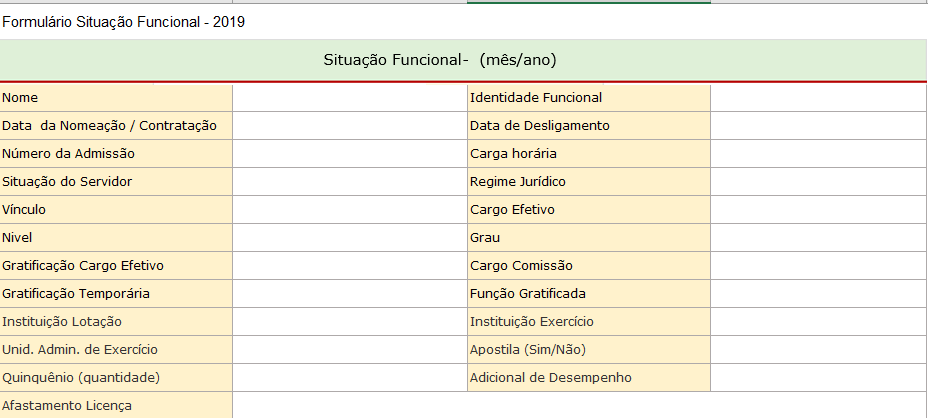
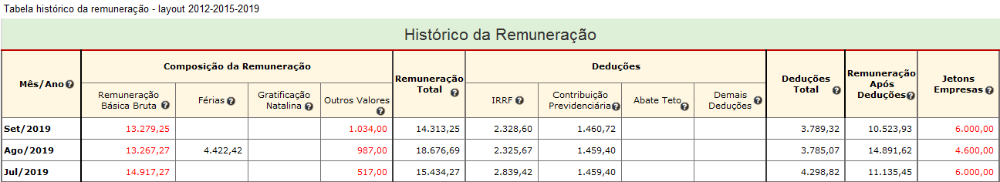
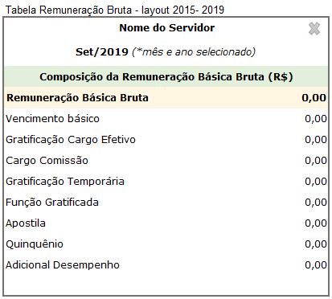
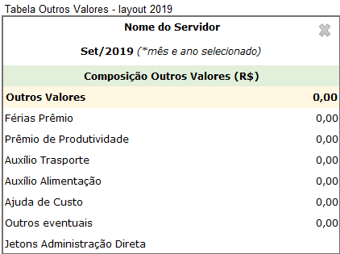
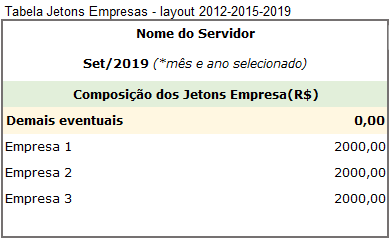

# Visão geral da Demanda

Essa demanda visa divulgar no Portal da Transparência as remunerações dos servidores públicos do Poder Executivo de todos os exercícios.

Sugere-se a alteração do formato de divulgação do histórico da remuneração, com inversão de linhas e colunas, de tal forma que seja possível a visualização de maior quantidade de meses.

Além disso, também deve ser realizada a adequação do layout (entre planilha, banco de dados e interface) da consulta de remuneração no Portal da Transparência.

Por fim, deve ser incluído funcionalidade de exportação para .pdf e .csv conforme formato definido nesta especificação.

# Motivação / contexto da demanda

O formato atual de divulgação da consulta de Remuneração no Portal da Transparência apresenta apenas o histórico da remuneração referentes ao ano corrente, o que tem sido objeto de dúvidas no Fale Conosco e no telefone 155, sobre a localização do histórico da remuneração dos anos anteriores.

A prática adotada pelo Portal da Transparência é a transferência dos dados ao final do ano corrente para a base de dados do Portal de Dados Abertos, e a consequente exclusão desse dados na consulta de Remuneração.

Visando atender com mais completude o disposto no inc. VIII, do art. 4º do Decreto Estadual nº 45.969/2012, a Diretoria Central de Transparência Ativa - DTA/CGE, sugere a inclusão do histórico da remuneração de todos os anos ( provavelmente a partir de 2012).

## _Planilha de remuneração do layout aprovado em 2019_

A especificação da consulta de remuneração foi elaborada em 2012 quando da publicação do Decreto 45.969/12 que obriga a publicação da remuneração e revista em 2015, quando da atualização e reformulação do Portal da Transparência.

Na primeira onda de reformulação optou-se por atualizar a interface web da consulta de remuneração já colocando os novos campos, mas não foi feita a adequação no banco de dados. Desde então existem campos disponibilizados na interface web da consulta que não possuem dados preenchidos.

## Formulário situação funcional e histórico da Remuneração

Após a seleção de um servidor utilizando qualquer um dos filtros da barra pesquisa, o Portal exibe o formulário da situação funcional e o histórico da Remuneração, conforme apresentado abaixo:

A tabela histórico remuneração deve permitir que o usuário clique no valor  referente a coluna "Remuneração básica bruta", "Demais eventuais" ou "Jetons Empresas" para detalhar os dados. Quando o usuário clicar em um desses campos o Portal exibe outra tabela detalhando os valores. O formato de exibição dessa nova tabela será do tipo [multi-modal](https://uxdesign.cc/design-better-data-tables-4ecc99d23356).

As tabelas multi-modal serão:

* Ao clicar no valor da coluna _[Remuneração básica Bruta]_ o portal exibe:

    

* Ao clicar no valor da coluna _[Outros Valores]_ o portal exibe:

  

* Ao clicar no valor da coluna "Jetons Empresas" o portal exibe:

  

### Observações

1. Tabela multi-modal:

    * A tabela de vizualização multi-modal deve apresentar a opção de fechar (x);
    * O usuário poderá mover a tabela multi-modal para qualquer parte da tela;

2. Tabela situação funcional:

    * Os dados da situação funcional devem refletir a situação do mês/ano selecionado na _[barra de pesquisa inicial]_ do Portal no início da consulta.       

      __Exemplo 1:__ Caso o usuário selecione a  exibição os dados de out/2019, a situação funcional apresentada na tabela _[situação funcional]_ será a correspondente a esse período (Out/2019).

      __Exemplo 2:__ Caso o usuário selecione  a  exibição os dados de Jan/2015, a situação funcional apresentada na tabela _[situação funcional]_ será a correspondente a esse período (Jan/2015).

3. Tabela histórico da remuneração:
    * A coluna mês/ano será apresentada da seguinte forma: Mês (3 caracteres) e ano (4 caracteres);           
    __Exemplo:__ Set/2019

    * Os dados da coluna mês/ano devem ser exibidos de forma decrescente (mais recente para o mais antigo);

    * Quando o número de linhas da tabela _[histórico da remuneração]_ for superior ao limite da página deve ser aplicado a paginação conforme já ocorre nas demais consultas do Portal.

    * O cabeçalho da tabela histórico da remuneração deve ser congelado, ou seja, quando o usuário usar a barra de rolagem horizontal o cabeçalho da tabela deve ficar sempre visível.                    
     __Exemplo:__ [Cabeçalho fixo (_Fixed Header_)](https://uxdesign.cc/design-better-data-tables-4ecc99d23356)

     * A tabela _[histórico da remuneração]_ deve exibir a opção de classificar em todas as colunas conforme já ocorre nas demais consultas do Portal.

    * Os dados apresentados na tabela _[histórico da remuneração]_ devem refletir o primeiro mês da série histórica disponível até o mês/ano selecionado no início da pesquisa.  
      __Exemplo:__ O servidor Luiz possui dados disponíveis de Mai/2015 a Out/2019. Caso o usuário selecione na barra de pesquisa inicial a exibição os dados de Out/2017, o Portal exibe dos dados de Mai/2015 a Out/2017.

      ___Observação___: Considerando que do período de 2012 a 2019 não existe detalhamento dos dados da Remuneração básica bruta, o Portal não terá a opção do usuário exibir a tabela multi-modal nesse período.

4. Exportar CSV:

    * A opção exportar dados deve gerar a planilha completa em forma de tabela com todos os dados das tabelas _[situação funcional]_ e _[histórico da remuneração]_.

      Os dados de cada linha da planilha deve refletir a situação funcional e remuneração referente ao período (mês/ano). Ver: Modelo da Planilha CSV: [remuneracao-layout-2019]()

      __Exemplo:__ A linha "Ago/2015" deve exibir a situação funcional e remuneração do servidor referente a agosto de 2015; A linha "Jan/2019" deve exibir a situação funcional e remuneração do servidor referente a janeiro/2019 e assim sucessivamente.

      ___IMPORTANTE___: Caso o usuário tenha selecionado um período específico a tabela _[histórico da remuneração]_ o portal exporta apenas o histórico da remuneração referente a seleção aplicada.

      __Exemplo 1__:  O servidor Aroldo possui dados disponíveis de Mai/2012 a Out/2019. Caso o usuário selecione o mês janeiro/2019 na barra de pesquisa inicial do Portal. O Portal exibe e exporta para CSV o primeiro mês da série histórica disponível até o mês de Jan/2019 (Mai/2012 a Jan/2019).

      __Exemplo 2__: Considerando ainda o servidor Aroldo. O mês atual é Out/2019. O Usuário não realizou nenhum filtro na barra de pesquisa inicial do Portal que por default utilizou o mês corrente (Out/2019). O Portal exibe e exporta para CSV o primeiro mês da série histórica disponível até o mês de Set/2019 (Mai/2012 a Out/2019).

5. Exportar PDF e imprimir:
    * A opção deve permitir que o cidadão imprima ou gere o pdf dos dados exibidos na tela conforme já ocorre nas demais consultas do Portal.  
    
## Glossário Interativo

1. Mês/ ano: Mês e ano de referência da remuneração

2. Remuneração Básica Bruta: É composta pela soma das parcelas remuneratórias correspondentes ao cargo efetivo, a função ou o cargo comissionado.
3. Férias: Adicional: correspondente a 1/3 (um terço) da remuneração, pago ao servidor civil ou militar por ocasião das férias.
4. Gratificação Natalina: Gratificação assegurada ao servidor civil ou militar a título de décimo terceiro salário.
5. Jetons Administração Direta: Gratificação paga, em folha, referente a participação em reuniões dos órgãos de deliberação coletiva. Pode ser pago a pessoa que não tenha vínculo funcional com o Estado.
6. Demais eventuais: Gratificações, restituições, horas-extras, prêmio de produtividade, férias prêmio e outros, pagos de forma variável e/ou eventual.
7. IRRF: Imposto de Renda Retido na Fonte, nos termos da legislação própria.
8. Contribuição Previdenciária: Contribuição Previdenciária obrigatória, nos termos da legislação pertinente.
9. Demais Deduções;
10. Abate Teto: Valor deduzido da remuneração básica bruta, quando esta ultrapassar o teto constitucional, nos termos da legislação pertinente.
11. Total de Vencimentos: Valor obtido pela soma das remunerações básica bruta, férias, Gratificação Natalina. Jetons Administração Direta e Demais eventuais.
12. Total de Descontos: Valor total dos descontos obrigatórios
13. Remuneração após deduções: Valor líquido após descontos obrigatórios.
14. Jetons empresas: É a remuneração percebida por servidores públicos estaduais em razão da participação como representantes do Estado em Conselhos de Administração e Fiscal ou órgãos equivalentes de empresas controladas direta ou indiretamente pelo Estado
