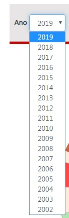
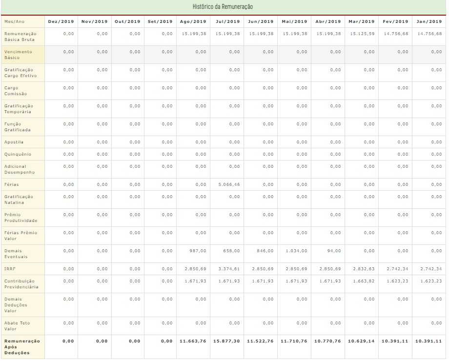
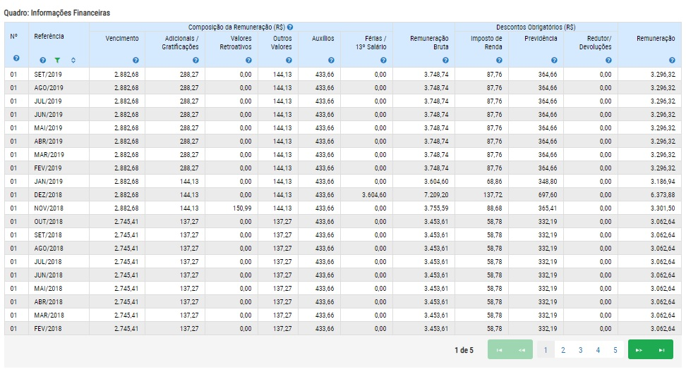
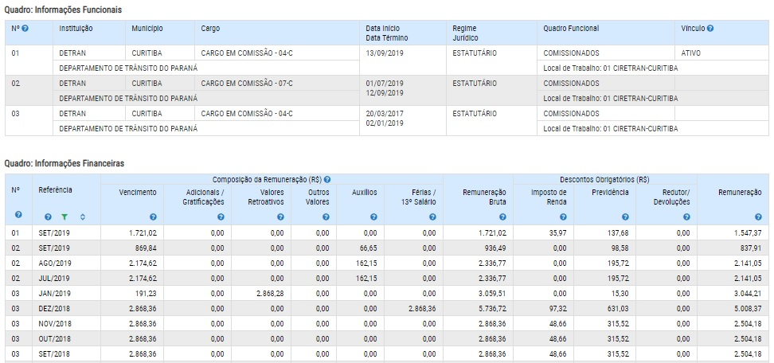

---
titulo: "Remuenração de Servidores"

pull_request: [pull_request_002](https://github.com/transparencia-mg/especificacoes-portal-transparencia/blob/feat/especificacao-remuneracao-servidores/especificacao-remuneracao-servidores.md)

---

# Visão Geral da Intervenção

A proposta dessa especificação é realizar alterações na consulta de Remuneração passando a apresentar os últimos 12 meses dos dados de pagamentos e não mais do ano corrente. Além de incluir a opção do filtro dos anos anteriores para consulta de todos os pagamentos.

# Motivação / Contexto da Intervenção

De acordo com o Decreto Estadual nº 45.969/2012, o direito de acesso à informação compreende dentre outros, a obtenção de informação relativa a remuneração e subsídios recebidos por ocupante de cargo, posto, graduação, função e emprego público, incluindo auxílios, ajudas de custo, jetons e quais outras vantagens pecuniárias, bem como proventos de aposentadoria e pensões daqueles que estiveram na ativa, de maneira individualizada.

Para atender o disposto no inc. VIII, do art. 4º do Decreto Estadual nº45.969/2012, o Portal da Transparência, por meio da consulta de __Remuneração de Servidores__ disponibiliza dados sobre a situação funcional e o histórico da remuneração, contendo os dados financeiros do ano corrente.

Visando atender com mais completude o disposto no inc. VIII, do art. 4º do Decreto Estadual nº 45.969/2012, a Diretoria Central de Transparência Ativa - DTA/CGE, recomenda a alteração do _layout_ da consulta de __Remuneração de Servidores__, com a inclusão do histórico da remuneração referente aos últimos doses meses e do filtro __Ano__ para a navegação do usuário em anos anteriores, sem mais excluir a base de dados após o encerramento do ano.

# Especificação

## Consulta Remuneração de Servidores

### Página Inicial

O cidadão seleciona a opção Pessoal e depois Remuneração dos Servidores e o Portal exibirá

1. Ano da consulta (aaaa) O portal exibirá a opção para escolher o período da consulta – formato aaaa.
2. Mês: sem alteração
3. consulta: sem alteração
4. Nome: sem alteração
5. Pesquisa
6. Pesquisa Avançada

#### Regras para a página inicial

1. Período/Ano: habilitar a consulta por ano no primeiro nível da consulta, semelhante a regra que já é adotada para a consulta de Despesa.

2. Mês: incluir no filtro mês, todos os meses do anos. Atualmente, só consta os meses de Janeiro a Agosto, considerando que o portal apresenta apenas os dados financeiros do ano corrente.

### Formulário Situação Funcional e Dados de Remuneração

1. Na visualização dos dados do servidor referente ao Histórico da Remuneração, a linha referente ao --mês/ano-- deverá apresentar dados financeiros dos últimos 12 meses.

|Mês/Ano|Ago/2019|Jul/2019|Jun/2019|Mai/2019|Abr/2019|Mar/2019|Fev/2019|Jan/2019|Dez/2018|Nov/2018|Out/2018|Set/2018|
|-------|:--------|:--------|:--------|:--------|:--------|:--------|:--------|:--------|:--------|:--------|:--------|:--------|
|-----|

2. A cada nova carga no Portal referentes aos dados de remuneração dos servidores, deverá ser excluída a última coluna da barra, referente ao mês mais antigo.

3. E, posteriormente, deverá ser incluída na primeira coluna (após o mês/ano), o mês da carga atual dos dados de remuneração.

4. Incluir a funionalidade de salvar os dados funcionais e financeiros em PDF e visualizar por meio de planilha: exemplo Governo do Paraná

# Dependências/Integrações

Não se aplica.

# Exemplos

[Governo do Paraná](http://www.transparencia.pr.gov.br/pte/pages/pessoal/remuneracoes/exibir_remuneracao?windowId=729)

# Dúvidas

1. A situação funcional do servidor será histórica? Ou seja, será possível pesquisar a situação funcional de um servidor no mês de Maio de 2014 ou somente a situação funcional atual?????

2. Sugiro a alteração na apresentação dos dados financeiros.
Atualmente o portal apresenta os dados mês/ano em coluna

Sugestão: apresentar os dados dos financeiros no formato mês/ano em linha, como ocorre no Portal do Paraná

Dessa forma, não será necessário criar o filtro por ano, pois toda a remuneração do servidor já estará disponível, bastando navegar pelas próximas páginas.

3. Concentrar as informações de servidores que possem mais de um cargo em uma mesma tela.
Atualmente, o Portal da Transparência apresenta os dados de servidores com mais de um cargo em telas separadas:

Sugestão: Permitir a visualização dos cargos e remunerações em uma única tela. Diferenciando os cargos por números, a exemplo com o que ocorre no Governo do Paraná

