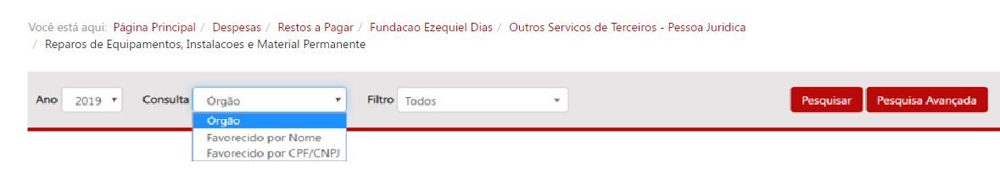
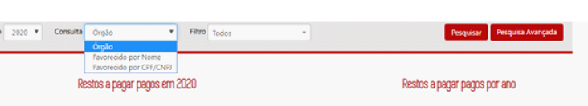
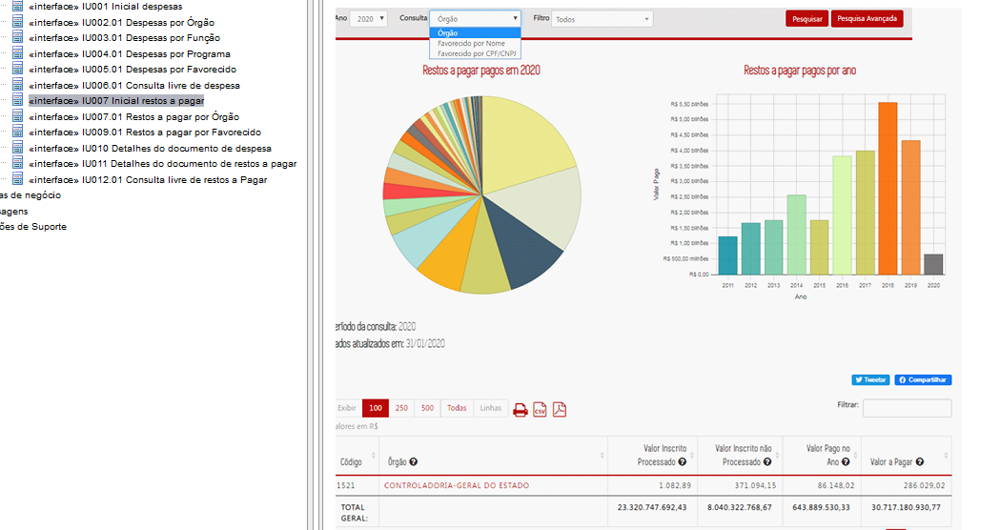
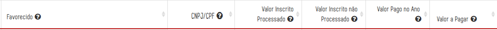
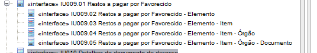
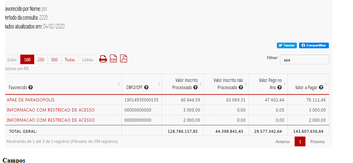
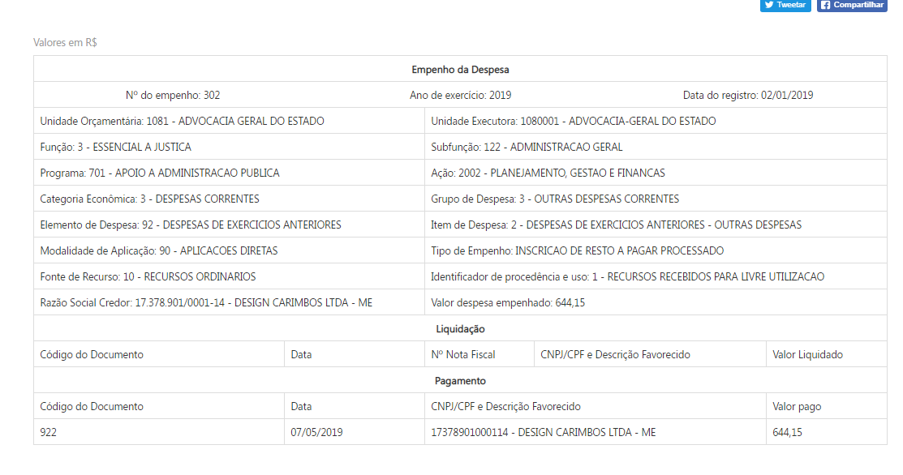
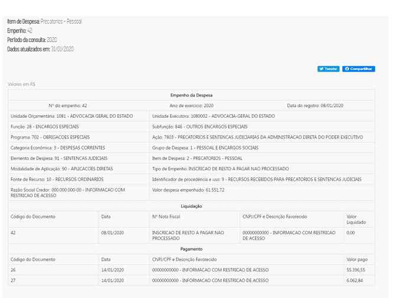
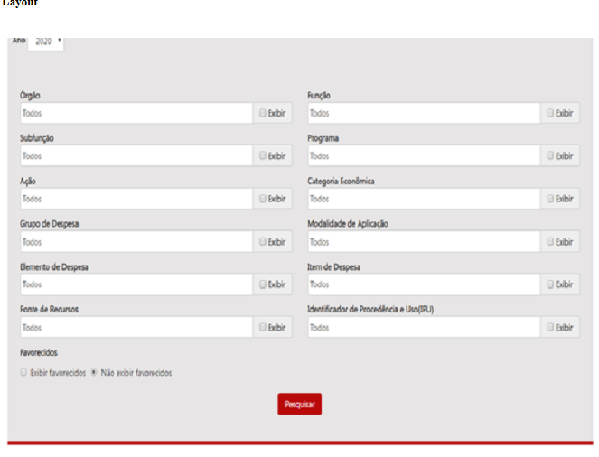
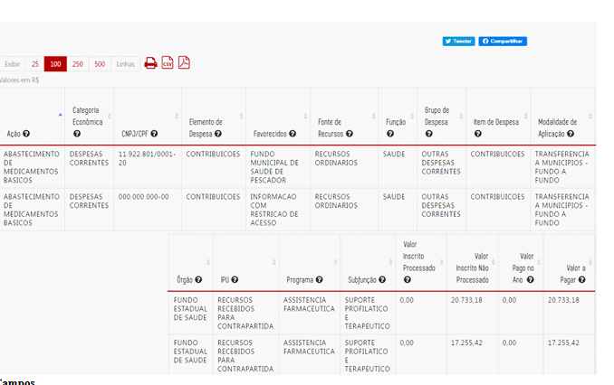

# Homologação da documentação da especificação

Toda as divergências foram corrigidas

## Página Inicial e Navegação por nível

Para contemplar a inclusão dos modos de pesquisa adicionais a barra de pesquisa da página inicial deve ser:

__Tipos de consulta OK__

1. Ao selecionar o tipo de consulta [ÓRGÃO] o campo a ser exibido deve ser [FILTRO], conforme padrão já utilizado nas demais consultas __CORRIGIDO__

2. A página inicial da Consulta de restos a pagar será por consulta por [ÓRGÃO]" e não por [FAVORECIDO] como consta no IU007 __CORRIGIDO__

Após uma pesquisa bem sucedida utilizando o filtro favorecido por nome ou CPF/CNPJ devem ser apresentados um gráfico _treemap_ e uma tabela, __ambos navegáveis__, por meio de duplo clique. O primeiro nível de navegação após a realização de uma busca utilizando o filtro favorecido é

A ordem de navegação para os demais níveis e os campos descritivos que compõe o _treemap_ e a tabela são:

* 1º nível: | [Favorecido](#)      | CPF/CNPJ |
* 2º nível: | Categoria Econômica	| Grupo de Despesa | [Elemento de Despesa](#) |
* 3º nível: | Fonte de Recursos	  | Modalidade de Aplicação	| [Item de Despesa](#) |
* 4º nível: | Código              | [Órgão](#)	|
* 5º nível: | Data                | [Número do Empenho](#)	|

__Ordem de navegação OK__  

Somente os campos marcados como _hyperlink_ permitem a navegação nas tabelas. Nas tabelas do 1º ao 5º nível os seguinte campos numéricos devem ser apresentados:

* Valor Inscrito Processado,
* Valor Inscrito não Processado,
* Valor Pago no Ano,
* Valor a pagar

1. O favorecido com o termo __"Informação com restrição de acesso"__ deve ser navegável - __CORRIGIDO__

2. O campo filtrar dever permitir que o usuário realize a pesquisa por qualquer dado que consta na tabela e não apenas pelo nome do favorecido. - __CORRIGIDO__

 

Ao clicar no campo _[Número do empenho]_ no 5º nível, o Portal exibirá o [formulário de detalhamento](http://www.transparencia.mg.gov.br/despesa-estado/restos-a-pagar/restospagar-orgaos/2019/3887/477/42/20/2768/130/58/5839139), já utilizado na consulta por órgão:

__O título do formulário é "Empenho da Despesa"`__

### Observações

* O gráfico _treemap_ deve utilizar a métrica "Valor Pago no Ano" em todos os níveis;
* O título do gráfico _treemap_ em cada nível deve ser o valor da classificação orçamentária selecionada no nível anterior;
* O campo _[Data]_ exibido no 5º nível deve fazer referência a data de registro inicial do empenho.
* O filtro favorecido por nome deve ter a opção de autocomplete a partir de 3 letras. A menos que seja tecnicamente inviável os resultados devem ser retornados sem a necessidade do usuário clicar no ícone pesquisar;
* O filtro favorecido por nome deve permitir que o cidadão digite no mínimo 3 letras consecutivas de qualquer parte do nome do favorecido e o portal retornará todos os itens que encaixem na pesquisa;
* O preenchimento obrigatório dos filtros favorecido por nome e por CPF/CNPJ somente deve ser necessário em caso de inviabilidade técnica ou prejuízo de desempenho para o Portal.
* O filtro favorecido por CPF/CNPJ deve realizar a busca com CPFs/CNPJs formatados ou númericos.
* No filtro o campo órgão deve permitir buscas por sigla sem que essa informação seja exibida.
* Os filtros dos três modos de pesquisa devem possuir funcionalidade de seleção múltipla como na pesquisa avançada.

## Pesquisa Avançada

A consulta avançada terá 12 campos de filtro e parâmetro de ano:

1.  Órgão
2.  Função
3.  Subfunção
4.  Programas
5.  Ação
6.  Categoria Econômica
7.  Grupo de Despesa
8.  Modalidade de Aplicação
9.  Elemento de despesa
10.  Item de Despesa
11.  Fonte de Recursos
12.  Identificador de Procedência e Uso (IPU)

O usuário poderá escolher em exibir ou não a lista dos favorecidos. Como padrão o portal não exibirá os favorecidos.

Favorecidos

 <input type="checkbox" disabled=""> Exibir favorecidos
 <input type="checkbox" disabled="" checked=""> Não exibir Favorecidos

 

 __Campos da consulta avançada OK__

 

   

   

Os dados do resultado da consulta estão incorretos

   

### Observações

* O campo órgão da pesquisa avançada deve permitir buscas por sigla sem que essa informação seja exibida.

*  A Pesquisa Avançada deve possuir um botão de marcar/desmarcar todas as colunas conforme demanda [especificação checkboxes](https://github.com/transparencia-mg/especificacoes-portal-transparencia/tree/feat/especificacao_checkboxes/espec010_checkboxes).

*   O autocomplete da pesquisa avançada deve possuir código e descrição das classificações orçamentárias ([eg. consulta proposta orçamentária](http://www.transparencia.mg.gov.br/planejamento-e-resultados/proposta-lei-orcamentaria/proposta-orcamentaria/proposta-pesquisa-avancada));

* A exibição de código e descrição deve ser diferente em cada seção da pesquisa  avançada:
  * Campos dos filtros: exibir  código e descrição no mesmo campo ([eg. consulta proposta orçamentária](http://www.transparencia.mg.gov.br/planejamento-e-resultados/proposta-lei-orcamentaria/proposta-orcamentaria/proposta-pesquisa-avancada));
  * Tabela de resultado: exibir apenas descrição;
  * Opções imprimir e PDF: exibir apenas descrição; e
  * Opção exportar CSV.: exibir código e descrição em campos distintos.

*   Ao exibir o favorecido o Portal deverá retornar o nome e CNPJ/CPF do favorecido, conforme já ocorre na [Consulta de despesa](http://www.transparencia.mg.gov.br/despesa-estado/despesa/despesa-resultado-pesquisa-avancada/2019/01-01-2019/31-12-2019/3853/0/3684/0/0/0/0/0/0/0/0/0/0/0/0/0/0/0/0/0/0/0/0/0/1/0).

*   O Portal dever ter a funcionalidade de autocompletar (desde a primeira letra), desconsiderando acentuação, letras maiúsculas/minúsculas e palavras intermediárias (ex.: Ao digitar "gestao pública", um dos resultados será "Gestão da Administração Pública").

*   O cidadão poderá informar mais de um valor para cada filtro. Ao informar um valor de filtro, listar todas as opções. Se o cidadão não informar um valor para cada filtro, o Portal considerará todos os valores possíveis para cada filtro não informado.

*   O cidadão poderá escolher os campos que ele quer que apareça no resultado (seguir modelo das demais consultas).

*   O cidadão deverá escolher o ano da pesquisa.

*   Ao exibir o resultado na tabela a consulta deverá retornar as colunas valor inscrito processado, valor inscrito não processado, valor pago no ano e valor a pagar.
