# Homologação do Layout
<a href="#top">(inicio)</a>

___Todas as divergências apontadas pela CGE na homologação do dia 05/02/2020 foram corrigidas pela PRODEMGE___  

  

## Página Inicial e Navegação por nível
<a href="#top">(inicio)</a>

Para contemplar a inclusão dos modos de pesquisa adicionais a barra de pesquisa da página inicial deve ser:

__Tipos de Consultas OK__

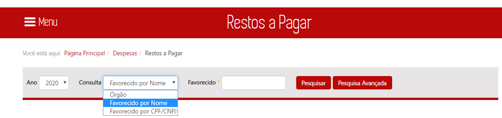
  

__1__. Ao selecionar o tipo de consulta [ÓRGÃO] o campo a ser exibido deve ser [FILTRO], conforme padrão já utilizado nas demais consultas

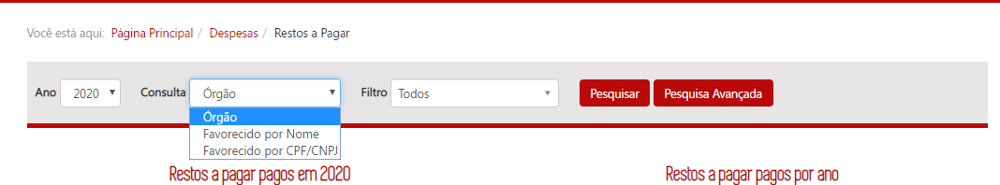

----

__2.__ Falta no ano no título do gráfico de pizza

Após uma pesquisa bem sucedida utilizando o filtro favorecido por nome ou CPF/CNPJ devem ser apresentados um gráfico _treemap_ e uma tabela, __ambos navegáveis__, por meio de duplo clique. O primeiro nível de navegação após a realização de uma busca utilizando o filtro favorecido é

---
__Dados da tabela 1º nível OK__
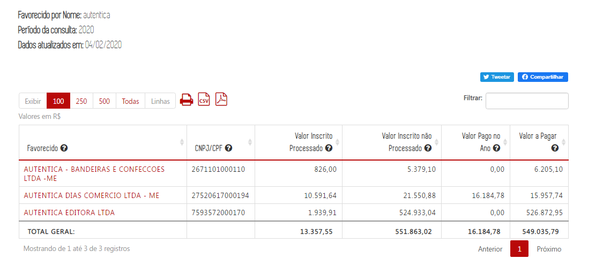

A ordem de navegação para os demais níveis e os campos descritivos que compõe o _treemap_ e a tabela são:

* 1º nível: | [Favorecido](#)      | CPF/CNPJ |
* 2º nível: | Categoria Econômica	| Grupo de Despesa | [Elemento de Despesa](#) |
* 3º nível: | Fonte de Recursos	  | Modalidade de Aplicação	| [Item de Despesa](#) |
* 4º nível: | Código              | [Órgão](#)	|
* 5º nível: | Data                | [Número do Empenho](#)	|

__Dados OK__

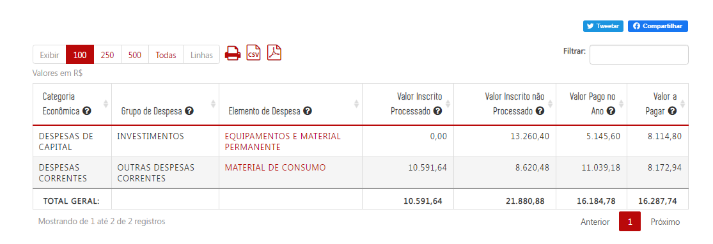
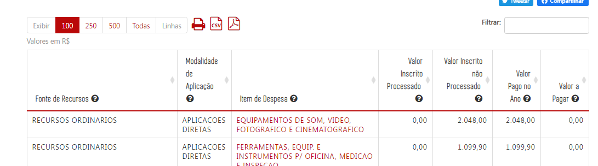
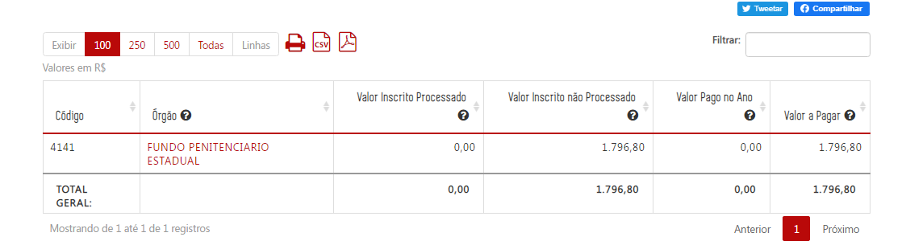
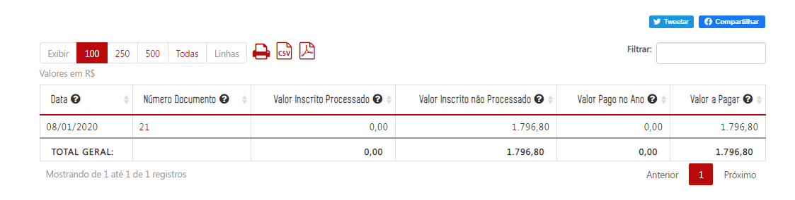

Somente os campos marcados como _hyperlink_ permitem a navegação nas tabelas. Nas tabelas do 1º ao 5º nível os seguinte campos numéricos devem ser apresentados:

* Valor Inscrito Processado,
* Valor Inscrito não Processado,
* Valor Pago no Ano,
* Valor a pagar
---
__O campo filtrar permiti pesquisar qualquer dado da tabela - OK__

 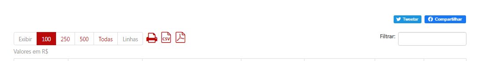

O 5º nível do número do documento não possui gráfico _treemap_
http://homologa3.prodemge.gov.br/age7/despesa-estado/restos-a-pagar/restospagar-favorecidos/2020/2811340/autentica/0/3/566/25/51/3106/154/560/9804

 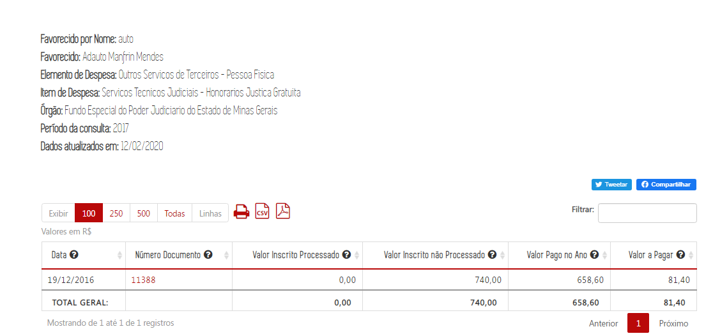

 ---
 Os dados abaixo da tabela não estão sendo carregados

Ao clicar no campo _[Número do empenho]_ no 5º nível, o Portal exibirá o [formulário de detalhamento] já utilizado na consulta por órgão:

__Formulário de detalhamento RP OK__

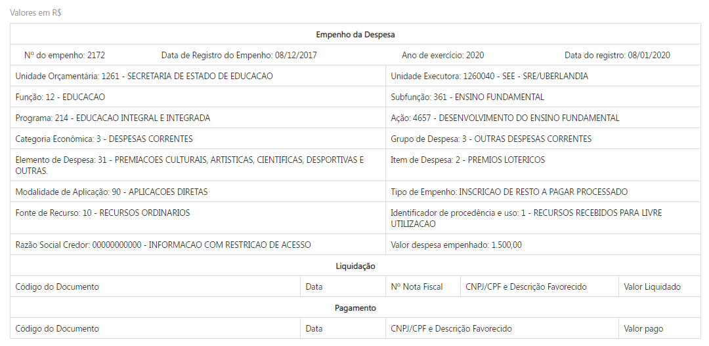
  

  

Ao selecionar um favorecido pelo número do CPF/CNPJ o Portal exibe o favorecido corretamente, no entanto ao tentar avançar para o próximo nível o usuário é direcionado a página inicial. __CORRIGIDO__
http://homologa3.prodemge.gov.br/age7/despesa-estado/restos-a-pagar/restospagar-favorecidos/2020/0/0/27520617000194/4

  

### Observações

* O gráfico _treemap_ deve utilizar a métrica "Valor Pago no Ano" em todos os níveis; __CONFERE__
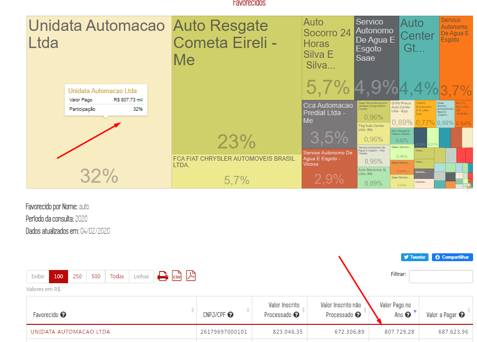
---
* O título do gráfico _treemap_ em cada nível deve ser o valor da classificação orçamentária selecionada no nível anterior; __CONFERE__
  

  

* O campo _[Data]_ exibido no 5º nível deve fazer referência a data de registro inicial do empenho.

O Portal está apresentando a data de registro em restos a pagar e não a data inicial do documento de empenho __CORRIGIDO__

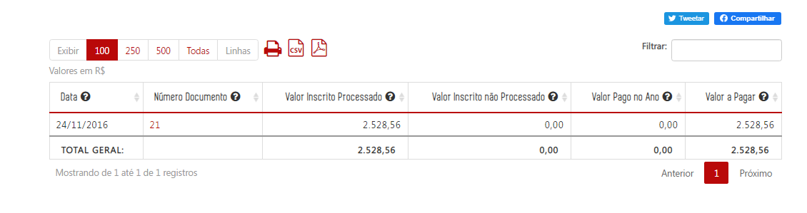

  

* O filtro favorecido por nome deve ter a opção de autocomplete a partir de 3 letras. A menos que seja tecnicamente inviável os resultados devem ser retornados sem a necessidade do usuário clicar no ícone pesquisar;

__Observação enviada pelo Luiz (PRODEMGE)__: A funcionalidade de autocomplete não foi atendida, para evitar possíveis problemas de desempenho;
  

* O filtro favorecido por nome deve permitir que o cidadão digite no mínimo 3 letras consecutivas de qualquer parte do nome do favorecido e o portal retornará todos os itens que encaixem na pesquisa; __CONFERE__
  

* O preenchimento obrigatório dos filtros favorecido por nome e por CPF/CNPJ somente deve ser necessário em caso de inviabilidade técnica ou prejuízo de desempenho para o Portal.

__Observação enviada pelo Luiz (PRODEMGE)__ A obrigatoriedade de preenchimento do campo persiste, para evitar possíveis problemas de desempenho;
  

* O filtro favorecido por CPF/CNPJ deve realizar a busca com CPFs/CNPJs formatados ou númericos.

A pesquisa por CNPJ/CPF quando utilizado o número formatado não retorna nenhum dado __CORRIGIDO__

CNPJ pesquisado: 04.602.789/0001-01  - DATEN TECNOLOGIA LTDA
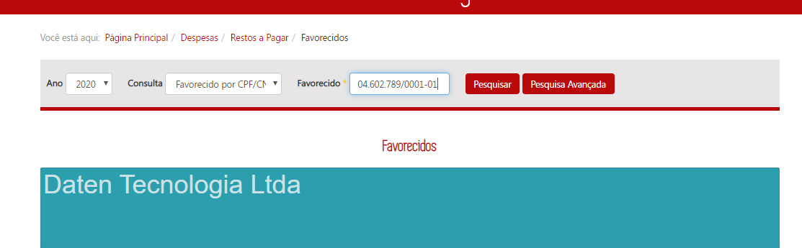

---

* No filtro o campo órgão deve permitir buscas por sigla sem que essa informação seja exibida.

Luiz, conforme sugerido por você a CGE aprova a inclusão da sigla logo após o nome do órgão na caixa de pesquisa. Porém, favor colocar a sigla em caixa alta __IMPLEMENTADO__

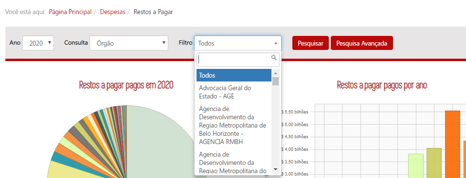

* Os filtros dos três modos de pesquisa devem possuir funcionalidade de seleção múltipla como na pesquisa avançada.

__Observação enviada pelo Luiz (PRODEMGE)__:	A seleção múltipla nos filtros não foi atendida. Aplicar este recurso somente nas consultas de Despesa e Restos a Pagar irá sair do padrão do site, causa uma possível redução do uso da Pesquisa Avançada, além de possíveis problemas no layout e desempenho;
 

## Pesquisa Avançada
<a href="#top">(inicio)</a>

A consulta avançada terá 12 campos de filtro e parâmetro de ano:

1.  Órgão
2.  Função
3.  Subfunção
4.  Programas
5.  Ação
6.  Categoria Econômica
7.  Grupo de Despesa
8.  Modalidade de Aplicação
9.  Elemento de despesa
10.  Item de Despesa
11.  Fonte de Recursos
12.  Identificador de Procedência e Uso (IPU)

O usuário poderá escolher em exibir ou não a lista dos favorecidos. Como padrão o portal não exibirá os favorecidos.

Favorecidos

 <input type="checkbox" disabled=""> Exibir favorecidos
 <input type="checkbox" disabled="" checked=""> Não exibir Favorecidos

 

__CONFERE__

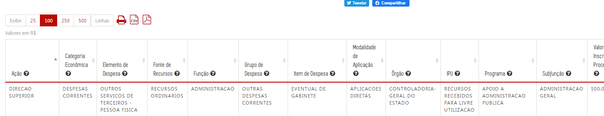
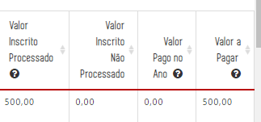

   

### Observações

* O campo órgão da pesquisa avançada deve permitir buscas por sigla sem que essa informação seja exibida.

Se possível aplicar a mesma regra. O campo busca pode exibir o nome e sigla (nessa ordem) sem exibir na tabela. __IMPLEMENTADO__

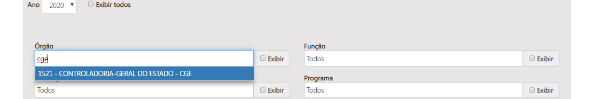

 

 

*  A Pesquisa Avançada deve possuir um botão de marcar/desmarcar todas as colunas conforme demanda [especificação checkboxes](https://github.com/transparencia-mg/especificacoes-portal-transparencia/tree/feat/especificacao_checkboxes/espec010_checkboxes).

__Funcionalidade está OK na consulta de restos a pagar, as demais serão verificadas depois__

---

*   O autocomplete da pesquisa avançada deve possuir código e descrição das classificações orçamentárias ([eg. consulta proposta orçamentária](http://www.transparencia.mg.gov.br/planejamento-e-resultados/proposta-lei-orcamentaria/proposta-orcamentaria/proposta-pesquisa-avancada));

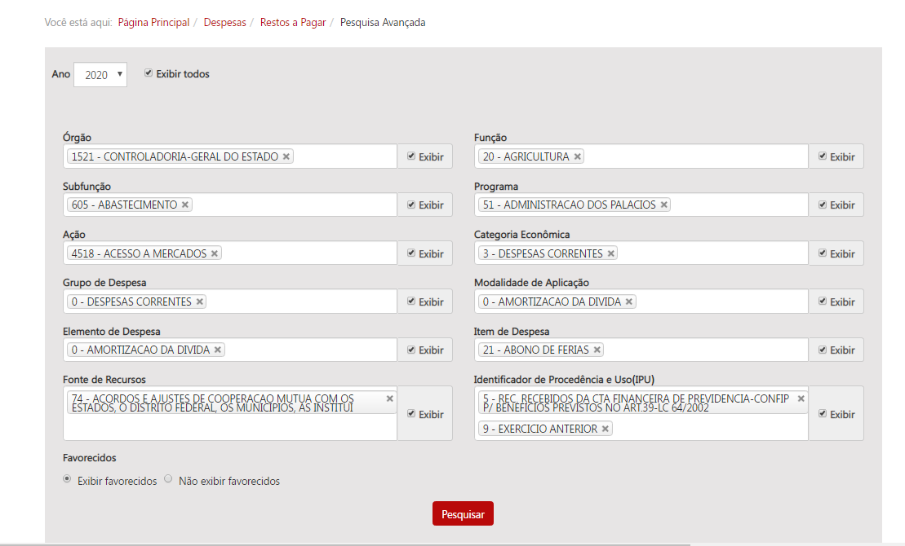

_Exemplo 1: Em 08 de Janeiro/2020 foram inscritos em RP R$ 7317,47 da ação 4484 - Abastecimento de Medicamentos Básicos com ano de origem 2016 e R$ 514,16 da ação 4259 - Representação Judicial, Cobrança da Dívida Ativa e Assessoramento Jurídico ao Estado na Região Metrô com ano de origem 2019. Em 2020 o filtro de ação deve mostrar apenas as ações 4484 - Abastecimento de Medicamentos Básicos e 4259 - Representação Judicial, Cobrança da Dívida Ativa e Assessoramento Jurídico ao Estado na Região Metrô._

_Exemplo 2: Ao selecionar a ação 4392- Promoção do acesso a Informação e da Transparência Governamental no ano de 2020, o filtro apresenta como opção outro código para a mesma descrição - 4056 - Promoção do acesso a Informação e da Transparência Governamental. No entanto, a ação com o código 4056 refere-se a classificação orçamentária do ano de 2020. Conforme tabela gerada no BO (Restos a pagar) o código correto da ação é 4392 pois na classificação orçamentária de 2019, a qual se refere o restos a pagar o código da ação Promoção do acesso a Informação e da Transparência Governamental é 4392._

_Assim, ao selecionar um período específico o Portal irá exibir apenas a classificação orçamentária referente ao ano de inscrição do em restos a Pagar._

 

* A exibição de código e descrição deve ser diferente em cada seção da pesquisa  avançada:
  * Campos dos filtros: exibir  código e descrição no mesmo campo ([eg. consulta proposta orçamentária](http://www.transparencia.mg.gov.br/planejamento-e-resultados/proposta-lei-orcamentaria/proposta-orcamentaria/proposta-pesquisa-avancada)); __CONFERE__

  * Tabela de resultado: exibir apenas descrição; __CONFERE__
  * Opções imprimir e PDF: exibir apenas descrição; e __CONFERE__
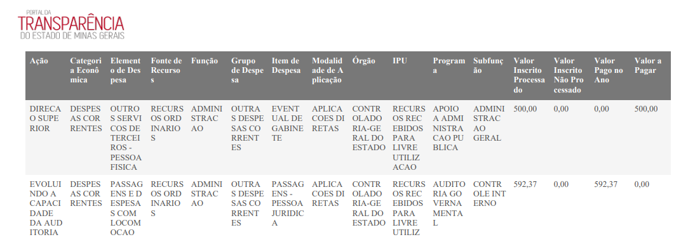
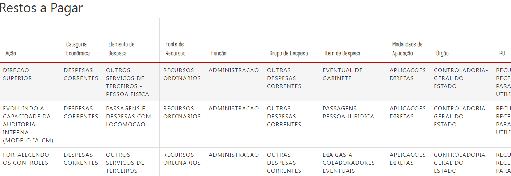

  * Opção exportar CSV.: exibir código e descrição em campos distintos. __CONFERE__

 ---

*   Ao exibir o favorecido o Portal deverá retornar o nome e CNPJ/CPF do favorecido, conforme já ocorre na [Consulta de despesa](http://www.transparencia.mg.gov.br/despesa-estado/despesa/despesa-resultado-pesquisa-avancada/2019/01-01-2019/31-12-2019/3853/0/3684/0/0/0/0/0/0/0/0/0/0/0/0/0/0/0/0/0/0/0/0/0/1/0).

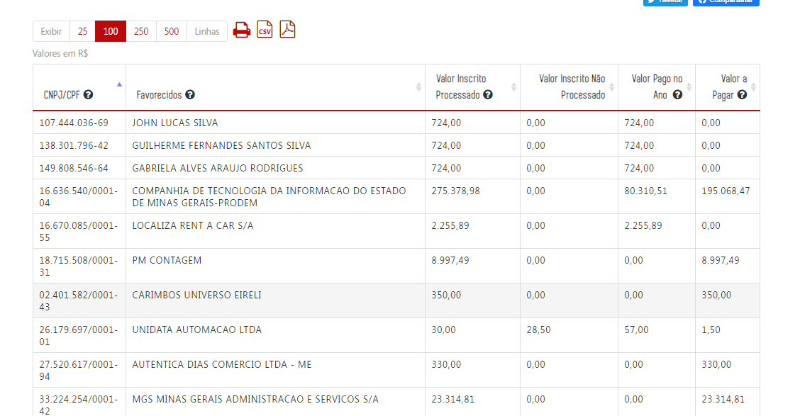

---

*   O Portal dever ter a funcionalidade de autocompletar (desde a primeira letra), desconsiderando acentuação, letras maiúsculas/minúsculas e palavras intermediárias (ex.: Ao digitar "gestao pública", um dos resultados será "Gestão da Administração Pública"). __CONFERE__

*   O cidadão poderá informar mais de um valor para cada filtro. Ao informar um valor de filtro, listar todas as opções. Se o cidadão não informar um valor para cada filtro, o Portal considerará todos os valores possíveis para cada filtro não informado. __CONFERE__

*   O cidadão poderá escolher os campos que ele quer que apareça no resultado (seguir modelo das demais consultas). __CONFERE__

*   O cidadão deverá escolher o ano da pesquisa. __CONFERE__

*   Ao exibir o resultado na tabela a consulta deverá retornar as colunas valor inscrito processado, valor inscrito não processado, valor pago no ano e valor a pagar. __CONFERE__

### Observações Gerais
<a href="#top">(inicio)</a>

Conforme informado pelo analista da Prodemge Luiz, o Armazém SIAFI não apresenta programação financeira para dados anteriores a 2002, nesse sentido quando um empenho se referir a esse período não será possível trazer essa informação.

"_Inclusão dos registros que, por serem referentes a anos de exercícios anteriores a 2002, não possuem informações de Programa/Ação, Função e Subfunção associadas_"

