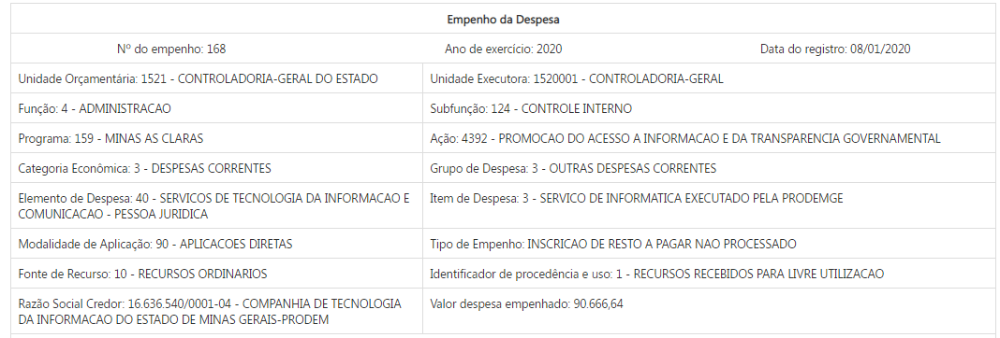
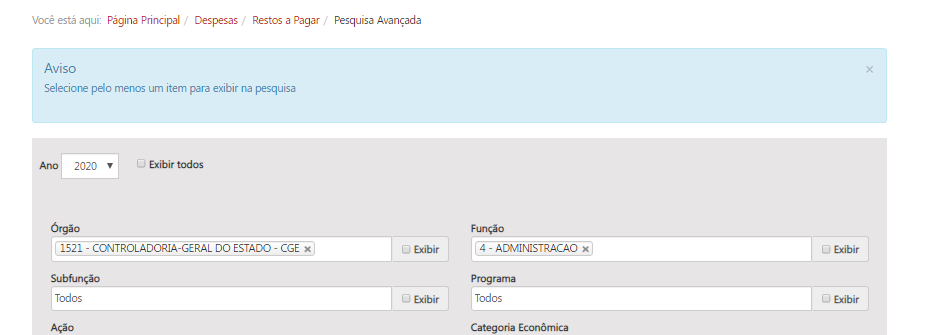
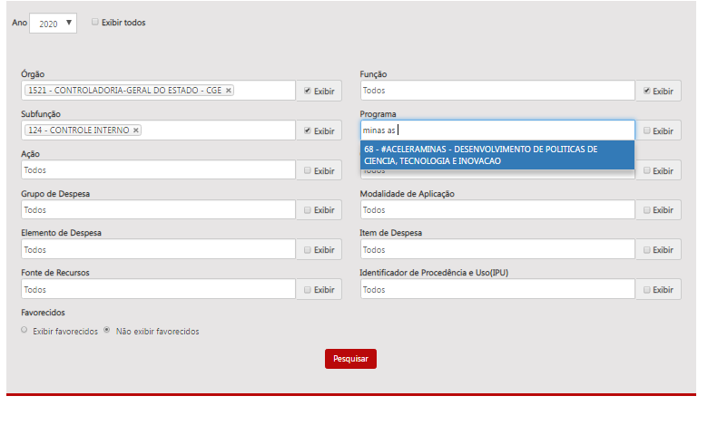
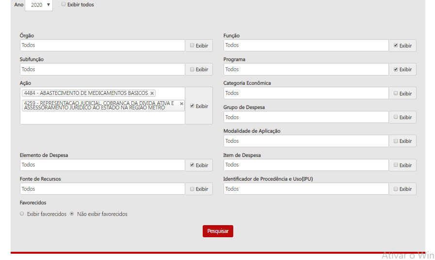
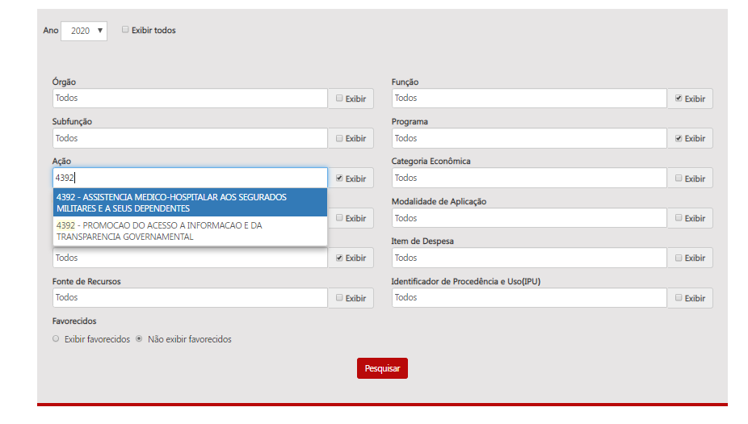
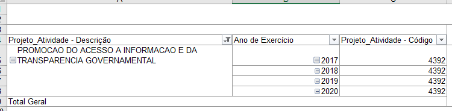
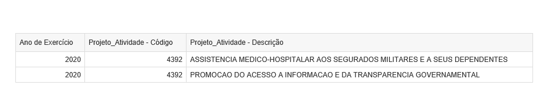
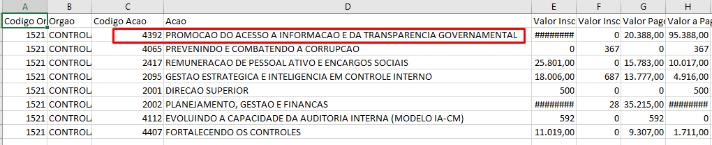

# Homologação consulta avançada - Restos a Pagar
<a href="#top">(inicio)</a>

Todas as divergências foram corrigidas na homologação do dia 30/03/2020.
  

Ao selecionar  alguns filtros na caixa de seleção o Portal não retorna nenhum dado. No entanto, ao deixar a caixa com a opção “Todos” o portal retorna a tabela que contém o item selecionado.

#### Filtros utilizados na seleção da pesquisa avançada:
* CONTROLADORIA -GERAL DO ESTADO:

__Pesquisa Avançada__ - CORRIGIDO

1. Função selecionada: Administração

* Função selecionada: Todos - O Portal exibe resultados

----
2. Alguns campos de seleção não estão apresentado as opções que constam na tabela de  resultado. __[CORRIGIDO]__

Exemplo: Programa- Minas as Claras

 

---

3. A classificação de alguns itens que constam na caixa filtro não é o mesmo da tabela gerada em csv.  Destaca-se que o escopo do ano selecionado na consulta deve refletir a classificação orçamentária inscrita em restos a pagar e não a classificação vigente na lei do ano corrente. __[CORRIGIDO]__
______

 * Exemplo 1: Em 08 de Janeiro/2020 foram inscritos em RP R$ 7317,47 da ação 4484 - Abastecimento de Medicamentos Básicos com ano de origem 2016 e R$ 514,16 da ação 4259 - Representação Judicial, Cobrança da Dívida Ativa e Assessoramento Jurídico ao Estado na Região Metrô com ano de origem 2019. Em 2020 o filtro de ação deve mostrar apenas as ações 4484 - Abastecimento de Medicamentos Básicos e 4259 - Representação Judicial, Cobrança da Dívida Ativa e Assessoramento Jurídico ao Estado na Região Metrô.

______
* Exemplo 2: Ao selecionar a ação "Promoção do acesso a Informação e da Transparência Governamental" no ano de 2020, o filtro apresenta como opção a ação "4056 - Promoção do acesso a Informação e da Transparência Governamental". No entanto, a ação com o código 4056 refere-se a classificação orçamentária do ano de 2020. Conforme tabela gerada no BO (Restos a pagar) o código correto da ação é 4392.

______

* O resultado apresentado na tabela csv encontra-se correto.

  

