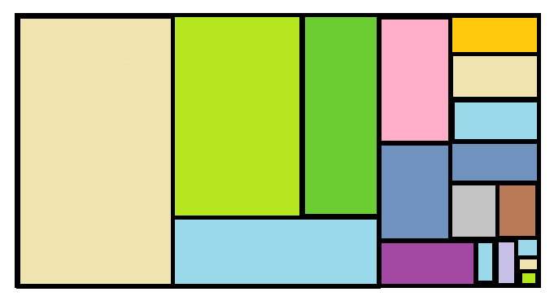

# Visão geral da intervenção

Essa intervenção visa acrescentar modos de pesquisa adicionais a consulta de Restos a Pagar, nos moldes da consulta de Despesa.

Serão acrescentados as pesquisas por filtros de:

1. Favorecido por nome;
2. Favorecido por CPF/CNPJ.

Além disso, também deve ser acrescentado o modo de Pesquisa Avançada.

# Motivação / contexto da intervenção

O Portal de Transparência possui como padrão em suas consultas a possibilidade de pesquisa um item por meio de vários filtros e pesquisa avançada. No entanto,
quando ao reestruturação do Portal em 2015, a consulta de Restos a Pagar foi contemplada apenas com o filtro de pesquisa Órgão.

Nesse sentido, com o objetivo de ofertar mais opções de pesquisa aos usuários essa nova especificação irá acrescentar os mesmos filtros atualmente existentes na consulta de despesa.

# Especificação

## Página Inicial

O cidadão seleciona a opção Restos a pagar e o Portal exibirá

1. __Ano da consulta (aaaa)__ O portal exibirá a opção para escolher o período da consulta – formato aaaa.

2. __Consulta__: Órgão, Função, Programa, Favorecido por nome, Favorecido por CPF/CNPJ. A consulta principal será a consulta por órgão.
3. __Filtro:__ exibir filtro para selecionar uma opção. Sempre que não for selecionado nenhum filtro, a pesquisa deverá retornar todos os resultados possíveis.
  O filtro _favorecido por nome_ deverá permitir que o cidadão digite qualquer parte do nome e o portal retornará todos os itens que encaixem na pesquisa.

4. __Data Ínicio e Fim__
5. __Pesquisar__
6. __Pesquisa Avançada__

Exemplo:

|Ano| Consulta| Filtro|Início|Fim|Pesquisa|Pesquisa Avançada|
|---|:---------|-------|------|---|--------|-----------------|
|   |Órgão (consulta existente)
|   |Função
|   |Programa
|   |Favorecido nome
|   |Favorecido por CPF/CNPJ

#### Observações Gerais

* Todas as páginas da consulta deverão exibir ícones com links para compartilhar consultas no facebook e twitter e a possibilidade de fazer download da planilha completa em csv, exportar para pdf e imprimir conforme padrão já adotado em outras consultas do Portal. Exibir cabeçalho e legenda da tabela e “migalhas” conforme padrão.

* Todos os gráficos da consulta irão buscar a o valor pago no ano.

* Todos dos gráficos deverão apresentar legenda conforme o já adotado em outras consultas.

* Em todos os níveis o cidadão poderá avançar para os próximos níveis tanto clicando no gráfico quanto na tabela.

* Exibir cabeçalho em todas as tabelas.

## Consulta Favorecido por nome

__1º nível (Favorecido)__

O portal exibirá a opção de escolher tipo da consulta e, ao selecionar o tipo _[Favorecido por nome]_, permitirá que o cidadão escreva o nome completo ou parte do nome do favorecido. O Portal retornará todos os resultados que se encaixem no termo informado do filtro.

O Portal da Transparência irá listar o resultado da consulta em um gráfico treemap e em tabela.

<<Título do gráfico: Favorecidos>>

|Favorecido| CNPJ/CPF|Valor inscrito processado| Valor não inscrito processado| Valor pago no ano| Valor a pagar|
|-----|-----|-----|-----|-----|---
|_Link para o próximo nível_

__2º nível (Elemento de Despesa)__

Ao clicar no nome do _[Favorecido]_ o Portal exibirá um gráfico treemap e uma tabela.

<<Título do gráfico: Nome do favorecido selecionado no nível anterior>>

|Categoria Econômica|Grupo de Despesa| Elemento de Despesa| Valor inscrito processado| Valor não inscrito processado|Valor pago no ano | Valor a pagar
|-----|-----|-----|-----|-----|---|----
|||_Link para o próximo nível_

__3º nível (Item de despesa)__

Ao clicar no _[Elemento de despesa]_ o Portal exibirá um gráfico treemap e uma tabela.

<<Título do gráfico: Nome do elemento de despesa selecionado no nível anterior>>

|Fonte de Recursos| Modalidade de Aplicação| Item de Despesa| Valor inscrito processado| Valor não inscrito processado|Valor pago no ano|Valor a pagar
|-----|-----|-----|-----|-----|---|----|
|||_Link para o próximo nível_

__4º nível (Órgão)__

Ao clicar em _[Item de despesa]_ o Portal exibirá um gráfico treemap e uma tabela.

<<Título do gráfico: Nome do item de despesa selecionado no nível anterior>>

|Código| Órgão| Valor inscrito processado| Valor não inscrito processado| Valor pago no ano | Valor a pagar|
|-----|-----|-----|-----|-----|---|
||_Link para o próximo nível_

__5º nível (Número de Empenho)__

Ao clicar em _[órgão]_ o Portal exibirá e uma tabela.

|Data|Número do Empenho| Valor inscrito processado| Valor não inscrito processado| Valor pago no ano | Valor a pagar
|-----|-----|-----|-----|-----|---|
||_Link para o próximo nível_

___OBS: A data deverá ser a data de registro inicial do empenho___

__6º nível (Formulário de detalhamento)__

Ao clicar no _[número do empenho]_ o Portal exibirá o Formulário de detalhamento igual ao utilizado atualmente na consulta por órgão.

## Consulta Favorecido por CPF/CNPJ

Os níveis desse filtro serão os mesmos da consulta _[Favorecido por nome]_

## Consulta Função

__1º nível (Função)__

O portal exibirá a opção de escolher tipo da consulta e, ao selecionar o tipo _[Função]_, permitirá que o cidadão escreva o nome da função ou selecione uma função na lista. O Portal retornará todos os resultados que se encaixem no termo informado do filtro.

O Portal da Transparência irá listar o resultado da consulta em um gráfico treemap e em tabela.

<<Título do gráfico: Funções>>

|Função|Valor inscrito processado| Valor não inscrito processado| Valor pago no ano| Valor a pagar|
|-----|-----|-----|-----|----
|_Link para o próximo nível_

__2º nível (Subfunção)__

Ao clicar no nome da _[Função]_ o Portal exibirá um gráfico treemap e uma tabela. O cidadão poderá navegar pelos níveis de detalhamento tanto no gráfico quanto na tabela.

<< Título do gráfico: Nome da função selecionada no nível anterior>>

|Código|Subfunção|Valor inscrito processado| Valor não inscrito processado|Valor pago no ano | Valor a pagar
|-----|-----|-----|-----|-----|---|
||_Link para o próximo nível_

__3º nível (órgão)__

Ao clicar na _[Subfunção]_ o Portal exibirá um gráfico treemap e uma tabela.

<< Título do gráfico: Nome da Subfunção selecionado no nível anterior>>

|Código|Órgão| Valor inscrito processado| Valor não inscrito processado|Valor pago no ano|Valor a pagar
|-----|-----|-----|-----|-----|--
||_Link para o próximo nível_

__4º nível (Programa)__

Ao clicar em _[Órgão]_ o Portal exibirá um gráfico treemap e uma tabela.

<< Título do gráfico: Nome do órgão selecionado no nível anterior>>

|Código do Programa|Programa| Valor inscrito processado| Valor não inscrito processado| Valor pago no ano | Valor a pagar|
|-----|-----|-----|-----|-----|---|
||_Link para o próximo nível_

__5º nível (Ação)__

Ao clicar no nome do _[Programa]_  Portal exibirá um gráfico treemap e uma tabela

<< Título do gráfico: Nome do programa selecionado no nível anterior>>

|Código da Ação|Ação| Valor inscrito processado| Valor não inscrito processado| Valor pago no ano | Valor a pagar|
|-----|-----|-----|-----|-----|---|
||_Link para o próximo nível_

__6º nível (Elemento de Despesa)__

Ao clicar no nome da _[ação]_ o Portal exibirá um gráfico treemap e uma tabela.

<<Título do gráfico: Nome da Ação selecionada no nível anterior>>

|Categoria Econômica|Grupo de Despesa| Elemento de Despesa| Valor inscrito processado| Valor não inscrito processado|Valor pago no ano | Valor a pagar
|-----|-----|-----|-----|-----|---|----
|||_Link para o próximo nível_

__7º nível (Favorecido)__

Ao clicar no nome do _[Elemento de despesa]_ o Portal exibirá um gráfico treemap e uma tabela.

<<Título do gráfico: Nome do Elemento de despesa selecionado no nível anterior>>

|Favorecido| CNPJ/CPF|Valor inscrito processado| Valor não inscrito processado| Valor pago no ano| Valor a pagar|
|-----|-----|-----|-----|-----|---
|_Link para o próximo nível_

__8º nível (Lista dos empenhos)__

Ao clicar no nome do _[Favorecido]_ o Portal exibirá uma tabela.

|Data|Número do Empenho| Valor inscrito processado| Valor não inscrito processado| Valor pago no ano | Valor a pagar
|-----|-----|-----|-----|-----|---|
||_Link para o próximo nível_

___OBS: A data deverá ser a data de registro inicial do empenho___

__8º nível (Formulário de detalhamento)__

Ao clicar no número do empenho o Portal exibirá o Formulário de detalhamento igual ao utilizado atualmente na consulta por órgão.

## Consulta Programa

__1º nível (Programa)__

O portal exibirá a opção de escolher tipo da consulta e, ao selecionar o tipo _[Programa]_, permitirá que o cidadão escreva o nome da função ou selecione um programa na lista. O Portal retornará todos os resultados que se encaixem no termo informado do filtro.

O Portal da Transparência irá listar o resultado da consulta em um gráfico treemap e em tabela.

<<Título do gráfico: Programas>>

|Código do Programa|Programa| Valor inscrito processado| Valor não inscrito processado| Valor pago no ano | Valor a pagar|
|-----|-----|-----|-----|-----|---|
||_Link para o próximo nível_

__2º nível (Órgão)__

Ao clicar no _[Programa]_ o Portal exibirá um gráfico treemap e uma tabela.

<< Título do gráfico: Nome do Programa selecionado no nível anterior>>

|Código|Órgão| Valor inscrito processado| Valor não inscrito processado|Valor pago no ano|Valor a pagar
|-----|-----|-----|-----|-----|--
||_Link para o próximo nível_

__3º nível (Ação)__

Ao clicar no _[Órgão]_ o Portal exibirá um gráfico treemap e uma tabela.

<< Título do gráfico: Nome do Órgão selecionado no nível anterior>>

|Código da Ação|Ação| Valor inscrito processado| Valor não inscrito processado|Valor pago no ano|Valor a pagar
|-----|-----|-----|-----|-----|--
||_Link para o próximo nível_

__4º nível (Elemento de Despesa)__

Ao clicar no nome da _[ação]_ o Portal exibirá um gráfico treemap e uma tabela.

<<Título do gráfico: Nome da Ação selecionada no nível anterior>>

|Categoria Econômica|Grupo de Despesa| Elemento de Despesa| Valor inscrito processado| Valor não inscrito processado|Valor pago no ano | Valor a pagar
|-----|-----|-----|-----|-----|---|----
|||_Link para o próximo nível_

__5º nível (Favorecido)__

Ao clicar no nome do _[Elemento de despesa]_ o Portal exibirá um gráfico treemap e uma tabela.

<<Título do gráfico: Nome do Elemento de despesa selecionado no nível anterior>>

|Favorecido| CNPJ/CPF|Valor inscrito processado| Valor não inscrito processado| Valor pago no ano| Valor a pagar|
|-----|-----|-----|-----|-----|---
|_Link para o próximo nível_

__6º nível (Lista dos empenhos)__

Ao clicar no nome do _[Favorecido]_ o Portal exibirá uma tabela.

|Data|Número do Empenho| Valor inscrito processado| Valor não inscrito processado| Valor pago no ano | Valor a pagar
|-----|-----|-----|-----|-----|---|
||_Link para o próximo nível_

___OBS: A data deverá ser a data de registro inicial do empenho___

__7º nível (Formulário de detalhamento)__

Ao clicar no número do empenho o Portal exibirá o Formulário de detalhamento igual ao utilizado atualmente na consulta por órgão.

## Consulta Avançada

A consulta avançada terá 12 campos de filtro simples e parâmetro de ano:
1. Órgão
2. Função
3. Subfunção
4. Programas
5. ação
6. Categoria Econômica
7. Grupo de Despesa
8. Modalidade de Aplicação
9. Elemento de despesa
10. Item de Despesa
11. Fonte de Recursos
12. Identificador de Procedência e Uso (IPU)

O usuário poderá escolher em exibir ou não a lista dos favorecidos. Como padrão o portal não exibirá os favorecidos.

Favorecidos
- [ ] Exibir favorecidos
- [x] Não exibir Favorecidos

__OBS: Ao exibir o favorecido o Portal deverá retornar o nome e CNPJ/CPF do favorecido, conforme já ocorre na consulta de despesa.__

O cidadão poderá informar mais de um valor para cada filtro. Ao informar um valor de filtro, listar todas as opções e disponibilizar ao cidadão a funcionalidade de autocompletar (desde a primeira letra), desconsiderando acentuação, letras maiúsculas/minúsculas e palavras intermediárias (ex.: Ao digitar "gestao pública", um dos resultados será "Gestão da Administração Pública").

Se o cidadão não informar um valor para cada filtro, o Portal da Transparência considerará todos os valores possíveis para cada filtro não informado.

O cidadão poderá escolher os campos que ele quer que apareça no resultado (seguir modelo das demais consultas).

O cidadão deverá escolher o ano da pesquisa.

Ao exibir o resultado na tabela a consulta deverá retornar as colunas valor inscrito processado, valor inscrito não processado, valor pago no ano e valor a pagar.

# Dependências / Integrações

A integração será realizada com o armazém do SIAFI (BO) conforme ocorre atualmente.

# Exemplos

Seguir o modelo atual da [consulta de Despesa](http://www.transparencia.mg.gov.br/despesa-estado/despesa) do Portal de Transparência

# Dúvidas

  1. Avaliar junto a Prodemge a possibilidade do cidadão não ter que digitar 3 digitos par exibir a lista dos favorecidos na consulta Favorecido por nome.
  Nesse sentido o filtro favorecido por nome deverá permitir que o cidadão digite qualquer parte do nome e o portal retornará todos os itens que encaixem na pesquisa.

  2. Avaliar a real necessidade de acrescentar todos os filtros, uma vez que conforme levantamento realizado no google analytics, considerando a consulta de despesa, os filtros mais utilizados são:

  * __Período analisado__: jan/2019 a 23/out/2019
  * __Total de acessos na consulta de despesa__: 153.255 sessões

      | Filtros    | Acessos   | %       |
      |------------|----------:|--------:|
      | Órgãos     |   132.412 |  86,40% |
      | Programa   |       429 |   0,28% |
      | Função     |     4.179 |   2,73% |
      | Favorecido |    16.235 |  10,59% |
      | __Total__  |__153.255__|         |

3. Avaliar se a navegação por nível deverá espelhar a da Consulta de Despesa.
