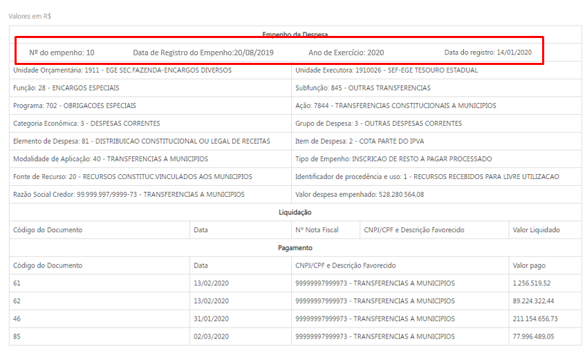

# Visão geral da demanda
<a href="#top">(inicio)</a>

Essa demanda visa acrescentar modos de pesquisa adicionais a [consulta de Restos a Pagar](http://www.transparencia.mg.gov.br/despesa-estado/restos-a-pagar), nos moldes da [consulta de Despesa](http://www.transparencia.mg.gov.br/despesa-estado/despesa). Devem ser acrescentados os modos de pesquisa:

1.  Filtro favorecido por nome;
2.  Filtro favorecido por CPF/CNPJ;
3.  Pesquisa Avançada.

# Motivação / contexto da demanda
<a href="#top">(inicio)</a>

As consultas do Portal de Transparência possuem como padrão a possibilidade de pesquisa por meio de filtros (eg. [_Filtro Favorecido - Consulta Despesas_](http://www.transparencia.mg.gov.br/despesa-estado/despesa/despesa-favorecidos/2019/01-01-2019/31-12-2019/0/LUCIANA%20CASSIA%20NOGUEIRA/0/3)) e pesquisa avançada (eg. [_Pesquisa Avançada - Consulta Despesa_](http://www.transparencia.mg.gov.br/despesa-estado/despesa/despesa-pesquisa-avancada)). No entanto, na reestruturação do Portal de Transparência, ocorrida entre 2015 e 2017, a consulta de Restos a Pagar não foi contemplada com esses modos de pesquisa, sendo disponibilizado apenas o filtro por órgão.

A Diretoria Central de Transparência Ativa (DTA) recebe de forma recorrente questionamentos sobre a ausência dos modos de pesquisa adicionais.

# Especificação

## Página Inicial e Navegação por nível
<a href="#top">(inicio)</a>

Para contemplar a inclusão dos modos de pesquisa adicionais a barra de pesquisa da página inicial deve ser:

Após uma pesquisa bem sucedida utilizando o filtro favorecido por nome ou CPF/CNPJ devem ser apresentados um gráfico _treemap_ e uma tabela, __ambos navegáveis__, por meio de duplo clique. O primeiro nível de navegação após a realização de uma busca utilizando o filtro favorecido é

A ordem de navegação para os demais níveis e os campos descritivos que compõe o _treemap_ e a tabela são:

* 1º nível: | [Favorecido](#)      | CPF/CNPJ |
* 2º nível: | Categoria Econômica	| Grupo de Despesa | [Elemento de Despesa](#) |
* 3º nível: | Fonte de Recursos	  | Modalidade de Aplicação	| [Item de Despesa](#) |
* 4º nível: | Código              | [Órgão](#)	|
* 5º nível: | Data                | [Número do Empenho](#)	|

Somente os campos marcados como _hyperlink_ permitem a navegação nas tabelas. Nas tabelas do 1º ao 5º nível os seguinte campos númericos devem ser apresentados:

* Valor Inscrito Processado,
* Valor Inscrito não Processado,
* Valor Pago no Ano,
* Valor a pagar

Ao clicar no campo _[Número do empenho]_ no 5º nível, o Portal exibirá o [formulário de detalhamento], conforme abaixo:

__Obs:__ Foi incluído a data inicial de registro do empenho no formulário de detalhamento.

### Observações

* O gráfico _treemap_ deve utilizar a métrica "Valor Pago no Ano" em todos os níveis;
* O título do gráfico _treemap_ em cada nível deve ser o valor da classificação orçamentária selecionada no nível anterior;
* O campo _[Data]_ exibido no 5º nível deve fazer referência a data de registro inicial do empenho.
* O filtro favorecido por nome deve ter a opção de autocomplete a partir de 3 letras. A menos que seja tecnicamente inviável os resultados devem ser retornados sem a necessidade do usuário clicar no ícone pesquisar;
* O filtro favorecido por nome deve permitir que o cidadão digite no mínimo 3 letras consecutivas de qualquer parte do nome do favorecido e o portal retornará todos os itens que encaixem na pesquisa;
* O preenchimento obrigatório dos filtros favorecido por nome e por CPF/CNPJ somente deve ser necessário em caso de inviabilidade técnica ou prejuízo de desempenho para o Portal.
* O filtro favorecido por CPF/CNPJ deve realizar a busca com CPFs/CNPJs formatados ou númericos.
* No filtro o campo órgão deve permitir buscas por sigla sem que essa informação seja exibida.
* Os filtros dos três modos de pesquisa devem possuir funcionalidade de seleção múltipla como na pesquisa avançada.

## Pesquisa Avançada
<a href="#top">(inicio)</a>

A consulta avançada terá 12 campos de filtro e parâmetro de ano:

1.  Órgão
2.  Função
3.  Subfunção
4.  Programas
5.  Ação
6.  Categoria Econômica
7.  Grupo de Despesa
8.  Modalidade de Aplicação
9.  Elemento de despesa
10.  Item de Despesa
11.  Fonte de Recursos
12.  Identificador de Procedência e Uso (IPU)

O usuário poderá escolher em exibir ou não a lista dos favorecidos. Como padrão o portal não exibirá os favorecidos.

Favorecidos

 <input type="checkbox" disabled=""> Exibir favorecidos
 <input type="checkbox" disabled="" checked=""> Não exibir Favorecidos

### Observações

* O campo órgão da pesquisa avançada deve permitir buscas por sigla sem que essa informação seja exibida.

*  A Pesquisa Avançada deve possuir um botão de marcar/desmarcar todas as colunas conforme demanda [especificação checkboxes](https://github.com/transparencia-mg/especificacoes-portal-transparencia/tree/feat/especificacao_checkboxes/espec010_checkboxes).

*   O autocomplete da pesquisa avançada deve possuir código e descrição das classificações orçamentárias ([eg. consulta proposta orçamentária](http://www.transparencia.mg.gov.br/planejamento-e-resultados/proposta-lei-orcamentaria/proposta-orcamentaria/proposta-pesquisa-avancada)). Os itens de resultado em cada filtro devem refletir apenas as classificações orçamentárias inscritas em restos a pagar, e não a classificação orçamentária vigente no ano.

    _Exemplo 1: Em 08 de Janeiro/2020 foram inscritos em RP R$ 7317,47 da ação `4484 - Abastecimento de Medicamentos Básicos` com ano de origem 2016 e R$ 514,16 da ação `4259 - Representação Judicial, Cobrança da Dívida Ativa e Assessoramento Jurídico ao Estado na Região Metrô` com ano de origem 2019. Em 2020 o filtro de ação deve mostrar apenas as ações `4484 - Abastecimento de Medicamentos Básicos` e `4259 - Representação Judicial, Cobrança da Dívida Ativa e Assessoramento Jurídico ao Estado na Região Metrô`_.

    _Exemplo 2: Ao selecionar a ação `4392- Promoção do acesso a Informação e da Transparência Governamental` no ano de 2020, o filtro apresenta como opção outro código para a mesma descrição - `4056 - Promoção do acesso a Informação e da Transparência Governamental`. No entanto, a ação com o código `4056` refere-se a classificação orçamentária do ano de 2020. Conforme tabela gerada no BO (Restos a pagar) o código correto da ação é `4392` pois na classificação orçamentária de 2019, a qual se refere o restos a pagar o código da ação `Promoção do acesso a Informação e da Transparência Governamental é 4392`_

Assim, ao selecionar um período específico o Portal irá exibir apenas a classificação orçamentária referente ao ano de inscrição do em restos a Pagar.

* A exibição de código e descrição deve ser diferente em cada seção da pesquisa  avançada:
  * Campos dos filtros: exibir  código e descrição no mesmo campo ([eg. consulta proposta orçamentária](http://www.transparencia.mg.gov.br/planejamento-e-resultados/proposta-lei-orcamentaria/proposta-orcamentaria/proposta-pesquisa-avancada));
  * Tabela de resultado: exibir apenas descrição;
  * Opções imprimir e PDF: exibir apenas descrição; e
  * Opção exportar CSV.: exibir código e descrição em campos distintos.

*   Ao exibir o favorecido o Portal deverá retornar o nome e CNPJ/CPF do favorecido, conforme já ocorre na [Consulta de despesa](http://www.transparencia.mg.gov.br/despesa-estado/despesa/despesa-resultado-pesquisa-avancada/2019/01-01-2019/31-12-2019/3853/0/3684/0/0/0/0/0/0/0/0/0/0/0/0/0/0/0/0/0/0/0/0/0/1/0).

*   O Portal dever ter a funcionalidade de autocompletar (desde a primeira letra), desconsiderando acentuação, letras maiúsculas/minúsculas e palavras intermediárias (ex.: Ao digitar "gestao pública", um dos resultados será "Gestão da Administração Pública").

*   O cidadão poderá informar mais de um valor para cada filtro. Ao informar um valor de filtro, listar todas as opções. Se o cidadão não informar um valor para cada filtro, o Portal considerará todos os valores possíveis para cada filtro não informado.

*   O cidadão poderá escolher os campos que ele quer que apareça no resultado (seguir modelo das demais consultas).

*   O cidadão deverá escolher o ano da pesquisa.

*   Ao exibir o resultado na tabela a consulta deverá retornar as colunas valor inscrito processado, valor inscrito não processado, valor pago no ano e valor a pagar.

## Observações Gerais

Conforme informado pelo analista da Prodemge Luiz, o Armazém SIAFI não apresenta programação financeira para dados anteriores a 2002, nesse sentido quando um empenho se referir a esse período não será possível trazer essa informação.
