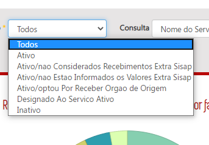
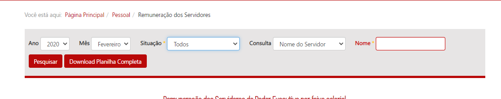
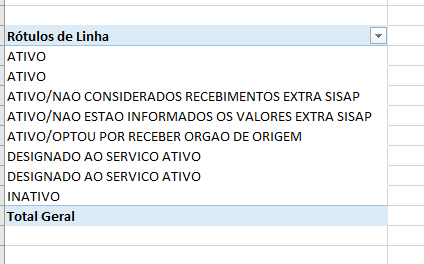

| Título       | [Homologação do layout - Filtro Servidor](http://htmlpreview.github.io/?https://github.com/transparencia-mg/especificacoes-portal-transparencia/blob/master/espec005_filtro-servidores/especificacao-filtro-servidor-homologa-layout.html)
| -|:-
|__Contrato Manutenção__ | Nº 15210010062019 (INF. 3951)
|__Proposta comercial__ |  Nº 626584/19
|__Mantis__ | 0146470   

# Homologação do layout
<a href="#top">(inicio)</a>

Divergências destacadas em vermelho
--

  

# Especificação

Na barra de pesquisa deve ser incluída um novo filtro em um campo específico que permita pesquisas a partir dos valores da variável `Descrição Situação do Servidor`/`descsitser`. A barra de pesquisa deverá apresentar a seguinte estrutura:

__CONFERE__

  

Uniformizar os texto do campo Situação.
--

**Exemplo:** "Ativo/nao Estao Informados os Valores Extra Sisap"

**Alterar para:**

**opção 1**: Ativo/não estão informados os valores extra sisap; ou  
**opção 2**: Ativo/não estão informados os valores extra SISAP

  

Verificar a possibilidade de colocar a barra de pesquisa em apenas uma linha
--

## Observações

* Caso o cidadão não escolha nenhum tipo de filtro no campo ___Situação___ o Portal deverá exibir o resultado considerando todos os tipos de vínculos existentes.

* O portal deve exibir todos os tipos de situação funcional do servidor que estiverem na planilha de remuneração.

__CONFERE__

  

