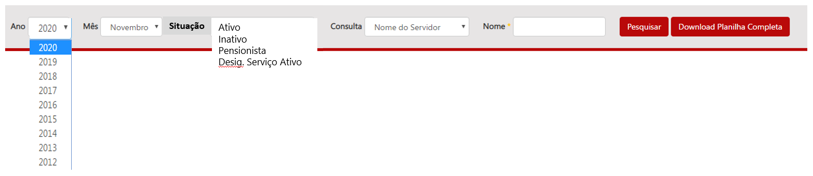
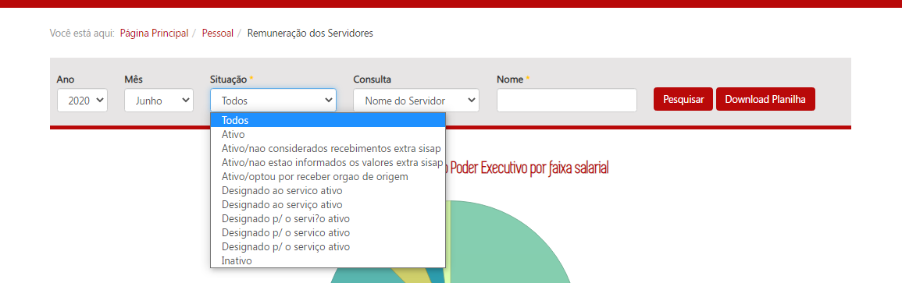

# Homologação no ambiente de produção
<a href="#top">(inicio)</a>

# Especificação

Na barra de pesquisa deve ser incluída um novo filtro em um campo específico que permita pesquisa pesquisas a partir dos valores da variável `Descrição Situação do Servidor`/`descsitser`. A barra de pesquisa deverá apresentar a seguinte estrutura:

CONFERE
--
***O conteúdo desse campo será alterado no momento que a DTA realizar a limpeza nas planilhas de remuneração.***

## Observações

* Caso o cidadão não escolha nenhum tipo de filtro no campo ___Situação___ o Portal deverá exibir o resultado considerando todos os tipos de vínculos existentes.

* O portal deve exibir todos os tipos de situação funcional do servidor que estiverem na planilha de remuneração.
