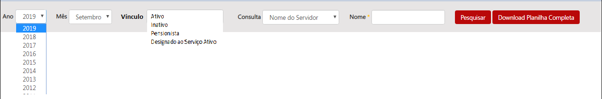

# Visão geral da demanda

Essa demanda visa criar o filtro *Situação do Servidor* na página inicial da consulta de [Remuneração de Servidores](http://www.transparencia.mg.gov.br/estado-pessoal/remuneracao-dos-servidores) para a possibilitar a consulta de servidores ativos, inativos, pensionistas entre outros.

# Motivação / contexto da demanda

A criação do filtro situação do servidor é importante para atender a uma demanda da sociedade, via Fale Conosco e 3915-9622, que necessita realizar consultas de outros tipos de vínculos.

O formato atual de divulgação no Portal da Transparência apresenta apenas a lista total dos servidores, não diferenciando os servidores ativos e inativos.

Só se conhece a situação funcional do servidor (ativo ou inativo), quando se acessa o detalhamento dos dados funcionais desse servidor (Situação Funcional - Descrição Situação do Servidor).

Assim, ao criar o filtro *Situação do Servidor*, será possível visualizar a quantidade de servidores ativos, inativos, pensionsitas e outros.

# Especificação

## Barra de pesquisa

## Barra de pesquisa

Para contemplar a possibilidade da seleção de novos períodos a barra de pesquisa da página inicial deve ser:

### Observações gerais

* Nos filtro situação do servidor, órgão, cargo efetivo caso o usuário não selecione nenhuma opção o Portal deve exibir todos resultados possíveis.

* Caso o cidadão não escolha nenhum tipo de vínculo e digite o nome do servidor ou outro tipo de consulta no campo ___NOME___ o portal retornará todos os tipos de vínculos relacionados a consulta selecionada.

* Nos filtro situação do servidor, órgão, cargo efetivo e cargo em comissão devem possuir funcionalidade de seleção múltipla como na pesquisa avançada da consulta de despesa.

* O filtro nome do servidor deve permitir que o cidadão digite no mínimo 3 letras consecutivas de qualquer parte do nome do servidor e o portal retornará todos os itens que encaixem na pesquisa, conforme ocorre atualmente

* No filtro o campo órgão deve permitir buscas por sigla sem que essa informação seja exibida.

* O portal deve exibir todos os tipos de situação funcional do servidor que estiverem na planilha de remuneração.

# Exemplos / Pesquisa

* Governo do [Distrito Federal](http://www.transparencia.df.gov.br/#/servidores/remuneracao)

* Prefeitura de [Curitiba](https://www.transparencia.curitiba.pr.gov.br/meta4/servidores.aspx)

