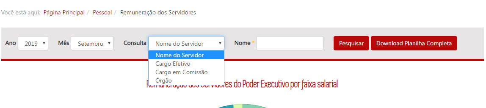
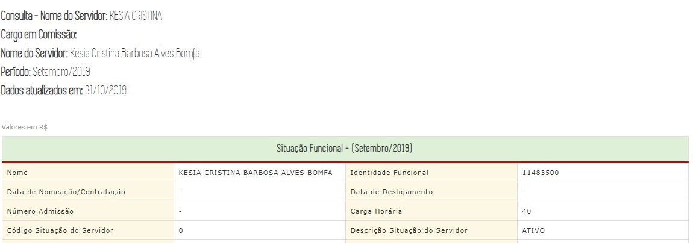
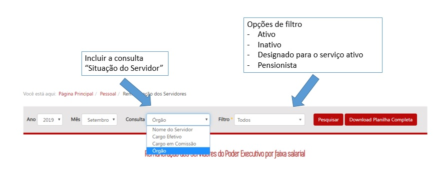

  
# Visão geral da demanda

Essa demanda visa criar o filtro *situação do servidor* na página inicial da consulta de **Remuneração de Servidores** para a possiblitar a consulta de servidores ativos, inativos e pensionistas.

# Motivação / contexto da demanda
A criação do filtro situação do servidor é importante para atender a uma demanda da sociedade, via Fale Conosco e 59622, que necessita realizar consultas de servidores inativos e pensionistas.

O formato atual de divulgação no Portal da Transparência apresenta apenas os dados de servidores inativos que estão na ativa.

No entanto, não há um filtro que permita visualizar os servidores inativos. Só se conhece que um servidor é inativo, ao acessar o detalhamento de um servidor (Situação Funcional - Descrição Situação do Servidor).

Assim, ao criar o filtro Situação do Servidor, será possível viasulizar a quantidade de servidores ativos, inativos e pensionsitas.

#Especificação

## Filtro Situação do Servidor

### Página Inicial

O cidadão seleciona na consulta os filtros 
- Nome do Servidor
- Cargo Efetivo
- Cargo em Comissão
- Órgão
- Situação do Servidor

No filtro "Nome", será possível escolher umas das 3 opções abaixo:
- Ativo
- Inativo
- Pensionista
- Designado ao serviço ativo

Ao clicar em pesquisar, a consulta exibirá a lista do servidores que se encontram no filtro pesquisado.

Dependências / Integrações
Não se aplica

Exemplos / Pesquisa

Dúvidas
Questionamentos ou dúvidas que ainda precisam ser avaliados/resolvidos.