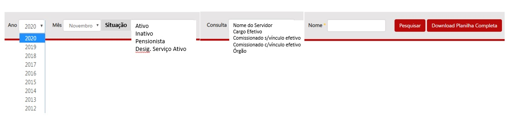

# Visão geral da demanda
<a href="#top">(inicio)</a>

Essa demanda visa criar o filtro ___Situação___ na página inicial da consulta de [Remuneração de Servidores](http://www.transparencia.mg.gov.br/estado-pessoal/remuneracao-dos-servidores) para a possibilitar a consulta de servidores ativos, inativos, pensionistas entre outros.

# Motivação / contexto da demanda
<a href="#top">(inicio)</a>

A Diretoria Central de Transparência Ativa (DTA) recebe de forma recorrente questionamentos sobre a ausência de filtros para realizar a consulta por outros tipos de vínculos.

O formato atual de divulgação no Portal da Transparência apresenta apenas a lista total dos servidores, não diferenciando os servidores ativos, inativos, pensionistas entre outros.

A situação funcional do servidor (ativo ou inativo) só é apresentada quando se acessa o detalhamento dos dados funcionais de um determinado servidor [Situação Funcional - Descrição Situação do Servidor](http://www.transparencia.mg.gov.br/estado-pessoal/remuneracao-dos-servidores/remuneracao-filtros/201911/zema/0/0/0/4139353/2256/0).

Assim, ao criar o filtro *Situação do Servidor*, será possível visualizar a quantidade de servidores ativos, inativos, pensionsitas e outros.

Na opção de Consulta: deverá ser excluída a opção Cargo Comissionado, e substituída por:
- Comissionado com vínculo efetivo;
- Comissioando sem vínculo efetivo.

# Especificação

## Barra de pesquisa

Considerando a inclusão do campo ___Situação___ e as alterações propostas na especificação referente ao layout da remuneração, a barra de pesquisa deverá apresentar a seguinte estrutura:

* Ano: Todo o histórico anual da remuneração;

* Mês: Todos os meses do (Janeiro a Dezembro);
* ___Situação:___ Ativo, Inativo, Pensionista, Designado ao Serviço Ativo e outros (o Portal deve exibir todos os tipos de vínculo que estiverem na planilha de remuneração);
* ___Consulta___: Nome do servidor, Cargo efetivo, Comissionado com vínculo efetivo,Comissioando sem vínculo efetivo, órgão;
* Nome: manter as regras atuais
* Pesquisar;
* Download planilha completa;

### Observações gerais

* Caso o cidadão não escolha nenhum tipo de filtro no campo ___Situação___ o Portal deverá exibir o resultado considerando todos os tipos de vínculos existentes.

* Nos filtro situação do servidor, órgão, cargo efetivo e cargo em comissão devem possuir funcionalidade de seleção múltipla como na pesquisa avançada da consulta de despesa.

* No filtro o campo órgão deve permitir buscas por sigla sem que essa informação seja exibida.

* O portal deve exibir todos os tipos de situação funcional do servidor que estiverem na planilha de remuneração.
