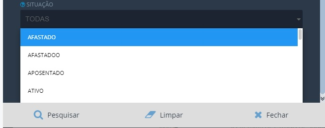
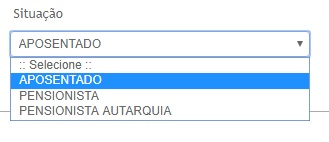

----
Título: "Filtro do Servidor"

pull_request: [espec005](https://github.com/transparencia-mg/especificacoes-portal-transparencia/pull/7)

Contrato de Manutenção nº 15210010062019 (INF. 3951)

Proposta Comercial nº 

----

# Visão geral da demanda

Essa demanda visa criar o filtro *vínculo do servidor* na página inicial da consulta de [Remuneração de Servidores](http://www.transparencia.mg.gov.br/estado-pessoal/remuneracao-dos-servidores) para a possibilitar a consulta de servidores ativos, inativos, pensionistas entre outros.

# Motivação / contexto da demanda
A criação do filtro vínculo do servidor é importante para atender a uma demanda da sociedade, via Fale Conosco e 3915-9622, que necessita realizar consultas de outros tipos de vinculos.

O formato atual de divulgação no Portal da Transparência apresenta apenas a lista total dos servidores, não diferenciando os servidores ativos e inativos.

Só se conhece a situação funcional de servidor (ativo ou inativo), quando se acessa o detalhamento dos dados funcionais desse servidor (Situação Funcional - Descrição Situação do Servidor).

Assim, ao criar o filtro Vínculo do Servidor, será possível visualizar a quantidade de servidores ativos, inativos, pensionsitas e outros.

# Especificação

## Página Inicial

Para contemplar a inclusão dos novos filtros a página inicial deverá sofrer alterações conforme abaixo:

* Ano da consulta (aaaa): Conforme padrão adotado atualmente.
* Mês (mmmm): Conforme padrão adotado atualmente.
* Vínculo: todos, ativo, inativo, pensionista, designado ao serviço e etc.
* Consulta: nome do servidor, cargo efetivo, cargo em comissão, órgão.
* Nome: manter as regras atuais
* Pesquisar
* Download planilha completa

|Ano| Mês| Vínculo|Consulta|Nome|pesquisar| Download planilha completa|
----|----|----|---|----|----|-----|
|||Ativo|
|||Inativo
|||Pensionista
|||Designado ao serviço
|||Etc

#### __Observações gerais__

1. O cidadão poderá escolher um tipo de vínculo ou solicitar que o Portal apresente todos.
Ex. Caso o cidadão não escolha nenhum tipo de vínculo e digite o nome do servidor ou outro tipo de consulta no campo ___NOME___ o portal retornará todos os tipos de vínculos relacionados a consulta selecionada.

2. O portal deve exibir todos os tipos de vínculo que estiverem na planilha de remuneração.

# Dependências / Integrações

Não se aplica

# Exemplos / Pesquisa

* Governo do [Distrito Federal](http://www.transparencia.df.gov.br/#/servidores/remuneracao)

* Prefeitura de [Curitiba](https://www.transparencia.curitiba.pr.gov.br/meta4/servidores.aspx)

# Dúvidas
