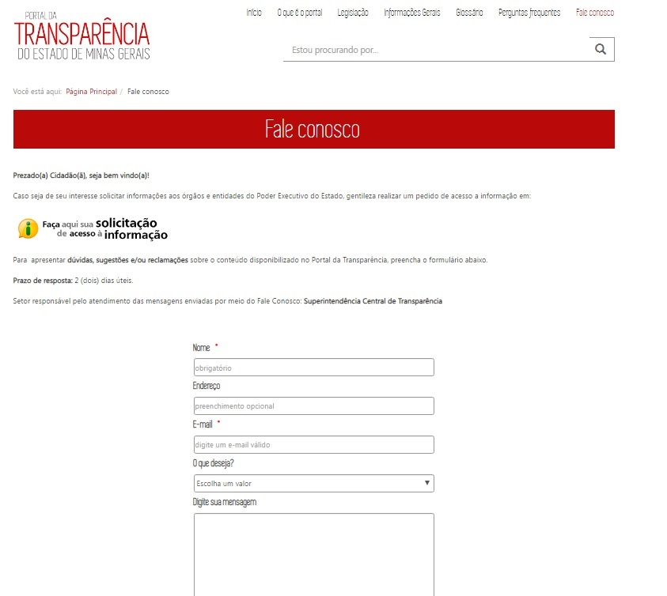
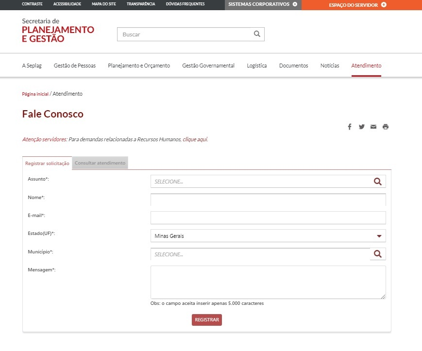

  
  
# Visão geral da demanda
  
Essa demanda visa alterar a interface do *Fale Conosco* existente no Portal da Transparência, passando a adotar a configuração do "Fale Conosco" padrão existente no Portal da [SEPLAG](http://www.planejamento.mg.gov.br/pagina/atendimento/fale-conosco/fale-conosco).

# Motivação / contexto da demanda

Atualmente, os dados do Fale Conosco são recebidos na equipe da Diretoria de Transparência Passiva, após análise prévia da equipe da Diretoria de Transparência Passiva, que recebe todas as demandas, e encaminha por e-mail apenas os pedidos relacionados a transparência ativa.

A equipe da DTA responde os pedidos, devolve para a DTP e em seguida, registra os pedidos respondido em um arquivo da rede.

[REDE](S:\SCT\Diretoria_Transparencia_Ativa_DTA\Respostas_Faleconosco_Esic/respostas_faleconosco).

A DTA não possui acesso a base de dados do Fale Conosco registrados no Portal da Transparência. Além disso, esses dados não estão centralizados na base de dados do Fale Conosco administrados atualmente pela SEPLAG.

Assim, a alteração da interface do "Fale Conosco" do Portal da Transparência tem por objetivos:
  
- adequar o layout atual ao layout padrão do Estado de Minas Gerais;
- centralizar os dados na base de dados do Fale Conosco utilizados pelos demais órgãos e entidades; 
- permitir o acesso da equipe da DTA ao banco de dados do sistema.

#Especificação

## Fale Conosco

### Página Inicial

Alterar o layout do Fale Conosco, adequando ao layout padrão utilizado pela SEPLAG:

# Dependências / Integrações
Não se aplica

# Exemplos / Pesquisa

[SEPLAG](http://www.planejamento.mg.gov.br/pagina/atendimento/fale-conosco/fale-conosco)

[SEDESE](http://www.social.mg.gov.br/fale-conosco)

# Dúvidas
OBSERVAÇÃO: Não sei informar como deverá ser realizada essa alteração.

1. Verifiquei que no Portal da CGE não consta o Menu atendimento, conforme especificado na Resolução nº 29/2016. 
Não seria interessante incluir essa alteração????? [CGE](http://www.cge.mg.gov.br/)

  
  - Menu Atendimento, contendo:
      - Fale Conosco
      - Horário de Atendimento
      - Dúvidas Frequentes
      - Ajuda (consta da revisão)
