# Visão geral da demanda

Essa demanda visa incluir nas consultas que possuem pesquisas avançadas a opção de marcar e desmarcar as caixas de seleção ___checkboxes___, de forma que o usuário possa selecionar todas as opções da pesquisa avançada sem a necessidade de selecionar todas as opções exibir.

# Motivação / contexto da demanda

Atualmente, a pesquisa avançada das consultas do Portal da Transparência possui a funcionalidade de exibir os itens da pesquisa. No entanto, para que o usuário possa visualizar os itens da pesquisa é necessário que ele selecione um a um os campos "_exibir_" que serão mostrados na consulta.

Para facilitar a navegação do usuário, sugere-se a inclusão do item “___Exibir Todos___” no início da consulta, possibilitando ao usuário selecionar com apenas um clique todos os itens da consulta.

# Homologação do layout da funcionalidade

A Diretoria Central de Transparência Ativa (DTA) não enviou a especificação da funcionalidade checkboxes, dessa forma a PRODEMGE propôs um modelo de funcionalidade que foi aprovado pela equipe gestora do Portal.
  

As divergências estão destacadas em   
vermelho  

  

  

__Diárias__

  Não está funcionado. Ao clicar no ícone Diáriaso Portal retorna para a página inicial
        

  1. Despesa
  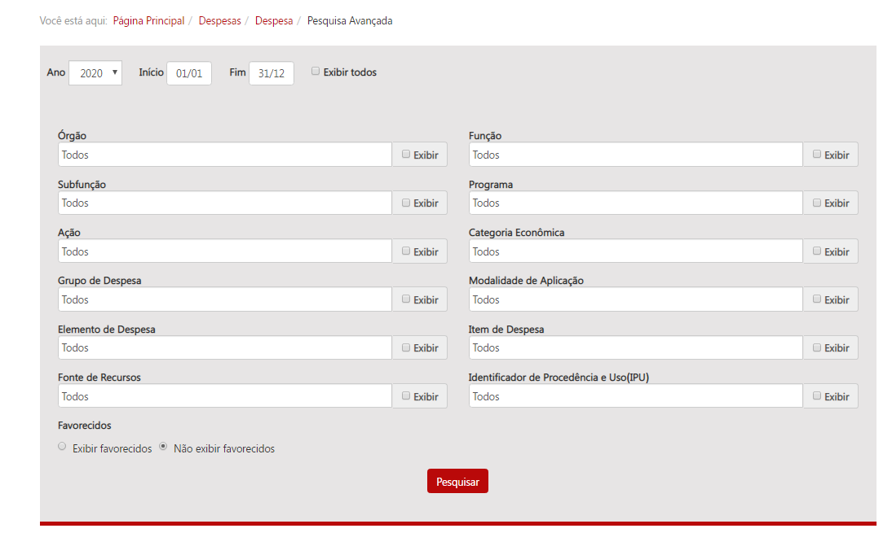
--

2. Restos a pagar

  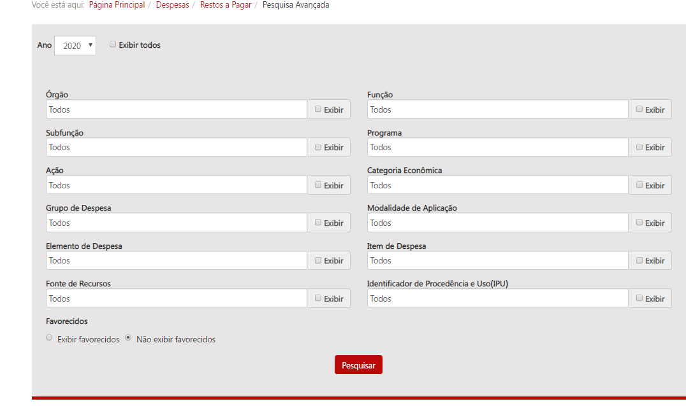

3. Viagens

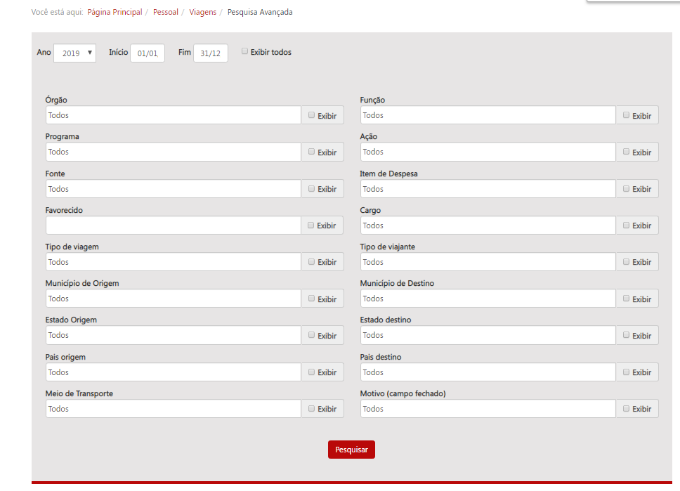

4. Receita

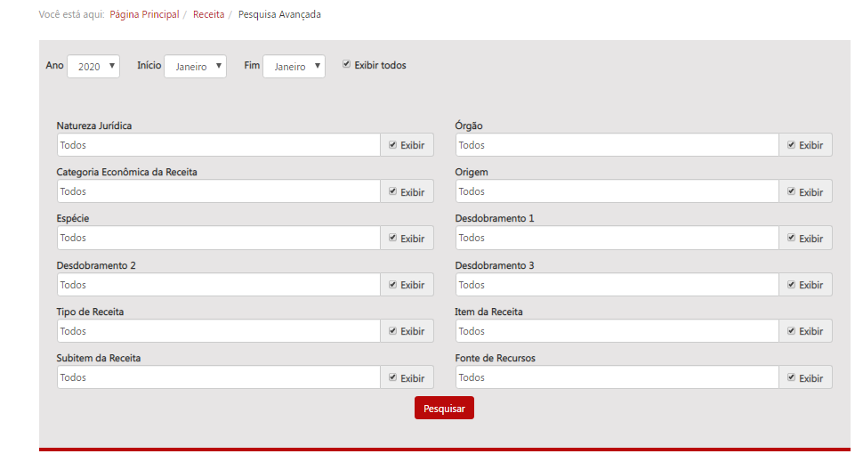

5. Proposta Orçamentária
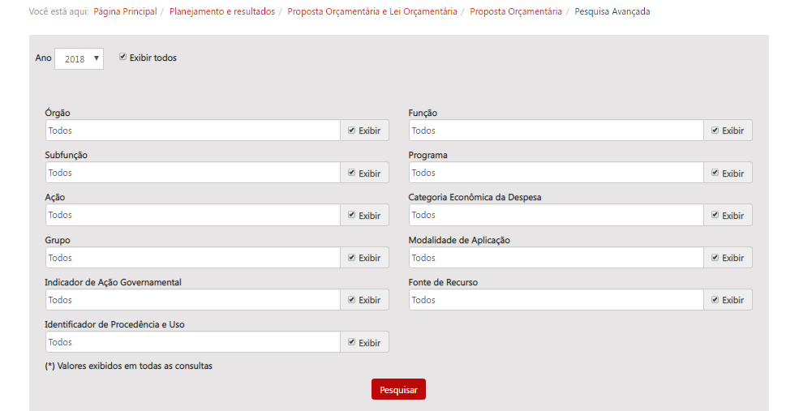

6. Crédito Orçamentário
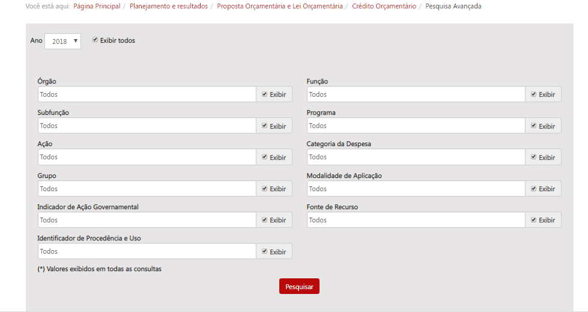

7. Alteração Orçamentária
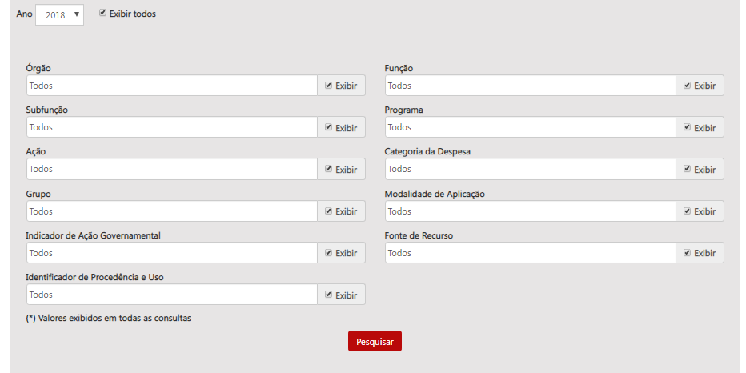

8. Alteração Orçamentária
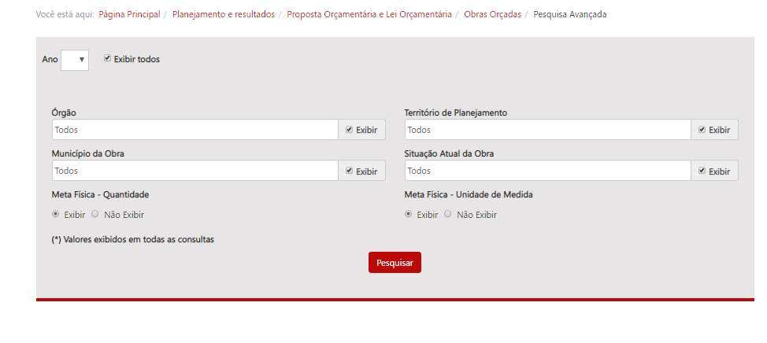

9. Convênio de Saída
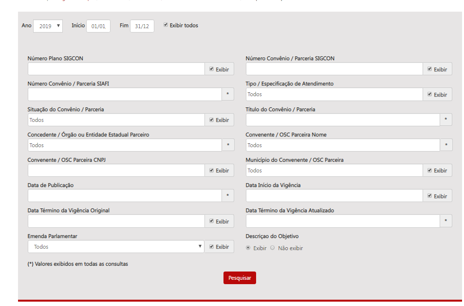

10. Convênio Entrada
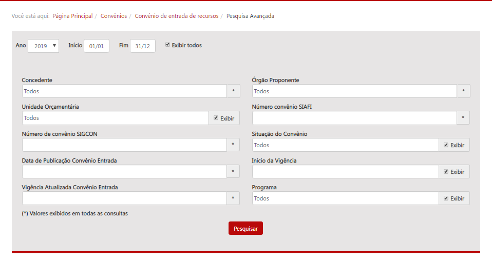

11. Compras e Contratos
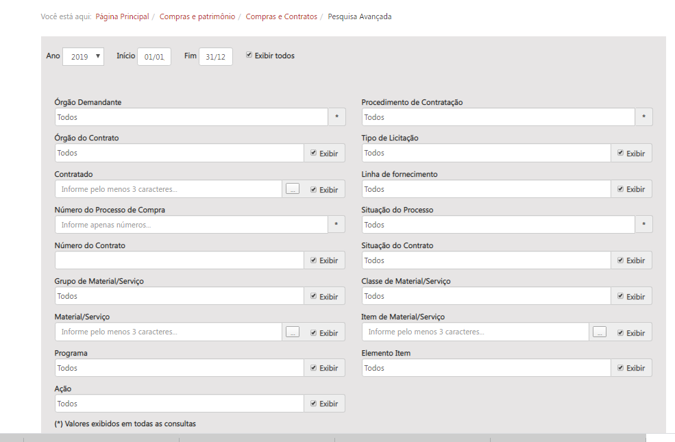

12. Patrimônio
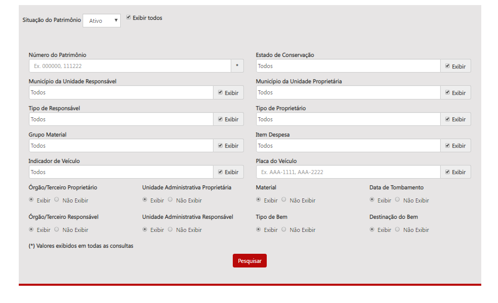

13. Frota
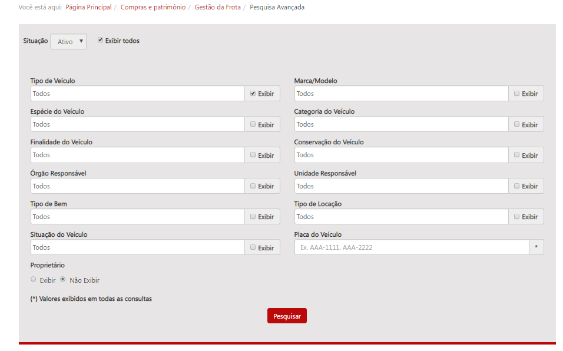

  

