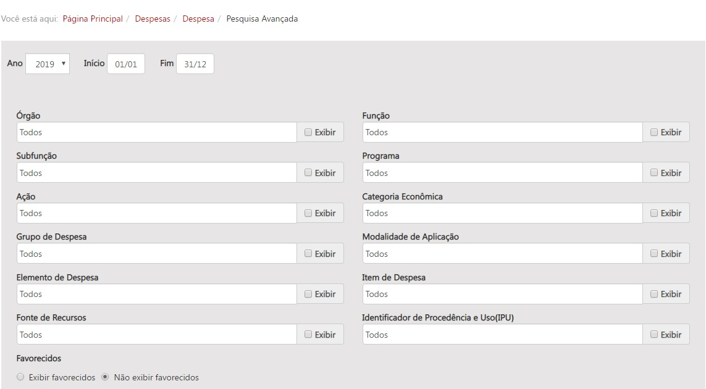

  
  
# Visão geral da demanda
  
Essa demanda visa incluir nas consultas que possuem pesquisas avançadas a opção de marcar e desmarcar as caixas de seleção “checkboxes”, de forma que o usuário possa selecionar todas as opções da pesquisa avançada sem a necessidade de selecionar todas as opções exibir.

# Motivação / contexto da demanda

Atualmente, a pesquisa avançada das consultas do portal da transparência possui a funcionalidade de exibir os itens da pesquisa. No entanto, para que o usuário possa visualizar os itens da pesquisa é necessário que ele selecione um a um os campos "exibir" que serão mostrados na consulta.
Para facilitar a navegação do usuário, sugere-se a inclusão do item “Exibir Todos” no início da consulta, possibilitando ao usuário selecionar com apenas um clique todos os itens da consulta.

[Pesquisa Avançada]( http://transparencia.mg.gov.br/despesa-estado/despesa/despesa-pesquisa-avancada).

# Especificação

Segue abaixo o layout da inclusão da opção exibir todos.

1.	Incluir caixa de seleção com a descrição “Exibir todos”;

2.	A caixa de seleção deverá ser localizada antes da seleção das opções da consulta avançada;

3.	A opção “Exibir todos” deverá ser incluída em todas as consultas que possuem “Pesquisa Avançada”:

- [Despesa](http://www.transparencia.mg.gov.br/despesa-estado/despesa/despesa-pesquisa-avancada);
- Restos a Pagar (a consulta avançada já consta da nova reformulação do portal);
- [Viagens](http://www.transparencia.mg.gov.br/estado-pessoal/viagens/estado_viagens-pesquisa-avancada);
- [Receita](http://www.transparencia.mg.gov.br/estado-receita/receita-pesquisa-avancada);
- [Proposta orçamentária](http://www.transparencia.mg.gov.br/planejamento-e-resultados/proposta-lei-orcamentaria/proposta-orcamentaria/proposta-pesquisa-avancada);
- [Alteração orçamentária](http://www.transparencia.mg.gov.br/planejamento-e-resultados/proposta-lei-orcamentaria/alteracao-orcamentaria/altorcam-pesquisa-avancada);
- [Obras orçadas](http://www.transparencia.mg.gov.br/planejamento-e-resultados/proposta-lei-orcamentaria/obras-orcadas/obras-pesquisa-avancada);
- [Crédito orçamentário](http://www.transparencia.mg.gov.br/planejamento-e-resultados/proposta-lei-orcamentaria/credito-orcamentario/credorcam-pesquisa-avancada);
- [Programação e Execução PPAG por Programa](http://www.transparencia.mg.gov.br/planejamento-e-resultados/planejamento-e-monitoramento/programacao-execucao-ppag-programa?task=estado_ppagprograma.consultaLivre);
- [Convênios/Parcerias de Saída de Recursos](http://www.transparencia.mg.gov.br/convenios/convenios-de-saida/convenios-pesquisa-avancada);
- [Convênios de Entrada de Recursos](http://www.transparencia.mg.gov.br/convenios/convenio-entrada/convenios-entrada-pesquisa-avancada);
- [Compras e Contratos](http://www.transparencia.mg.gov.br/compras-e-patrimonio/compras-e-contratos/comprasecontratos-pesquisa-avancada);
- [Gestão de Frota](http://www.transparencia.mg.gov.br/compras-e-patrimonio/gestao-de-frota/frota-pesquisa-avancada);
- [Patrimônio](http://www.transparencia.mg.gov.br/compras-e-patrimonio/patrimonio/patrimonio-pesquisa-avancada).

# Dependências / Integrações

Não se aplica

# Exemplos / Pesquisa

# Dúvidas

1.	Boa Prática
Muitos portais utilizam a opção na pesquisa de exibir todos ou selecionar todos, sem a necessidade de ficar marcando a caixa de seleção “Exibir”. Dessa forma a seleção só é alterada, caso o usuário tenha interesse em exibir apenas um item específico.

- Estados que utilizam a opção exibir todas:

[CEARÁ](https://cearatransparente.ce.gov.br/portal-da-transparencia/despesas/despesas-do-poder-executivo?locale=pt-BR&__=__)

[Distrito Federal](http://www.transparencia.df.gov.br/#/despesas/credor)

