# Homologação da especificação

 __Mantis: 0145203__

 

As divergências estão destacadas em vermelho.
--

# Especificação

## Consulta Despesa e Diárias

__1. Alterar descrição do campo "Valor Pago"__

Alterar a descrição do _tooltip_ da coluna Valor Pago:

* __Valor Pago:__ Valor referente aos pagamentos efetuados através de movimentações bancárias, escriturais e apropriação contábil da despesa. O efetivo pagamento pode estar pendente de transmissão ao banco e/ou sujeito a compensação bancária.

  Conceito alterado em todas as tabelas
  --
  Despesa OK

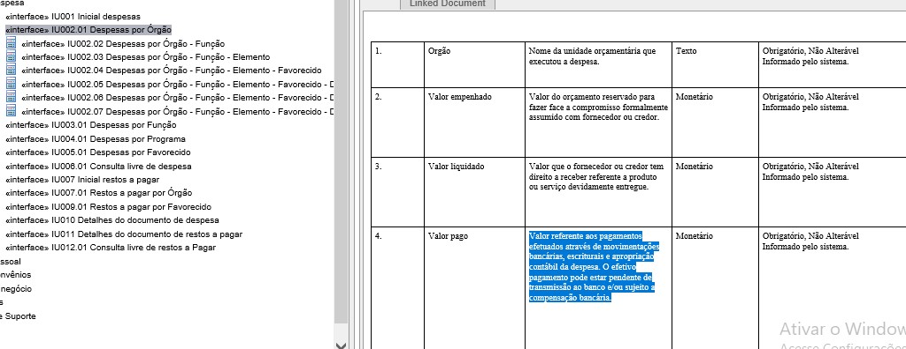

---

  Diárias OK

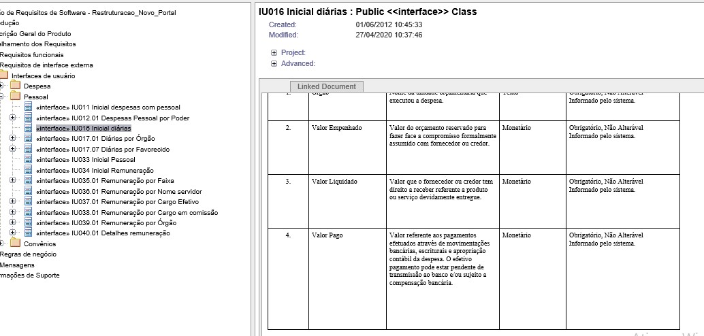

   

__2. Alterar o texto e descrição das colunas "Data" e "Número de Documento"__

Alterar o texto e descrição do _tooltip_ das colunas "Data" e " Número do documento":

 __Situação 1:__ ao clicar em [Valor Empenhado](http://www.transparencia.mg.gov.br/despesa-estado/despesa/despesa-orgaos/2020/01-01-2020/31-12-2020/4009/1910/457/20/42/1264408/2771/empenhado), o próximo nível deverá apresentar a informação:

  - Data de Registro (no lugar de Data): Data de registro do documento de empenho.

  - Número do Empenho (no lugar de Número Documento): Número de identificação do documento de empenho.

__DESPESA__

Dados corretos

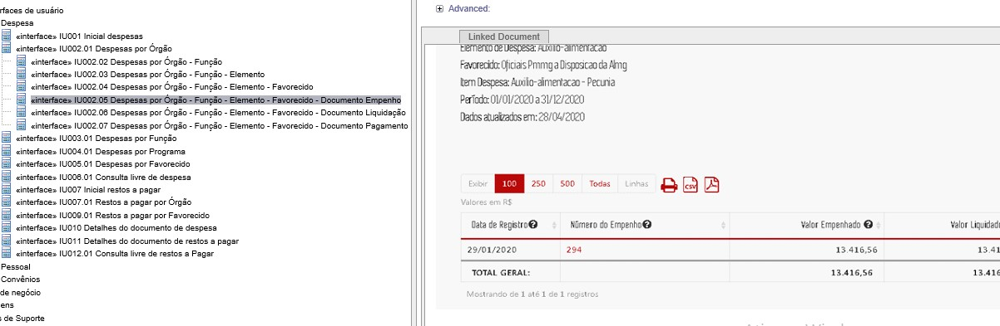

O nome na tabela lista está incorreto. O nome deve ser [Número do empenho]
--
__A correção deve ser aplicada em todas as consultas e em todos os niveis.__
--
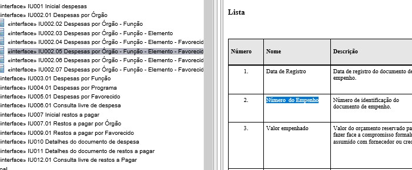

__DIÁRIAS__

O nome da coluna está incorreto na tabela e na descrição. O correto é  [*Número do Empenho*]
--
__A correção deve ser aplicada em todas as consultas e em todos os niveis.__
--
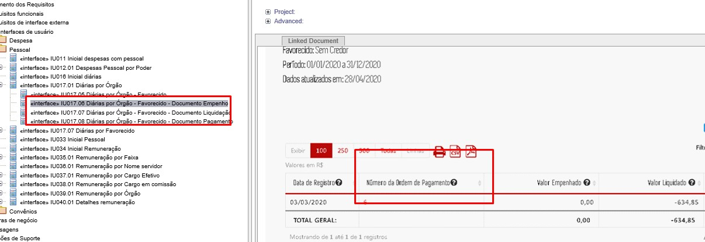

---
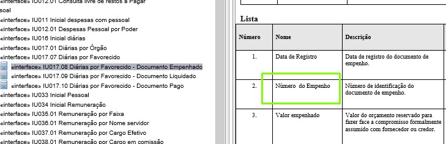

__Situação 2:__ ao clicar em [Valor Liquidado](http://www.transparencia.mg.gov.br/despesa-estado/despesa/despesa-orgaos/2020/01-01-2020/31-12-2020/4009/1910/457/20/42/1264408/2771/liquidado), o próximo nível deverá apresentar a informação:

  - Data do Registro (no lugar de Data): Data de registro do documento de liquidação.

  

__DESPESA__

__OK__
  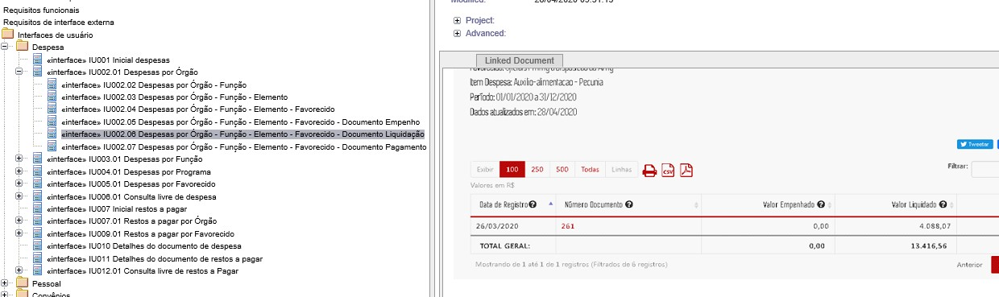

A descrição do nome Data de registro está incorreto. O correto é [*Data de registro do documento de liquidação*]. __CORRIGIDO__

A correção deve ser aplicada em todas as consultas e em todos os niveis.__CORRIGIDO__

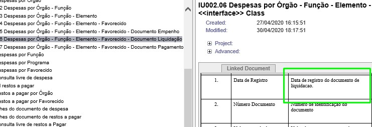

__DIÁRIAS__

__OK__

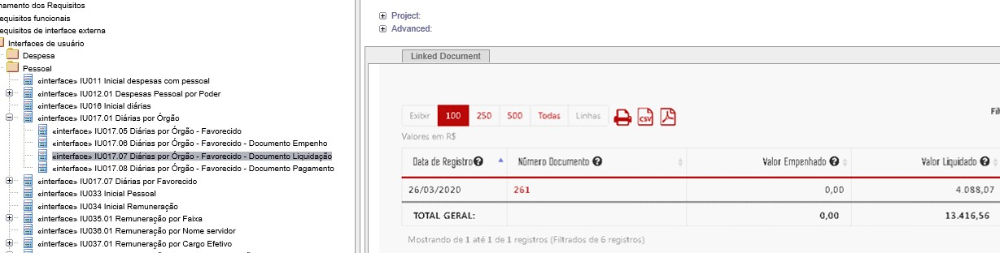

A descrição do nome Data de registro está incorreto. O correto é [*Data de registro do documento de liquidação*].<__CORRIGIDO__>

A correção deve ser aplicada em todas as consultas e em todos os niveis. <__CORRIGIDO__>

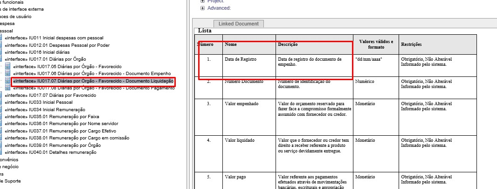

__Situação 3:__ ao clicar em [Valor Pago](http://www.transparencia.mg.gov.br/despesa-estado/despesa/despesa-orgaos/2020/01-01-2020/31-12-2020/4009/1910/457/20/42/1264408/2771/pago), o próximo nível deverá apresentar a informação:

  - Data de Registro (no lugar de Data): Data de registro da ordem de pagamento.

  - Número da Ordem Pagamento (no lugar de Número Documento): Número de identificação do documento da ordem de pagamento.

DESPESA

__OK__

  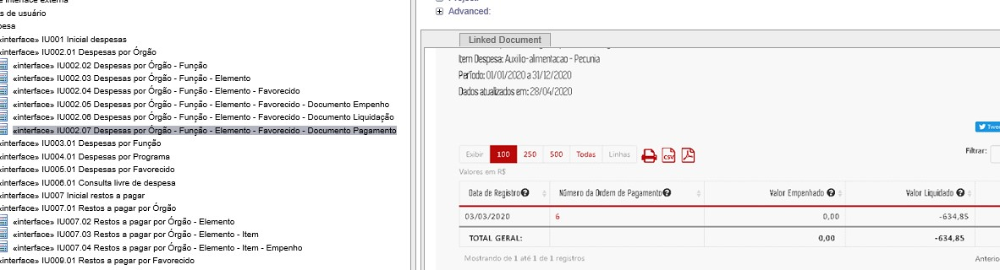

A descrição do nome [Data de registro] e [Número da Ordem de Pagamento] estão incorretos.
--

**O correto é:**

* Data de Registro [*Data de registro da ordem de pagamento*] <__CORRIGIDO__>

Número da Ordem de Pagamento [*Número de identificação do documento da ordem de pagamento*]. <__O TEXTO AINDA ESTÁ INCORRETO__>
--

__A correção deve ser aplicada em todas as consultas e em todos os niveis.__
--
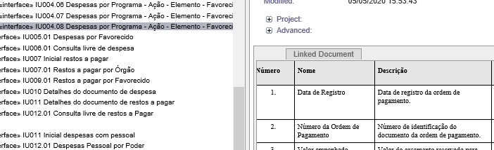

__DIÁRIAS__

__OK__

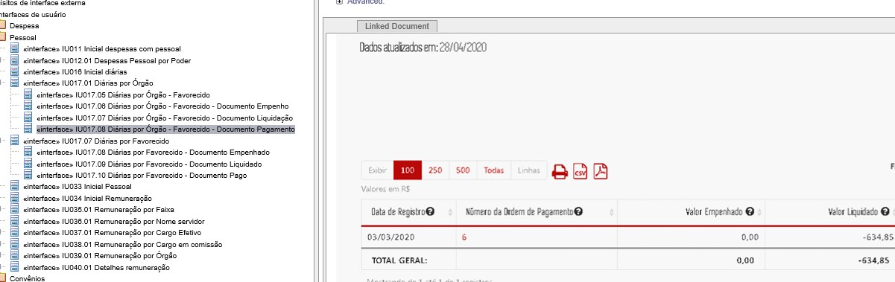

A descrição do nome [Data de registro] e [Número da Ordem de Pagamento] estão incorretos.
--

**O correto é:**

* Data de Registro [*Data de registro da ordem de pagamento*] <__CORRIGIDO__>

Número da Ordem de Pagamento [*Número de identificação do documento da ordem de pagamento*]. __O texto ainda está errado__
--

__A correção deve ser aplicada em todas as consultas e em todos os niveis.__
--

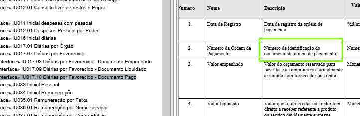

__3. Alteração do Formulário de Detalhamento__

Ao clicar no [Número do documento do Empenho, Número Documento Liquidação ou Número do Documento Pagamento](http://www.transparencia.mg.gov.br/despesa-estado/despesa/despesa-orgaos/2020/01-01-2020/31-12-2020/4009/1910/457/20/42/1264408/2771/empenhado/16/12589445/0/0), o próximo nível deverá apresentar a informação:

* Substituir o texto "Data" para "Data Registro" no formulário de liquidação e pagamento (sem alteração na extração de dados no Armazém);

* Incluir a coluna de "Situação da Ordem de Pagamento" no formulário de pagamento (após a coluna data de registro).

DESPESA

__OK__

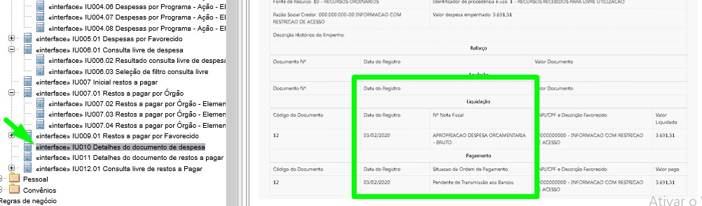

DIÁRIAS

 Conforme Caso de Uso CDU002.03 Consultar pessoal – Despesas com Diárias em Requisitos funcionais > Casos de Uso, a interface de detalhamento de despesa é acessada pela consulta de diárias, pois ambas consultas compartilham o mesmo formato de detalhamento.
--

## Consulta Restos a Pagar

__1. Alterar descrição do campo "Valor Pago no Ano"__

Alterar a descrição do _tooltip_ da coluna "valor pago no ano" da consulta de Restos a Pagar:

  - __Valor Pago no Ano:__ Soma do valor de restos a pagar processados e não processados referentes aos pagamentos efetuados através de movimentações bancárias, escriturais e apropriação contábil da despesa. O efetivo pagamento pode estar pendente de transmissão aos bancos e/ou sujeito a compensação bancária.

OK Conceito alterado em todas as tabelas
--
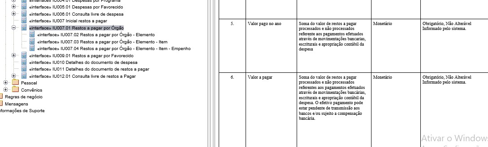

__2. Formulário de Detalhamento__

No [Formulário de Detalhamento da Consulta de Restos a pagar](http://transparencia.mg.gov.br/despesa-estado/restos-a-pagar/restospagar-orgaos/2019/3853/546/42/20/3065/130/58/5933374) será alterada a mesma informação já especificada para a consulta de Despesas e Diárias, que é:

1. Substituir o texto "Data" para "Data Registro" (sem alteração na extração de dados no Armazém);

2. Incluir a coluna de "Situação da Ordem de Pagamento" no formulário de pagamento (após a coluna data de registro).

__OK__
--
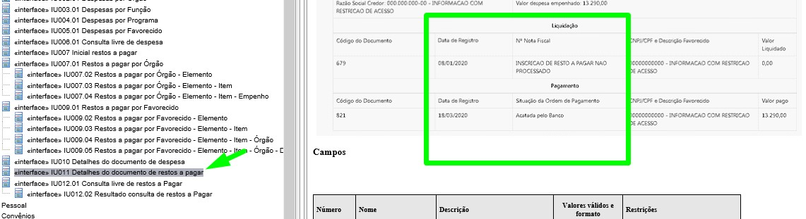

## Consulta Convênios de Saída

__1. Alterar descrição do campo "Valor Repassado pelo Concedente/Órgão ou Entidade Estadual Parceiro"__

Alterar a descrição do _tooltip_ da coluna "valor Repassado pelo Concedente/Órgão ou Entidade Estadual Parceiro":

  * __Valor Repassado pelo Concedente/Órgão ou Entidade Estadual Parceiro:__ Valor financeiro repassado pelo concedente/órgão ou entidade estadual parceiro ao convenente / Organização da Sociedade Civil (OSC) parceria, referente ao(s) convênios(s)/ parceria(s) firmado(s) entre as partes por meio de pagamento via SIAFI. Abrange o valor do concedente / órgão ou entidade estadual parceiro, das emendas parlamentares e outras fontes. O efetivo pagamento pode estar sujeito a compensação bancária.

<kbd>A alteração será aplicada em todos os níveis da consulta? Não identifiquei os demais niveis na documentação.</kbd>

Resposta Luiz:

_"O formato da documentação realizada na época é diferenciado, não apresentando os níveis da consulta. Entretanto, a alteração será aplicada em todos os níveis, principalmente pelo fato de que o glossário interativo é uma informação centralizada na aplicação.'_'

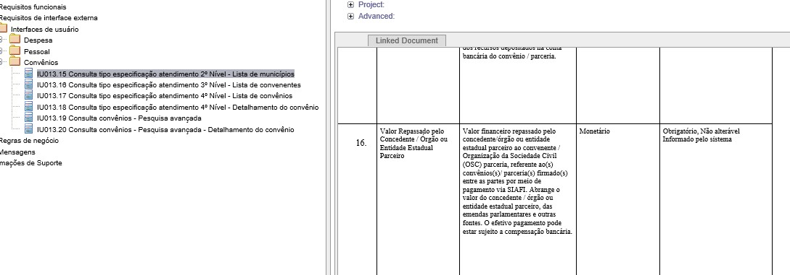

__2. Alterar Formulário de Detalhamento__

Para obter o real valor repassado deve-se utilizar a fórmula: (Valor Pago Financeiro - Valor Pago pendente =  Valor repassado) conforme campos do armazém BO.

Campos do Armazém BO:

Exemplos:

Dados disponíveis no Portal de Transparência atualmente:

O Portal apresenta como repassado o valor total de R$ 35.000,00 no entanto, conforme consta no SIAFI transacional o valor encontra-se __"pendente para o banco- aguardando assinatura digital"__. Com as novas regras o Portal deve apresentar o valor efetivamente repassado (Valor Pago Financeiro - Valor Pago pendente).

## Observação

De acordo com informações da SEF, as variáveis _[Situação Ordem de Pagamento - Descrição]_ e _[Valor Pago Pendente]_ sofrem diversas alterações ao longo do exercício. O processo de carga utilizado, especialmente se possuir natureza incremental, deve garantir que os valores das variáveis estejam sendo atualizados.
