| Título| Contrato manutenção|Proposta Comercial|Mantis|Versão html
| -|-|-|-|-|
|Homologação do layout - Memória do valor pago| nº 15210010062019 (INF. 3951)|626584/19|0146649|[link](http://htmlpreview.github.io/?https://raw.githubusercontent.com/transparencia-mg/especificacoes-portal-transparencia/master/espec011_valor_pago/espec011_valor-pago-homologa-layout.html)

# Homologação do layout da Memória do valor pago

#### Consultas:
* Despesa
* Restos a Pagar
* Diárias
* Convênios de Saída

Todas as divergências estão destacadas em vermelho
--
  

# Especificação

## Consulta Despesa e Diárias

__1. Alterar descrição do campo "Valor Pago"__

Alterar a descrição do _tooltip_ da coluna Valor Pago:

* __Valor Pago:__ Valor referente aos pagamentos efetuados através de movimentações bancárias, escriturais e apropriação contábil da despesa. O efetivo pagamento pode estar pendente de transmissão ao banco e/ou sujeito a compensação bancária.

Consulta de Despesas
--

CONFERE
--
A alteração foi aplicada em todos os níveis

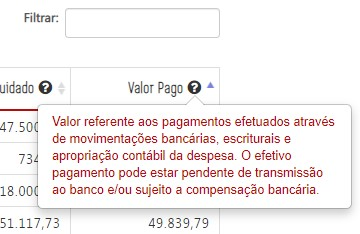

  

Consulta de Diárias
--
<s>A alteração **não** foi aplicada </s> - __CORRIGIDO__

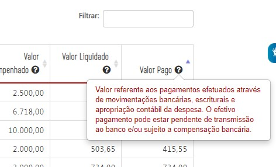

  

__2. Alterar o texto e descrição das colunas "Data" e "Número de Documento"__

Alterar o texto e descrição do _tooltip_ das colunas "Data" e " Número do documento":

 __Situação 1:__ ao clicar em [Valor Empenhado](), o próximo nível deverá apresentar a informação:

  - Data de Registro (no lugar de Data): Data de registro do documento de empenho.

  - Número do Empenho (no lugar de Número Documento): Número de identificação do documento de empenho.

  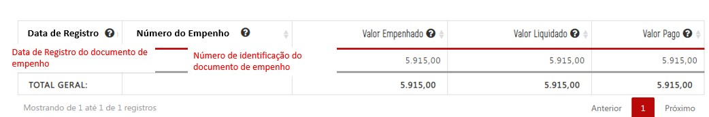

Consulta de Despesas
--
<s>Dados não alterados (nome e tooltip)</s> - __CORRIGIDO__

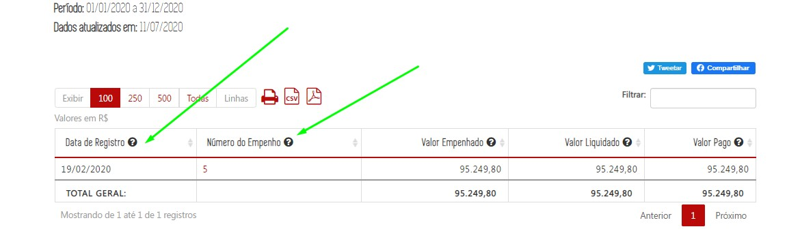

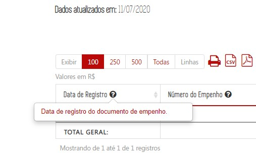

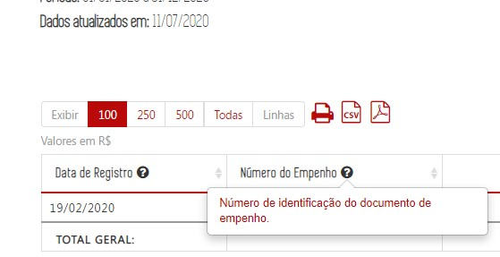

Consulta de Diárias
--
__CONFERE__
--
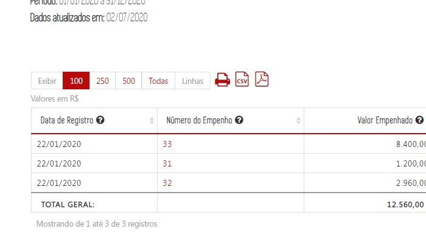

---

__CONFERE__

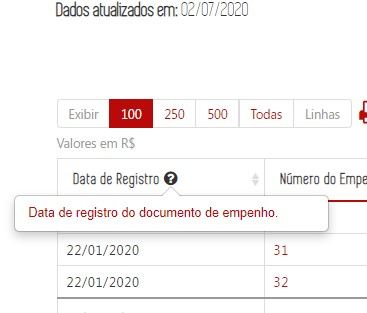
---

__CONFERE__

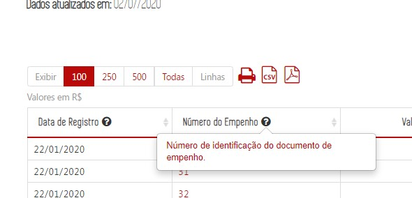

__Situação 2:__ ao clicar em [Valor Liquidado](), o próximo nível deverá apresentar a informação:

  - Data do Registro (no lugar de Data): Data de registro do documento de liquidação.

  - Número do documento: Número de identificação do documento

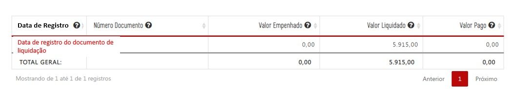

Consulta de Despesas
--
<s>Dados **não** alterados (nome e tooltip)</s> - __CORRIGIDO__

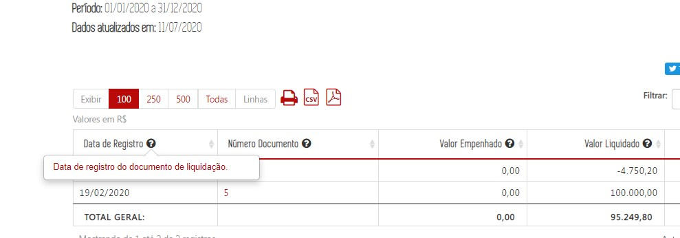

Despesa
--

Ficou pendente a correção do tooltip do campo "Número do documento" ao clicar no **VALOR LIQUIDADO**
--
**Número do documento**: Número de identificação do documento
--

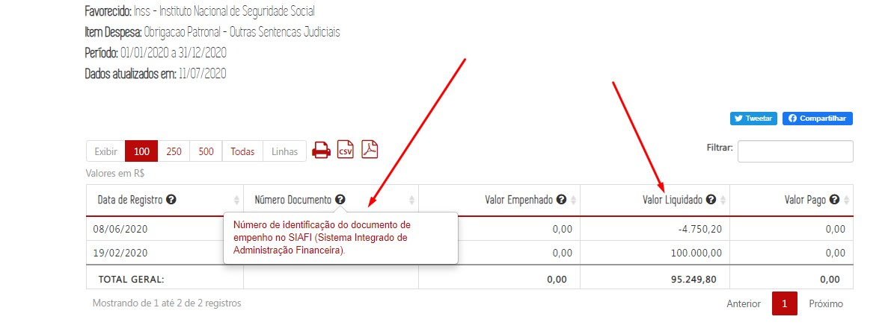

Consulta de Diárias
--
__CONFERE__

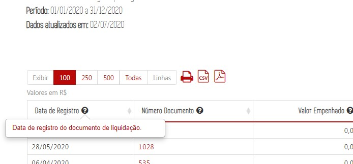

Consulta de Diárias
--

<s>Alterar o tooltip do campo "Número do Documento" para: Número de identificação do documento</s> __CORRIGIDO__

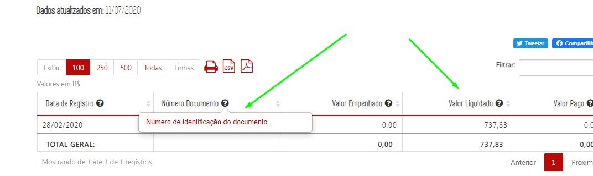
---

__Situação 3:__ ao clicar em [Valor Pago](), o próximo nível deverá apresentar a informação:

  - Data de Registro (no lugar de Data): Data de registro da ordem de pagamento.

  - Número da Ordem Pagamento (no lugar de Número Documento): Número de identificação do documento da ordem de pagamento.

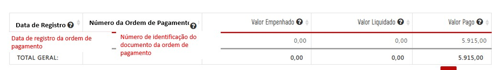

Consulta de Despesas
--
<s>Dados **não** alterados (nome e tooltip)</s> - __CORRIGIDO__

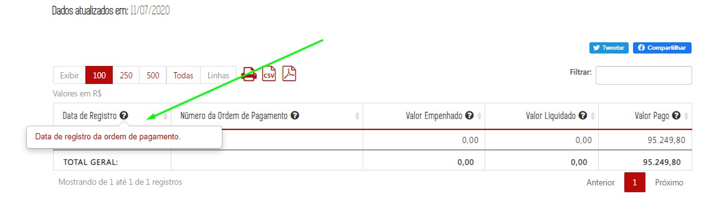

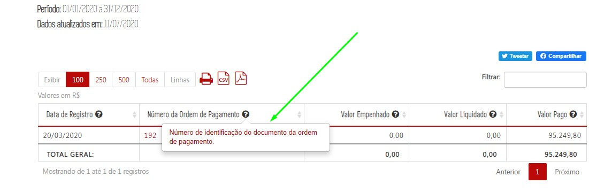

Consulta de Diárias
--
__CONFERE__

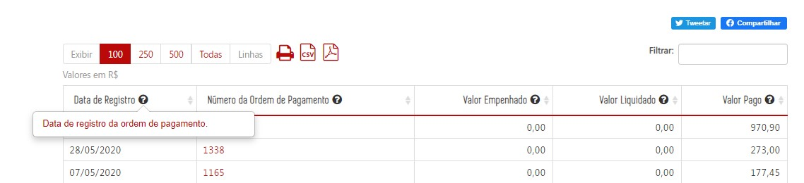

---
__CONFERE__

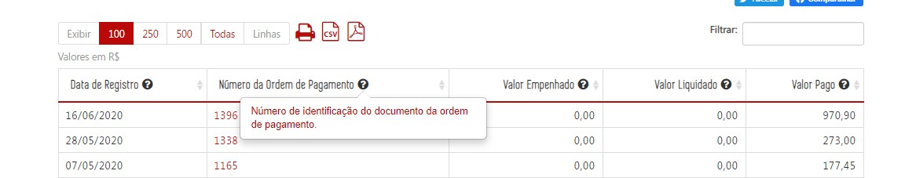

__3. Alteração do Formulário de Detalhamento__

Ao clicar no [Número do documento do Empenho, Número Documento Liquidação ou Número do Documento Pagamento](), o próximo nível deverá apresentar a informação:

* Substituir o texto "Data" para "Data Registro" no formulário de liquidação e pagamento (sem alteração na extração de dados no Armazém);

* Incluir a coluna de "Situação da Ordem de Pagamento" no formulário de pagamento (após a coluna data de registro).

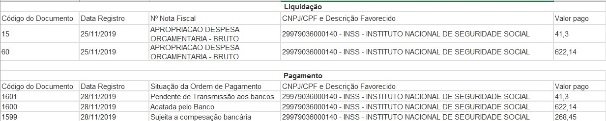

Consulta de Despesas
--
CONFERE

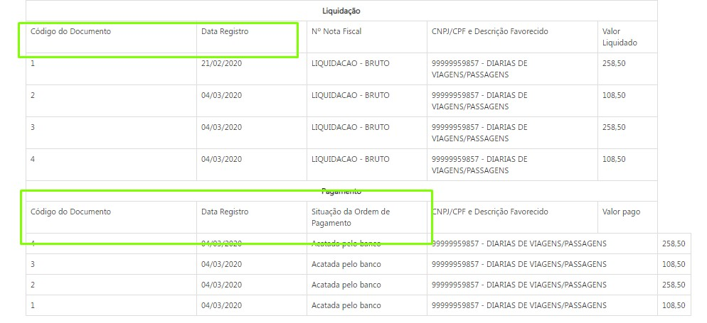

Consulta de Despesas
--
Corrigir a formatação da tabela de pagamento - __Não corrigido__
--

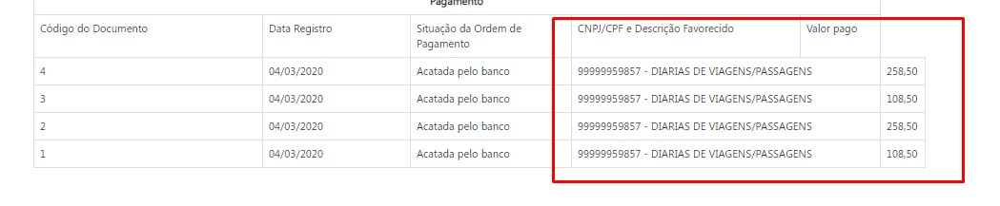

Consulta de Diárias
--
<s>A alteração dos campos estão OK, no entanto a tabela está desconfigurada</s> - __CORRIGIDO  FORMULÁRIO DE EMPENHO__

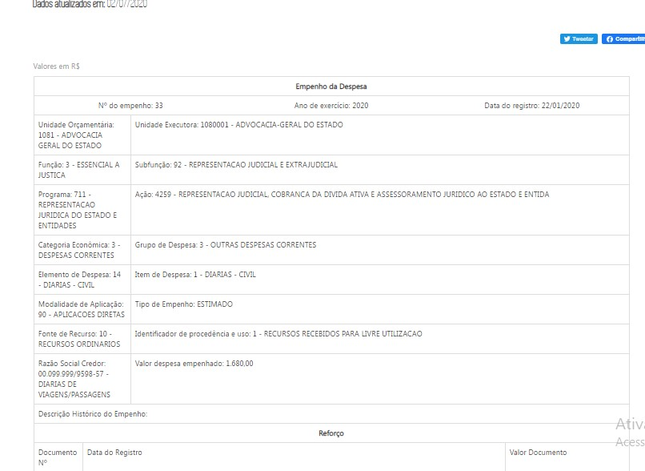

DIÁRIAS
--

Corrigir formatação do formulário de pagamento
--

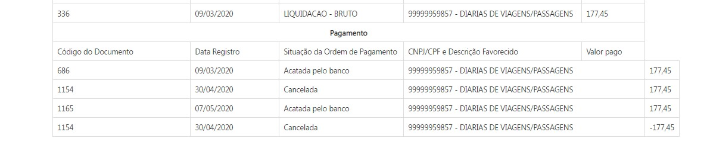

__CONFERE__

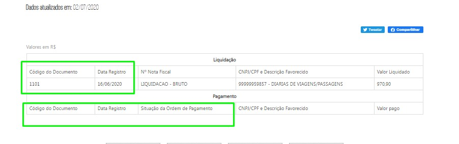

## Consulta Restos a Pagar

__1. Alterar descrição do campo "Valor Pago no Ano"__

Alterar a descrição do _tooltip_ da coluna "valor pago no ano" da consulta de Restos a Pagar:

  - __Valor Pago no Ano:__ Soma do valor de restos a pagar processados e não processados referentes aos pagamentos efetuados através de movimentações bancárias, escriturais e apropriação contábil da despesa. O efetivo pagamento pode estar pendente de transmissão aos bancos e/ou sujeito a compensação bancária.

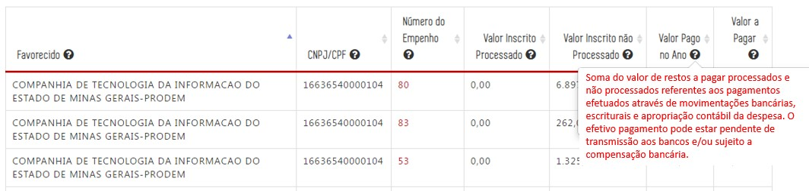

Não alterado a descrição do tooltip
--

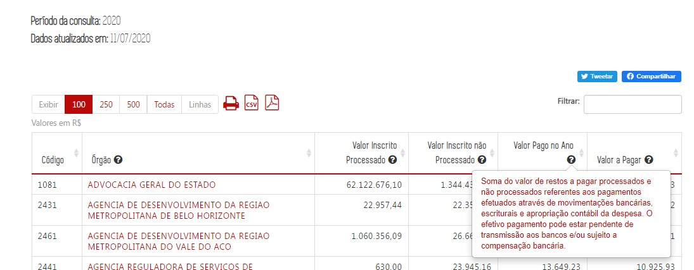

__2. Formulário de Detalhamento__

No [Formulário de Detalhamento da Consulta de Restos a pagar]() será alterada a mesma informação já especificada para a consulta de Despesas e Diárias, que é:

1. Substituir o texto "Data" para "Data Registro" (sem alteração na extração de dados no Armazém);

2. Incluir a coluna de "Situação da Ordem de Pagamento" no formulário de pagamento (após a coluna data de registro).

RESTOS A Pagar
--

Corrigir formatação - __NÃO CORRIGIDO__
--

## Consulta Convênios de Saída

__1. Alterar descrição do campo "Valor Repassado pelo Concedente/Órgão ou Entidade Estadual Parceiro"__

Alterar a descrição do _tooltip_ da coluna "valor Repassado pelo Concedente/Órgão ou Entidade Estadual Parceiro":

  * __Valor Repassado pelo Concedente/Órgão ou Entidade Estadual Parceiro:__ Valor financeiro repassado pelo concedente/órgão ou entidade estadual parceiro ao convenente / Organização da Sociedade Civil (OSC) parceria, referente ao(s) convênios(s)/ parceria(s) firmado(s) entre as partes por meio de pagamento via SIAFI. Abrange o valor do concedente / órgão ou entidade estadual parceiro, das emendas parlamentares e outras fontes. O efetivo pagamento pode estar sujeito a compensação bancária.

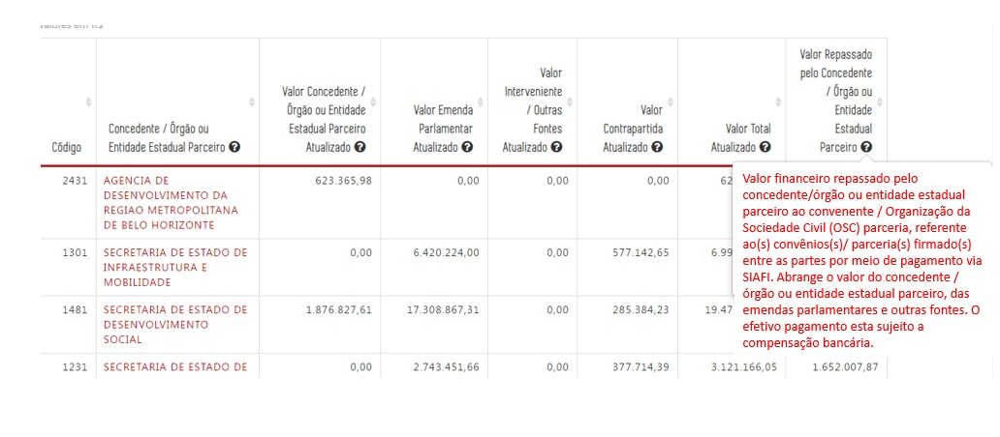

CONFERE
--
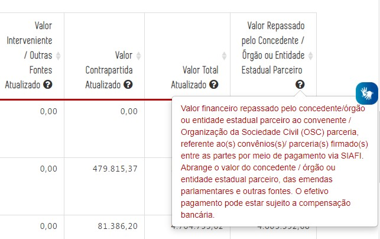

__2. Alterar Formulário de Detalhamento__

Para obter o real valor repassado deve-se utilizar a fórmula: (Valor Pago Financeiro - Valor Pago pendente =  Valor repassado) conforme campos do armazém BO.

Campos do Armazém BO:
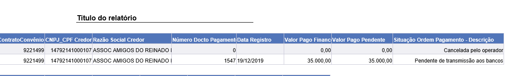

Exemplos:

Dados disponíveis no Portal de Transparência atualmente:

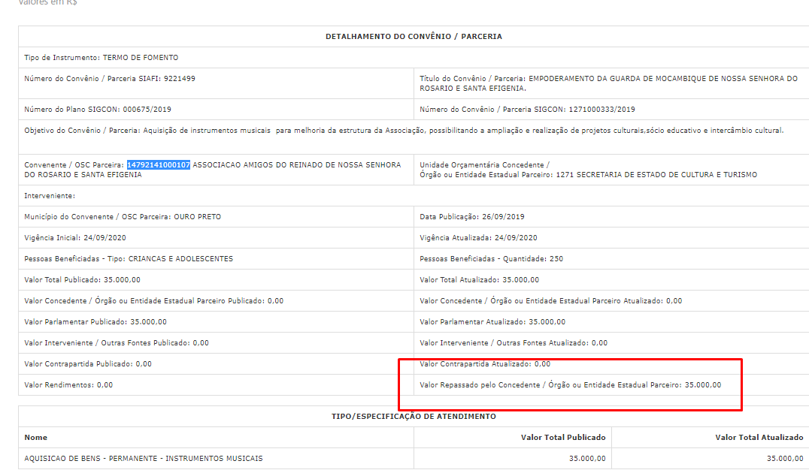

O Portal apresenta como repassado o valor total de R$ 35.000,00 no entanto, conforme consta no SIAFI transacional o valor encontra-se __"pendente para o banco- aguardando assinatura digital"__. Com as novas regras o Portal deve apresentar o valor efetivamente repassado (Valor Pago Financeiro - Valor Pago pendente).

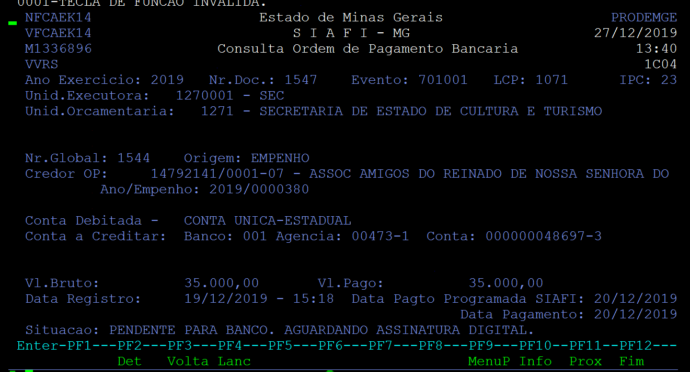

## Observação

De acordo com informações da SEF, as variáveis _[Situação Ordem de Pagamento - Descrição]_ e _[Valor Pago Pendente]_ sofrem diversas alterações ao longo do exercício. O processo de carga utilizado, especialmente se possuir natureza incremental, deve garantir que os valores das variáveis estejam sendo atualizados.
