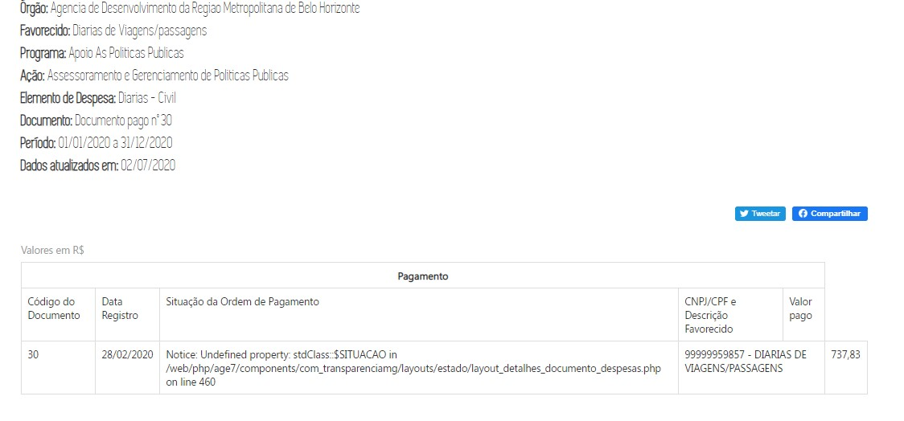

| Título| Homologação de valores - Memória do valor pago
| -|:-
|__Contrato manutenção__ | nº 15210010062019 (INF. 3951)
|__Proposta Comercial__ | nº 626584/19
|__Mantis__ |nº 0146649
|__Versão html__ |[link]()

# Homologação de valores da Memória do valor pago

#### Consultas:
* Despesa
* Restos a Pagar
* Diárias
* Convênios de Saída

Todas as divergências estão destacadas em vermelho - data de acesso ao armazém 02/07/2020
--
  

# Especificação

## Consulta Despesa e Diárias

Consulta Despesa
--
Os valores estão duplicados no resultado da consulta
--

  

__CONFERE__

---
__CONFERE__

  

Consulta Diárias
--
O resultado apresenta erros, não é possível realizar a conferência
--

## Consulta Restos a Pagar

__CONFERE__

## Consulta Convênios de Saída

__CONFERE__

