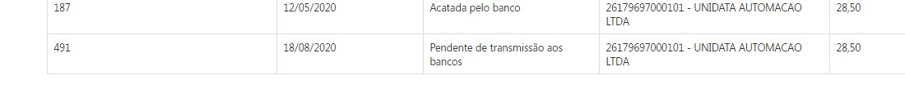
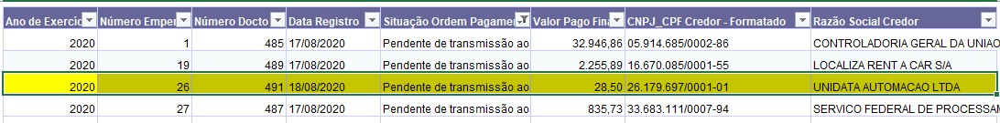
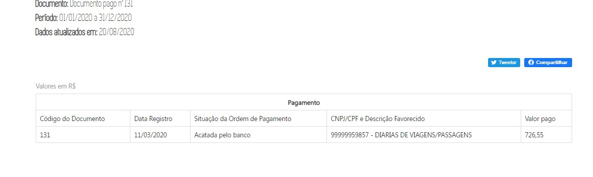
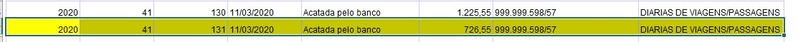
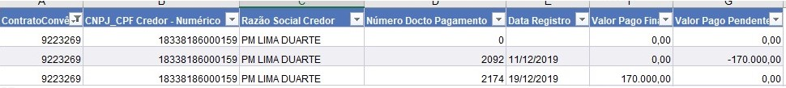
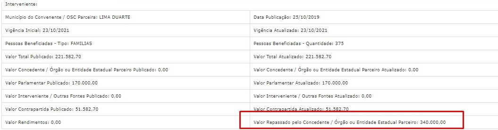

|Título| Contrato manutenção |Proposta Comercial| Mantis |Versão html
| -|:-| -|:-| -|
| Homologação de valores produção- Memória do valor pago| 15210010062019 (INF. 3951)| 626584/19|0146649| [link]()|

# Homologação de valores da Memória do valor pago no ambiente de produção

#### Consultas:
* Despesa
* Restos a Pagar
* Diárias
* Convênios de Saída

# Especificação

## Consulta Despesa e Diárias

Consulta Despesa

Consulta Diárias
--

## Consulta Convênios de Saída

Quando o convênio apresenta alguma OP cancelada o valor pago pendente permanece no sistema(BO-SIAFI), assim faz com que ao realizar o cálculo (Valor Pago Financeiro - Valor Pago Pendente) o portal exiba o valor duplicado.

Exemplo  
* OP 2092 (11/12/2019) Foi realizado o Pagamento  
* OP 2092 (18/12/2019) Essa OP foi cancelada e o valor no BO permaneceu como - R$170.000,00  
* OP 2174 (19/12/2019) Foi paga normalmente

O Porta está apresentando como valor repassado o valor de R$ 340.000,00

Luiz, favor analisar o banco e verificar se é possível simplesmente zerar o valor pendente que não tiver valor pago associado. Caso essa não seja a solução mais viável, como podemos nos proceder?

[LINK](http://transparencia.mg.gov.br/convenios/convenios-de-saida/convenios-conslivre-detalhesconv/2019/01-01-2019/31-12-2019/55767)

