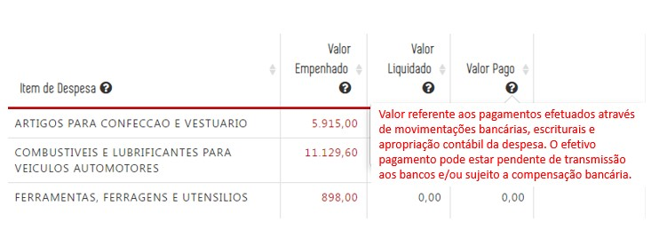

# Visão Geral da Intervenção

Essa demanda visa adequar no Portal da Transparência a forma de divulgação de informações sobre pagamentos de despesas. Mais especificamente

* alteração do formulário de detalhamento (opção pagamento);
* alteração do nome das tabelas;
* alteração da conceito dos _tooltips_ das consultas de despesa, restos a pagar e diárias;
* alteração do cálculo do valor repassado na consulta de convênios

As variáveis _[Situação Ordem de Pagamento - Descrição]_ e _[Valor Pago Pendente]_ do assunto `EXECUÇÃO ORÇAMENTÁRIA DA DESPESA / DESPESA REALIZADA` deverão ser extraídas do Armazém SIAFI para viabilizar as alterações definidas nesta especificação.

# Motivação / Contexto da Intervenção

De acordo com o [art. 64 da Lei 4320/1964](http://www.planalto.gov.br/ccivil_03/leis/l4320.htm#art64), a ordem de pagamento é o despacho exarado por autoridade competente, determinando que a despesa seja paga. O pagamento da despesa consiste na transferência de recursos financeiros a terceiros, encerrando a obrigação existente entre as partes.

De maneira geral, entre o registro da ordem de pagamento (OP) e o seu pagamento efetivo a OP irá percorrer as seguintes etapas:

1. Pendente de assinatura digital;
1. Pendente de transmissão aos bancos;
1. Pendente de [compensação bancária](https://contaembanco.com.br/servicos/quais-sao-os-prazos-de-compensacao-bancaria/);
1. Pendente de confirmação da compensação bancária.

Atualmente o Portal da Transparência divulga uma OP enquanto valor pago no momento de seu registro. Isso ocorre nas consultas de despesa, diárias, restos a pagar, e convênios de saída.

Ou seja, o Portal divulga uma despesa como paga que potencialmente não percorreu todas as etapas de pagamento, como, por exemplo, assinatura pelo ordenador de despesa, transmissão ao banco e compensação bancária.

Essa situação gera dúvidas para os credores sobre o efetivo depósito dos valores registrados no Portal como pagos, sendo motivo de questionamentos recorrentes à equipe gestora do Portal da Transparência, inclusive por parte de órgãos estaduais.

Além disso, não existe clareza sobre o significado da data de pagamento informada nas diversas consultas do Portal.

## Observação

Conforme informado pela Diretoria Central de Governança do Sistema - SEF o campo _[Situação Ordem de Pagamento - Descrição]_ do armazém SIAFI foi tratado em 2019 para permitir que a informação seja extraída de apenas uma [tabela](static/static/espec-SEF-situacao-ordem-pagamento.docx).

Ainda segundo essa Diretoria, o campo _[Valor Pago Pendente]_ (campo que será utilizado na nova regra da consulta de convênios de saída) são tratadss as situações: transmitida ao banco – pendente de Confirmação e pendente de transmissão aos bancos.

# Especificação

## Consulta Despesa e Diárias

__1. Alterar descrição do campo "Valor Pago"__

Alterar a descrição do _tooltip_ da coluna Valor Pago:

* __Valor Pago:__ Valor referente aos pagamentos efetuados através de movimentações bancárias, escriturais e apropriação contábil da despesa. O efetivo pagamento pode estar pendente de transmissão ao banco e/ou sujeito a compensação bancária.

__2. Alterar o texto e descrição das colunas "Data" e "Número de Documento"__

Alterar o texto e descrição do _tooltip_ das colunas "Data" e " Número do documento":

 __Situação 1:__ ao clicar em [Valor Empenhado](http://www.transparencia.mg.gov.br/despesa-estado/despesa/despesa-orgaos/2020/01-01-2020/31-12-2020/4009/1910/457/20/42/1264408/2771/empenhado), o próximo nível deverá apresentar a informação:

  - Data de Registro (no lugar de Data): Data de registro do documento de empenho.

  - Número do Empenho (no lugar de Número Documento): Número de identificação do documento de empenho.

  

__Situação 2:__ ao clicar em [Valor Liquidado](http://www.transparencia.mg.gov.br/despesa-estado/despesa/despesa-orgaos/2020/01-01-2020/31-12-2020/4009/1910/457/20/42/1264408/2771/liquidado), o próximo nível deverá apresentar a informação:

  - Data do Registro (no lugar de Data): Data de registro do documento de liquidação.

  

__Situação 3:__ ao clicar em [Valor Pago](http://www.transparencia.mg.gov.br/despesa-estado/despesa/despesa-orgaos/2020/01-01-2020/31-12-2020/4009/1910/457/20/42/1264408/2771/pago), o próximo nível deverá apresentar a informação:

  - Data de Registro (no lugar de Data): Data de registro da ordem de pagamento.

  - Número da Ordem Pagamento (no lugar de Número Documento): Número de identificação do documento da ordem de pagamento.

__3. Alteração do Formulário de Detalhamento__

Ao clicar no [Número do documento do Empenho, Número Documento Liquidação ou Número do Documento Pagamento](http://www.transparencia.mg.gov.br/despesa-estado/despesa/despesa-orgaos/2020/01-01-2020/31-12-2020/4009/1910/457/20/42/1264408/2771/empenhado/16/12589445/0/0), o próximo nível deverá apresentar a informação:

* Substituir o texto "Data" para "Data Registro" no formulário de liquidação e pagamento (sem alteração na extração de dados no Armazém);

* Incluir a coluna de "Situação da Ordem de Pagamento" no formulário de pagamento (após a coluna data de registro).

## Consulta Restos a Pagar

__1. Alterar descrição do campo "Valor Pago no Ano"__

Alterar a descrição do _tooltip_ da coluna "valor pago no ano" da consulta de Restos a Pagar:

  - __Valor Pago no Ano:__ Soma do valor de restos a pagar processados e não processados referentes aos pagamentos efetuados através de movimentações bancárias, escriturais e apropriação contábil da despesa. O efetivo pagamento pode estar pendente de transmissão aos bancos e/ou sujeito a compensação bancária.

__2. Formulário de Detalhamento__

No [Formulário de Detalhamento da Consulta de Restos a pagar](http://transparencia.mg.gov.br/despesa-estado/restos-a-pagar/restospagar-orgaos/2019/3853/546/42/20/3065/130/58/5933374) será alterada a mesma informação já especificada para a consulta de Despesas e Diárias, que é:

1. Substituir o texto "Data" para "Data Registro" (sem alteração na extração de dados no Armazém);

2. Incluir a coluna de "Situação da Ordem de Pagamento" no formulário de pagamento (após a coluna data de registro).

## Consulta Convênios de Saída

__1. Alterar descrição do campo "Valor Repassado pelo Concedente/Órgão ou Entidade Estadual Parceiro"__

Alterar a descrição do _tooltip_ da coluna "valor Repassado pelo Concedente/Órgão ou Entidade Estadual Parceiro":

  * __Valor Repassado pelo Concedente/Órgão ou Entidade Estadual Parceiro:__ Valor financeiro repassado pelo concedente/órgão ou entidade estadual parceiro ao convenente / Organização da Sociedade Civil (OSC) parceria, referente ao(s) convênios(s)/ parceria(s) firmado(s) entre as partes por meio de pagamento via SIAFI. Abrange o valor do concedente / órgão ou entidade estadual parceiro, das emendas parlamentares e outras fontes. O efetivo pagamento pode estar sujeito a compensação bancária.

__2. Alterar Formulário de Detalhamento__

Para obter o real valor repassado deve-se utilizar a fórmula: (Valor Pago Financeiro - Valor Pago pendente =  Valor repassado) conforme campos do armazém BO.

Campos do Armazém BO:

Exemplos:

Dados disponíveis no Portal de Transparência atualmente:

O Portal apresenta como repassado o valor total de R$ 35.000,00 no entanto, conforme consta no SIAFI transacional o valor encontra-se __"pendente para o banco- aguardando assinatura digital"__. Com as novas regras o Portal deve apresentar o valor efetivamente repassado (Valor Pago Financeiro - Valor Pago pendente).

## Observação

De acordo com informações da SEF, as variáveis _[Situação Ordem de Pagamento - Descrição]_ e _[Valor Pago Pendente]_ sofrem diversas alterações ao longo do exercício. O processo de carga utilizado, especialmente se possuir natureza incremental, deve garantir que os valores das variáveis estejam sendo atualizados.
