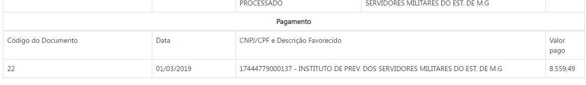
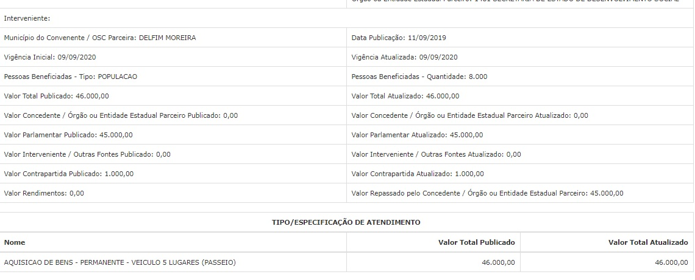
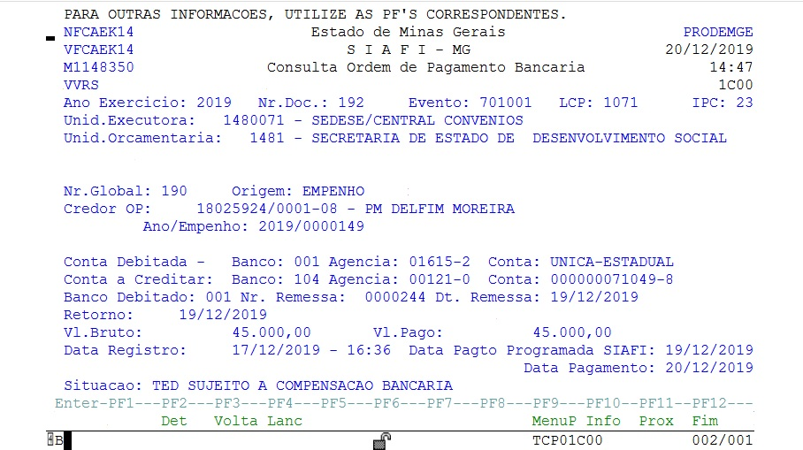
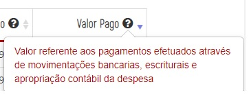
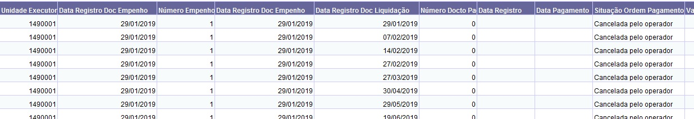
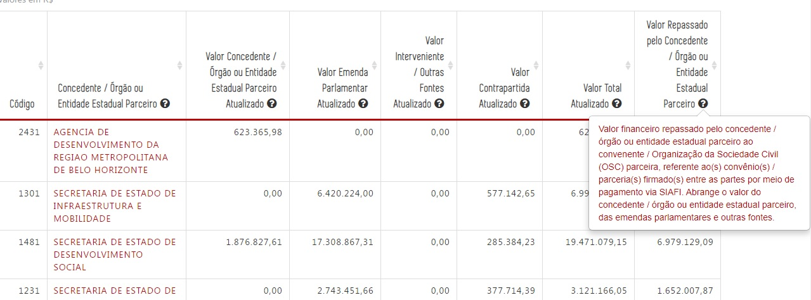
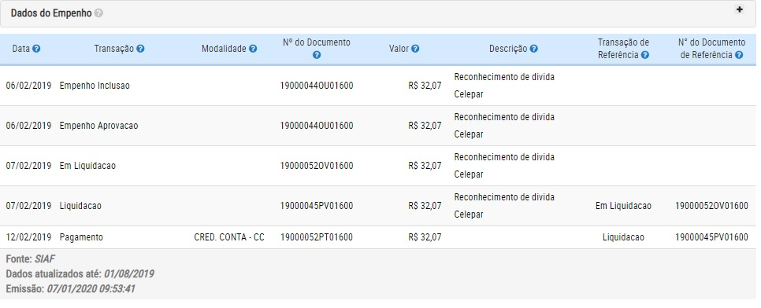
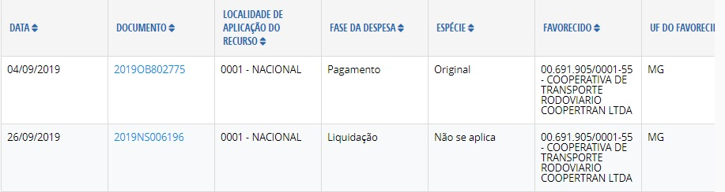

# Visão Geral da Intervenção

Essa demanda visa adequar no Portal da Transparência a regra de divulgação dos dados de pagamento, mais especificamente, a inclusão a Data de Pagamento no formulário de detalhamento da despesa. alteração do nome das tabelas e alteração da conceito do valor pago das consultas de Despesa, Diárias e Restos a Pagar.

A alteração também será realizada na consulta de Convênios, e será alterada a regra de extração dos dados para a divulgação dos valores pagos.

# Motivação / Contexto da Intervenção

De acordo com as regras de registro de Ordem de Pagamento (OP) no SIAFI é possível ocorrer diversas situações identificadas no armazém BO para o campo Situação Ordem de Pagamento, que são:

1. Paga
2. Acatada pelo banco
3. Pendente de transmissão aos bancos
4. Sujeita a compensação bancária
5. Quitada
6. Cancelada
7. Cancelada pelo operador
8. Cancelada -TED
9. Transmitida ao banco - Pendente de confirmação
10. Cancelada sem cancelamento do IRRP retido _TED_

Dentre essas situações, ressaltamos as situações 2 (acatada pelo banco), 3 (pendente de transmissão aos bancos) e situação 4 (sujeita a compensação bancária).

Atualmente, o Portal de Transparência apresenta os dados relativos a OP utilizando como variável para divulgação do valor pago a Data de Registro no SIAFI.

 Assim, o Portal divulga uma despesa como paga, mas que ainda não percorreu todas as etapas de pagamento, ou seja, assinatura pelo ordenador de despesa, transmissão ao banco e a compensação bancária, o que gera dúvidas para os credores sobre o efetivo depósito dos valores registrados no Portal como pagos.

 Para elucidar, trazemos um caso referente ao empenho 1387 (UE 1500002), OP 1599 consultado no SIAFI na data de 17/12/2019, cujo registro da OP ocorreu no dia 28/11/2019, com data de pagamento registrada no SIAFI para 29/11/2019.

E conforme tela do SIAFI, consta na Situação a informação de PENDENTE PARA BANCO. AGUARDANDO ASSINATURA DIGITAL.

Essa mesma OP consultada no Portal da Transparência consta como paga no formulário de detalhamento de despesa, desde o dia 28/11/2019 (código do documento 1599), no valor de R$268,45.

Assim, conforme exemplo acima, apesar de constar como paga no Portal da Transparência desde o dia 28/11/2019, a OP 1599 ainda não percorreu todas as etapas de pagamento.

A mesma situação ocorre na consulta de Restos a Pagar.
Exemplo é a consulta de restos a pagar referente ao Restos a Pagar 2018/3. Conforme tela do SIAFI a data de registro da OP ocorreu em 01/03/2019, mas o efetivo pagamento da despesa ocorreu em 07/03/2019.

No Portal da Transparênca, a mesma OP 22, consta que o pagamento foi realizado no 01/03/2019, quando na verdade, a data em que o valor foi acatado pelo banco ocorreu somente no dia 07/03/2019.

Outra consulta com impacto direto na divulgação de dados sobre o pagamento é a consulta de Convênios/Parcerias de Saída de Recursos, que diferentemente das demais consultas não possui a informação de Data de Registro da OP.

A regra adotada pelo Portal da Transparência para a Consulta de Convênios / Parcerias de Saída de Recursos é a mesma aplicada as demais consultas, que é a informação de valor repassado tendo como critério o Valor Pago Financeiro, Valor Pago Processado e Valor Pago Não Processado de acordo com a Data de Registro da OP, que traz para o Portal, a informação de valor repassado, mesmo que a despesa não tenha percorrido todas as suas fases.

[Convênios de Saída](static/conveniossaida.xls)

Como exemplo, temos o convênio 9220736, cuja OP 192 foi registrada no dia 17/12/2019, e com data de pagamento para 20/12/2019.

No entanto, conforme consulta ao armazém consta na Situação Ordem Pagamento - Descrição: Transmitida ao banco - pendente de confirmação. Essa situação indica que o depósito no valor de R$45.000,00 ainda não foi realizado na conta do convenente. Apesar do Portal da Transparência informar que o valor já foi repassado ao convenente.

A tela do SIAFI, confirma que o OP 192 ainda depende de compensação bancária, estando o depósito sujeita a confirmação pelo banco.

Assim, com o objetivo de melhorar a divulgação de dados sobre pagamentos, sugere-se a alteração no formulário de detalhamento da despesa (opções Empenho e Pagamento) para que apresente não somente a data de registro da OP, mas também a data de pagamento de uma determinada OP (paga, acatada pelo banco e sujeita a compensação bancária), respeitado o prazo de atualização de D+1 estabelecido pelo Decreto Federal n° 7.185, de 2010.

Além dessa alteração, sugere-se a alteração na descrição do valor pago que consta das colunas "Valor pago" das consultas de Despesa, Diária e Restos a Pagar, para que seja esclarecido a sociedade as situações que compõem o campo valor pago.

Atualmente, o glossário do portal e o tool tip trazem a seguinte definição: valor referente aos pagamentos efetuados através de movimentações bancárias, escriturais e apropriação contábil da despesa.

# Especificação

## Consulta Despesa e Diárias

### Descrição do Valor Pago

Alterar a descrição do TOOL TIP da coluna valor pago, que passará a exibir o seguinte texto ao passar o cursor sobre o ponto de interrogação:

- Valor referente aos pagamentos efetuados através de movimentações bancárias, escriturais e apropriação contábil da despesa. O efetivo pagamento pode estar pendente de assinatura do ordenador de despesa e/ou sujeito a compensação bancária.

**IMPORTANTE:**
1. Essas alterações aplicam-se as consultas de Despesas e Diárias.
2. Essas alterações aplicam-se a toda base de dados da consulta de Despesas e Diárias disponíveis no Portal da Transparência.

### Texto das colunas Data e Número de Documento

Visando adequar os textos das colunas de Data e Número do Documento sugere-se a alteração dos textos de empenho, liquidação e pagamento, com informação próxima ao que consta no armazém SIAFI.

Alterar o texto das [colunas](http://transparencia.mg.gov.br/despesa-estado/despesa/despesa-orgaos/2019/01-01-2019/31-12-2019/3853/1872/469/20/42/1648079/3075/empenhado) "DATA" e "NUMERO DO DOCUMENTO" das consultas de Despesas e Diárias.

**Situação 1:** ao clicar no "Valor Empenhado", o próximo nível deverá apresentar a informação:
- Data Empenho (no lugar de Data)
- Número Empenho (no lugar de Número Documento)

**Situação 2:** ao clicar no "Valor Liquidado", o próximo nível deverá apresentar a informação:
- Data Registro (no lugar de Data), e alterar o texto descritivo do TOOL TIP para "Data de registro da liquidação no SIAFI (Sistema Integrado de Administração Financeira)"
- Número Liquidação (no lugar de Número Documento) e alterar o texto descritivo do TOOL TIP para "Número de identificação da liquidação no SIAFI(Sistema Integrado de Administração Financeira)"

Alterar também a descrição dos TOOL TIP das colunas dna situação Valor Liquidado

**Situação 3:** ao clicar no "Valor Pago", o próximo nível deverá apresentar a informação:

- Data Registro (no lugar de Data) e alterar o texto descritivo do TOOL TIP para "Data de registro da ordem de pagamento no SIAFI (Sistema Integrado de Administração Financeira)"
- Número Ordem Pagamento (no lugar de Número Documento) e alterar o texto descritivo do TOOL TIP para "Número de identificação da ordem de pagamento no SIAFI(Sistema Integrado de Administração Financeira)"

**IMPORTANTE:**
1. Essas alterações aplicam-se as consultas de Despesas e Diárias.
2. Essas alterações aplicam-se a toda base de dados da consulta de Despesas e Diárias disponíveis no Portal da Transparência.

**Observação:**
Abaixo, indicamos as consultas realizadas no armazém SIAFI para cada alteração sugerida.

[Planilha Pagamentos](static/pagamentos_2019.xls)

### Formulário de Detalhamento de Despesa

No formulário de detalhamento da despesa, opções de empenho e pagamento, serão alteradas as seguintes informações:

1. Substituir o texto: "Data" para "Data Registro" (sem alteração na extração de dados no Armazém);

2. Incluir a coluna de "Data Pagamento" (após a coluna data de registro), que será preenchida quando ocorrer o preenchimento da variável data de pagamento em uma das seguintes "Situações Ordem Pagamento - Descrição" (somente a situações Ordem Pagamento, código 3):

  - Paga
  - Acatada pelo banco
  - Sujeita a compensação bancária

Importante ressaltar que serão consideradas apenas as data de pagamento com valores válidos. Informações em branco ou informações inválidas não serão trazidas para o portal.

[formulario_detalhamento_despesa](static/formulario_detalhamento_despesa.xls)

**IMPORTANTE:**
1. Essas alterações aplicam-se as consultas de Despesas e Diárias.
2. Essas alterações aplicam-se a toda base de dados da consulta de Despesas e Diárias disponíveis no Portal da Transparência.

## Consulta Restos a Pagar

### Formulário de Detalhamento de Despesa

No [Formulário de Detalhamento da Despesa](http://transparencia.mg.gov.br/despesa-estado/restos-a-pagar/restospagar-orgaos/2019/3853/546/42/20/3065/130/58/5933374) da Consulta de Restos a Pagar, será alterada a mesma informação já especificada para a consulta de Despesas e Diárias, que é:

1. Substituir o texto: "Data" para "Data Registro" (sem alteração na extração de dados no Armazém);

2. Incluir a coluna de Data de Pagamento (após a coluna data de registro), que será preenchida quando ocorrer o preenchimento da variável data de pagamento em uma das seguintes "Situações Ordem Pagamento - Descrição" (somente a situações Ordem Pagamento, código 3):

  - Paga
  - Acatada pelo banco
  - Sujeita a compensação bancária

Importante ressaltar que serão consideradas apenas as data de pagamento com valores válidos. Informações em branco ou informações inválidas não serão trazidas para o portal.

[Restos a Pagar](static/restosapagar.xls)

**IMPORTANTE:**
1. Essas alterações aplicam-se a toda base de dados da consulta de Restos a Pagar do Portal da Transparência.

### Descrição do Valor Pago no Ano

Alterar a descrição do TOOL TIP da coluna "valor pago no ano" da consulta de Restos a Pagar, que passará a exibir o seguinte texto ao passar o cursor sobre o ponto de interrogação:

- Soma do valor de restos a pagar processados e não processados referentes aos pagamentos efetuados através de movimentações bancárias, escriturais e apropriação contábil da despesa. O efetivo pagamento pode estar pendente de assinatura do ordenador de despesa e/ou sujeito a compensação bancária.

**IMPORTANTE:**
1. Essas alterações aplicam-se a toda base de dados da consulta de Restos a Pagar do Portal da Transparência.

## Consulta Convênios de Saída

### Descrição do Valor Repassado

Alterar a descrição do TOOL TIP da coluna "valor Repassado pelo Concedente/Órgão ou Entidade Estadual Parceiro" da consulta de Convênios/Parcerias Saída de Recursos, que passará a exibir o seguinte texto ao passar o cursor sobre o ponto de interrogação:

* __Valor Repassado pelo Concedente/Órgão ou Entidade Estadual Parceiro: Valor financeiro__: Valor repassado pelo concedente/órgão ou entidade estadual parceiro ao convenente / Organização da Sociedade Civil (OSC) parceria, referente ao(s) convênios(s)/ parceria(s) firmado(s) entre as partes por meio de pagamento via SIAFI. Abrange o valor do concedente / órgão ou entidade estadual parceiro, das emendas parlamentares e outras fontes. O efetivo pagamento pode estar pendente de assinatura do ordenador de despesa e/ou sujeito a compensação bancária.

Para obter o real valor repassado deve-se utilizar a fórmula: (Valor Pago Financeiro - Valor Pago pendente =  Valor repassado) conforme campos do armazém BO.

Campos do Armazém BO:

Exemplos:

Dados disponíveis no Portal de Transparência atualmente:

O Portal apresenta como repassado o valor total de R$ 35.000,00 no entanto, conforme consta no SIAFI transacional o valor encontra-se "pendente para o banco- aguardando assinatura digital". Com as novas regras o Portal deve apresentar o valor efetivamente repassado.

__Nome da Consulta Armazém (BO):__ valor_repassado_conv_saida

**IMPORTANTE:**
1. Essas alterações aplicam-se a toda base de dados da consulta de Restos a Pagar do Portal da Transparência.

Na extração dos dados do armazém para a divulgação do Valor Repassado pelo Concedente/Órgão ou Entidade Estadual Parceiro, será considerado para divulgação de valores repassados o Valor Pago Financeiro menos o Valor Pago Pendente.

Também deverá ser considerada apenas os pagamentos com o preenchimento da variável data de pagamento em uma das seguintes "Situações Ordem Pagamento - Descrição" (somente a situações Ordem Pagamento, código 3):

  - Paga
  - Acatada pelo banco
  - Sujeita a compensação bancária

Importante ressaltar que serão consideradas os pagamentos cuja variável data de pagamento apresente valores em branco ou informações inválidas. Essa informação no Portal deve permanecer zerada até que a data de pagamento apresente uma data válida.

**IMPORTANTE:**
1. Essas alterações aplicam-se a toda base de dados da consulta de Convênios/Parcerias de Saída de Recursos do Portal da Transparência.

# Exemplos

1. Boa Prática:
O portal da Transparência do Distrito Federal traz a informação de Data de Emissão no lugar de data de pagamento.

2. No Governo do [Paraná](http://www.transparencia.pr.gov.br/pte/pages/despesas/consultaCredor/exibir_extrato.jsf?windowId=8b8), é utilizado a expressão Nº do Documento, no entanto, a visualização das fases é apresentada numa única tela, não deixando dúvidas a que fase da despesa o documento se refere.

3. O [Governo Federal](http://transparencia.gov.br/despesas/favorecido?de=01/09/2019&ate=30/09/2019&funcaoSubfuncao=FN03&funcaoSubfuncao=SB092&programa=2130&acao=2674&programaGoverno=00&grupo=3&elemento=14&modalidade=90&orgaos=UG110581&ordenarPor=valor&direcao=desc) utiliza a expressão Documento, com visualização semelhante a do Paraná, com o número do documento acompanhado da fase a que se refere.

