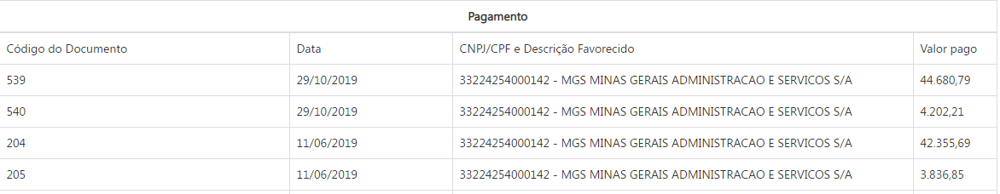

---
titulo: "Valor Pago Financeiro"

# Visão Geral da Intervenção

Essa demanda visa alterar no Portal da Transparência a divulgação da coluna "Valor Pago" das consultas de Despesa, Restos a Pagar, Convênios de Saída e Diárias, bem como do Formulário de Detalhamento da Despesa.

A alteração será realizada na extração dos dados realizada no armazém SIAFI, que passará a exibir informar na coluna Valor Pago as OP´s após a assinatura do ordenador de despesa e não mais a partir da data do registro da OP.

# Motivação / Contexto da Intervenção

De acordo com as regras de registro de Ordem de Pagamento (OP) no SIAFI é possível ocorrer 3 situações:

1. Pendente de transmissão aos bancos;
2. Sujeita a compensação bancaria;
3. Acatada pelo banco.

Sendo que as situações 1 e 2 referem-se a data de registro da OP no SIAFI e a situação 3 a data do efetivo pagamento.

Atualmente, o Portal de Transparência apresenta os dados relativos a OP no momento do registro no SIAFI. Assim, o Portal divulga uma despesa como paga, mas que ainda não percorreu todas as etapas de pagamento, o que gera dúvidas para os credores e para a própria Administração.

A partir dessa alteração, a coluna Valor Pago bem como o formulário de detalhamento do pagamento e do empenho passará a apresentar o pagamento efetivo de uma determinada OP, na data em que a compensação bancária ocorrer, respeitado o prazo de atualização de D+1 estabelecido pelo Decreto Federal n° 7.185, de 2010.

Além dessa alteração, deverá ser alterada a descrição do Valor pago que consta das colunas "Valor pago" da consulta de Despesa. No glossário do portal atual e no tool tip consta apenas a definição de valor pago: Valor referente aos pagamentos efetuados através de movimentações bancárias, escriturais e apropriação contábil da despesa.

# Especificação

## Consulta Despesa

### Consulta por Órgão, Função, Programa, Favorecido por Nome e CPF/CNPJ

Apresentar no campo "Valor Pago", o valor referente a data em que a OP foi acatada pelo campo.

### Formulário de Detalhamento do Empenho e no Formulário de Detalhamento do Pagamento

Apresentar na coluna Data e no Valor Pago, o pagamento quando a OP for acatada pelo banco.

### Alterar a descrição do Valor Pago

Alterar a descrição do valor pago para: valor pago pelo Estado de Minas Gerais até a data de atualização da base de dados, estando o efetivo pagamento sujeito a compensação bancária.

### A quais consulta se aplica
A regra deverá ser aplicada a todas as consultas que extraem o campo Valor Pago Financeiro do armazém SIAFI:
* Consulta Despesa
* Consulta Restos a Pagar
* Consulta Convênios de Saída
* Consulta Diárias

# Dependências/Integrações

Não se aplica.

# Exemplos

# Dúvidas
