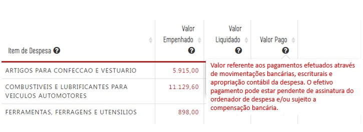
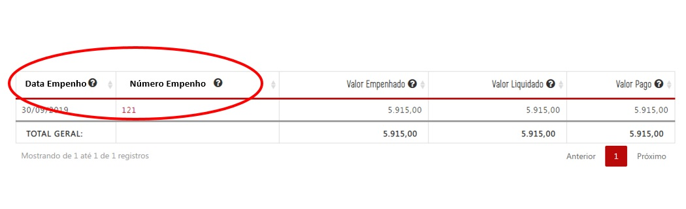
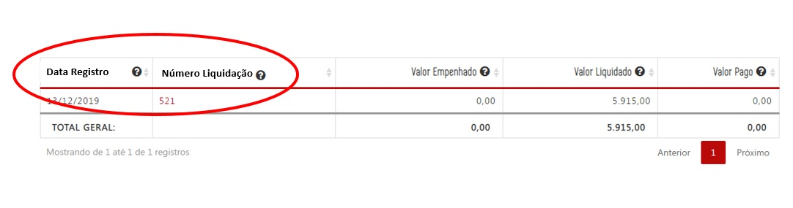
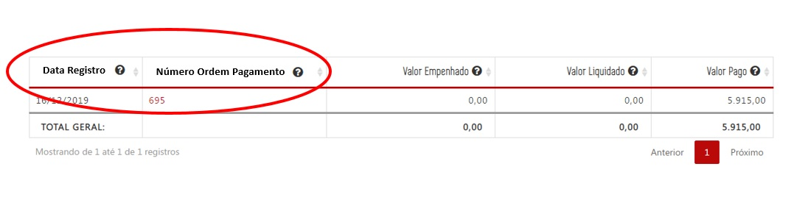
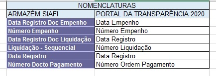
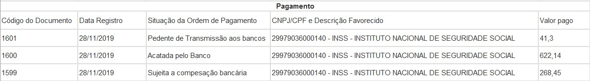
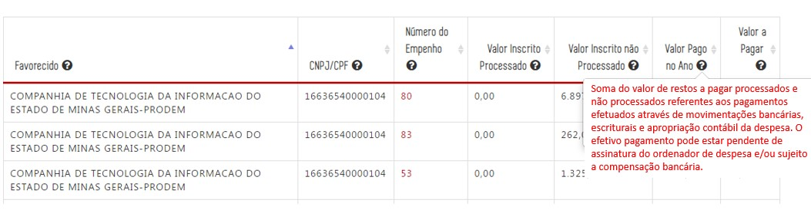
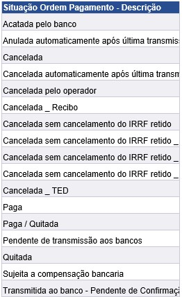
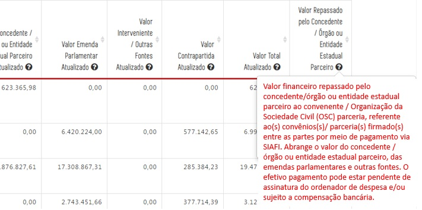

# Visão Geral da Intervenção

Essa demanda visa adequar no Portal da Transparência a regra de divulgação dos dados de pagamento, mais especificamente, a inclusão da situação da ordem de pagamento no formulário de detalhamento da despesa, alteração do nome das tabelas e alteração da conceito do valor pago das consultas de Despesa, Diárias e Restos a Pagar.

A alteração também será realizada na consulta de Convênios, e será alterada a regra de extração dos dados para a divulgação dos valores pagos.

# Motivação / Contexto da Intervenção

De acordo com as regras de registro de Ordem de Pagamento (OP) no SIAFI é possível ocorrer diversas situações identificadas no armazém BO para o campo Situação Ordem de Pagamento, que são:

1. Paga
2. Acatada pelo banco
3. Pendente de transmissão aos bancos
4. Sujeita a compensação bancária
5. Quitada
6. Cancelada
7. Cancelada pelo operador
8. Cancelada -TED
9. Transmitida ao banco - Pendente de confirmação
10. Cancelada sem cancelamento do IRRP retido _TED_

Atualmente, o Portal de Transparência apresenta os dados relativos a OP utilizando como variável para divulgação do valor pago a ___Data de Registro___ no SIAFI sem considerar a situação da ordem de pagamento.

Nesse sentido o Portal divulga uma despesa como paga, mas que ainda não percorreu todas as etapas de pagamento, ou seja, assinatura pelo ordenador de despesa, transmissão ao banco e a compensação bancária, o que gera dúvidas para os credores sobre o efetivo depósito dos valores registrados no Portal como pagos.

Com o objetivo de melhorar a divulgação de dados sobre pagamentos, sugere-se a alteração no formulário de detalhamento da despesa (opções Empenho e Pagamento) para que apresente a situação da ordem de pagamento, respeitado o prazo de atualização de D+1 estabelecido pelo Decreto Federal n° 7.185, de 2010.

Além dessa alteração, sugere-se a alteração na descrição do valor pago que consta no glossário interativo das colunas "Valor pago" das consultas de Despesa, Diárias e Restos a Pagar, para que seja esclarecido a sociedade as situações que compõem o campo valor pago.

``Atualmente, o glossário do portal e o tool tip trazem a seguinte definição: valor referente aos pagamentos efetuados através de movimentações bancárias, escriturais e apropriação contábil da despesa.``

# Especificação

## Consulta Despesa e Diárias

__1. Alterar descrição do campo "Valor Pago" no glossário interativo__

Alterar a descrição do _tool tip_ da coluna valor pago que passará a exibir o seguinte texto ao passar o cursor sobre o ponto de interrogação:

* Valor Pago: Valor referente aos pagamentos efetuados através de movimentações bancárias, escriturais e apropriação contábil da despesa. O efetivo pagamento pode estar pendente de assinatura do ordenador de despesa e/ou sujeito a compensação bancária.

___Observação___: Essas alterações aplicam-se a toda base de dados da consulta de Despesas e Diárias disponíveis no Portal da Transparência.

__2. Alterar o texto das colunas Data e Número de Documento__

Alterar o texto e descrição das [colunas] "DATA" e "NUMERO DO DOCUMENTO" das consultas de Despesas e Diárias.

 __Situação 1:__ ao clicar no [Valor Empenhado](http://www.transparencia.mg.gov.br/despesa-estado/despesa/despesa-orgaos/2020/01-01-2020/31-12-2020/4009/1910/457/20/42/1264408/2771/empenhado), o próximo nível deverá apresentar a informação:

  - Data de Registro (no lugar de Data): Data de Registro do documento de empenho no SIAFI (Sistema Integrado de Administração Financeira).

  - Número do Empenho (no lugar de Número Documento): Número de identificação do documento de empenho no SIAFI (Sistema Integrado de Administração Financeira).

  

__Situação 2:__ ao clicar no [Valor Liquidado](http://www.transparencia.mg.gov.br/despesa-estado/despesa/despesa-orgaos/2020/01-01-2020/31-12-2020/4009/1910/457/20/42/1264408/2771/liquidado), o próximo nível deverá apresentar a informação:

  - Data do Registro (no lugar de Data): Data de registro da liquidação no SIAFI (Sistema Integrado de Administração Financeira).

  - Número da Liquidação (no lugar de Número Documento): Número de identificação do documento de  liquidação no SIAFI (Sistema Integrado de Administração Financeira);

__Situação 3:__ ao clicar no [Valor Pago](http://www.transparencia.mg.gov.br/despesa-estado/despesa/despesa-orgaos/2020/01-01-2020/31-12-2020/4009/1910/457/20/42/1264408/2771/pago), o próximo nível deverá apresentar a informação:

  - Data de Registro (no lugar de Data): Data de registro da ordem de pagamento no SIAFI (Sistema Integrado de Administração Financeira).

  - Número da Ordem Pagamento (no lugar de Número Documento): Número de identificação do documento da ordem de pagamento no SIAFI (Sistema Integrado de Administração Financeira).

___Observação___: Essas alterações aplicam-se a toda base de dados da consulta de Despesas e Diárias disponíveis no Portal da Transparência.

Abaixo segue as consultas realizadas no armazém SIAFI para cada alteração sugerida.

[Planilha Pagamentos](static/pagamentos_2019.xls)

__3. Alteração do Formulário de Detalhamento de Despesa e Diárias__

No formulário de detalhamento da consulta de despesa e diárias, opções de empenho e pagamento, serão alteradas as seguintes informações:

 __Situação:__ Ao clicar no [Número do documento do Empenho, Número Documento Liquidação ou Número do Documento Pagamento](http://www.transparencia.mg.gov.br/despesa-estado/despesa/despesa-orgaos/2020/01-01-2020/31-12-2020/4009/1910/457/20/42/1264408/2771/empenhado/16/12589445/0/0), o próximo nível deverá apresentar a informação:

* Substituir o texto "Data" para "Data Registro" no formulário de pagamento (sem alteração na extração de dados no Armazém);

* Incluir a coluna de "Data Pagamento" no formulário de pagamento (após a coluna data de registro).

__Observação__: Importante ressaltar que o portal deve realizar a atualização do campos [Situação da Ordem de Pagamento] diariamente, pois esse campo não é estático no decorrer do exercício podendo sofrer alterações constantes.

## Consulta Restos a Pagar

__1. Formulário de Detalhamento de Despesa__

No [Formulário de Detalhamento da Despesa](http://transparencia.mg.gov.br/despesa-estado/restos-a-pagar/restospagar-orgaos/2019/3853/546/42/20/3065/130/58/5933374) da Consulta de Restos a Pagar, será alterada a mesma informação já especificada para a consulta de Despesas e Diárias, que é:

1. Substituir o texto "Data" para "Data Registro" (sem alteração na extração de dados no Armazém);

2. Incluir a coluna de "Data Pagamento" no formulário de pagamento (após a coluna data de registro).

  __Observação__: Importante ressaltar que o portal deve realizar a atualização do campos [Situação da Ordem de Pagamento] diariamente, pois esse campo não é estático no decorrer do exercício podendo sofrer alterações constantes.

__2. Alterar descrição do campo "Valor Pago no Ano" no glossário interativo__

Alterar a descrição do _tooltip_ da coluna "valor pago no ano" da consulta de Restos a Pagar, que passará a exibir o seguinte texto ao passar o cursor sobre o ponto de interrogação:

  - Valor Pago no Ano: Soma do valor de restos a pagar processados e não processados referentes aos pagamentos efetuados através de movimentações bancárias, escriturais e apropriação contábil da despesa. O efetivo pagamento pode estar pendente de assinatura do ordenador de despesa e/ou sujeito a compensação bancária.

## Observações Gerais

1. O campo [Situação da Ordem de Pagamento] no Portal deve refletir a mesma situação da OP que consta no Armazém. Como já mencionado, esse campo não é estático, podendo sofrer várias alterações no decorrer no ano. Nesse sentido, é necessário atualização diária dessa informação no Portal da Transparência.

Campo a ser utilizado no Armazém:

## Consulta Convênios de Saída

__1. Alterar descrição do campo "Valor Repassado pelo Concedente/Órgão ou Entidade Estadual Parceiro" no glossário interativo__

Alterar a descrição do _tooltip_ da coluna "valor Repassado pelo Concedente/Órgão ou Entidade Estadual Parceiro" da consulta de Convênios/Parcerias Saída de Recursos, que passará a exibir o seguinte texto ao passar o cursor sobre o ponto de interrogação:

  - __Valor Repassado pelo Concedente/Órgão ou Entidade Estadual Parceiro:__ Valor financeiro repassado pelo concedente/órgão ou entidade estadual parceiro ao convenente / Organização da Sociedade Civil (OSC) parceria, referente ao(s) convênios(s)/ parceria(s) firmado(s) entre as partes por meio de pagamento via SIAFI. Abrange o valor do concedente / órgão ou entidade estadual parceiro, das emendas parlamentares e outras fontes. O efetivo pagamento pode estar sujeito a compensação bancária.

__2. Alterar Formulário de Detalhamento do Convênio__

Para obter o real valor repassado deve-se utilizar a fórmula: (Valor Pago Financeiro - Valor Pago pendente =  Valor repassado) conforme campos do armazém BO.

Campos do Armazém BO:

Exemplos:

Dados disponíveis no Portal de Transparência atualmente:

O Portal apresenta como repassado o valor total de R$ 35.000,00 no entanto, conforme consta no SIAFI transacional o valor encontra-se __"pendente para o banco- aguardando assinatura digital"__. Com as novas regras o Portal deve apresentar o valor efetivamente repassado (Valor Pago Financeiro - Valor Pago pendente).

Na extração dos dados do armazém para a divulgação do Valor Repassado pelo Concedente/Órgão ou Entidade Estadual Parceiro, será considerado para divulgação dos valores repassados o Valor Pago Financeiro menos o Valor Pago Pendente, nas segintes condições:

# Sugestões

Na especificação da consulta de Despesa foi sugerido acrescentar o campo [Situação da ordem de pagamento] no formulário de detalhamento.
Outra hipótese pode ser a exibição das ordens de pagamento que apresentem apenas as situação definidas pela DTA, como por exemplo: Acatada pelo Banco, Sujeita a Compensação Bancária e Paga. Nesse caso, o Portal irá apresentar apenas as OPs que efetivamente foram pagas e/ou transmitidas ao banco.

Assim não seria necessário a inclusão de mais campos no formulário de detalhamento.
