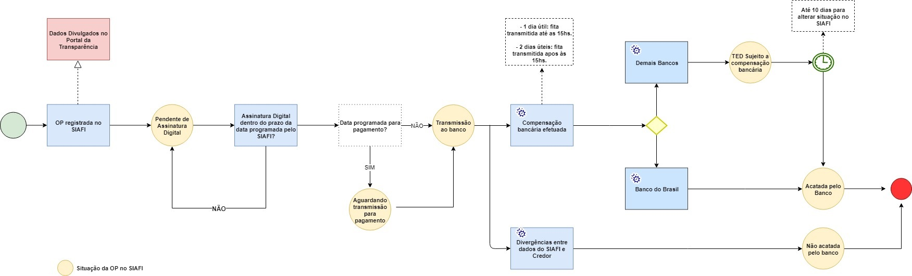
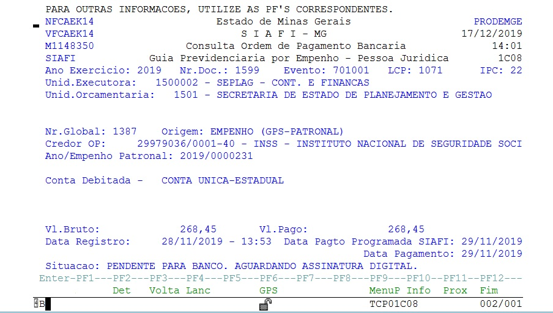
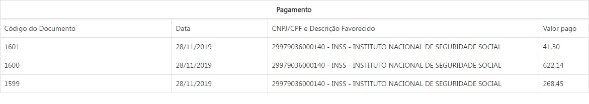
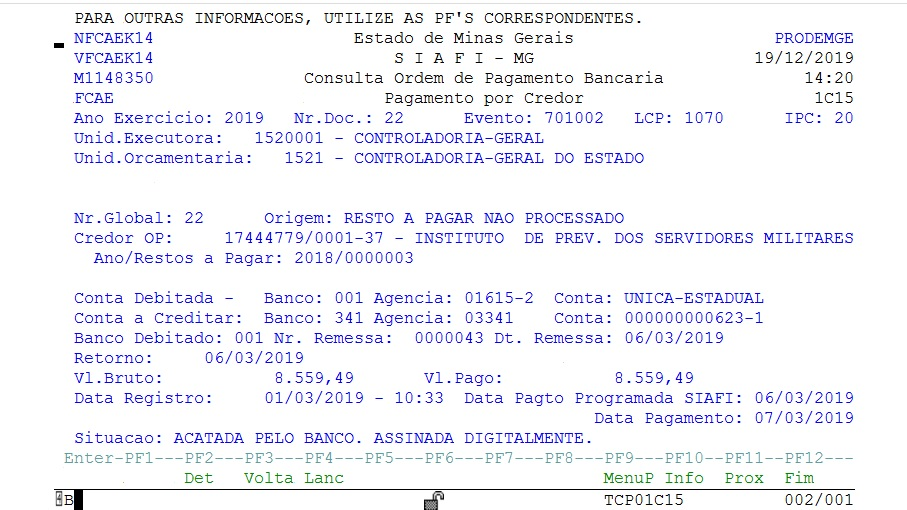
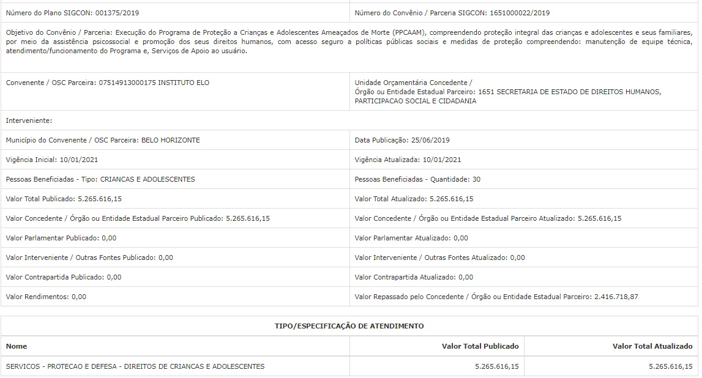
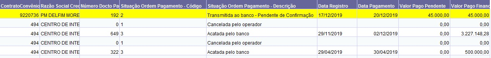
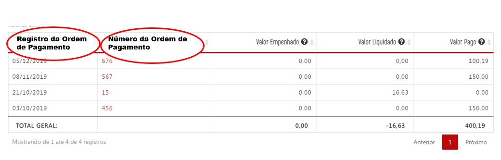
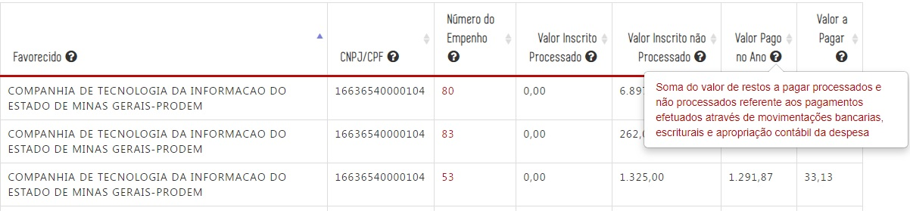

# Visão Geral da Intervenção

Essa demanda visa adequar no Portal da Transparência a regra de divulgação dos dados de pagamento, mais especificamente, a inclusão a Data de Pagamento no formulário de detalhamento da despesa. alteração do nome das tabelas e alteração da conceito do valor pago das consultas de Despesa, Diárias e Restos a Pagar.

A alteração também será realizada na consulta de Convênios, e será alterada a regra de extração dos dados para a divulgação dos valores pagos.

# Motivação / Contexto da Intervenção

De acordo com as regras de registro de Ordem de Pagamento (OP) no SIAFI é possível ocorrer diversas situações identificadas no armazém BO para o campo Situação Ordem de Pagamento, que são:

1. Paga
2. Acatada pelo banco
3. Pendente de transmissão aos bancos
4. Sujeita a compensação bancária
5. Quitada
6. Cancelada
7. Cancelada pelo operador
8. Cancelada -TED
9. Transmitida ao banco - Pendente de confirmação
10. Cancelada sem cancelamento do IRRP retido _TED

Dentre essas situações, ressaltamos as situações 2 (acatada pelo banco), 3 (pendente de transmissão aos bancos) e situação 4 (sujeita a compensação bancária).

Atualmente, o Portal de Transparência apresenta os dados relativos a OP utilizando como variável para divulgação do valor pago a Data de Registro no SIAFI.

 Assim, o Portal divulga uma despesa como paga, mas que ainda não percorreu todas as etapas de pagamento, ou seja, assinatura pelo ordenador de despesa, transmissão ao banco e a compensação bancária, o que gera dúvidas para os credores sobre o efetivo depósito dos valores registrados no Portal como pagos.

 Para elucidar, trazemos um caso referente ao empenho 1387 (UE 1500002), OP 1599 consultado no SIAFI na data de 17/12/2019, cujo registro da OP ocorreu no dia 28/11/2019, com data de pagamento registrada no SIAFI para 29/11/2019.

E conforme tela do SIAFI, consta na Situação a informação de PENDENTE PARA BANCO. AGUARDANDO ASSINATURA DIGITAL.

Essa mesma OP consultada no Portal da Transparência consta como paga no formulário de detalhamento de despesa, desde o dia 28/11/2019 (código do documento 1599), na valor de R$268,45.

Assim, conforme exemplo acima, apesar de constar como paga no Portal da Transparência desde o dia 28/11/2019. A OP 1599 ainda não percorreu as etapas de pagamento.

A mesma situação ocorre na consulta de Restos a Pagar. Exemplo é a consulta de restos a pagar referente ao Restos a Pagar 2018/3. Conforme tela do SIAFI a data de registro da OP ocorreu em 01/03/2019, mas o efetivo pagamento da despesa ocorreu em 07/03/2019.

 Assim, com o objetivo de melhorar a divulgação de dados sobre pagamentos, sugere-se a alteração no formulário de detalhamento da despesa (opções Empenho e Pagamento) para que apresente não somente a data de registro da OP, mas também a data de pagamento de uma determinada OP (paga, acatada pelo banco e sujeita a compensação bancária), respeitado o prazo de atualização de D+1 estabelecido pelo Decreto Federal n° 7.185, de 2010.

Além dessa alteração, sugere-se a alteração na descrição do valor pago que consta das colunas "Valor pago" das consultas de Despesa, Diária e Restos a Pagar, para que seja esclarecido a sociedade as situações que compõem o campo valor pago.

Atualmente, o glossário do portal e o tool tip traz a seguinte definição: valor referente aos pagamentos efetuados através de movimentações bancárias, escriturais e apropriação contábil da despesa.

Diferentemente das demais consultas de Despesa, Diárias e Restos a Pagar, a consulta de Convênios/Parcerias de Saída de Recursos não possui a divulgação de Data de Registro da OP, consta apenas a informação do Valor total Repassado pelo Concedente/Órgão ou Entidade Estadual Parceiro, sem detalhamento sobre a Data de Registro da OP ou Data de Pagamento.

No entanto, a regra adotada pelo Portal da Transparência é a mesma aplicada as demais consulta, que é a informação de valor repassado tendo como critério o Valor Pago Financeiro, Valor Pago Processado e Valor Pago Não Processado de acordo com a Data de Registro da OP, que traz para o Portal, a informação de valor repassado, mesmo que a despesa não tenha percorrido todas as suas fases.

[Convênios de Saída](static/conveniossaida.xls)

Como exemplo, temos o convênio 9192092, cuja OP 622 foi registrada no dia 17/12/2019, e com data de pagamento para 19/12/2019. No entanto, conforme consulta ao armazém consta na Situação Ordem Pagamento - Descrição: pendente de transmissão aos bancos. Essa situação indica que o depósito no valor de R$100.000,00 ainda não foi depositada pelo órgão concedente.

# Especificação

## Consulta Despesa e Diárias

### Descrição do Valor Pago

Alterar a descrição do TOOL TIP da coluna valor pago, que passará a exibir o seguinte texto ao passar o cursor sobre o ponto de interrogação:

- valor regsitrado no SIAFI/MG até a data de atualização da base de dados, podendo o efetivo pagamento estar pendente de assinatura do ordenador de despesa, transmissão bancária e/ou sujeito a compensação bancária.

**IMPORTANTE:** Essas alterações aplicam-se as consultas de Despesas e Diárias.

### Texto das colunas Data e Número de Documento

Alterar o texto das colunas "Data" e "NUMERO DO DOCUMENTO" das consultas de Despesas e Diárias

**Situação 1:** ao clicar no "Valor Empenhado", o próximo nível deverá apresentar a informação:
- Data de Empenho (no lugar de Data)
- Número do Empenho (no lugar de Número Documento)

**Situação 2:** ao clicar no "Valor Liquidado", o próximo nível deverá apresentar a informação:
- Data de Liquidação (no lugar de Data): Data de registro do documento de liquidação no SIAFI (Sistema Integrado de Administração Financeira).

- Número da Liquidação (no lugar de Número Documento): Número de identificação do documento de liquidação no SIAFI (Sistema Integrado de Administração Financeira).

**Situação 3:** ao clicar no "Valor Pago", o próximo nível deverá apresentar a informação:
- Registro da Ordem de Pagamento (no lugar de Data): Data de registro do documento de pagamento no SIAFI (Sistema Integrado de Administração Financeira).

- Número da Ordem de Pagamento (no lugar de Número Documento):Número de identificação do documento de pagamento no SIAFI (Sistema Integrado de Administração Financeira).

*IMPORTANTE:* Essas alterações aplicam-se as consultas de Despesas e Diárias.

### Formulário de Detalhamento de Despesa

No formulário de detalhamento da despesa, opções de empenho e pagamento, serão alteradas as seguintes informações:

1. Substituir o texto: "Data" para "Data de Registro" (sem alteração na extração de dados no Armazém);

2. Incluir a coluna de Data de Pagamento (após a coluna data de registro), que será preenchida quando ocorrer o preenchimento da variável data de pagamento em uma das seguintes "Situações Ordem Pagamento - Descrição" (somente a situações Ordem Pagamento, código 3):

  - Paga
  - Acatada pelo banco
  - Sujeita a compensação bancária

Importante ressaltar que serão consideradas apenas as data de pagamento com valores válidos. Informações em branco ou informações inválidas não serão trazidas para o portal.

[formulario_detalhamento_despesa](static/formulario_detalhamento_despesa.xls)

*IMPORTANTE:* Essas alterações aplicam-se as consultas de Despesas e Diárias.

## Consulta Restos a Pagar

### Formulário de Detalhamento de Despesa

No formulário de detalhamento da despesa da Consulta de Restos a Pagar, será alterada a seguinte informação:

[Formulário de Detalhamento da Despesa](http://transparencia.mg.gov.br/despesa-estado/restos-a-pagar/restospagar-orgaos/2019/3853/546/42/20/3065/130/58/5933374)

1. Substituir o texto: "Data" para "Data de Registro" (sem alteração na extração de dados no Armazém);

2. Incluir a coluna de Data de Pagamento (após a coluna data de registro), que será preenchida quando ocorrer o preenchimento da variável data de pagamento em uma das seguintes "Situações Ordem Pagamento - Descrição" (somente a situações Ordem Pagamento, código 3):

  - Paga
  - Acatada pelo banco
  - Sujeita a compensação bancária

Importante ressaltar que serão consideradas apenas as data de pagamento com valores válidos. Informações em branco ou informações inválidas não serão trazidas para o portal.

[Restos a Pagar](static/restosapagar.xls)

### Descrição do Valor Pago no Ano

Alterar a descrição do TOOL TIP da coluna "valor pago no ano" da consulta de Restos a Pagar, que passará a exibir o seguinte texto ao passar o cursor sobre o ponto de interrogação:

- soma do valor de restos a pagar processados e não processados referentes aos pagamentos registrados no SIAFI/MG até a data de atualização da base de dados, podendo o efetivo pagamento estar pendente de assinatura do ordenador de despesa, transmissão bancária e/ou sujeito a compensação bancária.

## Consulta Convênios de Saída

Na extração dos dados do armazém para a divulgação do Valor Repassado pelo Concedente/Órgão ou Entidade Estadual Parceiro, será considerado apenas os pagamentos com o preenchimento da variável data de pagamento em uma das seguintes "Situações Ordem Pagamento - Descrição" (somente a situações Ordem Pagamento, código 3):

  - Paga
  - Acatada pelo banco
  - Sujeita a compensação bancária

Importante ressaltar que serão consideradas apenas as data de pagamento com valores válidos. Informações em branco ou informações inválidas não serão trazidas para o portal.

# Exemplos

1. Boa Prática:
O portal da Transparência do Distrito Federal traz a informação de Data de Emissão no lugar de data de pagamento.

