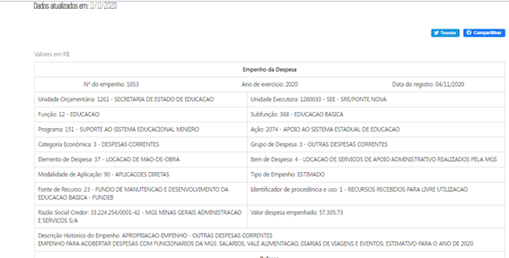
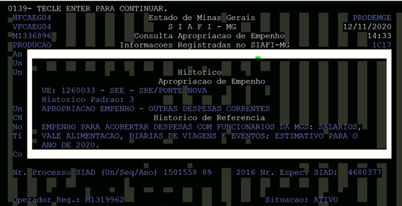
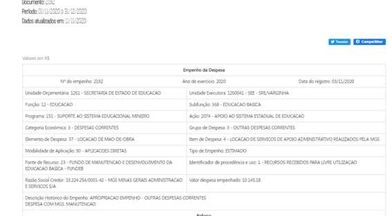
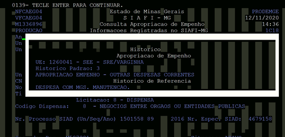
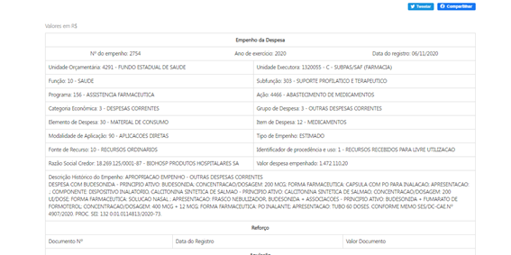
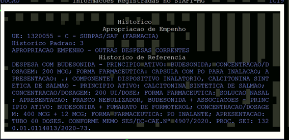

|Título| Homologação da descrição do empenho - Produção
| -|:-
|__Contrato manutenção__ | nº 15210010062019 (INF. 3951)
|__Proposta Comercial__ | nº 626584/19
|__Mantis__ |nº 0146901
|__Versão html__ |[link]()

# Homologação do campo Descrição Histórico do Empenho

A homologação foi realizada por **amostragem** e conforme solicitado apenas com base nos **empenhos gerados a partir de 01/11/2020**.

* Informações do analista da PRODEMGE que realizou a intervenção no Portal:

>_A liberação preliminar se faz necessário não somente pelas informações desatualizadas, mas devido a identificação de alguns pontos identificados nos arquivos gerados e relatados a seguir:_
>
>_Todos os empenhos possuem um “histórico padrão”, geralmente uma linha apenas que descreve brevemente do que se trata o Empenho (por exemplo, APROPRIACAO EMPENHO - PESSOAL E ENCARGOS SOCIAIS);_
>
> * _Caso o “histórico padrão” seja removido, poderá ocasionar empenhos com histórico vazio._
> * _Boa parte dos empenhos, além do “histórico padrão”, possuem o “complemento de empenho”, sendo esse um texto livre inserido pelo usuário;_
>
> * _Para o processamento da carga foi considerado a junção do histórico padrão com o complemento de empenho, sendo segregados por uma quebra de linha;_
>* _O complemento de empenho, por se tratar de texto livre, possui algumas anomalias na formatação do texto. Limitações no mainframe e provavelmente a forma que o usuário insere as informações no mesmo, provocam quebras indesejadas de palavras ou não inserção de espaço entre palavras. Para resolver o problema foi aplicada uma técnica que identifica quando uma quebra de linha ocorre entre uma palavra (realizando a união) ou entre duas palavras (inserindo o espaço quando necessário).A técnica se baseia na validação da palavra por meio da lista de palavras existentes na língua portuguesa, sendo assim, não é perfeita, podendo, ocasionalmente, apresentar informações separadas por espaço quando as mesmas deveriam estar unidas._
>
>_O volume de dados cobre 100.417 dos 163.214 empenhos de despesa do ano de 2020. Caso o arquivo seja gerado ao longo do dia 09/07, esse será atualizado em homologação e irei comunicar sobre esse evento._

## Consulta Despesa:

__CONFERE__

PORTAL
--

SIAFI
--
  

__CONFERE__

PORTAL
--

SIAFI

__CONFERE__

PORTAL
--

SIAFI
--

