# Homologação da documentação da especificação
<a href="#top">(inicio)</a>

### Atenção

A anonimização dos nomes e CPFs de credores pessoas físicas nas consultas de Despesa e Restos a Pagar (RP) referente  elemento item de despesa 3102 - PRÊMIOS LOTÉRICOS deve permanecer conforme [demanda já disponibilizada em produção](https://github.com/transparencia-mg/especificacoes-portal-transparencia/blob/master/espec001_anonimizacao-cpf/anonimizacao-cpf-espec.md) e deverá sem aplicada antes dessa nova proposta de descaraterização.

# Especificação
<a href="#top">(inicio)</a>

Inicialmente, cabe destacar que todos os registros devem ser carregados novamente na base de dados do Portal da Transparência, de forma que todos os CPFs fiquem anonimizados.

A anonimização deve ser aplicada em:

* Gráficos e tabelas do nível favorecido (ex. Despesa ; RP;  Diárias e Viagens);
* Formulários de detalhamento de documentos ex. Despesa ; RP;  Diárias e Viagens);
* Tabela do nível nome do classificado (ex. Concursos realizados);
* Pesquisa avançada;
* Imprimir página;
* Exportar para csv;
* Exportar para pdf.

## Método de anonimização

A anonimização deve ser aplicada em **TODOS** os campos e filtros de **TODAS** as consultas que possuem informação de CPF.

O método de anonimização consiste em ocultar os três primeiros dígitos e dos dois dígitos verificadores dos CPFs.

 **Exemplo:**  
 Substituir o CPF pelo valor *** .456.526- **

Abaixo segue **EXEMPLOS** de algumas consultas de como a anonimização deve ocorrer:

## Concursos Realizados - ok
<a href="#top">(inicio)</a>

A anonimização deve ser aplicada no nível 'Nome do Classificado' em todos os filtros da consulta [Concursos Realizados](http://transparencia.mg.gov.br/estado-pessoal/concursos-realizados/concursos-orgaos-demandantes/2018/01-01-2018/31-12-2018/1/17/17/97) que possuem informação de CPF.

Ao acessar o nível 'Nome do Classificado', o Portal deverá exibir:

| Nome do Classificado | CPF |
|---|---|
ADRIA DE LIMA SOUSA|*** .000.000- **|
* ***Obs: As demais colunas não sofrerão alterações***

CONFERE
--
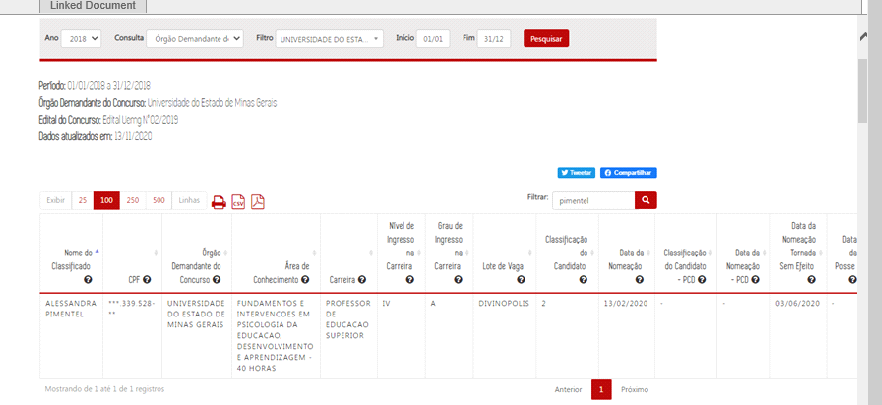
  

## Despesa, Restos a Pagar, Diárias e Viagens
<a href="#top">(inicio)</a>

A anonimização deve ser aplicada no nível 'Favorecido' de todos os filtros das consultas [Despesa](http://transparencia.mg.gov.br/despesa-estado/despesa/despesa-orgaos/2020/01-01-2020/31-12-2020/4015/1914/533/20/42), [Diárias](http://transparencia.mg.gov.br/estado-pessoal/diarias/despesadiarias-programas/2020/01-01-2020/31-12-2020/4026), [Restos a Pagar](http://transparencia.mg.gov.br/despesa-estado/restos-a-pagar/restospagar-orgaos/2020/4015/533/42/20/2798/130/58) e [Viagens](http://transparencia.mg.gov.br/estado-pessoal/viagens/estado_viagens-consulta/21/01-01-2020/31-12-2020/2020) que possuem informação de CPF.

Ao acessar o nível 'Favorecido por nome' ou 'Favorecido por CNPJ/CPF' o Portal deverá exibir:

### Consulta Despesa- ok

| Favorecido | CNPJ/CPF | Item de despesa | Valor Empenhado |Valor Liquidado| Valor Pago|
|---|---|---|---|---|---
MARCOS SAULO DE CARVALHO|*** .456.286- **|DESPESAS MIUDAS DE PRONTO PAGAMENTO| 10.000,00|10.000,00|10.000,00|

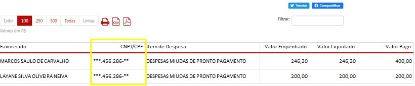

CONFERE
--

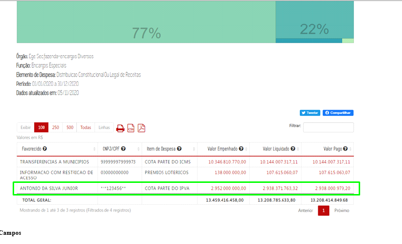

  

* **Formulários de detalhamento de documentos**

Ao acessar os formulários de detalhamento, os seguintes campos devem ser anonimizados:

=> Campo ___Razão Social do Credor, CNPJ/CPF e Descrição do Favorecido___ do formulário de empenho da despesa:

  

Conforme informado pelo analista Luiz:
> '*objetivo dos dados presentes nas interfaces da documentação tem apenas o intuito de simular como a aplicação irá se comportar, não refletindo o funcionamento real da aplicação.Conforme foi observado nos formulários de detalhamento de Despesas e Restos a Pagar, os dados apresentados em liquidação e pagamento divergem do comportamento real da aplicação, mas possuem a intenção de demonstrar como as funcionalidades de anonimização e descaracterização de CPF comportam.*''

Considerando a informação acima os dados estão de acordo, mas durante a homologação em da consulta verificar.

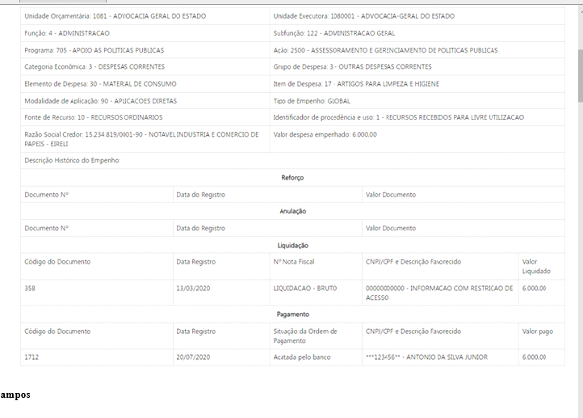
  

### Consulta Restos a Pagar- ok

| Favorecido | CNPJ/CPF | Número do empenho | Valor Inscrito Processado |Valor Inscrito não Processado| Valor Pago no ano| Valor a pagar
|---|---|---:|---:|---:|---:|---:
MARCOS SAULO DE CARVALHO|*** .456.286- **|85| 10.000,00|30.000,00|10.000,00|20.000,00

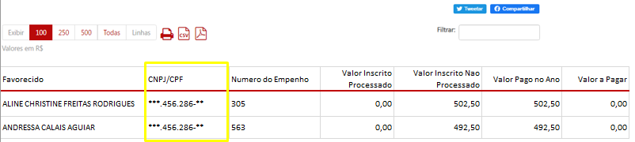

CONFERE
--

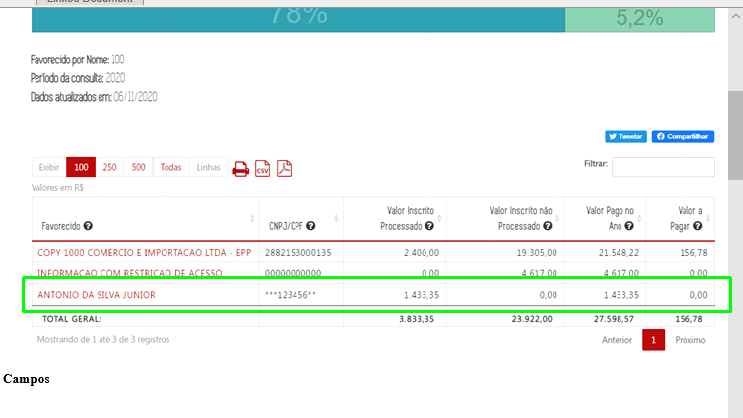
  

* **Formulários de detalhamento de documentos**

Ao acessar os formulários de detalhamento, os seguintes campos devem ser anonimizados:

=>Campo ___Razão Social do Credor, CNPJ/CPF e Descrição do Favorecido___ do formulário de empenho da despesa:

Conforme informado pelo analista Luiz:
> '*objetivo dos dados presentes nas interfaces da documentação tem apenas o intuito de simular como a aplicação irá se comportar, não refletindo o funcionamento real da aplicação.Conforme foi observado nos formulários de detalhamento de Despesas e Restos a Pagar, os dados apresentados em liquidação e pagamento divergem do comportamento real da aplicação, mas possuem a intenção de demonstrar como as funcionalidades de anonimização e descaracterização de CPF comportam.*''

Considerando a informação acima os dados estão de acordo, mas durante a homologação em da consulta verificar.

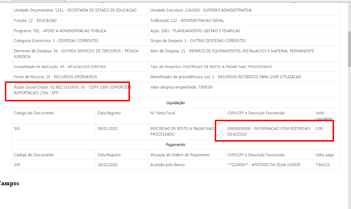
  

### Consulta Diárias - ok

|Favorecido| CNPJ/CPF|  Valor Empenhado |Valor Liquidado| Valor Pago|
|---|---|---:|---:|---:
MARCOS SAULO DE CARVALHO|*** .456.286- **|10.000,00|10.000,00|10.000,00|

CONFERE
--

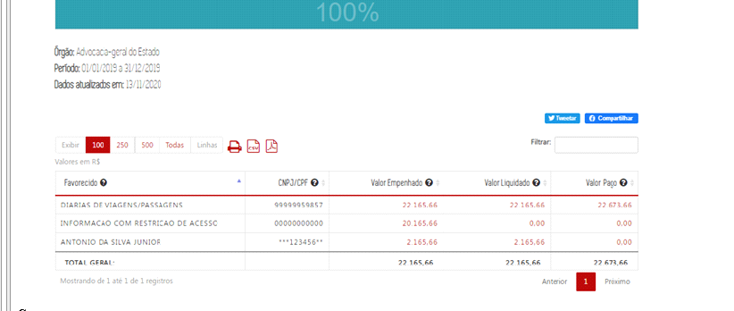
--
  
  
* **Formulários de detalhamento de documentos**

Ao acessar os formulários de detalhamento, os seguintes campos devem ser anonimizados:

=> Campo ___Razão Social do Credor, CNPJ/CPF e Descrição do Favorecido___ do formulário de empenho da despesa:

### Consulta Viagens- ok

|Favorecido | CNPJ/CPF | Cargo | Órgão| Quantidade de Viagens| Quantidade de Diárias |Valor Pago Diárias|Valor Pago Passagens| Valor Total|
|---|---|---|---|---|---|---:|---:|--:
MARCOS SAULO DE CARVALHO|*** .456.286- **| Auditor Fiscal| Secretária de Estado da Fazenda|1,00|1,00|0,00|0,00|0,00

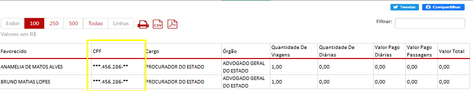

CONFERE
--
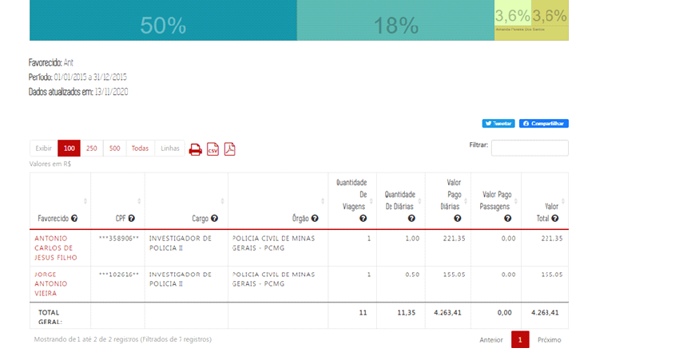

--
  
  

* **Formulários de detalhamento de documentos**

Ao acessar os formulários de detalhamento, os seguintes campos devem ser anonimizados:

CONFERE
--
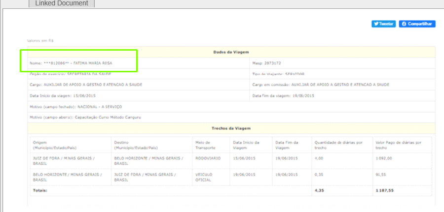
  
  

## Consulta Compras e Contratos
<a href="#top">(inicio)</a>

A anonimização deve ser aplicada no nível 'Contratado' em todos os filtros da consulta [Compras e Contratos](http://www.transparencia.mg.gov.br/compras-e-patrimonio/compras-e-contratos/comprasecontratos-filtros/3/2020/01-01-2020/07-10-2020/0/0/0/0/0/0/0/0/0/0/0/0) que possuem informação de CPF.

Ao acessar o nível 'Contratado', o Portal deverá exibir:

| Contratado| CNPJ/CPF | Valor de Referência | Valor Homologado | Economias
|---|---||---|---|
SANDRO LUIS VILELA AVELAR|*** .000.000- **|

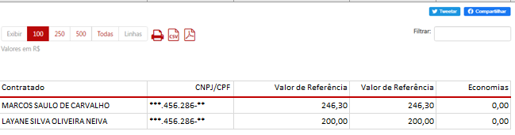

* **Formulários de detalhamento de documentos**

Ao acessar os formulários de detalhamento, os seguintes campos devem ser anonimizados:

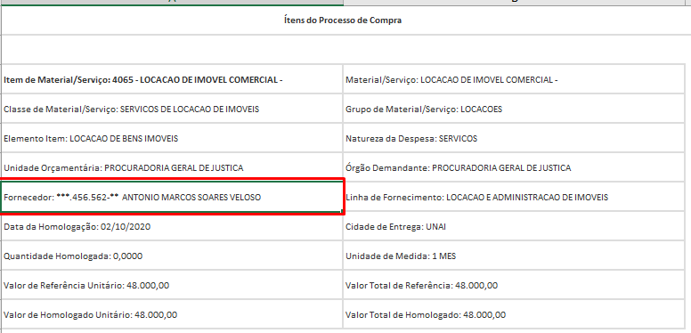

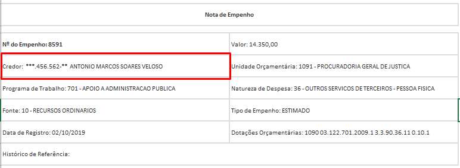

* **Formulário de detalhamento da consulta Contratos por órgão**

Ao acessar os formulários de detalhamento, os seguintes campos devem ser anonimizados:

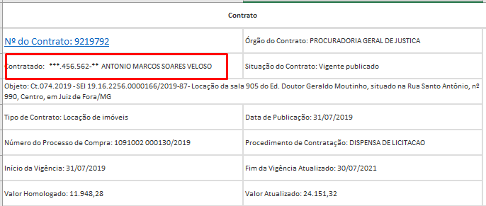

## Gestão da Frota - Ok
<a href="#top">(inicio)</a>

A anonimização deve ser aplicada no nível 'Proprietário' em todos os filtros da consulta [Gestão da Frota](http://www.transparencia.mg.gov.br/compras-e-patrimonio/gestao-de-frota/frota-veiculos-orgao-resp/1/1/51/51/31) que possuem informação de CPF.

| Número do Patrimônio| Placa do Veículo |Marca/Modelo | Ano de Fabricação | Siatuação do Veículo| Tipo de bem|Proprietário|Finalidade do Veículo
|---|---|---|---|---|--|---|-
|---|---|---|---|---|--|*** .000.000- ** -SANDRO LUIS VILELA AVELAR||

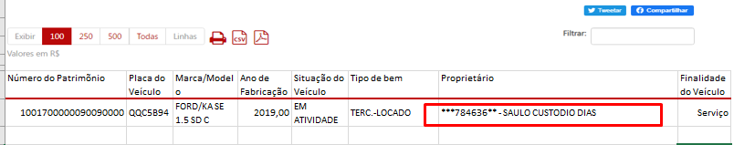

CONFERE
--
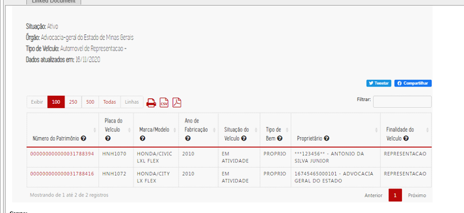

--
  
  

* **Formulários de detalhamento de documentos**

Ao acessar os formulários de detalhamento, os seguintes campos devem ser anonimizados:

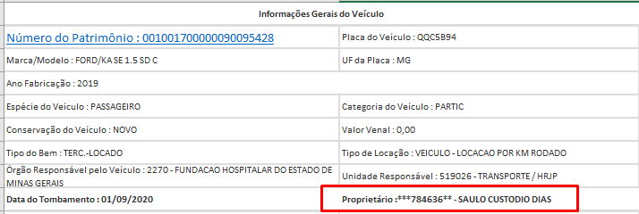

CONFERE
--
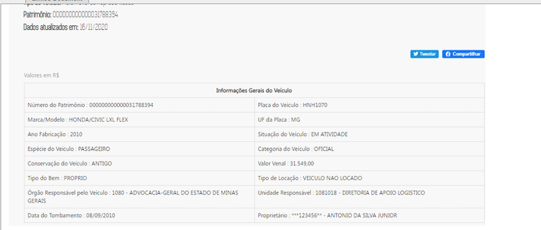

--
  
  

## Patrimônio - OK
<a href="#top">(inicio)</a>

A anonimização deve ser aplicada em todos os campos que tiver informação de CPFS e em todos os filtros da consulta [Patrimônio](http://www.transparencia.mg.gov.br/compras-e-patrimonio/patrimonio/patrimonio-terceiros-responsaveis/1/2/).

| CNPJ/CPF|Terceiro Responsável |Quantidade de Bens Ativos |
|---|---|---|
|*** .000.000- **|SANDRO LUIS VILELA AVELAR|-|

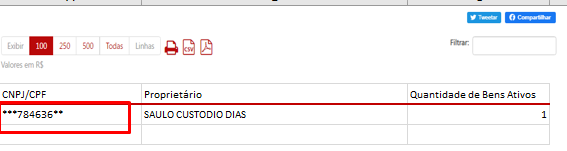

CONFERE
--
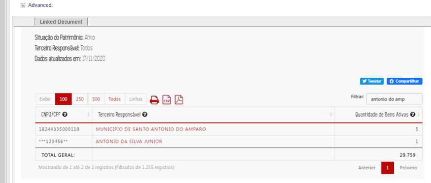

--
  
  

* **Formulários de detalhamento de documentos**

No formulário de detalhamento da consulta de Patrimônio não foi identificado, inicialmente, registro de informações de CPF, mas o sistema tem que estar apto caso isso ocorra.
--

  
  

***OBSERVAÇÕES GERAIS***

* As regras acima devem ser aplicadas inclusive no caso em que o nome e CPF sejam apresentados no mesmo campo (ex. formulários de detalhamento).

* No banco de dados do Portal da Transparência, as informações de CPF devem ser armazenadas sem anonimização, permitindo filtros que utilizem essas informações.

* A anonimização deve ocorrer em todas as pesquisas avançadas que apresentem informação de CPF.

DESPESAS - CONFERE
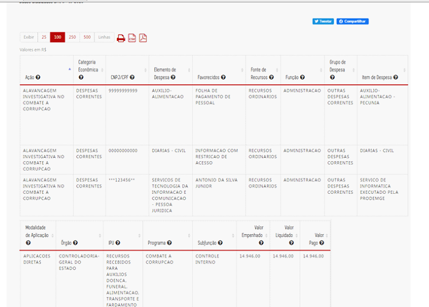

FROTA - CONFERE

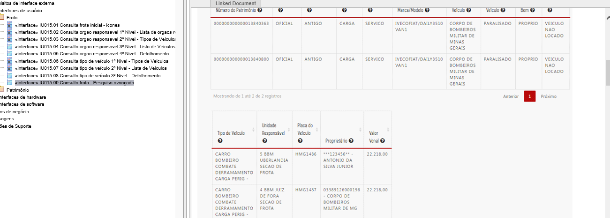
  
  
* Ao digitar o CPF de um favorecido na consulta 'Favorecido por CPF / CNPJ', o Portal deve exibir a consulta completa anonimizando os dados do favorecido.

* Os dados na migalha de pão (caminho da pesquisa) devem ser anonimizados quando exibir o número do CPF;

* Ao realizar uma anonimização, o Portal deve continuar a exibir as transações de forma separada.

* A anonimização deve ser aplicada na árvore de todas as consultas

* Quando o usuário clicar no número do processo de compra da consulta "[Compras - Programa de enfrentamento COVID -19](http://www.transparencia.mg.gov.br/covid-19/compras-contratos/contratoscovid-detalharcompra/145425)" deve-se aplicar as mesmas regras de anonimização adotada na Consulta de Compras e Contratos caso exista algum CPF.
