# Homologação do Layout da especificação
<a href="#top">(inicio)</a>

# Atenção

A anonimização dos nomes e CPFs de credores pessoas físicas nas consultas de Despesa e Restos a Pagar (RP) referente  elemento item de despesa 3102 - PRÊMIOS LOTÉRICOS deve permanecer conforme [demanda já disponibilizada em produção](https://github.com/transparencia-mg/especificacoes-portal-transparencia/blob/master/espec001_anonimizacao-cpf/anonimizacao-cpf-espec.md) e deverá sem aplicada antes dessa nova proposta de descaraterização.

DADOS CONTINUAM ANONIMIZADOS - OK
--
Despesa - Dados verificados no ano de 2020.

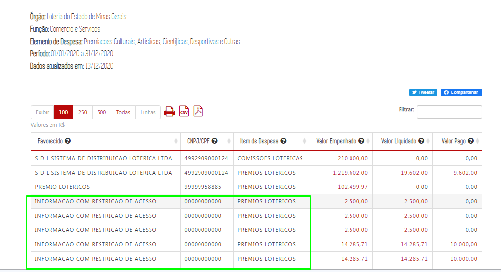
  

# Especificação
<a href="#top">(inicio)</a>

Inicialmente, cabe destacar que todos os registros devem ser carregados novamente na base de dados do Portal da Transparência, de forma que todos os CPFs fiquem anonimizados.

**Não é possível verificar todo os anos, pois no ambiente de Homologação foi disponibilizado apenas os anos de 2019 e 2020. Nesse sentido, os demais anos serão verificados no ambiente de produção**.

A anonimização deve ser aplicada em:

* Gráficos e tabelas do nível favorecido (ex. Despesa ; RP;  Diárias e Viagens);
* Formulários de detalhamento de documentos ex. Despesa ; RP;  Diárias e Viagens);
* Tabela do nível nome do classificado (ex. Concursos realizados);
* Pesquisa avançada;
* Imprimir página;
* Exportar para csv;
* Exportar para pdf.

## Método de anonimização

A anonimização deve ser aplicada em **TODOS** os campos e filtros de **TODAS** as consultas que possuem informação de CPF.

O método de anonimização consiste em ocultar os três primeiros dígitos e dos dois dígitos verificadores dos CPFs.

 **Exemplo:**  
 Substituir o CPF pelo valor *** .456.526- **

Abaixo segue **EXEMPLOS** de algumas consultas de como a anonimização deve ocorrer:

## Concursos Realizados - OK
<a href="#top">(inicio)</a>

A anonimização deve ser aplicada no nível 'Nome do Classificado' em todos os filtros da consulta [Concursos Realizados]() que possuem informação de CPF.

Ao acessar o nível 'Nome do Classificado', o Portal deverá exibir:

| Nome do Classificado | CPF |
|---|---|
ADRIA DE LIMA SOUSA|*** .000.000- **|
* ***Obs: As demais colunas não sofrerão alterações***

CONFERE
--
Dados verificados em todos os filtros no ano de 2017.

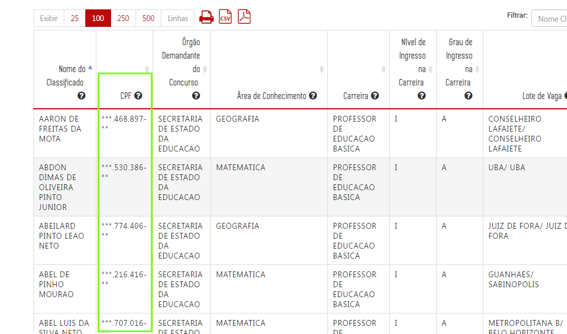
  

## Despesa, Restos a Pagar, Diárias e Viagens
<a href="#top">(inicio)</a>

A anonimização deve ser aplicada no nível 'Favorecido' de todos os filtros das consultas [Despesa]), [Diárias]), [Restos a Pagar]) que possuem informação de CPF.

Ao acessar o nível 'Favorecido por nome' ou 'Favorecido por CNPJ/CPF' o Portal deverá exibir:

### Consulta Despesa - OK
| Favorecido | CNPJ/CPF | Item de despesa | Valor Empenhado |Valor Liquidado| Valor Pago|
|---|---|---|---|---|---
MARCOS SAULO DE CARVALHO|*** .456.286- **|DESPESAS MIUDAS DE PRONTO PAGAMENTO| 10.000,00|10.000,00|10.000,00|

CONFERE
--
Dados verificados em todos os filtros no ano de 2020.

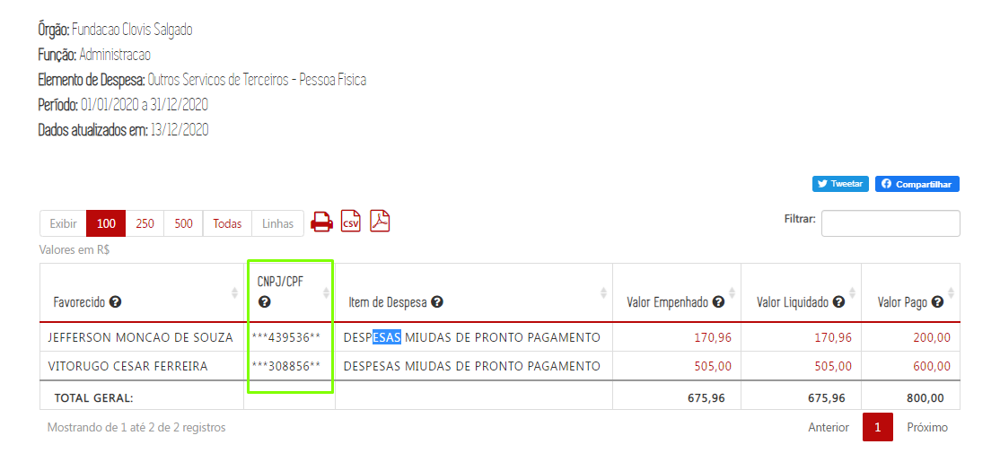
  

* **Formulários de detalhamento de documentos**

Ao acessar os formulários de detalhamento, os seguintes campos devem ser anonimizados:

=> Campo ___Razão Social do Credor, CNPJ/CPF e Descrição do Favorecido___ do formulário de empenho da despesa:

CONFERE
--
Dados verificados em todos os filtros no ano de 2020.
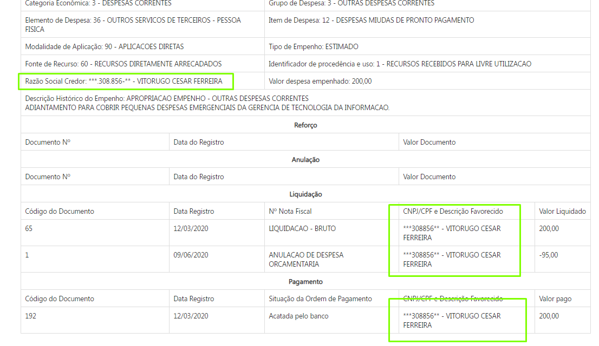

  

### Consulta Restos a Pagar - OK

| Favorecido | CNPJ/CPF | Número do empenho | Valor Inscrito Processado |Valor Inscrito não Processado| Valor Pago no ano| Valor a pagar
|---|---|---:|---:|---:|---:|---:
MARCOS SAULO DE CARVALHO|*** .456.286- **|85| 10.000,00|30.000,00|10.000,00|20.000,00

CONFERE
--
Dados verificados em todos os filtros no ano de 2020.
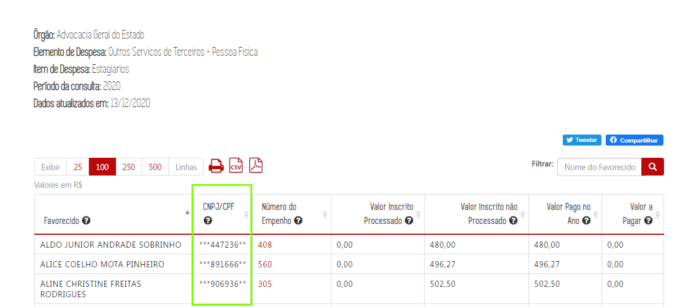
  

* **Formulários de detalhamento de documentos**

Ao acessar os formulários de detalhamento, os seguintes campos devem ser anonimizados:

=>Campo ___Razão Social do Credor, CNPJ/CPF e Descrição do Favorecido___ do formulário de empenho da despesa:

CONFERE
--
Dados verificados em todos os filtros no ano de 2020.
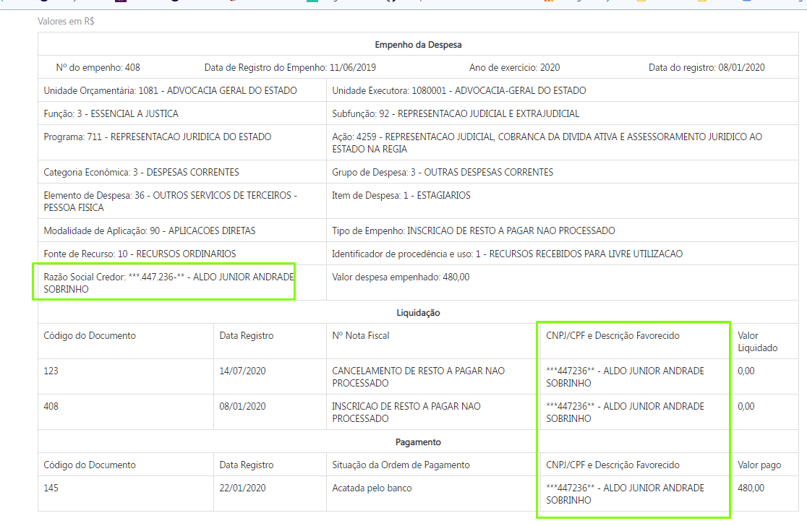

### Consulta Diárias - OK

|Favorecido| CNPJ/CPF|  Valor Empenhado |Valor Liquidado| Valor Pago|
|---|---|---:|---:|---:
MARCOS SAULO DE CARVALHO|*** .456.286- **|10.000,00|10.000,00|10.000,00|

CONFERE
--
Dados verificados em todos os filtros no ano de 2020.

  

* **Formulários de detalhamento de documentos**

Ao acessar os formulários de detalhamento, os seguintes campos devem ser anonimizados:

=> Campo ___Razão Social do Credor, CNPJ/CPF e Descrição do Favorecido___ do formulário de empenho da despesa:

CONFERE
--
Dados verificados em todos os filtros no ano de 2020.

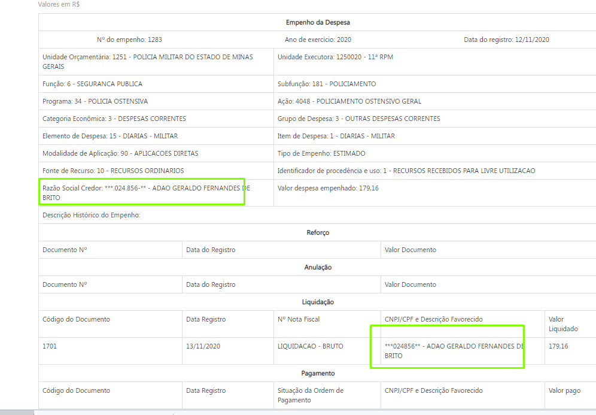
  

### Consulta Viagens - OK

|Favorecido | CNPJ/CPF | Cargo | Órgão| Quantidade de Viagens| Quantidade de Diárias |Valor Pago Diárias|Valor Pago Passagens| Valor Total|
|---|---|---|---|---|---|---:|---:|--:
MARCOS SAULO DE CARVALHO|*** .456.286- **| Auditor Fiscal| Secretária de Estado da Fazenda|1,00|1,00|0,00|0,00|0,00

CONFERE
--
Dados verificados em todos os filtros no ano de 2020.

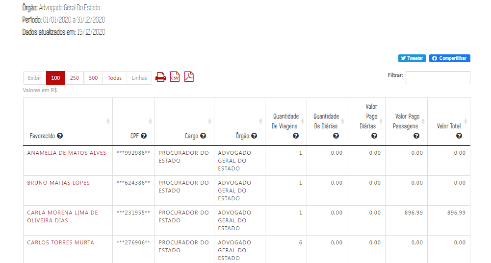
  

* **Formulários de detalhamento de documentos**

Ao acessar os formulários de detalhamento, os seguintes campos devem ser anonimizados:

CONFERE
--
Dados verificados em todos os filtros no ano de 2020.

  

## Consulta Compras e Contratos - OK
<a href="#top">(inicio)</a>

A anonimização deve ser aplicada no nível 'Contratado' em todos os filtros da consulta [Compras e Contratos]() que possuem informação de CPF.

Ao acessar o nível 'Contratado', o Portal deverá exibir:

| Contratado| CNPJ/CPF | Valor de Referência | Valor Homologado | Economias
|---|---||---|---|
SANDRO LUIS VILELA AVELAR|*** .000.000- **|

CONFERE
--
Dados verificados em todos os filtros no ano de 2020.

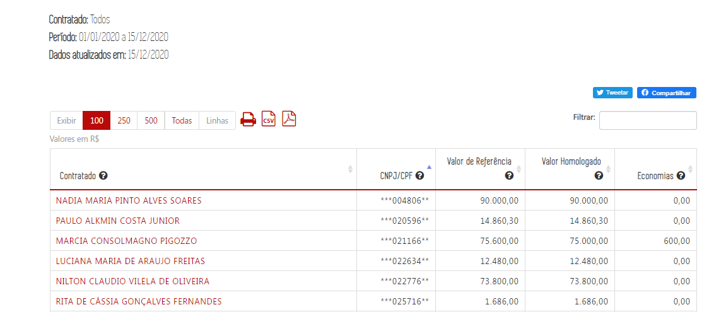
  

* **Formulários de detalhamento de documentos**

Ao acessar os formulários de detalhamento, os seguintes campos devem ser anonimizados:

CONFERE
--
Dados verificados em todos os filtros no ano de 2020

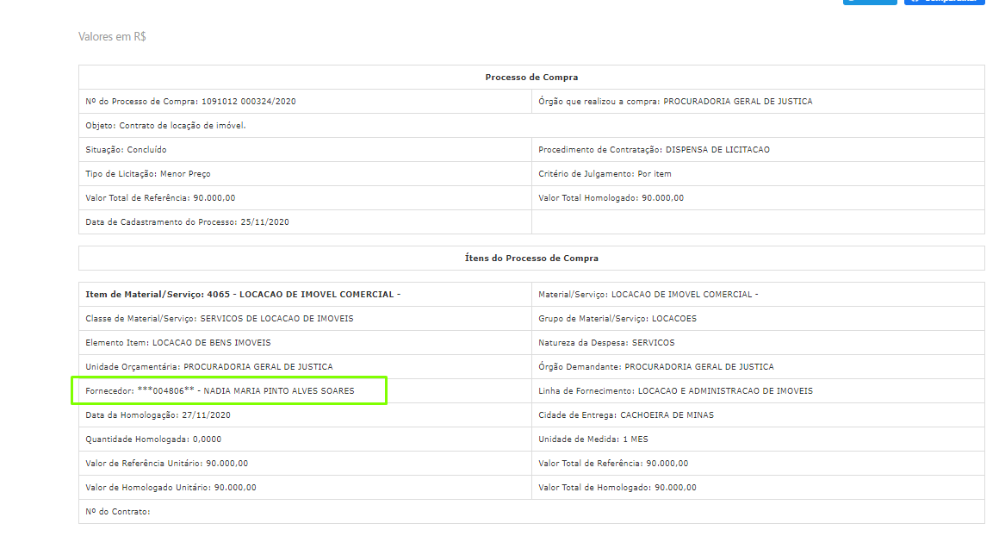

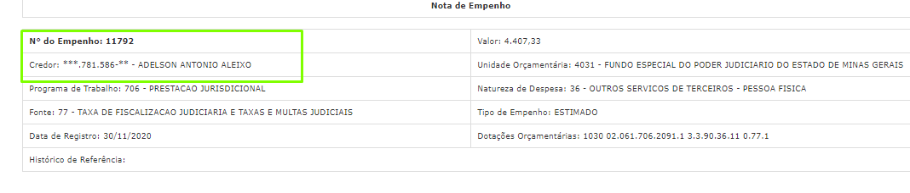

  

* **Formulário de detalhamento da consulta Contratos por órgão**

Ao acessar os formulários de detalhamento, os seguintes campos devem ser anonimizados:

CONFERE
--
Dados verificados em todos os filtros no ano de 2020

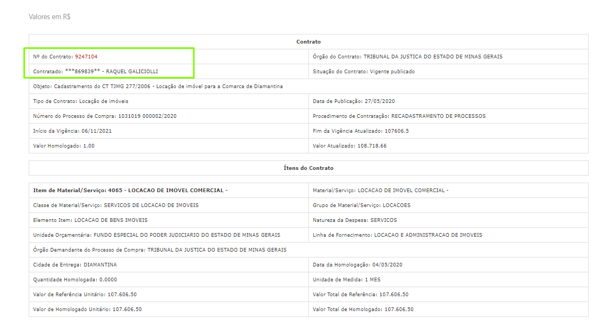

  

## Gestão da Frota - OK
<a href="#top">(inicio)</a>

A anonimização deve ser aplicada no nível 'Proprietário' em todos os filtros da consulta [Gestão da Frota]() que possuem informação de CPF.

| Número do Patrimônio| Placa do Veículo |Marca/Modelo | Ano de Fabricação | Siatuação do Veículo| Tipo de bem|Proprietário|Finalidade do Veículo
|---|---|---|---|---|--|---|-
|---|---|---|---|---|--|*** .000.000- ** -SANDRO LUIS VILELA AVELAR||

CONFERE
--
Dados verificados em todos os filtros no ano de 2020
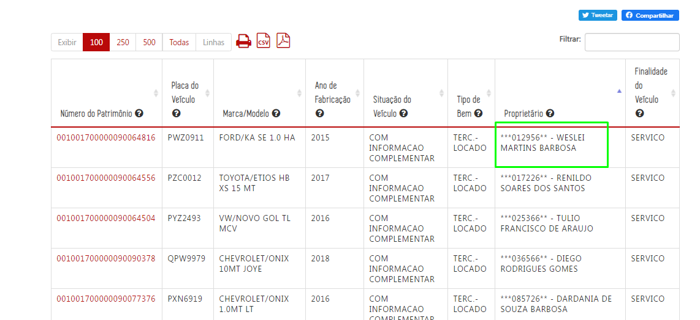

  

* **Formulários de detalhamento de documentos**

Ao acessar os formulários de detalhamento, os seguintes campos devem ser anonimizados:

CONFERE
--
Dados verificados em todos os filtros no ano de 2020
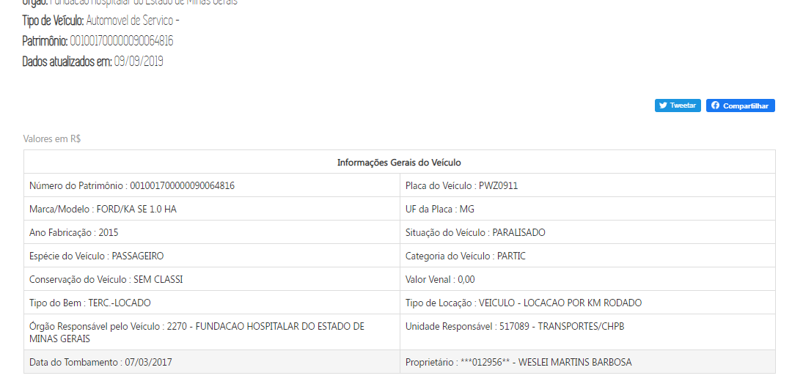

  

## Patrimônio - OK
<a href="#top">(inicio)</a>

A anonimização deve ser aplicada em todos os campos que tiver informação de CPFS e em todos os filtros da consulta [Patrimônio](http://www.transparencia.mg.gov.br/compras-e-patrimonio/patrimonio/patrimonio-terceiros-responsaveis/1/2/).

| CNPJ/CPF|Terceiro Responsável |Quantidade de Bens Ativos |
|---|---|---|
|*** .000.000- **|SANDRO LUIS VILELA AVELAR|-|

CORRIGIDO

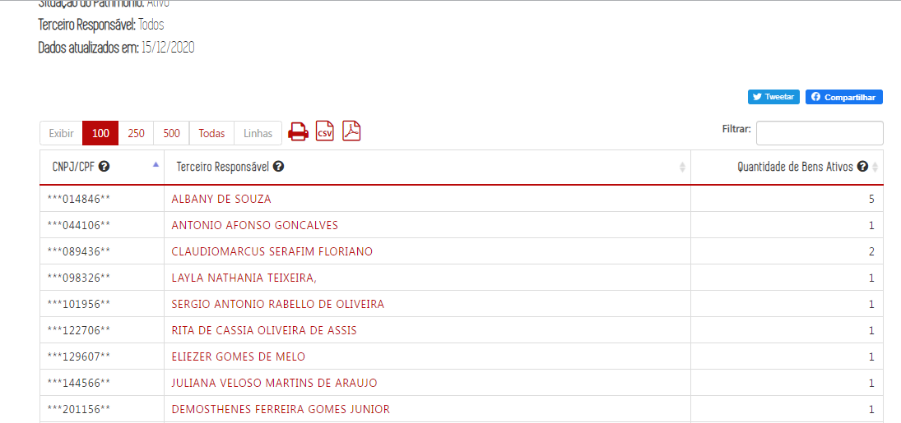

***OBSERVAÇÕES GERAIS***

* As regras acima devem ser aplicadas inclusive no caso em que o nome e CPF sejam apresentados no mesmo campo (ex. formulários de detalhamento).

Confere nas consultas que possuem formulários de detalhamento

* No banco de dados do Portal da Transparência, as informações de CPF devem ser armazenadas sem anonimização, permitindo filtros que utilizem essas informações.

* A anonimização deve ocorrer em todas as pesquisas avançadas que apresentem informação de CPF.

CONFERE
--
* Restos a pagar - 2020

------
* Despesa

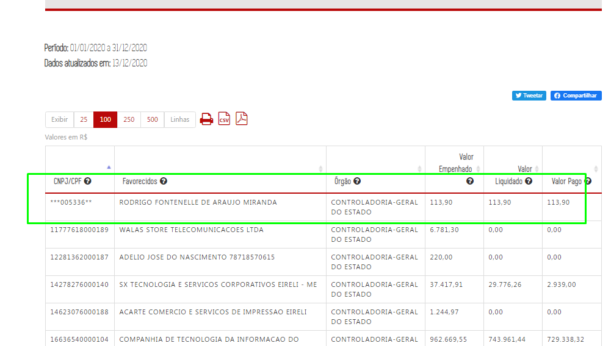

-----
* Frota

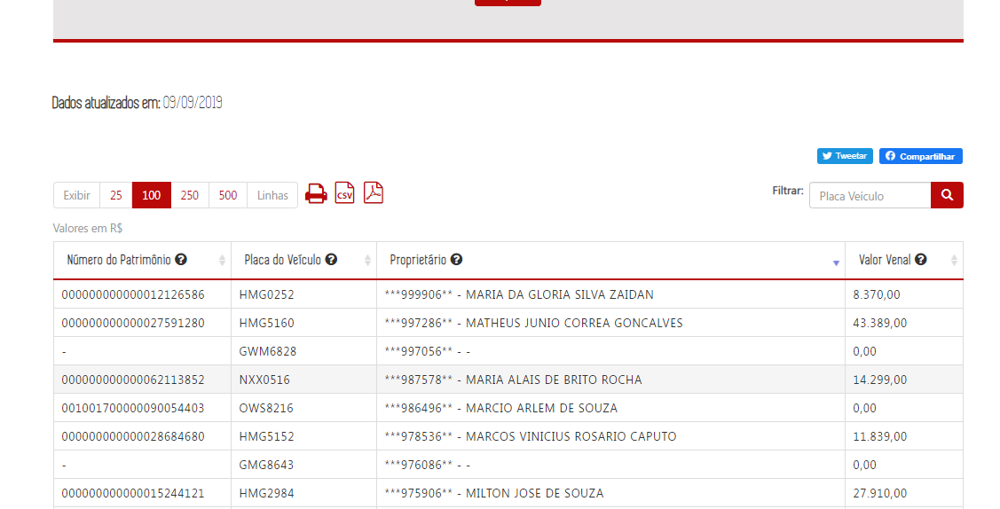

* Ao digitar o CPF de um favorecido na consulta 'Favorecido por CPF / CNPJ', o Portal deve exibir a consulta completa anonimizando os dados do favorecido.

CONFERE
--
* Despesa - Consulta por favorecido CNPJ/CPF ano de 2020.
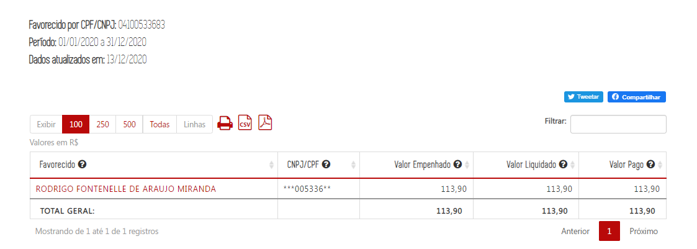
----

* Restos a pagar - Consulta por favorecido CNPJ/CPF ano de 2020.

* Os dados na migalha de pão (caminho da pesquisa) devem ser anonimizados quando exibir o número do CPF;

CONFERE
--
* Despesa - Consulta por favorecido CNPJ/CPF ano de 2020.
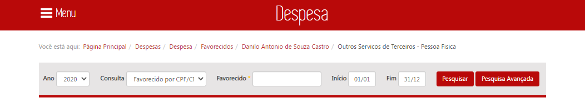

* Ao realizar uma anonimização, o Portal deve continuar a exibir as transações de forma separada.

* A anonimização deve ser aplicada na árvore de todas as consultas

## Dúvida:
<a href="#top">(inicio)</a>

--
Não é possível descaracterizar esses dados, pois são informações digitas pelo usuário.
>"seguindo o mesmo princípio adotado na anonimização e considerando que a informação apresentada no site apenas representa a entrada de dados realizada pelo usuário, e não a recuperação de informações sensíveis, podemos considerar a não descaracterização dessa informação apresentada;"

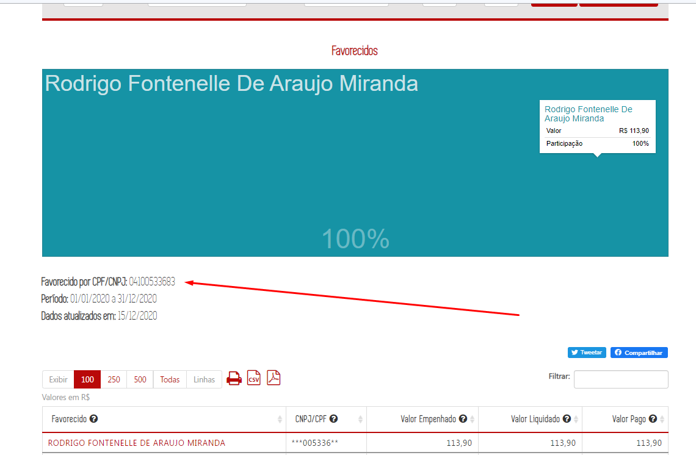

* Quando o usuário clicar no número do processo de compra da consulta "[Compras - Programa de enfrentamento COVID -19](http://www.transparencia.mg.gov.br/covid-19/compras-contratos/contratoscovid-detalharcompra/145425)" deve-se aplicar as mesmas regras de anonimização adotada na Consulta de Compras e Contratos caso exista algum CPF.

Até o momento não existe contratação nessa consulta com pessoa física (CPF), assim não foi possível a conferência

Corrigido - O Portal apresenta erro ao não exibir todos os dados da coluna CPNJ/CPF. Ao realizar a pesquisa por nome do favorecido é exibido todos os favorecidos, porém os dados de CPNJ não estão sendo exibidos.

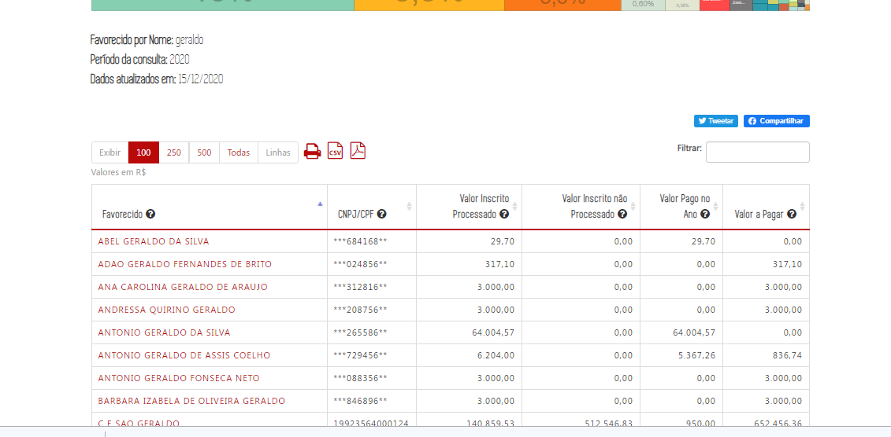

* O CPF administrativo do credor "Diárias e Favorecidos" não deverá ser descaracterizado, uma vez que não se refere a um credor pessoa física. Essa regra vale para todos os CPFs administrativos de todas as consultas

>" Os CPFs institucionais foram desconsiderados da regra, pois se tratam de um documento específico não diretamente associado a uma pessoa física;"

* DESPESA
http://www.transparencia.mg.gov.br/despesa-estado/despesa/despesa-orgaos/2020/01-01-2020/31-12-2020/4015/1915/502/20/42

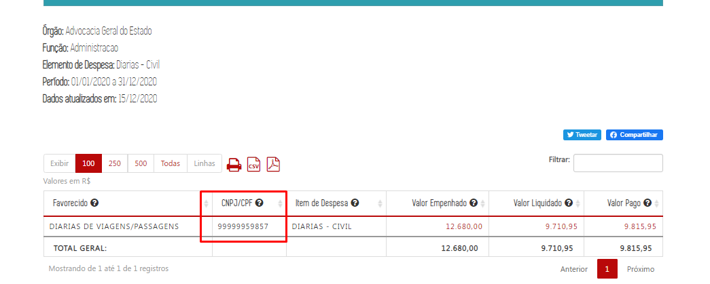
---

* Diárias
http://homologa3.prodemge.gov.br/age7/estado-pessoal/diarias/despesadiarias-programas/2020/01-01-2020/31-12-2020/9807
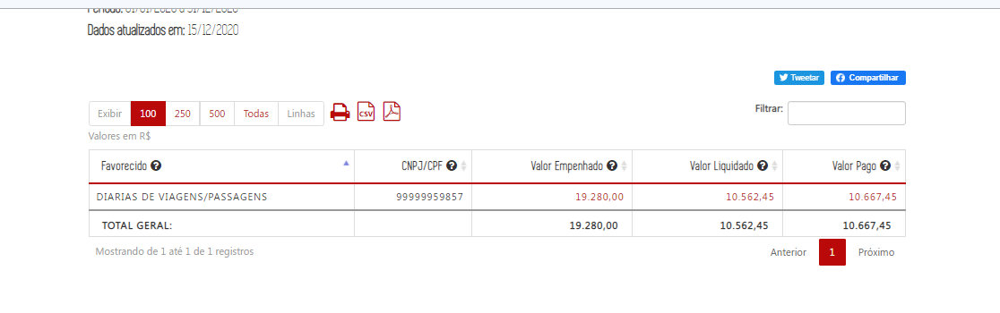

## Extração dos dados -
<a href="#top">(inicio)</a>

## PDF

Os dados serão tratados separadamente uma vez que o erro ocorre também no ambiente de produção
---

#### CSV
* Restos a Pagar
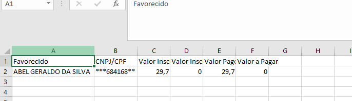

* Despesa

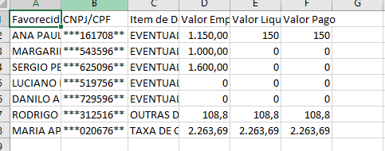

* Concursos
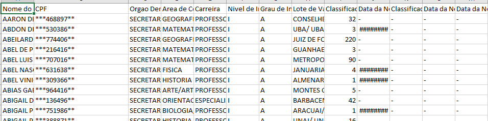

* Diárias
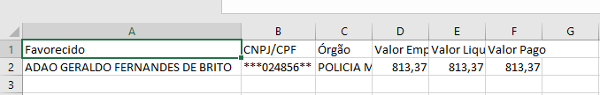

* Viagens
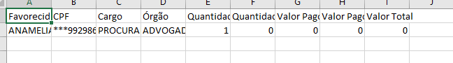

* Compras e Contratos
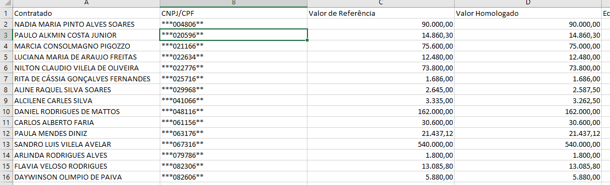

* Frota
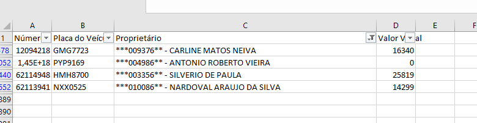

#### IMPRIMIR

* Restos a Pagar
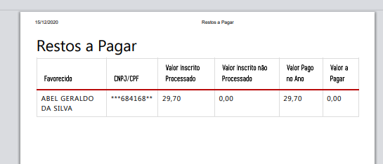

* DESPESA

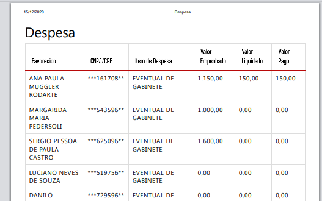

* Concursos

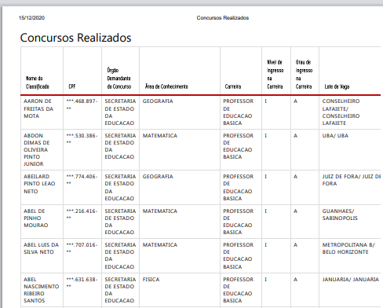

* Diárias
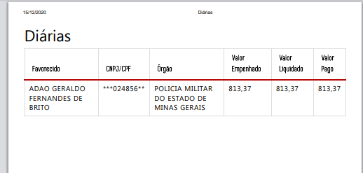

* Viagens
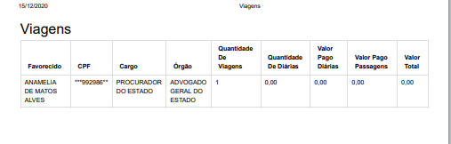

* Compras e Contratos
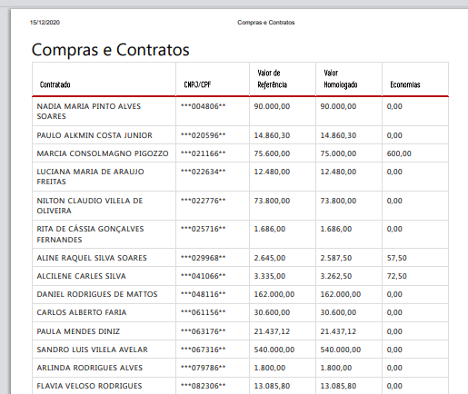

* Frota
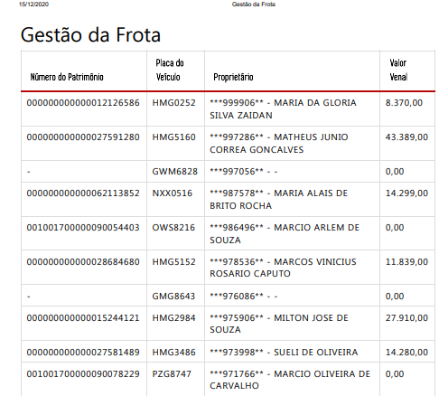

