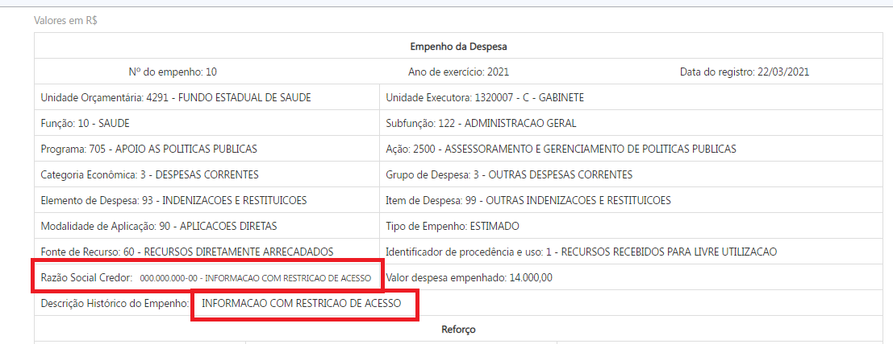
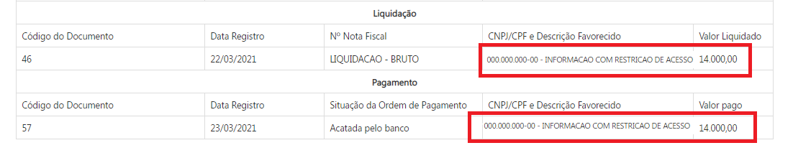
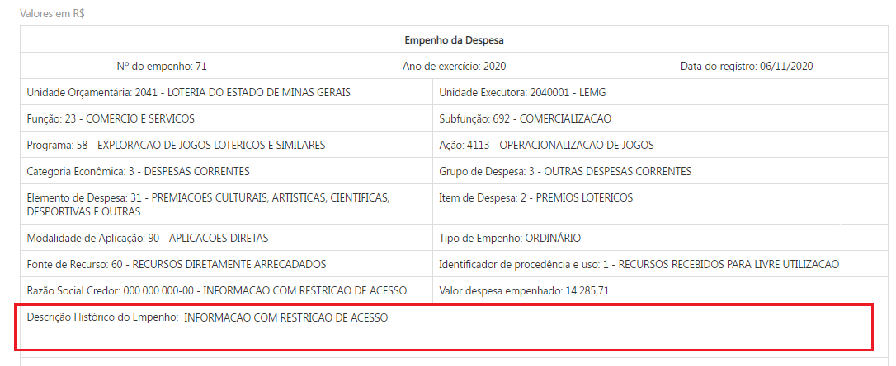

# Visão geral da demanda
<a href="#top">(inicio)</a>

Essa demanda visa anonimizar dados pessoais, como por exemplo nomes e CPFs, de credores pessoas físicas nas consultas do Portal de Transparência a partir de combinações especificas das classificações, inclusive de anos de exercício e períodos de datas especificas, podendo definir até quais empenhos serão anonimizados.

A combinação das classificações orçamentárias, anos e empenho serão informadas  conforme necessidade da Diretoria.

O método de anonimização deve ser flexível para que possa ser aplicado em todas as consultas disponíveis no Portal que apresentem informação de nome e CPF, bem como nas funcionalidades de exportação de dados.

Destaca-se que as informações devem ser armazenadas de forma completa no banco de dados do Portal, permitindo inclusive a realização de buscas nos campos anonimizados.

# Motivação / contexto da demanda
<a href="#top">(inicio)</a>

Foi solicitado pelo Auditor Setorial da SES a informação se o Portal de Transparência divulgava os credores de uma indenização referente aos filhos de hansênicos beneficiários da [Lei 23.137/2018](https://www.almg.gov.br/consulte/legislacao/completa/completa.html?tipo=LEI&num=23137&comp=&ano=2018) que 'Dispõe sobre o pagamento de indenização aos filhos segregados de pais com hanseníase submetidos à política de isolamento compulsório em Minas Gerais.'

Atualmente, o Portal divulga essa informação, mas trata-se de um dado pessoal sensível e, portanto, deve ser anonimizado. Contudo, a identificação desse grupo de credores só passível quando utilizamos a variável 'Unidade de Programação do Gasto'.

Como o mapa de carga do Portal não apresenta essa variável para anonimizar essas informações é preciso realizar a combinação de vários campos, como por exemplo,  classificação orçamentária, ano e número do empenho.

# Especificação
<a href="#top">(inicio)</a>

## Método de anonimização

A anonimização deve ser aplicada em todas as consultas do Portal de Transparência que possuem informações de nomes e CPFs. As combinações de classificação, ano, período, número do empenho, campos e etc devem contemplar todas as possibilidades de cruzamento.

Destaca-se que a regra de anonimização deve permitir tanto a aplicação inicial quanto o reprocessamento, ou seja, a DTA pode definir a partir de qual período a anonimização será aplicada, como também pode solicitar apenas um período especifico.

O método de anonimização consiste em:

- Quando se tratar de dados na consulta básica e formulário de detalhamento:

1. Substituir o nome do credor pelo valor "INFORMAÇÃO COM RESTRIÇÃO DE ACESSO"; e
2. Substituir o CPF do credor pelo valor "000.000.000-00".

As regras acima devem ser aplicadas inclusive no caso em que o nome e CPF sejam apresentados no mesmo campo, como nos formulários de detalhamento.

- Quando se tratar do campo histórico do empenho:

1. Substituir o nome do credor pelo valor "INFORMAÇÃO COM RESTRIÇÃO DE ACESSO" quando for possível identificar essa informação dentro do campo;

2. Substituir o CPF do credor pelo valor "000.000.000-00" quando for possível identificar essa informação dentro do campo
3. Caso não seja possível a identificação dos dados acima por se tratar de um campo aberto, a solução deverá ocultar toda a informação dentro do campo e o texto deverá ser substituído por "INFORMAÇÃO COM RESTRIÇÃO DE ACESSO" .

No banco de dados do Portal da Transparência as informações de nome, CPF e histórico de empenho devem ser armazenadas sem anonimização, permitindo filtros que utilizem essas informações.

## Consulta Despesa / Restos a Pagar

A anonimização deve ser aplicada:

* Gráficos e tabelas do nível favorecido
* Formulários de detalhamento de documentos
* Pesquisa avançada;
* Imprimir página;
* Exportar para csv;
* Exportar para pdf.

### Exemplo 1

Aonimizar os dados dos credores de indenização referente aos filhos de hansênicos.

Combinação a ser utilizada:
- Ano de exercício (2021)
- Unidade orçamentária (4291- Fundo Estadual de Saúde)
- Unidade Executora (1320007 - C- Gabinete)
- Número dos Empenhos (6 a 38 )

#### Gráficos e tabelas do nível favorecido

Ao acessar o nível favorecido das classificações orçamentárias que devem ser anonimizadas, o Portal deverá exibir

| Favorecido | CNPJ/CPF | Item de despesa | Valor Empenhado |Valor Liquidado| Valor Pago|
|---|---|---|---|---|---
INFORMAÇÃO COM RESTRIÇÃO DE ACESSO|000.000.000-00|Outras Indenizações e Restituições| 10.000,00|10.000,00|10.000,00|

#### Formulários de detalhamento de documentos

Ao acessar os formulários de detalhamento os seguintes campos devem ser anonimizados:

* Campo ___Razão Social do Credor___ do formulário de empenho da despesa:

 * Campo ___CNPJ/CPF e Descrição do Favorecido___ do formulário de liquidação e pagamento:

### Exemplo 2

Aonimizar o **histórico de empenho** dos credores de prêmios lotéricos.

Combinação a ser utilizada:
- Ano de exercício (Todos)
- Unidade orçamentária (2041- Loteria do Estado de Minas Gerais)
- Elemento Item de Despesa - (3102 - Prêmios Lotéricos)

#### Formulários de detalhamento de documentos

Ao acessar os formulários de detalhamento os seguintes campos devem ser anonimizados:

* Campo ___Razão Social do Credor___ do formulário de empenho da despesa:

#### Pesquisa Avançada

A anonimização deve ocorrer quando o usuário marcar o campo ___exibir favorecidos___.
