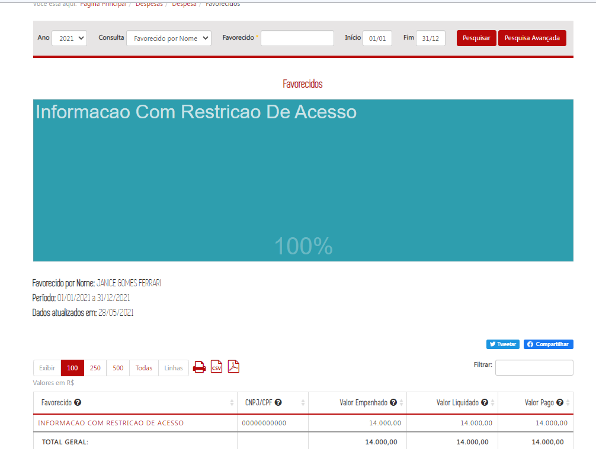
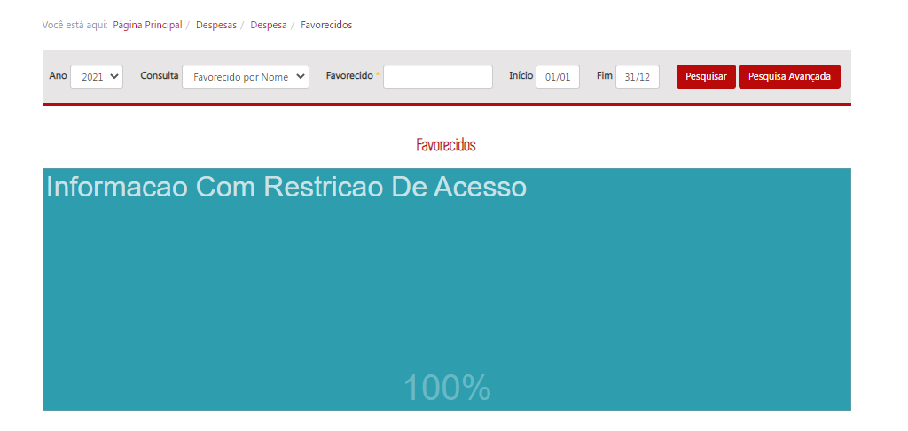
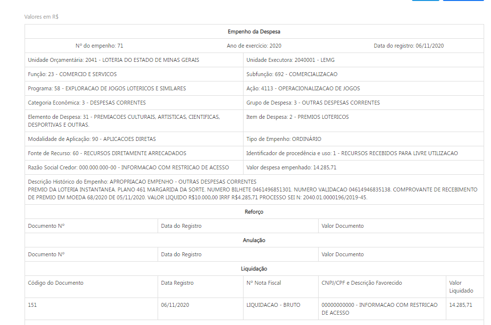
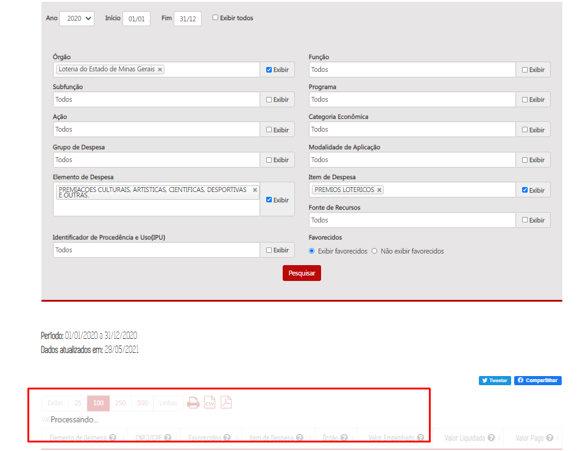
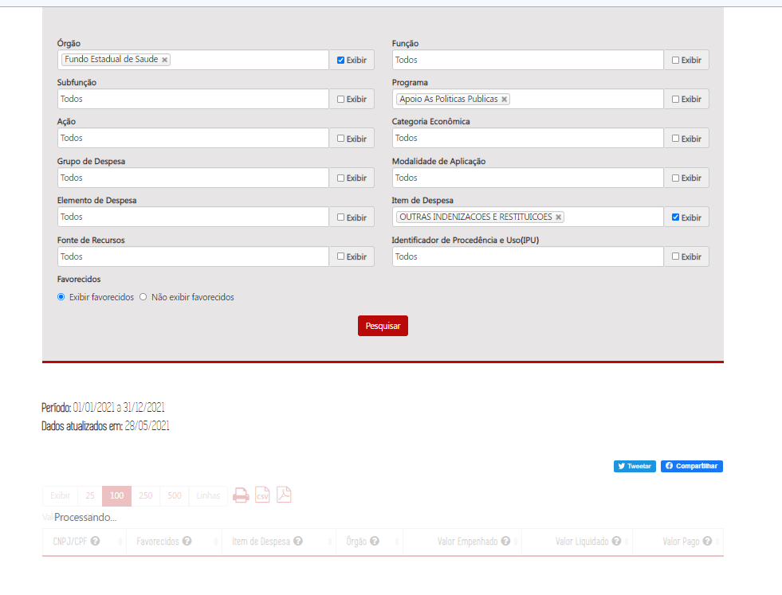

# Homologação do layout da funcionalidade

# Visão geral da demanda
<a href="#top">(inicio)</a>

Essa demanda visa anonimizar dados pessoais, como por exemplo nomes e CPFs, de credores pessoas físicas nas consultas de Despesa e Restos a Pagar (RP) a partir de combinações especificas das classificações da dotação orçamentária, inclusive de anos de exercício e períodos de datas especificas, podendo definir até quais faixas de empenhos serão anonimizados.

Nota 1: No banco de dados do Portal da Transparência as informações de nome e CPF devem ser armazenadas sem anonimização/descaracterização, permitindo filtros que utilizem essas informações.

**Despesa**

Ao pesquisar um dado anonimizado (Nome ou CPF) no campo de busca do Portal o comportamento foi o esperado.

__

Nota 2: A solução deve ser flexível para que as combinações possam ser alteradas mediante provocação da CGE.

# Especificação
<a href="#top">(inicio)</a>

## Método de anonimização

A anonimização deve ser aplicada nas informações de nomes, CPFs e histórico de empenho das consultas de Despesa e Restos a Pagar do Portal de Transparência. As combinações de classificação, ano, período, número do empenho e outros campos devem contemplar todas as possibilidades de cruzamento.

Abaixo segue a lista dos campos que poderão ser combinados para aplicação da funcionalidade:

* Ano de exercício
* Período de datas (data de registro do empenho)
* Unidade Orçamentária
* Unidade Executora
* Função
* Subfunção
* Programa
* Ação
* Identificador de Procedência e Uso
* Categoria Econômica
* Grupo de Despesa
* Elemento de Despesa
* Item de Despesa
* Fonte de Recurso
* Modalidade de Aplicação
* Número do Empenho
* Unidade de Programação de Gasto

A regra de anonimização deve permitir tanto a aplicação inicial quanto o reprocessamento, ou seja, a DTA pode definir a partir de qual período a anonimização será aplicada, como também pode solicitar apenas um período especifico.

O método de anonimização consiste em:

- Quando se tratar de dados na consulta básica e formulário de detalhamento:

1. Substituir o nome do credor pelo valor "INFORMAÇÃO COM RESTRIÇÃO DE ACESSO"; e
2. Substituir o CPF do credor pelo valor "000.000.000-00".

**Despesa**

  

As regras acima devem ser aplicadas inclusive no caso em que o nome e CPF sejam apresentados no mesmo campo, como nos formulários de detalhamento.

- Quando se tratar do campo histórico do empenho:

1. Substituir o nome do credor pelo valor "INFORMAÇÃO COM RESTRIÇÃO DE ACESSO" quando for possível identificar essa informação dentro do campo;

2. Substituir o CPF do credor pelo valor "000.000.000-00" quando for possível identificar essa informação dentro do campo
3. Caso **não seja possível** a identificação dos dados acima por se tratar de um campo aberto, a solução deverá ocultar toda a informação dentro do campo e o texto deverá ser substituído por "INFORMAÇÃO COM RESTRIÇÃO DE ACESSO" .

Como default sempre que for solicitado a anonimização dos dados de um determinado empenho o seu respectivo histórico deve ser anonimizado.

**Despesa**

  

No **banco de dados** do Portal da Transparência as informações de nome, CPF e histórico de empenho devem ser armazenadas sem anonimização, permitindo filtros que utilizem essas informações. Destaca-se ainda que a funcionalidade deve permitir que os dados deixem de ser anonimizados a qualquer momento sob demanda da CGE.

## Consulta Despesa / Restos a Pagar

A anonimização deve ser aplicada:

* Gráficos e tabelas do nível favorecido
* Formulários de detalhamento de documentos
* Pesquisa avançada;
* Imprimir página;
* Exportar para csv;
* Exportar para pdf.

### Exemplo 1

Anonimizar os dados dos credores de indenização referente aos filhos de hansênicos.

Combinação a ser utilizada:
- Ano de exercício (2021)
- Unidade orçamentária (4291- Fundo Estadual de Saúde)
- Unidade Executora (1320007 - C- Gabinete)
- Número dos Empenhos (6 a 38 )

#### Gráficos e tabelas do nível favorecido

Ao acessar o nível favorecido das classificações orçamentárias que devem ser anonimizadas, o Portal deverá exibir

| Favorecido | CNPJ/CPF | Item de despesa | Valor Empenhado |Valor Liquidado| Valor Pago|
|---|---|---|---|---|---
INFORMAÇÃO COM RESTRIÇÃO DE ACESSO|000.000.000-00|Outras Indenizações e Restituições| 10.000,00|10.000,00|10.000,00|

**Despesa**

**Despesa**

#### Formulários de detalhamento de documentos

Ao acessar os formulários de detalhamento os seguintes campos devem ser anonimizados:

* Campo ___Razão Social do Credor___ do formulário de empenho da despesa:

* Campo ___CNPJ/CPF e Descrição do Favorecido___ do formulário de liquidação e pagamento:

**Despesa**

Nesse exemplo não foi possível verificar a anonimização no formulário de pagamento, pois os dados não estão sendo exibidos no [ambiente de homologação](http://homologa3.prodemge.gov.br/age7/despesa-estado/despesa/despesa-favorecidos/2021/01-01-2021/31-12-2021/2953876/JANICE%20GOMES%20FERRARI/0/3/1/562/25/51/3566/154/483/9905/empenhado/13/6946479/0/0) mesmo tendo havido pagamento [eg. Portal Produção](http://www.transparencia.mg.gov.br/despesa-estado/despesa/despesa-favorecidos/2021/01-01-2021/31-12-2021/0/JANICE%20GOMES%20FERRARI/0/3).

### Exemplo 2

Anonimizar o **histórico de empenho** dos credores de prêmios lotéricos.

Combinação a ser utilizada:
- Ano de exercício (Todos)
- Unidade orçamentária (2041- Loteria do Estado de Minas Gerais)
- Elemento Item de Despesa - (3102 - Prêmios Lotéricos)

#### Formulários de detalhamento de documentos

Ao acessar os formulários de detalhamento os seguintes campos devem ser anonimizados:

* Campo ___Razão Social do Credor___ do formulário de empenho da despesa:

**Despesa**

A funcionalidade não foi aplicada no histórico de empenho da combinação do exemplo 2 http://homologa3.prodemge.gov.br/age7/despesa-estado/despesa/despesa-orgaos/2020/01-01-2020/31-12-2020/9770/4514/588/25/51/2933918/1/3455/empenhado/71/6809941/0/0

#### Pesquisa Avançada

A anonimização deve ocorrer quando o usuário marcar o campo ___exibir favorecidos___.

**Despesa**

Não foi possível verificar a funcionalidade na pesquisa avançada porque ela não está respondendo aos filtros selecionados.

---

**TESTES**
--

Favor implementar as combinações abaixo para testes.
A CGE irá verificar os dados e depois elas serão retiradas para nova conferência.

A anonimização realizada na consulta de despesa deve ser refletida na consulta de Restos a Pagar quando o empenho for inscrito em RP processado ou RP não processado.

**TESTE 1**

Combinação a ser utilizada:

- Ano de exercício (2016)
- Unidade orçamentária (4291- Fundo Estadual de Saúde)
- Unidade Executora (1320003 - C - SUBSILS/SGP(RH)
- UPG  (550 - DESPESAS ADMINISTRATIVAS DA SUPERINTENCIA DE GESTAO DE PESSOAS)

OBS: Os empenhos foram realizados em 2016 (eg.[Consulta de Despesa](http://www.transparencia.mg.gov.br/despesa-estado/despesa/despesa-favorecidos/2016/01-01-2016/31-12-2016/1741243/ADRIANA%20MARQUES%20DE%20ARAUJO/0/3/0/466/20/42/2991/130/18/3541/empenhado/4/9914927/0/0)), porém estão inscritos em Restos a Pagar em 2021 (eg. [Consulta Restos a Pagar](http://www.transparencia.mg.gov.br/despesa-estado/restos-a-pagar/restospagar-orgaos/2021/4113/466/42/20/2991/130/18))

**TESTE 2**

- Ano de exercício (2020)
- Unidade orçamentária (2011 - INSTITUTO DE PREVIDENCIA DOS SERVIDORES DO ESTADO DE MINAS GERAIS)
- Item de Despesa: (7 - PRECATORIOS - OUTROS)
- Identificador de procedência e uso: 9 - RECURSOS RECEBIDOS PARA PRECATORIOS E SENTENCAS JUDICIAIS

OBS: Os empenhos foram realizados em 2020 (eg.[Consulta de Despesa - Pesquisa Avançada](http://www.transparencia.mg.gov.br/despesa-estado/despesa/despesa-resultado-pesquisa-avancada/2020/01-01-2020/31-12-2020/3976/0/0/0/0/0/0/0/0/2767/0/97/0/0/0/0/0/0/0/0/0/0/0/0/1/0)) e [Pesquisa Básica](http://www.transparencia.mg.gov.br/despesa-estado/despesa/despesa-orgaos/2020/01-01-2020/31-12-2020/3976/1894/476/20/39), porém estão inscritos em Restos a Pagar em 2021 (eg. [Consulta Restos a Pagar - Pesquisa Avançada](http://www.transparencia.mg.gov.br/despesa-estado/restos-a-pagar/restospagar-resultado-pesquisa-avancada/2021/4193/0/0/0/0/0/0/0/0/2767/0/97/0/0/0/0/0/0/0/0/0/0/0/0/1/0/0)) e [Pesquisa Básica](http://www.transparencia.mg.gov.br/despesa-estado/restos-a-pagar/restospagar-orgaos/2021/4193/476/39/20/2767/130/58)

