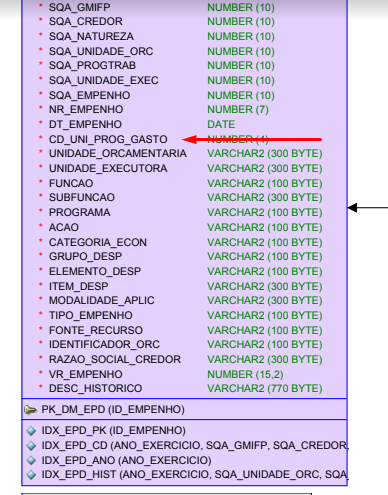

# Visão geral da demanda
<a href="#top">(inicio)</a>

Essa demanda visa acrescentar o campo "Unidade de Programação de Gasto" no Portal com o objetivo de realizar combinações para futuras anonimizações.

# Homologação do layout da funcionalidade
<a href="#top">(inicio)</a>

A Diretoria Central de Transparência Ativa (DTA) não enviou a especificação para essa demanda, uma vez que os dados serão exibidos apenas no mapa de carga do Portal.

  

CORRIGIR
--

O mapa de carga enviado consta apenas o Código da UPG na consulta de despesa.

A informação no mapa dever ser código e descrição conforme ocorre nos demais campos do [Diagrama Entidade Relacionamento](https://drive.google.com/drive/u/0/folders/1Y77huM56ODxQx876lvkabPc2aZhttJUq), tanto da consulta de despesa como da consulta de restos a pagar.

  </div
