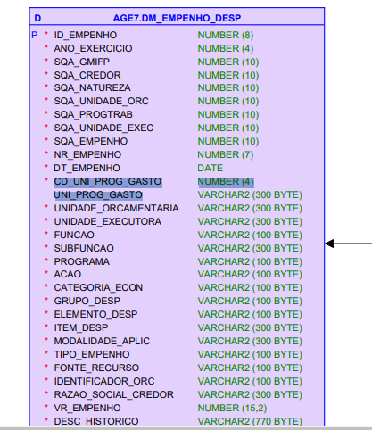

# Visão geral da demanda
<a href="#top">(inicio)</a>

Essa demanda visa acrescentar o campo "Unidade de Programação de Gasto" no Portal com o objetivo de realizar combinações para futuras anonimizações.

# Homologação do layout da funcionalidade
<a href="#top">(inicio)</a>

A Diretoria Central de Transparência Ativa (DTA) não enviou a especificação para essa demanda, uma vez que os dados serão exibidos apenas no mapa de carga do Portal.

  

CORRIGIDO - Despesa
--

~~O mapa de carga enviado consta apenas o Código da UPG na consulta de despesa.~~

A informação no mapa dever ser código e descrição conforme ocorre nos demais campos do [Diagrama Entidade Relacionamento](https://drive.google.com/drive/u/0/folders/1Y77huM56ODxQx876lvkabPc2aZhttJUq), tanto da consulta de despesa como da consulta de restos a pagar.

Restos a pagar
--

A UPG não é registrada nas informações de restos a pagar no armazém ela se baseia no UPG do empenho original. Assim os dados não são exibidos no DER de RP.

Conforme informado pelo Luiz (Prodemge) foi adicionado um vínculo entre o empenho original e o RP, coisa que não existia, exatamente para recuperar a informação da UPG.
Assim foi possível processar a anonimização e é por isso que no mapa de carga existem dois fluxos: um que recupera dados de Despesa e outro que usa os dados de Despesa para recuperar os restos a pagar associados.

  </div

  </div
