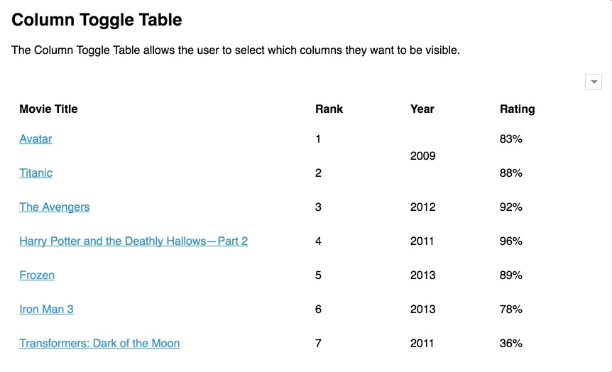

# Visão geral da demanda
<a href="#top">(inicio)</a>

Essa demanda visa remodelar a interface a Pesquisa Avançada do Portal de Transparência (PdT). Segue as consultas que serão alteradas:
1. Despesa
2. Restos a Pagar
3. Viagens
4. Compras e Contratos
5. Patrimônio
6. Convênios de Saída
7. Convênios de Entrada

# Motivação / contexto da demanda
<a href="#top">(inicio)</a>

# Especificação
<a href="#top">(inicio)</a>

Esse documento tem como base a remodelagem das pesquisas avançadas dos PdT. Abaixo será descrito o fluxo principal que deverá ser aplicado em todas as consultas.

•	Alteração do ícone
* Barra vertical com filtros;
•	Barra vertical deslizante;
•	Filtros Aplicados;
•	Tabela de Resultado;
•	Data de atualização dos dados;
•	Período;
•	Compartilhamento nas redes sociais
•	Ícone de acessibilidade, dúvidas e canais de atendimento na lateral a direita

As particularidades e filtros de cada consulta serão detalhadas no capitulo correspondente.

## Página Inicial da consulta
<a href="#top">(inicio)</a>

Ao acessar qualquer consulta do PdT o ícone de acesso a *[Pesquisa Avançada]* será apresentado na parte superior da barra de pesquisa.
* O layout (tipografia e cor) deverá seguir o padrão adotado pelo PdT. Porém, para que o ícone tenha destaque na página inicial **não** adotar a cor vermelha usada atualmente.

Exemplo:

## Campos da  Pesquisa Avançada
<a href="#top">(inicio)</a>

A pesquisa Avançada será composta pelos seguintes campos:

* Barra vertical com filtros;
* Barra vertical deslizante;
* Filtros Aplicados;
* Tabela de Resultado;
* Compartilhamento nas redes sociais
* Extração de dados

### Barra de Navegação Vertical
<a href="#top">(inicio)</a>

A barra de navegação vertical terá os seguintes atributos:

* Todos os filtros da barra de navegação terão tooltip.

* A Lista de filtros será localizada a esquerda da tela. A DTA irá definir os filtros gerais e os filtros padrões que deverão ser exibidos em cada consulta.

* O usuário poderá exibir mais filtros ao clicar em ***(+) Mais Filtros*** ou ocultar ao clicar em ***(-) Menos Filtros***. Caso a quantidade de filtros ultrapasse o limite da tela deverá ser utilizado a barra de rolagem.
Exemplo: https://www.pontofrio.com.br/Informatica/?Filtro=C56&nid=201704

* O usuário poderá realizar a busca de qualquer filtro na **barra de pesquisa**. A barra de pesquisa será representada pelo atributo *placeholder*, ou seja, indicação de como o campo deverá sem preenchido.

* A barra de navegação poderá ser **ocultada/exibida** ([*collapsed Sidebar*](https://www.w3schools.com/howto/howto_js_collapse_sidebar.asp)) a partir dos comandos abaixo.
Exemplo: [Portal de Transparência Federal](http://www.portaltransparencia.gov.br/despesas/programa-e-acao?ordenarPor=programa&direcao=asc)       

    *	Ocultada: ao clicar no símbolo **[<<]** ou no botão **[<< Ocultar Filtros]**;
    * Exibida: ao clicar no botão **[<< Exibir Filtros]**

OBS: Ao ocultar a barra de navegação vertical dos demais conteúdos (tabela de resultados, campos aplicados e etc) serão ajustados na página.

>Colocar gif fazer a tabela de resultados primeiro

* A barra de navegação deverá indicar a seção em que o utilizador se encontra.

* Ao clicar em qualquer filtro da barra de navegação será exibido uma outra barra de filtros deslizante onde o usuário deverá selecionar os parâmetros da pesquisa.       

* Todos os filtros selecionados serão exibidos na tabela de resultado.

>Colocar gif

### Barra deslizante
<a href="#top">(inicio)</a>

* A barra deslizante só será exibida se o usuário clicar em algum filtro  da barra de navegação.

* A barra deslizante será ocultada a partir dos seguintes comandos:
   * ao clicar no símbolo **[<<]**;
   * ao clicar em qualquer parte da tela, que não seja a barra de deslizante.  
Exemplo: [Portal de Transparência Federal](http://www.portaltransparencia.gov.br/despesas/programa-e-acao?ordenarPor=programa&direcao=asc)

* Quando a barra deslizante for ocultada a seção em que o utilizador se encontra deverá ser desativada e ao clicar em outro filtro a barra de navegação vertical a barra deslizante será exibida automaticamente.

>Colocar gif (ocultar/exibir barra)

* Ao colocar o cursor do mouse sob a **barra de pesquisa** será exibido uma lista suspensa com todos os parâmetros referente ao campo. Para selecionar o parâmetro desejado o usuário poderá usar a barra de rolagem ou usar o atributo *autocomplete*.  

* A **barra de pesquisa** deve aceitar várias formas de preenchimento dos dados.
  * Autocompletar desde a primeira letra;
  * Desconsiderar acentuação, letras maiúsculas/minúsculas;
  * Desconsiderar palavras intermediárias (ex.: Ao digitar “gestao pública”, um dos resultados será “Gestão da Administração Pública”);
  * O usuário poderá pesquisar código ou descrição das classificações orçamentárias (ex. [Pesquisa Avançada - Proposta Orçamentária do PdT](http://www.transparencia.mg.gov.br/planejamento-e-resultados/proposta-lei-orcamentaria/proposta-orcamentaria/proposta-pesquisa-avancada)).   

* Ao selecionar o período específico a barra deslizante de cada filtro irá exibir apenas as classificações orçamentárias vigentes no ano. A exceção será para a consulta de Restos a Pagar, onde os parâmetros da barra deslizante irá refletir apenas as classificações orçamentárias inscritas em restos a pagar, e não a classificação orçamentária vigente no ano.

* A medida que o usuário selecionar um parâmetro de qualquer filtro automaticamente apenas as opções que possuem relacionamento com o parâmetro selecionado será exibida nos demais filtros.  
Ex. Ao selecionar o parâmetro '1521- Controladoria-Geral do Estado' no filtro Órgão e em seguida clicar no filtro Programa apenas os programas que tiveram execução na Controladoria-Geral do Estado serão exibidos.

* A exibição de código e descrição será diferente em cada seção da pesquisa avançada:
 * barra de pesquisa e filtros aplicados: exibir código e descrição no mesmo campo (ex. Consulta Avançada - Proposta Orçamentária);
 * Tabela de resultado: exibir apenas descrição;
 * Opção exportar CSV.: exibir código e descrição em campos distintos, independente de o usuário selecionar a opção código na tabela de resultado.

* A barra deslizante deverá listar os parâmetros selecionados pelo usuário com a opção ***[X]*** onde o usuário poderá remover os parâmetros não desejados.

* O usuário poderá combinar vários parâmetros para o mesmo filtro (selecionar mais de um item) ou selecionar a opção ***[Todos]***. Ao selecionar o parâmetro ***[Todos]***, será exibido todos os parâmetros daquele campo com a opção ***[X]*** onde o usuário poderá remover aqueles não necessários.

>colocar imagem dos filtros todos

* Ao finalizar a seleção o usuário deverá clicar em **Adicionar**. Caso o usuário queira desmarcar todas as opções ele poderá clicar em **Limpar**.

>colocar imagem  adicionar / limpar

* Os filtros **Favorecido** e **CNPJ/CPF do Favorecido** devem usar o atributo *placeholder*:

  * Favorecido: informe pelo menos 3 caracteres
  * CNPJ/CPF do Favorecido: apenas números

>colocar imagem

* Todos os parâmetros selecionados serão exibidos no campo Filtros Aplicados.

### Filtros Aplicados
<a href="#top">(inicio)</a>

* O usuário poderá ocultar/exibir o conteúdo do campo filtros aplicados.

> gif

* Como padrão o filtro **Período** será exibido no campo filtros aplicados. O período exibido será o mm/aaaa inicial do exercício vigente até o mm/aaaa da última atualização dos dados.

> imagem

* O campo filtro aplicados será composto pelos botões: Pesquisar, Atualizar e Limpar:

  * Pesquisar: será exibido após o usuário selecionar qualquer parâmetro na barra deslizante.  O Usuário deverá clicar em pesquisar para exibir o resultado desejado.
 * Atualizar: será exibido quando o usuário remover/adicionar algum parâmetro, ou seja, fizer qualquer alteração no campo filtros aplicados.
 * Limpar: ficará disponível sempre que houver pelo menos um parâmetro selecionado. Ao clicar nesse botão será excluído todo o conteúdo desse campo.

* Casos os parâmetros selecionados não retornem nenhuma informação o PdT deverá apresentar uma mensagem informando que '*Não há dados a serem exibidos com os parâmetros selecionados.*''

* Os parâmetros selecionados na barra deslizante deverão ser exibidos na ordem que o usuário escolheu.

* Todos os parâmetros serão representados no campo filtros aplicados da seguinte forma:
  * **Filtro** (*nome do filtro*): **Parâmentro** (*nome do parâmetro*)(**X**)(*opção de fechar*);

* À medida que o usuário for incluindo parâmetros na pesquisa a tabela de resultados será deslocada para baixo quando ultrapassar o limite da tela.

>colocar imagem

### Tabela de resultados
<a href="#top">(inicio)</a>

* A tabela de resultado apresentará colunas padrões que serão exibidas independentemente de o usuário selecionar/aplicar algum filtro. A DTA irá definir as colunas que deverão ser exibidos em cada consulta.

* A data de atualização dos dados e o período relacionado serão exibidos acima da tabela de resultados.

* Estrutura de design das tabelas de resultados:
  * Cabeçalho fixo (*[Fixer Header](https://medium.com/nextux/design-better-data-tables-4ecc99d23356#86cf)*). Exemplo: Consulta de Remuneração;

  * Rolagem horizontal (*[Horizontal Scroll](https://medium.com/nextux/design-better-data-tables-4ecc99d23356)*). Quando o número de colunas ultrapassar o limite da página o PdT deve possibilizar a rolagem horizontal.

  * Colunas movíveis e classificáveis conforme ocorre atualmente;

  * Paginação e seleção da quantidade de linhas a serem exibidas, conforme ocorre atualmente;
  * Texto ajustável nas colunas, ou seja, caso seja necessário pode haver quebra de linha;

  * Acrescentar / remover colunas ([*hide/show columns*](https://ux.stackexchange.com/a/110079)).Ao clicar em ***Adicionar/remover colunas*** será exibido uma barra lateral a direta com todas as colunas que poderão ser adicionadas ou removidas. A DTA irá definir a lista com as colunas de consulta.

* Quando o usuário exibir/ocultar alguma coluna a tabela de resultados será atualizada automaticamente (eg.[*Column Toggle Table*](https://ux.stackexchange.com/questions/110077/best-practices-to-allow-user-to-hide-show-columns-in-a-data-table/110079#110079)).

* O ícone ***Adicionar/Remover Colunas*** será ocultada/exibido a partir dos seguintes comandos:

  * Exibir / Ocultar: clicando no ícone
  * Ocultar: ao clicar em qualquer parte da tela, que não seja no ícone ***Adicionar/Remover Colunas***.

* A tabela do ícone ***Adicionar/Remover Colunas*** além dos filtros pré-determinados pela DTA terá uma barra de pesquisa onde o usuário poderá digitar o filtro desejado. O atributo *autocomplete* e a barra de rolagem devem ser aplicados nessa tabela.

* A barra de pesquisa da tabela de resultado deverá retornar os dados da tabela que estão exibidos. A medida que o usuário for digitando os dados a busca será acionada. O atributo *placeholder*: deve ser aplicado na barra de pesquisa.

* As colunas definidas como padrão ficarão marcardas na tabela ***Adicionar/Remover Colunas*** podendo o usuário desativá-las.

* Ao inserir qualquer coluna essas serão incluídas antes das colunas de valores. E caso seja incluída alguma de valor essa será incluída ao final das colunas.

* A tabela de resultado deverá apresentar o **TOTAL GERAL**  e o **SUBTOTAL** de acordo com o comportamento do usuário:

  * TOTAL GERAL: quando o usuário não aplicar nenhum filtro na tabela e todos os dados estarem exibidos em uma única página;
  * SUBTOTAL: quando o usuário aplicar filtros na tabela através da barra de pesquisa;
  * SUBTOTAL: quando houver paginação no tabela de resultado, ou seja, houver mais de uma página de resultado.

>[Issues#]() definir esse comportamento

* Download dos dados:

  * PDF: O documento gerado em PDF deverá exibir a logo do Portal de Transparência no início da página e a *URL* no fim da página. O arquivo gerado irá exibir os mesmos dados apresentados na tela considerando todos os filtros aplicados e inclusive o **TOTAL GERAL** ou **SUBTOTAL**;

  * CSV: Será exibido a tabela completa de todas as páginas, independente do filtro aplicado. o valor **TOTAL GERAL** também deverá ser exibido

>[Issues#]() definir esse comportamento da extração dos dados

* Ao clicar no campo ***Download Base Completa*** o usuário será direcionado para o conjunto de dados da respectiva consulta no [Portal de Dados Abertos](https://dados.mg.gov.br/). O PdT deverá permitir que a equipe DTA inclua/altere da *url* desse campo através da área administrativa do Portal.

*  O PdT deverá permitir que por meio da área administrativa do Portal a equipe DTA decida se o campo ***Download Base Completa*** será exibido ou não na parte superior da tabela de resultado.

* Após a seleção dos parâmetros definidos pelo usuário a tabela de resultado levará em consideração os parâmetros aplicados.

## Filtros das consultas

### Despesa

### Filtros da barra vertical  (definir a ordem)
a)	Período (mm/aaaa)
b)	Órgão
c)	Favorecido
d)	CNPJ/CPF do Favorecido
e)	Programa
f)	Ação
g)	Função
h)	Subfunção
i)	Categoria Econômica
j)	Grupo de Despesa
k)	Modalidade de Aplicação
l)	Elemento de despesa
m)	Item de Despesa
n)	Fonte de Recursos
o)	Identificador de Procedência e Uso (IPU)
Número do Empenho

### Filtros padrões (definir)
