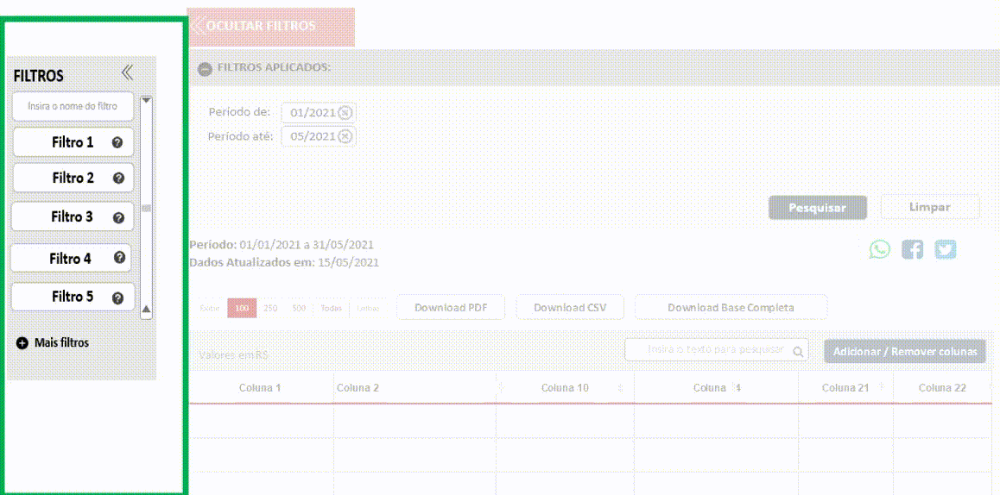

# Visão geral da demanda
<a href="#top">(inicio)</a>

Essa demanda visa remodelar a interface a Pesquisa Avançada do Portal de Transparência (PdT). Segue as consultas que serão alteradas:
1. Despesa
2. Restos a Pagar
3. Viagens
4. Compras e Contratos
5. Patrimônio
6. Convênios de Saída
7. Convênios de Entrada

# Motivação / contexto da demanda
<a href="#top">(inicio)</a>

# Especificação
<a href="#top">(inicio)</a>

Esse documento tem como base a remodelagem das pesquisas avançadas dos PdT. Abaixo será descrito o fluxo principal que deverá ser aplicado em todas as consultas.

•	Alteração do ícone
* Barra vertical com filtros;
•	Barra vertical deslizante;
•	Filtros Aplicados;
•	Tabela de Resultado;
•	Data de atualização dos dados;
•	Período;
•	Compartilhamento nas redes sociais
•	Ícone de acessibilidade, dúvidas e canais de atendimento na lateral a direita

As particularidades e filtros de cada consulta serão detalhadas no capitulo correspondente.

## Página Inicial da consulta
<a href="#top">(inicio)</a>

Ao acessar qualquer consulta do PdT o ícone de acesso a *[Pesquisa Avançada]* será apresentado na parte superior da barra de pesquisa.
* O layout (tipografia e cor) deverá seguir o padrão adotado pelo PdT. Porém, para que o ícone tenha destaque na página inicial **não** adotar a cor vermelha usada atualmente.

Exemplo:

## Campos da  Pesquisa Avançada
<a href="#top">(inicio)</a>

A pesquisa Avançada será composta pelos seguintes campos:

* Barra vertical com filtros;
* Barra vertical deslizante;
* Filtros Aplicados;
* Tabela de Resultado;
* Compartilhamento nas redes sociais

### Barra de Navegação Vertical

A barra de navegação vertical terá os seguintes atributos:

* Todos os filtros da barra de navegação terão tooltip.

* A Lista de filtros será localizada a esquerda da tela. A DTA irá definir os filtros gerais e os filtros padrões que deverão ser exibidos em cada consulta.

* O usuário poderá exibir mais filtros ao clicar em ***(+) Mais Filtros*** ou ocultar ao clicar em ***(-) Menos Filtros***. Caso a quantidade de filtros ultrapasse o limite da tela deverá ser adicionado a barra de rolagem.
Exemplo: https://www.pontofrio.com.br/Informatica/?Filtro=C56&nid=201704

* O usuário poderá realizar a busca de qualquer filtro na **barra de pesquisa**. A barra de pesquisa será representada pelo atributo *placeholder*, ou seja, indicação de como o campo deverá sem preenchido.

* A barra de navegação poderá **ocultada/exibida** ([*collapsed Sidebar*](https://www.w3schools.com/howto/howto_js_collapse_sidebar.asp)) a partir dos comandos abaixo.
Exemplo: [Portal de Transparência Federal](http://www.portaltransparencia.gov.br/despesas/programa-e-acao?ordenarPor=programa&direcao=asc)       

    *	Ocultada: ao clicar no símbolo **[<<]** ou no botão **[<< ocultar filtros]**;
    * Exibida: ao clicar no botão **[<< exibir filtros]**

OBS: Ao ocultar a barra de navegação vertical dos demais conteúdos serão ajustados na página.

>Colocar gif

* A barra de navegação deverá indicar a seção em que o utilizador se encontra.

* Ao clicar em qualquer filtro da barra de navegação será exibido uma outra barra de filtros deslizante onde o usuário deverá selecionar os parâmetros da pesquisa.       
 OBS:A barra deslizante só será apresentada se o usuário clicar no filtro.

* Todos os filtros selecionados serão exibidos na tabela de resultado.

>Colocar gif

### Barra deslizante

## Filtros das consultas

### Despesa

### Filtros da barra vertical  (definir a ordem)
a)	Período (mm/aaaa)
b)	Órgão
c)	Favorecido
d)	CNPJ/CPF do Favorecido
e)	Programa
f)	Ação
g)	Função
h)	Subfunção
i)	Categoria Econômica
j)	Grupo de Despesa
k)	Modalidade de Aplicação
l)	Elemento de despesa
m)	Item de Despesa
n)	Fonte de Recursos
o)	Identificador de Procedência e Uso (IPU)
Número do Empenho

### Filtros padrões (definir)
